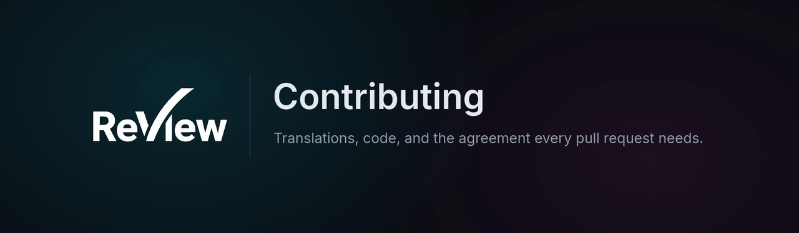

<p align="center">
  
</p>

<p align="center">
  <a href="CLA.md"></a>
  <a href="LICENSE"></a>
  <a href="#-translations-the-easiest-way-in"></a>
  <a href="https://discord.gg/vw7h6BqcNc"></a>
</p>

<p align="center">
  <a href="#-translations-the-easiest-way-in"><b>Translations</b></a> ·
  <a href="#-contributor-license-agreement"><b>CLA</b></a> ·
  <a href="#-source-file-headers"><b>Headers</b></a> ·
  <a href="#-third-party-dependencies"><b>Dependencies</b></a> ·
  <a href="#-before-you-open-a-pull-request"><b>Before a pull request</b></a> ·
  <a href="#-continuous-integration"><b>CI</b></a>
</p>

---

Thanks for considering a contribution. This page covers what a pull request needs to be
merged: the licensing side first, then the checks. The technical conventions live in
[DOCUMENTATION/development/](DOCUMENTATION/development/).

| Way in | What it takes | Start here |
|---|---|---|
| **Fix a translation** | A one-line edit in a JSON file, no build step | [Translations](#-translations-the-easiest-way-in) |
| **Propose a language** | A new catalogue, useful from its first line | [Translations](#-translations-the-easiest-way-in) |
| **Change the code** | The validation suite, green | [Before you open a pull request](#-before-you-open-a-pull-request) |

Whichever it is, every pull request needs the [CLA](#-contributor-license-agreement).

### ✅ In short

- [ ] The pull request says *I have read CLA.md and I agree to it*, with your full name and email.
- [ ] `bash scripts/validate.sh` is green.
- [ ] New source files carry their SPDX header: `node scripts/add-license-headers.mjs`.
- [ ] A new dependency is AGPL-compatible, and `node scripts/generate-notices.mjs` was run.

## 🌍 Translations: the easiest way in

<p align="center">
  
</p>

ReView ships in fourteen languages, and **every one except English was machine-translated
with no human proofreading**. Wording is very likely clumsy or wrong somewhere.

If you speak one of them, fixing a string is a one-line edit in a JSON file: no build step,
no framework to learn.

```bash
# frontend/src/v2/i18n/messages/<code>.json   : interface
# backend/src/i18n/messages/<code>.json       : emails and notifications
node scripts/check-translations.mjs
```

This matters most for the **regional languages ReView stands up for**: Breton, Basque,
Corsican, Alsatian and Occitan. They have far fewer speakers reviewing software strings than
English does, and one native speaker reading through a catalogue changes everything.

**Proposals for new languages are just as welcome**, regional or otherwise. Adding one is
three steps, and untranslated keys fall back to English, so a partial catalogue is useful
immediately. Two rules to keep in mind:

- keep `{placeholders}` intact;
- leave production terminology (`shot`, `sequence`, `dailies`, `playblast`, `version`,
  `annotation`, `review`, `board`, `retake`) in English. Artists read those words in English
  in every pipeline.

Full conventions: [DOCUMENTATION/development/i18n.md](DOCUMENTATION/development/i18n.md).

## ✍️ Contributor License Agreement

> [!IMPORTANT]
> Before a pull request can be merged, you must sign the
> [Contributor License Agreement](CLA.md).

**You keep the copyright on your work.** The CLA grants the maintainer a broad license,
including the right to sublicense, so that ReView can keep being offered both under the AGPL
and under a commercial license for studios that cannot accept the AGPL's obligations. Without
it, a single external contribution would permanently block that model.

To sign, read [CLA.md](CLA.md) and state in your pull request

> I have read CLA.md and I agree to it.

along with your full name and email. Contributing on behalf of a company? Have someone
authorised to bind it use the entity form in the same file.

## ⚖️ License of the project

ReView is distributed under the **GNU Affero General Public License v3.0 or later** (see
[LICENSE](LICENSE)). Anything merged here ships under that license.

## 🏷️ Source file headers

Every source file carries an SPDX header. New files get theirs automatically:

```bash
node scripts/add-license-headers.mjs
```

Keep your own copyright line if you want one: add it *above* the existing
`SPDX-FileCopyrightText` line rather than replacing it.

## 📦 Third-party dependencies

Adding a dependency means redistributing it, so it must be AGPL-3.0 compatible.

| Fine | Not accepted |
|---|---|
| MIT, BSD, ISC, Apache-2.0, MPL-2.0, public-domain equivalents | Proprietary, source-available (BSL, Elastic, Commons Clause), GPL-incompatible |

After `npm install`, refresh the notices:

```bash
node scripts/generate-notices.mjs
```

## 🧪 Before you open a pull request

```bash
bash scripts/validate.sh
```

The suite must be green. It checks formatting, types, lint, unit tests, builds, the route
size budget, the SPDX headers, the freshness of `THIRD-PARTY-NOTICES.md` and the consistency
of the translation catalogues.

> [!WARNING]
> Never disable, skip or delete a test to make it pass. Extend the suite, never weaken it.

## 🔁 Continuous integration

The same suite runs on GitHub Actions
([`.github/workflows/validate.yml`](.github/workflows/validate.yml)) on every push to
`dev`/`main` and on every pull request, under Node 22, the version the runtime images use:

| Job | What it runs | Blocking |
|---|---|---|
| `validate.sh (unitaire)` | `bash scripts/validate.sh` | Yes |
| `validate.sh --with-integration` | the same, plus the integration tests against real Postgres, Redis and MinIO containers | Yes |

The integration job used to be non-blocking while the resumable-upload test was rejected with a
429 by the backend's rate limiter, saturated by the suite itself. The test app now runs without
that limiter, and the job blocks like the other one: a job that never blocks ends up never being
read.

CI runs the suite exactly as it is written. It is not a lighter variant, and it is not a
substitute for running `scripts/validate.sh` locally before you push: it is the proof that
you did.

---

<p align="center">
  Questions before you start? Ask on <a href="https://discord.gg/vw7h6BqcNc">Discord</a>.
  Found a security problem? Do not open an issue: read the <a href="SECURITY.md">security policy</a>.
</p>
