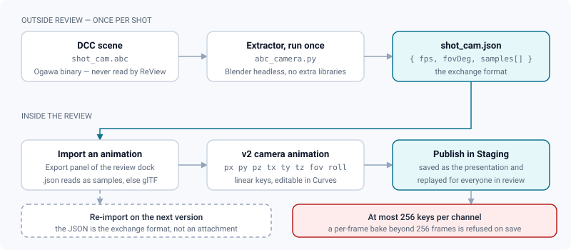
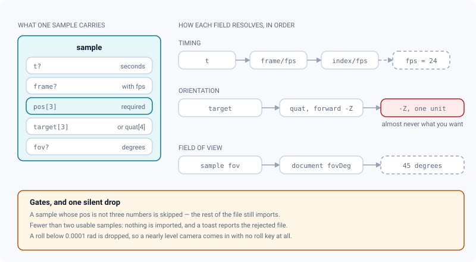

# Alembic camera import

*Turning a DCC Alembic camera into an editable, replayable ReView camera move through a JSON of samples.*

> Updated: 2026-08-23

Alembic (`.abc`) is the standard camera-interchange format in VFX — Maya, Houdini, Nuke and
Blender all read and write it. ReView can turn an Alembic **camera** into an editable v2 camera
animation in the review curve editor, so a splat or a 3D scene can be judged through the shot
camera instead of through whatever viewpoint the reviewer happens to fly to.

The path runs through a small JSON file. This page describes that file, how to produce it, what
the import does with it, and the one ceiling that decides whether the move can be published.

## Why a JSON, and not the `.abc`

Alembic is a **binary** container (Ogawa). Parsing it natively requires a compiled reader, which
would mean either shipping a native module in the browser — a parser attack surface for a file
a client uploads — or a containerised worker. ReView does neither today. Instead you extract the
camera **once per shot** with an external tool, and import the resulting JSON in the review
through the same control that accepts glTF cameras.



> [!NOTE]
> A containerised worker reading Ogawa directly (PyAlembic, or a Blender step folded into the
> asset worker) would remove the manual extraction. It would follow the same opt-in pattern as
> the [USD toolchain](3d-usd.md#installing-the-usd-toolchain) — a binary installed in the worker
> image behind a build argument — with the JSON schema below unchanged as the internal exchange
> contract. It is not shipped.

## The sample schema

```jsonc
{
  "fps": 24,          // optional, converts "frame" → seconds (default 24)
  "fovDeg": 45,       // optional default vertical FOV, in degrees
  "samples": [
    // Either a look "target" OR a "quat" (xyzw) orientation. "t" (seconds) or "frame".
    { "frame": 0,  "pos": [0, 1.6, 5], "target": [0, 1, 0], "fov": 38 },
    { "frame": 24, "pos": [3, 1.6, 4], "target": [0, 1, 0], "fov": 38 }
  ]
}
```

| Field | Required | Falls back to |
|---|---|---|
| `pos` — camera world position `[x, y, z]` | **yes** | Nothing: a sample without three numbers here is **skipped**, the file still imports |
| `target` — look-at point `[x, y, z]` | no | `quat` (xyzw), then a point one unit down `-Z` |
| `quat` — orientation, xyzw | no | Used only when `target` is absent; forward is `-Z`, roll comes from the up vector |
| `fov` — vertical FOV, in degrees | no | The document's `fovDeg`, then `45` |
| `t` — time in seconds | no | `frame / fps`, then the sample index at `fps` |
| `frame` — frame number | no | Same chain; `t` always wins when both are present |
| `fps` (document) | no | `24` |

At least **two** usable samples are required. Fewer, and nothing is imported at all: a toast
reports the rejected file and the animation you had stays untouched.



> [!IMPORTANT]
> The roll derived from a `quat` is written **only when it exceeds 0.0001 rad**. A nearly level
> camera therefore arrives with no key at all on the `roll` channel — which is what you want in
> almost every case, but explains a "my roll disappeared" that is not a bug. Emit a `target`
> when you do not care about roll, and a `quat` when you do.

### Focal length

ReView works in **millimetres on a fixed 36 mm sensor** and stores the field of view, so the two
are interchangeable. Convert in your extractor if your DCC gives you millimetres:

```
fov_deg = 2 * atan(18 / focal_mm) * 180 / pi
```

A 50 mm lens is therefore ≈ 39.6°, and a 24 mm ≈ 73.7°. The review shows the millimetre value,
so a mismatch here is immediately visible to the reviewer — the *Camera* panel of the dock edits
the focal length directly, from **7 to 400 mm**.

## Extracting samples with Blender

Blender ships an Alembic importer and needs no extra libraries. Save this as `abc_camera.py`:

```python
import bpy, json, sys
from math import pi
from mathutils import Vector

abc, out = sys.argv[-2], sys.argv[-1]

# One sample every STEP frames. A channel accepts 256 keys: raise this on a long shot.
STEP = 1

bpy.ops.wm.read_factory_settings(use_empty=True)
bpy.ops.wm.alembic_import(filepath=abc)
cam = next(o for o in bpy.context.scene.objects if o.type == 'CAMERA')
scene = bpy.context.scene
fps = scene.render.fps

samples = []
for f in range(scene.frame_start, scene.frame_end + 1, STEP):
    scene.frame_set(f)
    m = cam.matrix_world
    pos = m.translation
    # -Z is the Blender camera forward; build a look target one unit ahead.
    tgt = pos + (m.to_3x3() @ Vector((0.0, 0.0, -1.0)))
    samples.append({
        "frame": f,
        "pos": [pos.x, pos.y, pos.z],
        "target": [tgt.x, tgt.y, tgt.z],
        "fov": cam.data.angle_y * 180.0 / pi,
    })

json.dump({"fps": fps, "samples": samples}, open(out, "w"))
```

Run it:

```bash
blender --background --python abc_camera.py -- /path/shot_cam.abc /path/shot_cam.json
```

> [!WARNING]
> **Axis mismatch is the first thing that goes wrong.** Blender is Z-up; if your target scene is
> Y-up, convert the coordinates *in the script* — swap and negate axes there, not afterwards in
> the curve editor, where you would be correcting eight channels by hand.

## Importing, editing and publishing the move

1. Open a 3D or splat media and expand the dock's **Export** panel.
2. Click **Import an animation** and choose the `.json` produced above. Both viewers — 3D and
   splat — use the same control, and it routes on the extension: `.json` is read as Alembic
   samples, anything else as a glTF/GLB camera.
3. The keys land on the channels and the move starts playing. Scrub it, reshape it in the
   **Curves** drawer, then switch the review to **Staging** mode and press **Publish** in the
   options bar to save it as the media's presentation.

An import **replaces** the animation currently loaded and resets its undo history, so publish or
attach what you have before importing over it.

Every sample becomes one key at the same time on each channel it carries — `px`, `py`, `pz`,
`tx`, `ty`, `tz`, `fov`, and `roll` when there is one — with **linear** tangents. They are
ordinary v2 keys from then on: retimeable, deletable, and switchable to smooth tangents in the
curve editor. See [Camera animation](../user-guide/camera-animation.md).

Saving is where the sampling rate starts to matter, because the presentation endpoint validates
what it stores:

| Bound | Value | What happens beyond it |
|---|---|---|
| Keys per channel | **256** | The save is refused — the import and the scrubbing worked, the publish does not |
| Key time | 0 to **3 600 000 ms** (one hour) | Refused |
| Animation duration (`durationMs`) | 0 to **3 600 000 ms** | Refused |
| Channels | `px` `py` `pz` `tx` `ty` `tz` `fov` `roll` | An unknown channel name is refused |

> [!CAUTION]
> A per-frame bake is fine to scrub and fatal to publish past **256 frames** — about **10.6
> seconds at 24 fps**. Raise `STEP` in the extractor, or thin the keys in the curve editor,
> *before* pressing Publish; a tracked camera is smooth enough that one sample every two or
> three frames is indistinguishable once the tangents are on *Auto*.

## Where the move is replayed, and where it is not

Publishing the presentation writes it on the media, and it is replayed **identically for every
signed-in viewer**: the next person to open that review sees the move start on its own, from the
same pose, at the same focal length. That is what makes "look at the scan through the plate
camera" a shared fact instead of an instruction.

The **client share page is not the same surface**. A guest opening a share link gets the saved
camera **pose**, the depth of field, the default level of detail, the lighting, the splat edits
and the USD scene override — but the camera *animation* is not played there. For a client who
must watch a move rather than fly around it, render the move to video and share that, or walk
them through it in a live review session.

| Surface | Camera pose | Camera move | Scene edits and override |
|---|---|---|---|
| Review, any signed-in member | Restored | **Played** | Replayed |
| Comment with an attached move | Restored | Played while selected | Proposal, while selected |
| Client share link | Restored | Not played | Replayed |

See [Sharing](../user-guide/sharing.md) and
[Playlists & live review sessions](../user-guide/playlists-and-live-review.md).

## Use cases

**Reviewing a splat against the plate camera.** The shot camera is tracked in the DCC and exists
as `.abc`. Extract it, import the JSON on the splat media, publish it as the presentation:
everyone who opens that media sees the scan through the same camera move as the plate, instead
of flying around and arguing about parallax.

**Handing a layout to the team.** Import the camera, trim it in the curve editor to the twelve
seconds that matter, publish. Every reviewer opens on exactly that move — and if the shot has to
go to a client afterwards, it goes as a rendered video.

**Reusing a move across versions.** The JSON is the exchange format, not an attachment. Keep it
next to the shot and re-import it on the next version rather than re-authoring the move.

**Starting from a rough move.** Two samples are enough. Import a start and an end pose, then
shape the rest in the curve editor — the imported keys are ordinary v2 keys with linear easing.

**Answering a note with a move.** Instead of publishing, attach the imported animation to the
comment you are about to write. It then plays only when someone selects that note.

## Troubleshooting

| Symptom | Cause | Fix |
|---|---|---|
| Nothing imports, a toast reports a rejected file | Fewer than two samples carry a valid `pos` | Check that `pos` is an array of three numbers on every sample |
| The camera is in the right place but points the wrong way | Neither `target` nor `quat` was provided | Emit one of the two; the fallback simply looks one unit down `-Z` |
| The move is 90° off, or vertical and horizontal are swapped | Z-up source, Y-up scene | Convert the axes in the extractor, not afterwards |
| The framing is too wide or too narrow | `fov` is horizontal, or in radians | ReView expects **vertical degrees**; Blender's `cam.data.angle_y` is in radians |
| The move plays too fast or too slow | `fps` missing, so frames were divided by 24 | Set `fps`, or emit `t` in seconds and skip the question |
| The import worked, **Publish** fails | More than 256 keys on a channel, or a key past one hour | Raise `STEP` and re-extract, or thin the keys in the curve editor |
| The camera does not roll although the DCC camera does | The derived roll was below 0.0001 rad and was dropped | Confirm the roll in the DCC; key `roll` by hand if the move genuinely needs a small tilt |
| The move is right but nobody else sees it | It was imported, not published | Switch to **Staging** and press **Publish** — that is what is replayed |
| Members see the move, the client on the share link does not | Share pages restore the pose, not the animation | Expected; send a rendered video, or run a live review session |

## Security notes

- The importer reads the JSON **on the client**: `JSON.parse`, then a shape check that ignores
  unknown fields. A malformed file is rejected with a toast, never executed.
- No `.abc` bytes are parsed in the browser, so there is no native-parser attack surface.
- What is *persisted* goes through the server's schema — channel names, key counts, times and
  durations are all bounded — so a hand-crafted payload cannot store an unbounded animation.
- Publishing a presentation is reserved to those who can manage the media; everyone else can
  import and scrub locally without changing what other people see.

## Related pages

- [Camera animation](../user-guide/camera-animation.md)
- [Reviewing 3D media](../user-guide/review-3d.md)
- [Reviewing Gaussian splats](../user-guide/review-splat.md)
- [USD & 3D conversion](3d-usd.md)
- [Sharing](../user-guide/sharing.md)
