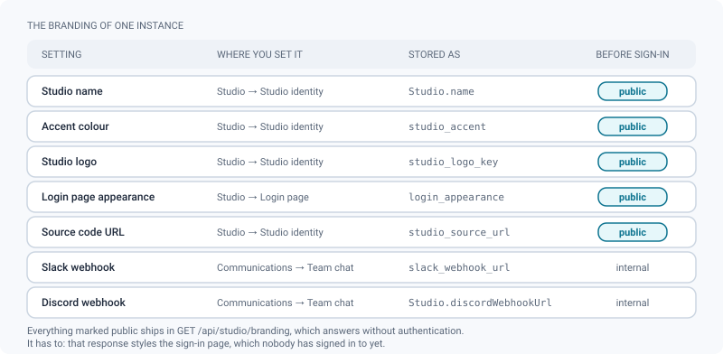
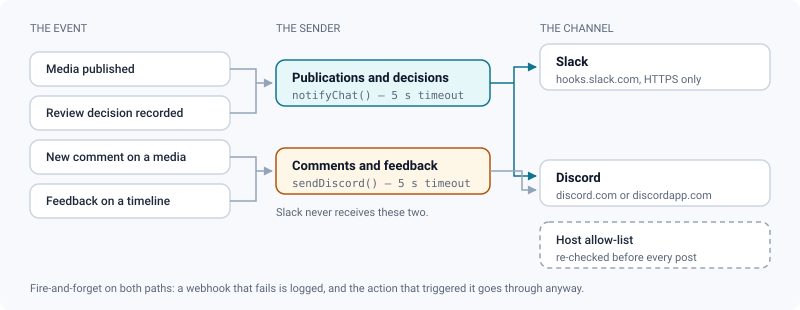
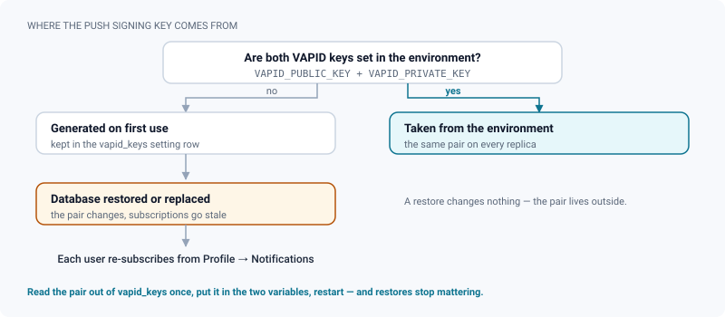

# Studio branding & team notifications

*Where each branding field lives, what a signed-out visitor can see, and how team chat and browser alerts are wired.*

> Updated: 2026-08-23

An instance of ReView is one studio, and it should look like that studio from the sign-in page
onwards. Three admin screens and one API-only field carry everything visible: the studio name,
the accent colour, the logo, the appearance of the login page and the source-code link the
licence requires.

The same page covers the two channels that push events *out* of the application — a team chat
webhook and browser notifications — because they share the property that makes them worth
documenting carefully: they are configured once, they fail silently, and one of them is a
secret.

## Where each branding value lives

Knowing the split saves a hunt: the **accent colour**, the **source-code URL** and the **Slack
webhook** are in *Studio → Settings*; the **studio logo** is in *Review contexts → Delivery*,
because it is primarily a delivery asset; the sign-in page is in *Studio → Login page*; and the
studio **name** is fixed at first-run setup.

The first five rows of the figure are rows of the generic `Setting` key/value table, written
through `PUT /api/studio/settings` (`ADMIN`, audited as `SETTING_UPDATE` with the key — never
the value). The last two live on the `Studio` record itself.

> [!NOTE]
> Renaming the studio has **no screen**. It is `PATCH /api/studio` with `{ "name": "…" }` as an
> `ADMIN`, between 2 and 120 characters. The slug derived at setup does not follow, and the name
> is what a signed-out visitor reads on the sign-in page.

## The studio theme

**Accent colour** — `studio_accent`, a `#RRGGBB` value. The picker offers **`#00b3c4`** (cyan)
when nothing is stored. The accent overrides the interface primary colour — buttons, links,
focus rings — across the whole application **and the sign-in page**. The readable ink on top of
it is derived from its luminance rather than fixed, so a dark accent does not leave an
unreadable label on a coloured button in one of the two themes.

*Reset* stores an **empty value**, which removes the override and lets the built-in theme tokens
apply again; it does not write the default hex back. The change lands on the next load: the
branding response is kept for five minutes by the client cache, and the accent is also mirrored
in the browser's local storage so it can be applied before the first paint instead of flashing.

**Studio logo** — uploaded in *Review contexts → Delivery*, stored as `studio_logo_key`. The
upload is presigned (`branding/logo-<timestamp>.<ext>`, a 15-minute `PUT`), then the key is
saved as a setting; removing the logo writes an empty key. The same file is reused on the
sign-in screen, the client share page and the optional FFmpeg burn-in — export it at a size that
still reads when scaled into a video corner. PNG, JPEG and WebP only: **SVG is refused**,
deliberately, because a scriptable document uploaded by an admin has no business being served
from the application's own origin. Details in
[Secure distribution](secure-distribution.md).

**Sign-in page** — *Studio → Login page* (`ADMIN`) is a partial patch: every field is optional
and what you do not send stays as it was.

| Field | Values | Default |
|---|---|---|
| Layout | `split` or `centered` | `split` |
| Background image | presigned upload, `branding/login-bg-<timestamp>.<ext>` | none — an accent gradient |
| Background fit | `cover` or `contain` | `cover` |
| Overlay opacity | 0 to 0.95 | **0.45** |
| Blur | 0 to 24 pixels, integer | **0** |
| Tagline | free text, 200 characters maximum | empty — a translated default is shown |
| Show the logo | on / off | on |

> [!TIP]
> The overlay and the blur are not decoration: a bright photograph under a bright form makes the
> fields unreadable, and no admin should have to retouch an image for that. `0.45` is the
> default for exactly this reason — lower it only after checking the form against your own
> image, signed out.

Saving the appearance is audited as `SETTING_UPDATE` on the key `login_appearance`.

## The public branding endpoint

`GET /api/studio/branding` is served **without authentication** — it has to be, since it styles
the login page. It returns the studio name, the accent, a presigned logo URL, the full login
appearance including a presigned background URL, and `sourceUrl`.

Treat everything in that payload as public. The studio name, the tagline and the background
image are visible to anyone who can reach the instance, including before they log in. If your
tagline names a client or a show under NDA, it is now on the open internet.

`sourceUrl` is there because the AGPL §13 requires offering the corresponding source to remote
users, authenticated or not. Empty, it falls back to the upstream repository; filled, it must be
an `http`/`https` URL, or it falls back too. See
[System & maintenance](system-and-maintenance.md).

## Team chat notifications

ReView can post one-line messages into a team channel on key events.

| Target | Where it is configured | Stored in |
|---|---|---|
| **Slack** | *Admin → Studio → Settings* → *Slack webhook (notifications)* | `slack_webhook_url` |
| **Discord** | **No screen** — `PATCH /api/studio` (`ADMIN`) with `discordWebhookUrl` | `Studio.discordWebhookUrl` |

Both URLs are checked against a strict host allow-list before anything is posted: HTTPS only,
and the host must be `hooks.slack.com` for Slack, or `discord.com` / `discordapp.com` for
Discord. Anything else is never contacted. **When that check happens differs**, and it matters
when you debug a channel that stays quiet:

- The **Discord** URL is validated at save time — `PATCH /api/studio` answers `400 BAD_WEBHOOK`
  on any other host, so a typo is caught while you are still looking at it.
- The **Slack** URL is an ordinary setting. It is stored as typed, with no validation, and only
  the allow-list at posting time rejects it. A wrong host is therefore accepted silently and
  simply never posts.

What triggers a message, and along which path:

| Event | Slack | Discord | Timeout |
|---|---|---|---|
| A media is published | yes | yes | 5 seconds |
| A review decision is recorded | yes | yes | 5 seconds |
| A new root comment on a media | no | yes | **none** |
| New feedback on a timeline | no | yes | **none** |

Both paths are fire-and-forget: the failure is logged and never blocks or fails the action that
triggered it. They differ on patience. The publish and decision path aborts the request after
five seconds; the comment path issues its request with no timeout at all, so an endpoint that
accepts the connection and never answers leaves a pending request behind until the platform
gives up on its own. On a busy project with a dead Discord endpoint, that is a slow leak rather
than an incident — but it is a reason to remove a webhook you no longer use rather than leaving
it pointing at a deleted channel.

The message itself carries the media name, the version name and the decision label. It is
composed from a fixed server-side template (currently written in French) and does not go through
the translation catalogues, so it reaches every workspace in the same wording.

> [!CAUTION]
> A webhook URL is a **secret**: anyone holding it can post into the channel. `GET /api/studio`
> therefore returns `discordWebhookUrl` only to an `ADMIN`; everyone else gets a
> `hasDiscordWebhook` boolean. Changing it is audited as `STUDIO_UPDATE` recording only *that*
> it changed — never the URL — because a readable audit log must not become the new hiding place
> for the secret. And since notifications carry shot codes and version names, do not route them
> to a workspace with a wider membership than the project.

These two webhooks are also the only outgoing targets that do **not** go through the shared
`safeFetch` guard: they rely on the host allow-list instead. Do not expect a redirect to be
refused there the way it is for a ShotGrid site or a push endpoint.

## Browser push

Push notifications work out of the box. If **`VAPID_PUBLIC_KEY`** and **`VAPID_PRIVATE_KEY`**
are not both set in the environment, a VAPID key pair is generated on first use and persisted in
the database under `Setting.vapid_keys`. `VAPID_SUBJECT` is optional and defaults to
`mailto:admin@review.local`.

> [!IMPORTANT]
> `vapid_keys` and `smtp_config` are the two settings **never readable through
> `GET /api/studio/settings` and never writable through `PUT /api/studio/settings`**
> (`400 RESERVED_SETTING`). The private VAPID key signs every push notification of the instance;
> it has no business appearing in a settings dump.

Users opt in from **Profile → Notifications**, next to the daily email digest and the weekly
production report. The browser asks for permission, subscribes to its own push service, and
sends the resulting endpoint to `POST /api/push/subscribe`.

That endpoint is a URL the server will later call **from inside the application network**, so it
is put through the outgoing-request guard before being stored: the host is resolved, and any
name that resolves to a private or link-local address is refused with
`400 PUSH_ENDPOINT_REFUSED`. That is the failure to look for when a user says they cannot enable
notifications — typically a browser behind a corporate proxy that rewrites the push endpoint to
an internal host. The same check runs again at send time, because a row may predate the guard
and a public name can start resolving elsewhere.

Two more properties worth knowing:

- Subscriptions the push service reports as gone (HTTP 404 or 410) are **pruned automatically**
  on the next send. Nothing to clean up by hand.
- A user can only unsubscribe **their own** browser: the endpoint is scoped to the calling
  account, so knowing someone else's endpoint is not enough to silence them.

Studio-wide announcements and outgoing mail are a separate feature — see
[SMTP & announcements](smtp-and-announcements.md).

## Use cases

### White-labelling the instance for a studio

1. *Studio → Settings*: set the accent to the studio colour and save. Reload to see it — the
   branding response is cached for five minutes.
2. *Review contexts → Delivery*: upload the logo. Remember it is **not** SVG-capable, and that
   the same file is reused for the login page, the client portal and the burn-in.
3. *Studio → Login page*: choose the layout, add a background and a tagline. Keep the overlay
   opacity high enough that the form stays legible over the image.
4. Check the result **signed out**, in a private window. Everything on that page is public.
5. If you have modified the code, fill the source-code URL in *Settings* now: the login page is
   exactly the "remote user" surface the AGPL clause is about.

### Wiring the studio Discord without an admin screen

*Production wants publish notifications in a Discord channel, and there is no field for it.*

1. Create an incoming webhook in Discord and copy the URL.
2. There is **no UI**. Call `PATCH /api/studio` as an `ADMIN` with
   `{ "discordWebhookUrl": "https://discord.com/api/webhooks/…" }`. A URL on any other host is
   rejected with `400 BAD_WEBHOOK`.
3. Verify by publishing a test media — delivery is fire-and-forget, so a wrong URL fails
   silently in the server log rather than surfacing an error in the interface.
4. Note the asymmetry before promising anything: Discord also receives new comments and timeline
   feedback; Slack receives only publications and review decisions.
5. To remove it, send `{ "discordWebhookUrl": null }`. Do remove it rather than leaving it
   pointing at a deleted channel — the comment path has no timeout.

### Push notifications stopped working after a restore

1. Check whether `VAPID_PUBLIC_KEY` / `VAPID_PRIVATE_KEY` are set in the environment. If they
   are not, the pair in use came from `Setting.vapid_keys`, and the restore brought back a
   different one.
2. Every existing subscription was signed against the old key and is now invalid. There is no
   server-side fix: affected users must toggle push off and on again from *Profile →
   Notifications*.
3. Set the environment variables to the pair you want to keep — read the current one out of the
   `vapid_keys` row if the subscriptions are worth preserving — and restart. From then on
   restores are harmless.

### One user cannot enable notifications, everyone else can

Look for `PUSH_ENDPOINT_REFUSED` in the server log with that user's id. The browser handed over
an endpoint whose host resolves inside the network, and the guard refused to store it. It is not
an account problem and not a key problem: it is that browser, that network. Trying another
browser, or the same one off the corporate network, is the fastest way to confirm it.

## Related pages

- [Secure distribution](secure-distribution.md) — the studio logo in shares, watermarks and burn-ins
- [SMTP & announcements](smtp-and-announcements.md) — the other outgoing channel
- [System & maintenance](system-and-maintenance.md) — the source-code URL and the AGPL obligation
- [Identity, API & audit](identity-and-api.md) — outgoing webhooks with signed payloads, and the audit log
- [Users & roles](users-and-roles.md) — who holds `ADMIN`
- [Personalisation (user guide)](../user-guide/personalization.md) — what a reader can change for themselves
