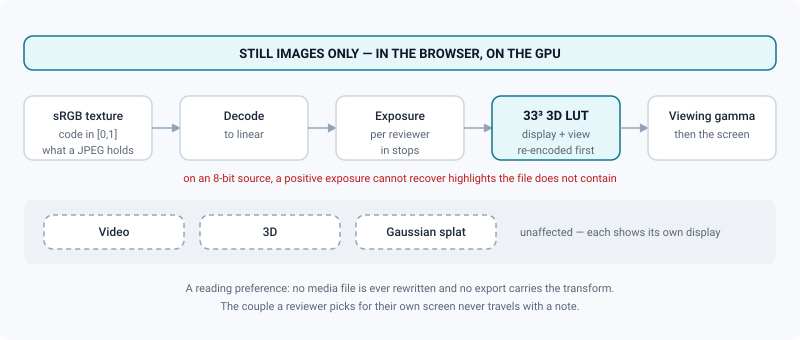
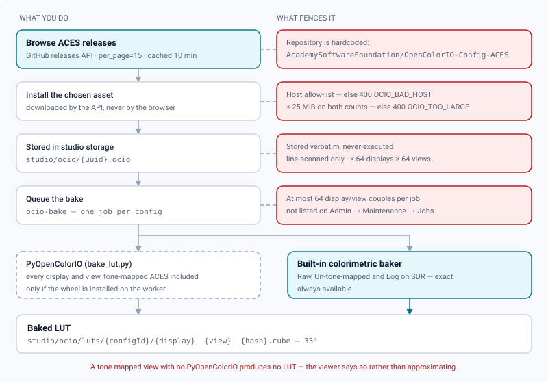

# Colour management (OCIO)

*Install an ACES config, bake its display LUTs, and know exactly which pixels the transform reaches.*

> Updated: 2026-08-23

ReView manages colour with OpenColorIO (OCIO) configs. The official **ACES** configs from the
Academy Software Foundation are fetched directly from their GitHub releases; projects then
pick a display and a view, and the **image viewer applies that couple to the pixels** through
a 3D LUT baked on the server.

Nothing here rewrites a file. A display transform in ReView is a way of *reading* a frame on
the show's reference display — the delivered pixels are still decided in the DCC and in the
transcode, exactly as they were before.

## What the transform reaches — and what it does not



The display transform is applied to **still images**, in the browser, on the GPU. Video, 3D
and Gaussian splat media still show their own display and are unaffected. The transform is a
**reading preference**: no media file is ever rewritten, no export carries it, and the couple
a reviewer picks for their own screen never travels with a note.

The chain is `decode → exposure → re-encode → LUT → viewing gamma`. Exposure is applied in
linear, in stops, before the display transform; the viewing gamma comes after it, to open up
the shadows on a bright room's screen. On an 8-bit source, a positive exposure cannot recover
highlights that are not in the file — no transform can invent them.

> [!IMPORTANT]
> Whether the transform is *exact* depends on the tooling installed on the worker. A
> tone-mapped view with no OpenColorIO tooling produces **no LUT at all** — the viewer says
> "no baked LUT for this view" instead of showing an approximation of the ACES rendering
> curve. A wrong curve looks plausible and misleads a supervisor; nothing does not.

| Baker | Covers | Available |
|-------|--------|-----------|
| **OpenColorIO** (`bake_lut.py`, PyOpenColorIO) | every display/view of the config, **including tone-mapped ACES output transforms** | only if the wheel is installed — see [Enabling exact OCIO baking](#enabling-exact-ocio-baking) |
| **Built-in** (`backend/src/lib/ocioBake.ts`) | `Raw`, `Un-tone-mapped` and `Log` views on SDR displays: gamut conversion, white adaptation and transfer function, all exact | always |

`ociobakelut` is **not** in the image — it ships with OCIO's own binaries, which the backend
image does not install — which is why the exact path goes through Python.

## Installing an ACES config

*Admin → Review contexts → Colour (OCIO)* (`/admin/ocio`):

1. Click **Browse ACES releases** — ReView lists the releases of
   [AcademySoftwareFoundation/OpenColorIO-Config-ACES](https://github.com/AcademySoftwareFoundation/OpenColorIO-Config-ACES/releases)
   and their config assets (studio / cg). Only the **15 most recent** releases are listed, and
   the result is cached for 10 minutes.
2. **Install** the config you want. The `.ocio` file is downloaded into studio storage at
   `studio/ocio/{uuid}.ocio` and the inventory is kept in a single setting row.
3. Use the **star** to set the studio default config.

The **studio config, ACES 1.3** is treated as the recommended default: on install it is
flagged as the studio default only if it is a studio ACES 1.3 asset *and* no default exists
yet. If no entry is flagged, the first installed config is used.



### Permissions

| Action | Route | Role |
|--------|-------|------|
| List installed configs (with a presigned URL) | `GET /api/studio/ocio/configs` | any authenticated account |
| List a config's displays and views | `GET /api/studio/ocio/configs/:id/displays` | any authenticated account |
| Get the baked LUT of a display/view | `GET /api/studio/ocio/configs/:id/lut?display=&view=` | any authenticated account |
| Re-bake the LUTs of a config | `POST /api/studio/ocio/configs/:id/bake` | **`ADMIN`** — audit `OCIO_BAKE` |
| Browse ACES releases | `GET /api/studio/ocio/releases` | **`ADMIN`** |
| Install a config | `POST /api/studio/ocio/install` | **`ADMIN`** — audit `OCIO_INSTALL` |
| Set the studio default | `PUT /api/studio/ocio/configs/:id/default` | **`ADMIN`** — audit `OCIO_DEFAULT` |
| Delete a config | `DELETE /api/studio/ocio/configs/:id` | **`ADMIN`** — audit `OCIO_DELETE` |

Reading is open on purpose: every project settings screen and every viewer badge needs the
list. The four write actions are the ones you will look for in the audit log; `OCIO_BAKE` is
emitted on every re-bake, including the ones you trigger after installing the Python tooling.

### Supply-chain guards on the download

The install path fetches a file from the internet and stores it in studio storage, so it is
constrained deliberately:

- the **repository is hardcoded** — an administrator cannot point the installer at another
  GitHub project;
- the asset URL must be on one of **three allow-listed hosts**: `github.com`,
  `objects.githubusercontent.com`, `release-assets.githubusercontent.com`. Anything else is
  refused with `400 OCIO_BAD_HOST`;
- the asset is capped at **25 MiB**, checked both on the declared size and on the bytes
  actually received (`400 OCIO_TOO_LARGE`);
- the `.ocio` file is stored **verbatim and never executed**; ReView only line-scans it to
  extract display and view names.

Other errors you may see: `400 OCIO_RELEASES_FAILED` (GitHub refused or is unreachable — often
rate limiting on an unauthenticated API call), `400 OCIO_ALREADY_INSTALLED`,
`400 OCIO_DOWNLOAD_FAILED`.

Parsing bounds: at most **64 displays** and **64 views** per display; a display with no views
is dropped. Parsed results are cached in memory per config, which is safe because an installed
config is immutable.

## Baked LUTs

A display transform is applied in the browser as a **33³ 3D LUT** in the Iridas/Resolve
`.cube` format, baked once on the server and stored next to the `.ocio` file:

```
studio/ocio/{configId}.ocio
studio/ocio/luts/{configId}/{display}__{view}__{hash}.cube
```

- **When.** Installing a config queues a bake job (`ocio-bake`, one job per config, at most 64
  display/view couples). *Re-bake* re-runs it — do that after installing the OpenColorIO
  tooling, with `force` to overwrite LUTs baked by the built-in path.
- **On demand.** If a viewer asks for a couple that has no LUT yet, the API bakes the built-in
  one immediately (it needs no external tool) and queues an OpenColorIO bake for the rest. The
  couple is checked against the config first: an unknown display or view is refused with
  `400 OCIO_BAD_DISPLAY_VIEW`, so no caller can have an arbitrary object written into storage.
- **Domain.** The LUT maps an **sRGB-texture code in [0,1]** (what a JPEG or a PNG of a review
  contains) to a **display code**.
- **Provenance.** The first line of each `.cube` records which baker produced it; the viewer
  reads it back and tells the reviewer, so "colorimetric conversion only — no rendering curve"
  is visible rather than assumed.
- Deleting a config also deletes its baked LUTs (`studio/ocio/luts/{configId}/`).

> [!WARNING]
> `ocio-bake` is a **BullMQ queue of its own**, deliberately separate from `media-processing`
> so a bake never delays a transcode. It is **not** shown on *Admin → Maintenance → Jobs*,
> which lists only `media`, `storage-cleanup` and `webhooks`: a bake that keeps failing leaves
> no trace on that screen. Watch the worker logs, or point a BullMQ dashboard at the same
> Redis. See [Jobs & workers](../infrastructure/jobs-and-workers.md).

### Enabling exact OCIO baking

The worker image already carries a Python virtual environment for USD
(`INSTALL_USD_TOOLS=1`, `/opt/usdenv`). Add the OpenColorIO wheel to it — it is BSD-3-Clause,
about 30 MB, and pulls no system package:

```dockerfile
# backend/Dockerfile, inside the INSTALL_USD_TOOLS block, next to usd-core:
&& /opt/usdenv/bin/pip install --no-cache-dir "opencolorio==2.4.*"
```

Rebuild the worker image, then *Admin → Colour (OCIO)* → re-bake each config with **force**.
`USD_PYTHON_BIN` selects the interpreter, so a site that installs PyOpenColorIO elsewhere only
has to point that variable at the right Python.

Without the wheel nothing fails: the bake job falls back to the built-in colorimetric baker
and skips the views it cannot do exactly.

## Per-project display and view

*Project → Settings → Colour management*: pick a config (or keep the studio default), then a
**display** and a **view** from that config. An empty config id means "use the studio
default".

Colour is one of the **eight inheritable settings sections**, exactly like resolution or
departments. That has two practical consequences:

- saving the colour panel sends a `PATCH /api/projects/:projectId/settings` carrying only the
  `color` section, so it cannot freeze the rest of the studio's settings into the project;
- the *Studio inheritance* panel at the top of the tab shows the row as *Overridden here* or
  *Inherited from the studio*, and **Hand back to the studio** sends `color: null` — one
  gesture, and the project follows the studio default again.

Writing it requires the effective project role `SUPERVISOR`, so a supervisor of that project
alone can set it. See [Pipeline settings](pipeline-settings.md).

The choice appears as an `OCIO` badge in the 3D review dock and in the media info sheet, and
it **drives the image viewer's colour panel**: it is the display and view applied to still
images by default. A reviewer can pick another couple of the same config for their own screen;
a project with no config gets a colour panel that says so and offers nothing but exposure and
gamma.

### Deleting a config that projects use

Deletion removes the entry from the inventory and the object from storage. **It does not
cascade**: projects referencing it keep a dangling config id.

The visible result is a project whose display and view selectors come back empty and disabled
— the displays endpoint answers `404` — while the previously chosen display and view strings
keep showing in the badges, because they are stored as plain strings and never re-resolved.
Nothing breaks, nothing warns, and the project silently stops being editable in colour terms.

Before deleting a config, check which projects reference it and move them to the replacement
first. If the deleted config was the studio default, the first remaining config is promoted
automatically.

## Use case: adopting ACES on a new show

1. *Admin → Colour (OCIO)* → **Browse ACES releases** → install the **studio config, ACES
   1.3** unless the show has a reason to differ. Star it as the studio default so new projects
   inherit it.
2. On the show: *Project → Settings → Colour management*, leave the config on the studio
   default and pick the display that matches the review room's monitor and the view the show is
   graded for.
3. **Install the OpenColorIO wheel on the worker** (see
   [Enabling exact OCIO baking](#enabling-exact-ocio-baking)) and re-bake, otherwise the ACES
   output transforms of that config have no LUT and the image viewer will say so.
4. **Tell the team what this does and does not do.** Still images are shown through the chosen
   display/view; video, 3D and splat are not. Exposure and gamma are per-reviewer reading aids,
   they never travel with a note, and no export carries the transform.
5. Keep the delivery convention outside ReView (in the DCC or the transcode) as the thing that
   determines the delivered pixels; the viewer transform tells a supervisor what the frame
   looks like on the show's display, not what the file contains.

## Use case: replacing an installed config

*A newer ACES release must supersede the one installed last year.*

1. Install the new config **first**. Both can coexist; there is no limit.
2. Move every project that references the old one to the new one, and re-select the display and
   the view — the strings are not migrated and would otherwise point at entries of a config
   that no longer exists.
3. Star the new config as the studio default.
4. Only then delete the old one. If you delete first, every project that used it loses the
   ability to change its selection until you re-point it, and the stale display and view keep
   showing as if nothing had happened — the image viewer, for its part, stops applying
   anything, because it refuses a couple that is not in the loaded config.
5. Re-bake the new config with **force** if the worker's OpenColorIO tooling changed since the
   LUTs were first produced.

## Use case: putting one show back on the studio config

*A project was pointed at a config of its own during a test and never moved back.*

Open *Project → Settings*, find the **Colour management** row in the *Studio inheritance*
panel, and press *Hand back to the studio*. That sends `color: null`; the project stops
carrying a colour override and follows the studio default from then on, including future
changes of that default. Re-selecting the studio config by hand in the picker looks the same
on screen but is not: it writes an override that pins today's choice.

## Troubleshooting

**"No baked LUT for this view yet".** The view is tone-mapped and the worker has no
PyOpenColorIO. Install the wheel and re-bake with `force`; until then the viewer is right to
show you the file rather than a guessed curve.

**The badge says "colorimetric conversion only — no rendering curve".** The LUT was produced by
the built-in baker. That is exact for `Raw`, `Un-tone-mapped` and `Log`, and expected on those
views.

**`400 OCIO_RELEASES_FAILED` on Browse.** GitHub refused the unauthenticated call, usually rate
limiting. The catalogue is cached for 10 minutes; wait and retry.

**A bake never seems to finish.** `ocio-bake` is invisible on the Jobs screen. Check the worker
logs — a failing bake retries three times with exponential backoff before giving up.

**A project's display and view pickers are empty and disabled.** Its config id points at a
config that was deleted. Pick another config; the stale display and view strings are only
labels and will be replaced when you save.

**The image looks the same with the transform on and off.** Check the couple: `Raw` on an sRGB
display is close to a no-op by construction. Check too that the media is a still image — video,
3D and splat are not touched.

## Related pages

- [Pipeline settings](pipeline-settings.md)
- [HDRI library](hdri-library.md)
- [3D review](../user-guide/review-3d.md)
- [Image review](../user-guide/review-image.md)
- [Jobs & workers](../infrastructure/jobs-and-workers.md)
- [System & maintenance](system-and-maintenance.md)
