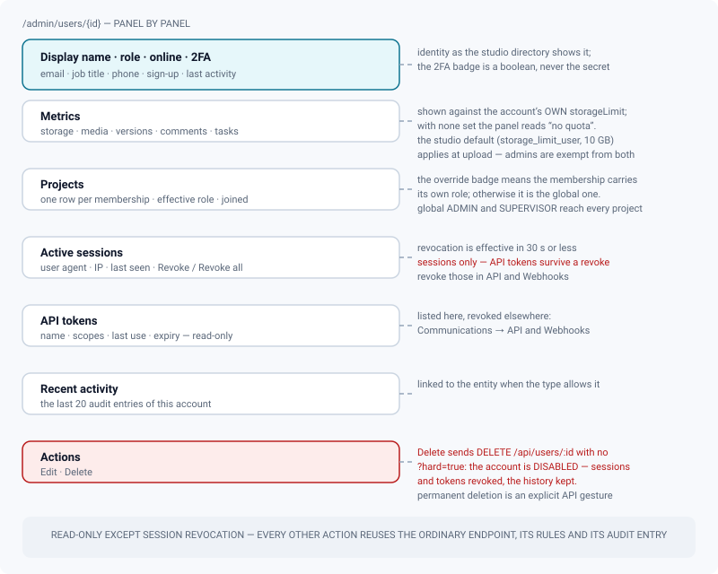
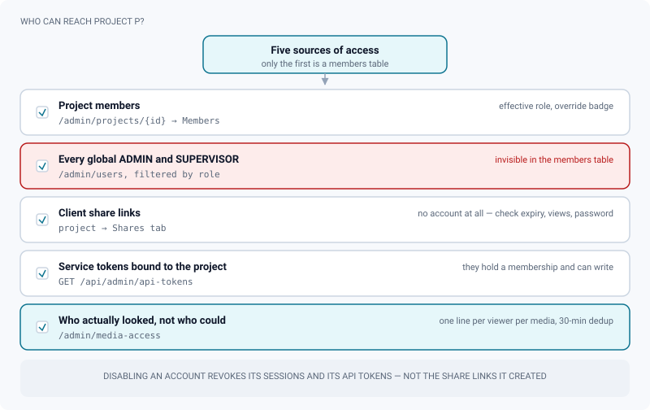

# Content explorer (users, projects, versions, comments)

*Studio-wide read views over every account, project, version and comment — and the exact actions they hand off.*

> Updated: 2026-08-23

The **Content** group of the admin area turns the dashboard counters into full, dedicated
pages. Every page is addressable (`/admin/users`, `/admin/projects`, `/admin/versions`,
`/admin/comments`, `/admin/storage`) and the dashboard metric cards link straight into them.

All of these pages are **`ADMIN`-only**, both in the interface — a non-admin landing on
`/admin` sees a refusal — and behind it, where the whole `/api/admin` router requires the
role. They are also, except for session revocation, **read-only**: every write reuses the
ordinary endpoint (`PATCH /api/users/:id`, `DELETE /api/comments/:id`), so it obeys the same
rules and produces the same audit entries as it would anywhere else in the application.

*Admin → Storage* belongs to the same group and is documented on its own page:
[Storage map](storage.md).

## Users — list and detail page

### The list

*Admin → Users* (`/admin/users`, `GET /api/users`) offers full-text search over display name,
username, first and last name and email, a role filter, and four sort orders.

| Sort | What it orders by |
|---|---|
| Name | The display name, alphabetically |
| Role | `ADMIN`, `SUPERVISOR`, `ARTIST`, `CLIENT`, then name |
| Storage | Total bytes uploaded by the account, heaviest first |
| Recent | The newest account first — creation order, not last activity |

**Service accounts are excluded** from the list: they carry the writes of a machine token and
are not members of the studio. Find them in *Communications → Service tokens*. Accounts that
were invited but never activated carry an *Invited* badge, with a button to send the
invitation again — the previous link dies at that moment, since only one live invitation
exists per account.

The whole list is fetched once and filtered in the browser, so search and sorting are instant
and the counter under the toolbar reflects the filter, not the studio.

### The detail page

Clicking a user opens `/admin/users/<id>` (`GET /api/admin/users/:id`).

- **Profile**: display name, role badge, online indicator, 2FA badge, email, job title, phone,
  sign-up date, last activity.
- **Metrics**: storage used, uploaded media, authored versions, comments, assigned tasks. The
  storage figure is shown against the account's **own** `storageLimit`; when none is set the
  panel reads *no quota*. That is a display, not a rule: an account with no personal limit is
  still capped at upload time by the studio default `storage_limit_user` (10 GB), and
  administrators are exempt from both.
- **Projects**: every membership with its **effective role** — the project override when the
  membership carries one, the global role otherwise — and the join date, each linking to the
  project admin page.
- **Active sessions**: user agent, IP, last seen. An admin can revoke one session
  (`DELETE /api/admin/sessions/:sid`) or all of them (`DELETE /api/users/:id/sessions`). Both
  take effect in **30 seconds or less** — the middleware caches session validity for that
  long. Neither touches the account's **API tokens**.
- **API tokens**: the account's live tokens (name, scopes, last use, expiry), read-only.
  Revocation lives in *Communications → API and Webhooks*.
- **Recent activity**: the last **20** audit entries written by this account, linked to the
  affected entity where the type allows it.
- **Actions**: *Edit* (the same modal as the list) and *Delete* — read the next chapter before
  pressing the second one.

## Disabling, deleting and re-enabling an account

The *Delete* button, on both the list and the detail page, sends `DELETE /api/users/:id`
**with no query string**. That route **disables** the account: sessions and API tokens are
revoked immediately, and everything the person did stays attributed to them.

> [!CAUTION]
> The confirmation dialog is worded as a permanent deletion. It is not one. Nothing is erased,
> and the account keeps appearing in the user list exactly as before — neither the list nor
> the detail page shows a "disabled" state today. The only visible effect is that the person
> can no longer sign in.

Permanent deletion is a deliberate API gesture: `DELETE /api/users/:id?hard=true`, which no
screen sends. Only that variant revokes every share link the account created and nulls the
author of its audit entries — which is precisely why it is not the default. See
[Users and roles](users-and-roles.md).

Re-enabling is likewise an API gesture today: `PATCH /api/users/:id` with `disabled: false`.
The edit modal does not carry the toggle, so there is no button for it in the Content group.
Re-enabling writes a `USER_ENABLE` audit entry, as disabling writes `USER_DISABLE`.

Two refusals protect the instance from itself, wherever the request comes from:

- you cannot disable or delete **your own** account;
- you cannot demote, disable or delete the **last remaining administrator**. Only genuinely
  usable admins count — a service account or an already-disabled one does not — and the
  request comes back as `LAST_ADMIN`. Without that guard, the studio would still be running
  with nobody able to create an account or change a setting.

## Projects — list and detail page

*Admin → Projects* (`/admin/projects`, `GET /api/admin/projects`) lists **all** non-deleted
projects of the instance — admins see everything regardless of membership — with search over
name and slug and a status filter, both applied in the browser over the full list. Each row
shows member, sequence, shot, asset, version and media counters plus storage consumption
against the project quota; the ratio turns red at **90 %**. Deleted projects are not here;
they live in *Maintenance → Trash*.

The **detail page** (`/admin/projects/<id>`) provides:

- a header with status, slug, timestamps, description and a link to the ordinary project page;
- **metrics**: storage against quota, versions, media (count and bytes), comments, assets —
  the versions and comments tiles link to the global lists pre-filtered on this project;
- a **members table** with avatar, effective role (badged when the membership carries its own)
  and join date, each row linking to the user detail page;
- **resolved settings**: the effective pipeline (resolution, framerate), start frame,
  nomenclature, departments and upload-naming rule after studio → project inheritance;
- a **hierarchy browser**: sequences and their shots, plus a *shots without sequence* group,
  each level showing its **effective pipeline settings** after the full project → sequence →
  shot resolution, with an *override* badge whenever a level redefines resolution or framerate
  and an explicit *inherited* tag otherwise.

That last panel is the authoritative answer to "what does this shot actually deliver at" —
see [Pipeline settings](pipeline-settings.md).

> [!NOTE]
> The hierarchy browser shows sequences and shots only. A series project's **episodes** do not
> appear, so a show organised by episode reads flatter here than it really is; and **assets**
> are counted in the metrics but not browsable in this panel. Use the ordinary project page
> for either.

## Versions — global list

*Admin → Versions* (`/admin/versions`, `GET /api/admin/versions`) lists every version of the
studio with server-side pagination and five filters: project, version status (`DRAFT`,
`REVIEW`, `PUBLISHED`), publication state, media kind (video, image, 3D, splat) and a name
search. Rows are newest first.

Each row shows the human-readable location — `SQ010 · SH020 › anim` for a shot task,
`hero › lookdev` for an asset task, the asset name for a version hung directly off an asset —
the current review decision with its colour, the publication badge, the media count and kinds,
the author and the creation date. The version name links to the review page of its first
media.

A version with **zero media** is a version whose upload never finalised. It is the most common
shape of "my file disappeared", and this list is the fastest place to see it.

## Comments — search and moderation

*Admin → Comments* (`/admin/comments`, `GET /api/admin/comments`) is the moderation view over
every review comment of the studio: full-text search on the content, filters by project,
author and resolution state, server-side pagination. Each entry shows the author — or the
guest name, for a comment left through a share link — the reply badge, the resolution state,
the media it belongs to (linked to the review) and the video timestamp when one is set.

Moderation reuses the standard comment endpoints:

| Action | Call | Effect |
|---|---|---|
| Resolve | `PATCH /api/comments/:id` with `isResolved: true` | Sets the thread state to `RESOLVED` and stamps who resolved it, and when |
| Reopen | `PATCH /api/comments/:id` with `isResolved: false` | Sets the thread state back to **`OPEN`** |
| Delete | `DELETE /api/comments/:id` | Removes the comment **and all its replies** by cascade, after confirmation |

> [!WARNING]
> Reopening from here writes `OPEN`, not the state the thread had before. A thread parked as
> *WIP*, *QUESTION* or *WONT_FIX* in the review loses that nuance. And deletion has no undo, no
> trash and no audit entry of its own: if the exchange may matter later, export or capture it
> first.

## How much these lists actually return

Two of the four lists are paginated by the server, and two are not — which is the practical
answer to "why does this list stop".

| List | Fetching | Page size |
|---|---|---|
| Users | Whole list in one call, filtered in the browser | — |
| Projects | Whole list in one call, filtered in the browser | — |
| Versions | Server-side, with previous/next | **50** per page |
| Comments | Server-side, with previous/next | **50** per page |

Behind them, every paginated admin endpoint accepts `page` and `pageSize`, **or** an opaque
`cursor` taken from a previous response. The API default when nothing is asked is **100** rows
and the hard ceiling is **500** — beyond that it is an export, not a page. A cursor is the
mode to use from a script on a long list: it never duplicates or skips a row when a creation
slips in mid-pass, and it does not make Postgres walk N rows before returning any.

## Use case: answering "who has access to this project?"

*A producer asks for the access list of a show before an external audit.*

1. *Admin → Projects → the project → Members*. The table shows the **effective role** per
   member, badged when it comes from a project override rather than the global role.
2. That list is not complete on its own. **Every global `ADMIN` and `SUPERVISOR` also has full
   access without appearing as a member.** Get that list from *Admin → Users* with the role
   filter, and add it to the answer.
3. Add the **share links** of the project, from its own *Shares* tab: they grant access with no
   account at all. Check expiry, view limit, whether a password is set, and whether the link
   was revoked.
4. Add the **service tokens** bound to the project — they hold a membership and can write.
   `GET /api/admin/api-tokens` lists them alongside personal tokens, and
   *Communications → Service tokens* is where they are issued and revoked.
5. For "who actually looked", not "who could", use *Maintenance → Media access*: one line per
   viewer per media, deduplicated over 30 minutes, covering accounts and share links alike.
   Note that it is bounded by the [retention policy](data-retention.md) — one year by default.

Finish the pass by remembering what an offboarding does **not** close: disabling an account
revokes its sessions and its API tokens, but leaves the share links it created alive. Revoke
those on the project.

## Use case: tracking down an account that is filling the disk

1. *Admin → Users*, sort by **storage**. The column is the total of everything that account has
   ever uploaded.
2. Open the account's detail page: the metrics panel shows usage against the limit in force,
   and the projects panel shows where they work.
3. Decide which lever applies. A per-account `storageLimit` caps that person everywhere and
   **does not apply to administrators**; a project quota caps the show and applies to
   everyone. See [Project organization](project-organization.md).
4. If the weight is renditions rather than sources, neither lever helps — that is the derived
   purge's job. Cross-check in
   [Storage map](storage.md#use-case-reclaiming-space-when-the-bucket-fills-up).

## Use case: moderating a comment thread that went wrong

*A heated exchange on a shot needs to be cleaned up before the client sees it.*

1. *Admin → Comments*, search the content or filter by author and project. The moderation view
   spans the whole studio, so you do not need to know which media it was on.
2. Prefer **resolving** over deleting: the thread stops surfacing as open feedback but the
   history stays.
3. If the comment came through a share link, the author is a guest name, not an account — the
   corrective action is on the link (revoke it), not on a user.
4. Deletion removes the comment and all its replies, with no undo and no audit trace. Capture
   what you need before pressing it.

## Related pages

- [Users and roles](users-and-roles.md)
- [Project organization and per-project rights](project-organization.md)
- [Pipeline settings](pipeline-settings.md)
- [Storage map](storage.md)
- [Data retention and log lifecycle](data-retention.md)
- [System and maintenance](system-and-maintenance.md)
- [Identity, API and audit](identity-and-api.md)
