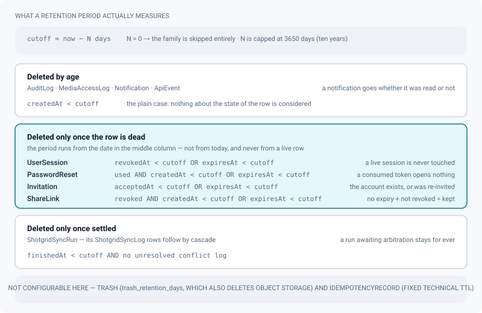
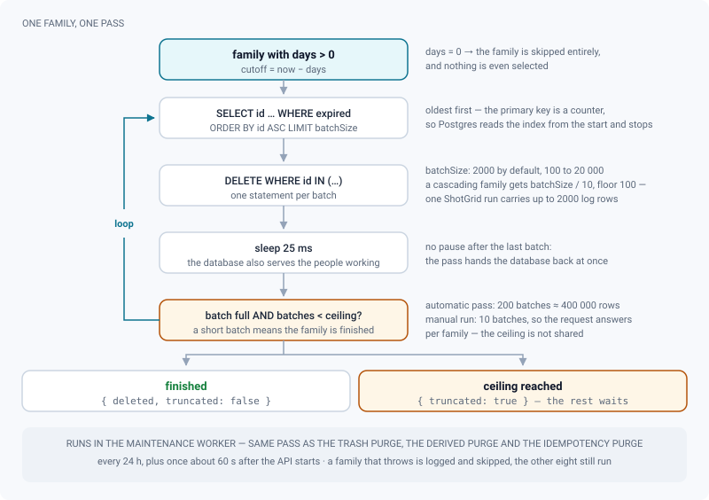

# Data retention & log lifecycle

*How long every journal is kept, which date each period is counted from, and how a sweep deletes millions of rows without locking the database.*

> Updated: 2026-08-23

ReView writes nine journals that grow with every day of production: who did what (audit), who
watched which media, notifications, sign-in sessions, password reset links, invitations,
client share links, ShotGrid sync history and the API v1 event log. Left alone they never
shrink — and several of them hold **personal data** (IP addresses, identities, timestamps)
that a studio cannot keep indefinitely without being able to say why.

This page is the retention policy of the instance. It is the page to open when answering a
GDPR request, a security questionnaire or a rights-holder audit.

## Where the policy lives

| Where | What |
|---|---|
| **Screen** | *Admin → Maintenance → Retention* (`/admin/retention`) |
| **Who** | `ADMIN` only — the routes sit behind the admin router, there is no per-project variant |
| **API** | `GET`/`PUT /api/admin/retention`, `POST /api/admin/retention/run` |
| **Stored as** | one studio setting, `retention_policy`, holding the nine periods and the batch size |

The screen always shows the **product default** next to the value in force, precisely because
it is read under pressure: when a client asks "how long do you keep our access logs", you
need to see both what you configured and what you started from.

Every field is sanitised on write: a period is rounded, clamped between `0` and **3650 days**
(ten years), and a value that cannot be read at all falls back to the default *for that field
alone*. A `retention_policy` row containing invalid JSON is ignored in favour of the defaults
rather than failing the page.

## The nine journals and their defaults

`0` in any field means **keep for ever** — the family is skipped entirely by the sweep, not
merely given a very long period.

| Family | Table | Default | What is deleted | Why this default |
|--------|-------|---------|-----------------|------------------|
| Audit log | `AuditLog` | **365 days** | Every row older than the period | One year is the usual floor for a security audit trail: it covers a full production and any yearly review |
| Media access log | `MediaAccessLog` | **365 days** | Every row older than the period | Answers "who saw this shot, and when" for a full year. Holds IP addresses, so it must be bounded |
| Notifications | `Notification` | **90 days** | Every row older than the period, read or not | The bell only ever shows recent activity; a three-month-old notification is noise |
| Sign-in sessions | `UserSession` | **30 days** | Only sessions **revoked or expired** more than that long ago | A live session is never touched. The trace of a closed session is only useful while investigating a recent incident |
| Password reset links | `PasswordReset` | **7 days** | Only links **used**, or **expired**, more than that long ago | A consumed token opens nothing; keeping it is pure liability |
| Invitations | `Invitation` | **90 days** | Only invitations **accepted** or **expired** more than that long ago | Once accepted the account exists; once expired the admin re-invites |
| Client share links | `ShareLink` | **180 days** | Only links **revoked**, or **expired**, more than that long ago | A link with no expiry that has not been revoked is still active, and is never deleted |
| ShotGrid sync history | `ShotgridSyncRun` (+ its `ShotgridSyncLog` rows, by cascade) | **90 days** | Only **finished** runs, and only if they carry **no unresolved conflict** | Long enough to explain a divergence from the current season; a run awaiting arbitration is never removed |
| API event log | `ApiEvent` | **30 days** | Every row older than the period | The historical value of the `GET /api/v1/events` cursor. A consumer further behind than this restarts from the present |

Two families are deliberately **not** configurable here:

- **Trash** keeps its own setting, `trash_retention_days` (30 days by default) — see
  [System and maintenance](system-and-maintenance.md). Emptying the trash deletes files from
  object storage, which is a different kind of operation with a different blast radius.
- **Idempotency records** (`IdempotencyRecord`) expire on a fixed technical TTL; they are a
  replay buffer for the v1 API, not a journal.

> [!IMPORTANT]
> The audit log **is** subject to retention, and expires at one year by default. If your
> studio needs an unbroken trail — a rights-holder contract, an ISO process — set the audit
> period to `0` and archive the table by other means, typically the database backup.

## What the period actually measures

A period is never simply "row age". For four of the nine families the sweep measures the age
of a *specific* date, and that is what makes the difference between deleting dead rows and
deleting live ones.

The screen says as much in one line under each field — *Deleted once older than this* against
*Only expired or revoked entries, and only once dead this long* — and the figure spells out
which timestamp each of them compares.

Three things are therefore **never** deleted, whatever the period:

- a **session that is still valid** — only revoked or expired ones are candidates;
- a **share link with no expiry that has not been revoked** — it is still an open door, and a
  retention sweep is not the place to close it (revoke it on the project instead);
- a **ShotGrid run carrying a conflict nobody has arbitrated** — the history that explains a
  divergence outlives the period that would have removed it.

> [!NOTE]
> Deleting a media cascades into its `MediaAccessLog` rows, so "who watched this shot" dies
> with the shot regardless of retention. And `MediaAccessLog.shareLinkId` is a plain column,
> not a foreign key: once a revoked share link is swept at 180 days, the access rows that
> named it survive with an id that no longer resolves. Investigate a client leak before the
> link expires, not after.

## How a pass deletes without locking the table

The sweep never issues a single large `DELETE`. For each family with a period greater than
zero it computes `cutoff = now − N days`, then loops:

1. rows are selected **oldest first** — the primary key is a counter, so Postgres reads the
   primary index from the start and stops as soon as the batch is full;
2. the batch is deleted in one statement, `batchSize` rows at a time (default **2000**,
   adjustable between 100 and 20 000);
3. the sweep sleeps **25 ms**, because the database is also serving the fifty people working;
4. a **short batch** means there is nothing left to take, and the family stops without one
   more query. Otherwise it loops.

Two ceilings bound the work: **200 batches per family** in an automatic pass (about 400 000
rows at the default batch size) and **10 batches** in a manual run, so that the HTTP request
answers. Whatever is left over is taken by the next pass, and the result says so.

A family whose deletion **cascades** gets a reduced batch: ShotGrid runs use `batchSize / 10`
with a floor of 100, because deleting one run can carry up to 2000 journal rows with it. That
is why the effective batch is not always the number you configured.

A family that throws — locked table, migration in flight — is logged and skipped; the other
eight still run.

This is what makes it safe to switch retention on for the first time on an instance that has
been running for a year: the backlog is absorbed over several nights instead of locking the
database for the length of one enormous delete.

> [!WARNING]
> The sweep runs inside the **maintenance worker**, in the same job as the trash purge, the
> obsolete-derivative purge and the idempotency purge — in that order. The job repeats every
> 24 hours and fires once again about 60 seconds after the API starts. If the worker
> container is not running, nothing is swept and nothing says so on this screen.

## Running a sweep on demand

*Admin → Maintenance → Retention → Run a sweep now* triggers the same sweep with the reduced
ceiling of ten batches per family. The toast gives the number of rows deleted; when a ceiling
was reached it adds *Batch ceiling reached — the nightly sweep will carry on*.

Use it to make a purge effective immediately after **shortening** a period — for example
after agreeing a shorter access-log period with a client, where "it will happen tonight" is
not the answer they are waiting for. Lengthening a period, by contrast, needs no run at all:
what is already deleted does not come back.

## Traceability

| Audit action | Written when | Carries |
|---|---|---|
| `RETENTION_CONFIG` | The policy is saved | The complete new policy |
| `RETENTION_RUN` | A manual sweep finishes | Rows deleted per family, and whether a ceiling was hit |
| `RETENTION_SWEEP` | An automatic sweep **actually deleted something** | Rows deleted per family, and whether a ceiling was hit |

All three are visible in *Admin → Maintenance → Audit*, which is itself subject to the audit
retention period above.

> [!TIP]
> An empty `RETENTION_SWEEP` history does not mean the sweep never ran — a pass that deletes
> nothing writes nothing. It means nothing expired. To prove the job is alive, look at the
> `maintenance` queue in *Admin → Maintenance → Jobs* instead.

## Answering a GDPR request

For "what do you keep about me, and for how long":

1. the table above lists every journal, what it contains and how long it lives;
2. `MediaAccessLog` and `AuditLog` are the two families that identify people directly — an
   identity plus an IP address on one side, an author plus an action on the other; both
   default to one year;
3. `UserSession` keeps a user agent and an IP address, but only while the session is alive
   and for 30 days after it dies; `Invitation` keeps an email address until 90 days after it
   was accepted or expired;
4. **deleting** an account removes its sessions, notifications, invitations and push
   subscriptions by cascade, while audit and media-access rows keep the action and drop the
   link to the person (`SET NULL`) — they become anonymous before their own retention
   expires;
5. **disabling** an account, which is what the admin screens actually do, deletes nothing:
   sessions and API tokens are revoked, the history stays attributed. Say so explicitly when
   answering an erasure request, and see [Content explorer](content-explorer.md) for how to
   go from one to the other.

## Related pages

- [System and maintenance](system-and-maintenance.md)
- [Users and roles](users-and-roles.md)
- [Content explorer](content-explorer.md)
- [Secure distribution](secure-distribution.md)
- [ShotGrid integration](shotgrid-integration.md)
- [Storage map](storage.md)
- [Identity, API and audit](identity-and-api.md)
