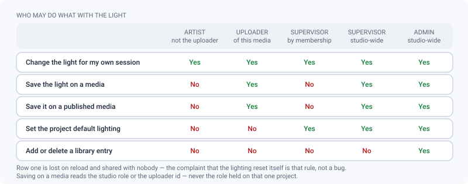
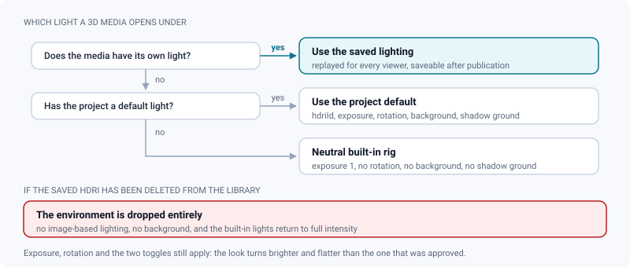

# HDRI library

*Curate the studio's lighting environments, and know exactly who can freeze a look for everyone.*

> Updated: 2026-08-23

A 3D review is only as honest as the light it is judged under. ReView keeps one **studio-wide
library of HDRI environments** — equirectangular `.hdr` and `.exr` maps — and offers it in the
lighting panel of every 3D review. A supervisor can then pin one environment on a media, or one
on a whole project, so that every reviewer opens the asset under the same light instead of each
inventing their own.

The library is deliberately small in surface: upload, list, delete. Everything interesting
happens downstream, in who is allowed to *save* a lighting choice and in what happens to media
that referenced an environment you removed.

## Where the library lives

*Admin → Review contexts → 3D & Splat* (`/admin/hdri`) is the whole management screen: an
**Add an HDRI** button and the **Library** list, one row per environment with a tone-mapped
preview, its name, its format badge and a delete button.

| Where | What | Notes |
|---|---|---|
| The entries | A `Setting` row named `hdriLibrary`, holding a JSON array | No dedicated table; the list is small and read on every 3D review |
| The files | MinIO, under the `studio/hdris/` prefix | Shown in *Admin → Storage* under the studio libraries, next to the OCIO configs |
| One entry | `id` (UUID), `name`, `storageKey`, `format`, `createdAt` | The name is the uploaded file name minus its extension |

`GET /api/studio/hdris` is open to **any authenticated account** — the 3D viewer needs the list,
and so does the project settings form. Writing is `ADMIN` only.

> [!IMPORTANT]
> That read route returns a **presigned download URL for every entry**, valid one hour, to any
> account that can sign in — external `CLIENT` accounts included. The library is not secret
> material; treat it as visible to everyone who has a login on the instance, and do not park a
> licensed environment in it that your clients are not entitled to.

## Adding, naming and removing an environment

Uploading takes three calls, two of which the browser makes on its own:

1. `POST /api/studio/hdris/presign` with `{ "format": "hdr" | "exr" }` returns
   `{ storageKey, uploadUrl }`. **The server decides the key and the extension**:
   `studio/hdris/{uuid}.{hdr|exr}`.
2. The browser `PUT`s the file straight to MinIO. It never transits through the API — which is
   exactly why no size limit applies to it.
3. `POST /api/studio/hdris` with `{ name, storageKey, format }` registers the entry and writes
   an `HDRI_ADD` line in the audit log.

Deleting is `DELETE /api/studio/hdris/:id` (`ADMIN`, audited as `HDRI_DELETE`): it removes the
entry **and** the MinIO object.

| Guard | Where | What is refused |
|---|---|---|
| Extension | Browser, before the presign | Anything other than `.hdr` / `.exr`, with an *Unsupported format* toast |
| `format` | Both write routes, before the service runs | Any value outside `hdr` / `exr` — answered by the generic `400 VALIDATION_FAILED` |
| `storageKey` | `POST /api/studio/hdris` | A key that does not start with `studio/hdris/` — `400 BAD_KEY` |
| `name` | `POST /api/studio/hdris` | Empty, or longer than 120 characters |

The declared format is what the server trusts: the file itself is never sniffed, so a `.exr`
renamed to `.hdr` is stored happily and fails later, in the browser, at load time. There is also
**no rename**: an entry takes the file name it was uploaded with, and changing it means
uploading again and deleting the old one.

> [!CAUTION]
> The delete button asks nothing. One click removes the entry and its file, immediately and for
> good, and every media that referenced it changes appearance the next time it is opened — see
> [Deleting an environment that media reference](#deleting-an-environment-that-media-reference).

## What to put in it, and what it costs

- **Only `hdr` and `exr`.** These are the two formats the viewer can decode (`RGBELoader` and
  `EXRLoader`), and the only two the presign route will hand a key for.
- **There is no size limit.** The studio-wide `max_file_size` applies to media uploads, not to
  this library. A 4 GB EXR latlong will upload, will be stored, and will then be **downloaded in
  full by every browser** that opens a 3D review using it. 2K is plenty for review.
- **The preview costs what the file costs.** Each row decodes the *whole* environment in the
  browser and tone-maps it (Reinhard, gamma 2.2) into a 96 × 48 canvas; the result is never
  stored. So opening the library page downloads every environment in it — which is the earliest
  and most honest symptom of an over-sized library.

> [!TIP]
> Resize environments before uploading, and name them for what they are — `studio-neutral-2k`,
> `sunset-warm-2k` — rather than for where they came from. The name is what a supervisor picks
> from a dropdown, months later, with no preview next to it.

## Lighting a 3D review

The lighting panel of the review dock exists for **3D models only**. A Gaussian splat carries
its lighting baked into the gaussians, so there is nothing to relight, and the panel is not
offered.

| Control | Range in the viewer | What it does |
|---|---|---|
| **HDRI** | the library, plus *None* | Loads the environment as an image-based light (PMREM-prefiltered) |
| **Exposure** | −5 to 5, step 0.1, default 1 | Tone-mapping exposure of the renderer |
| **Y rotation** | 0 to 360°, step 1 | Turns the environment, and the background with it |
| **HDRI as background** | on / off, default off | Shows the environment behind the model instead of the theme colour |
| **Shadow ground** | on / off, default off | An invisible plane under the model that catches shadows — independent of the HDRI |

When an environment is active, the scene's built-in lights are attenuated to 12 % of their
intensity: the HDRI is doing the lighting, and leaving the studio rig at full strength would
wash the asset out.

**Who may save the choice is narrower than "reviewers"**, and narrower than it looks:

- Anyone who can open the review may tweak the lighting **for their own session**. Nothing is
  sent to the server, and the changes are gone on reload.
- Persisting it on the media is reserved to an `ADMIN`, a **studio** `SUPERVISOR`, or **the
  account that uploaded the media**. The check reads the global role or the uploader id — a
  member promoted to supervisor *on that project alone* is not enough.
- The saved configuration lives in `metadata.splatPresentation.lighting` on the media and is
  replayed for every subsequent viewer, so everyone judges the model under the same light.
- Saving is allowed even on a **published** media: lighting is staging, not content. With the
  thumbnail, it is one of the two documented exceptions to the publication lock.

> [!NOTE]
> The save button in the dock reads *Default lighting of the project*. It writes on **this
> media**, not on the project — the project default is set in the project settings, described
> below. The tooltip is the accurate one: *Save the default lighting — replayed for everyone on
> open*.

Server-side bounds on the saved lighting are wider than the panel: exposure **0 to 10**,
rotation **−360 to 360**, `showBackground` required, `groundShadow` optional, `hdriId` up to 300
characters. Two consequences worth knowing: a **negative exposure cannot be saved** even though
the panel lets you dial one, and the panel can never reach the upper half of the accepted
exposure range.

## Which light a media opens under

A project can define the lighting replayed when a 3D media has none of its own, in the **Default
3D lighting** section of *Project → Settings* (effective project role `SUPERVISOR`, so a
supervision granted on that project alone is enough here):

| Field | Default | Accepted range |
|---|---|---|
| `hdriId` | none (neutral) | up to 64 characters — a library id is a 36-character UUID |
| `exposure` | `1` | 0 to 10 (the form offers 0 to 10, step 0.05) |
| `rotationDeg` | `0` | −180 to 180 |
| `showBackground` | `false` | boolean |
| `groundShadow` | `false` | boolean |

The section starts empty: *Set a default* creates a neutral entry you then edit, and *Remove the
default* takes the project back to inheriting nothing. See
[Pipeline settings](pipeline-settings.md) for how project settings inherit from the studio.

> [!WARNING]
> A guest opening a **client share link** does not get any of this. The share endpoint returns
> the file URLs and nothing else, so a shared 3D media is shown under the neutral built-in rig,
> whatever was saved on it. Screen anything whose look matters yourself, or send a rendered
> version. See [Sharing](../user-guide/sharing.md).

## Deleting an environment that media reference

Deletion removes the library entry and the storage object. **It does not cascade** — media and
project settings keep the now-dangling `hdriId`, and nothing anywhere warns you.

What the viewer then does is worth stating plainly, because the intuitive expectation is wrong:
it does **not** fall back to another HDRI. The environment map is dropped entirely
(`scene.environment = null`, no background) and the scene reverts to its **built-in light rig at
full intensity** — brighter and flatter than an HDRI-lit scene, precisely because those lights
are attenuated while an environment is active. The saved exposure, rotation, background and
shadow-ground values are kept and applied to that rig.

The practical consequence: deleting a popular HDRI silently changes the look of every model
reviewed under it, **including published ones**, with no warning, no cascade and no audit trail
on the affected media. The only trace is the `HDRI_DELETE` line in the studio audit log. Rename
or replace rather than delete when a review round is in flight.

## Use cases

### Setting up a lighting reference for a look-dev review

*Look-dev wants every asset judged under the same two environments.*

1. Upload the two environments (`.hdr` or `.exr`), resized to something a browser fetches
   quickly — 2K latlong is plenty, and nothing stops you from uploading a 16K one by mistake.
2. Set the **project default lighting** on the show: the chosen HDRI, an agreed exposure and
   rotation, background off (so the asset is judged, not the backdrop), shadow ground on if the
   department wants contact.
3. From then on every 3D media of the project opens under that light, with nobody touching a
   control.
4. When an asset needs its own setup, have the **uploader or a studio supervisor** save it on
   that media — it then overrides the project default for every viewer.
5. Tell artists that their own tweaks are session-only. The recurring complaint *my lighting
   reset itself* is this rule, not a bug.

### Pruning the library without breaking reviews

1. `GET /api/studio/hdris` gives the ids. There is **no "where is this used" report**, so treat
   every deletion as potentially breaking.
2. Prefer **replacing the file behind a name**: upload the new environment, re-point the project
   defaults and the per-media configurations to it, and only then delete the old entry.
3. If you must delete something in use, do it between shows, not during a review round — the
   change is immediate, retroactive and silent.
4. Never delete an environment referenced by a **published** media's saved lighting without
   telling the supervisor: the media stays published and locked, but it no longer looks the way
   it was approved.

### Nobody can save the light on this asset

The reviewer is a supervisor *on the project* but an artist studio-wide, and did not upload the
media. That is the one gap in the matrix above. Either ask the uploader to save it, ask a studio
supervisor, or — if the light should apply to the whole show anyway — set it as the **project
default**, which project-level supervision is enough for.

## Related pages

- [Pipeline settings](pipeline-settings.md) — how studio, project, sequence and shot settings inherit
- [Colour management](color-management.md) — the OCIO display and view intent shown next to the lighting panel
- [Storage](storage.md) — where `studio/hdris/` sits in the bucket, and what it weighs
- [Users & roles](users-and-roles.md) — what `ADMIN`, studio `SUPERVISOR` and project membership mean
- [3D review (user guide)](../user-guide/review-3d.md) — the dock, the viewer and the rest of the panel
- [Spatial thumbnails](spatial-thumbnails.md) — the other server-side render of a 3D media
