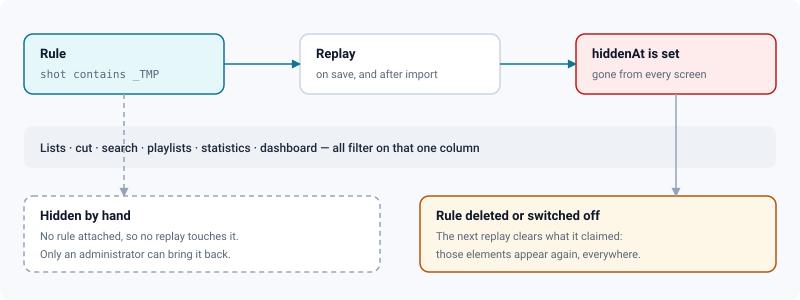

# Hiding elements

*Keeping test sequences, temporary shots and recipe assets out of every screen — without deleting them.*

> Updated: 2026-08-26

Every studio drags a few things it never wants to see: a sequence that only ever held tests,
shots named `SH999_TMP`, an asset created to check an import. Putting them in the trash is
not the answer — on a project linked to ShotGrid they come straight back at the next sync,
and along the way you lose the work, the comments and the history attached to them.

Hiding is the answer. The element stays in the database, keeps syncing, and simply stops
being offered anywhere. **Administrators only**: making something disappear from everyone's
screens is not a project-level decision, and the rules themselves expose the studio's naming
conventions, which an artist has no use for.

## Hiding one element

Right-click any sequence, shot or asset card and choose **Hide from everyone**. It vanishes
from the list you are looking at — which is exactly what you asked for, and also why it can
only come back from **Administration → Content → Hidden elements**.

A hand-hidden element carries no rule. No replay will ever bring it back on its own: that is
what protects a deliberate decision from a convention written six months later.

## Rules, for what will arrive later

One-off hiding does not scale to a studio whose site keeps producing `_TMP` shots. A **rule**
is declarative — it says what is not wanted, once, and applies to what exists as well as to
what arrives next week.

Open **Administration → Content → Hidden elements → New rule**.

| Field | What it does |
|-------|--------------|
| Applies to | Everything, or one of episodes, sequences, shots, assets |
| Match | Exactly, Starts with, Contains, or Regular expression |
| Pattern | What to look for |
| Ignore upper and lower case | On by default — naming conventions rarely are case-consistent |
| Note for later | Why you wrote this rule. Administrators only; never shown to artists |

A pattern is tested against the element **code**, and against its **name** when it has no
code — an asset has none. Both are checked, so you never have to guess which one your
studio's convention lives in.

### Writing a pattern

| Match | Pattern | Hides |
|-------|---------|-------|
| Exactly | `SH999` | that one element, and nothing else |
| Starts with | `TEST_` | everything whose name begins with it |
| Contains | `_TMP` | everything carrying it anywhere in the name |
| Regular expression | `_(TMP\|TEST)$` | names ending in `_TMP` or `_TEST` |

The regular expression is the only form that can be wrong, and the only one worth learning:
`|` means *or*, `$` matches the end of the name, `^` the beginning, `.` any character and
`.*` any run of them. The same table is available in the application, folded under **How to
write a pattern**, right where you type it.

> [!TIP]
> Start with **Contains**. It covers most conventions (`_TMP`, `_OLD`, `ZZ_`) without any
> syntax to get wrong, and a rule you can read six months later is worth more than a clever
> one.

> [!IMPORTANT]
> An invalid — or pathologically slow — regular expression is **refused when you save it**,
> not silently ignored. A rule that looked active while hiding nothing would be impossible to
> diagnose: you would see the rule, see the shot, and have no way to connect the two.

## What "hidden" reaches

One column carries the state, and every screen filters on it. A hidden element disappears
from:

- the **Sequences**, **Shots** and **Assets** tabs, and their counts;
- the **auto-cut** — a hidden shot is not edited into the film, and a hidden sequence takes
  its shots with it;
- **global search**, and the **favourites** you may have pinned on it;
- **playlist candidates** — the work of a hidden shot is not offered for dailies, which is to
  say not shown to a client;
- **production statistics**, the **progress matrix** and the **dashboard**.

It does **not** disappear from the API (`/api/v1`). That is deliberate: a render farm
publishing to a shot, or a DCC pushing a version, must keep working. Hiding is a display
decision, not a lock — see [Publish lock](../user-guide/upload-and-publishing.md) for what
actually locks.

## Replaying, and bringing things back

Rules are replayed whenever one is created, edited, switched off or deleted — and after
every ShotGrid import, which is where the elements you want to hide are born. **Replay the
rules** does it on demand and reports what it did: so many hidden, so many brought back.

Switching a rule off, or deleting it, does not itself reveal anything: the following replay
does, by finding elements no rule claims any more. That is why the button reports two
numbers rather than one.

> [!NOTE]
> Rules can be studio-wide (all projects) or attached to a single project. A studio rule
> shows up in a project's list too — otherwise an administrator would see a shot stay hidden
> with no rule in sight to explain it.

## Related pages

- [Project organization](project-organization.md) — archiving, quotas and templates
- [ShotGrid integration](shotgrid-integration.md) — where hidden elements keep coming from
- [Projects & pipeline](../user-guide/projects-and-pipeline.md) — what a sequence, a shot and
  an asset are
