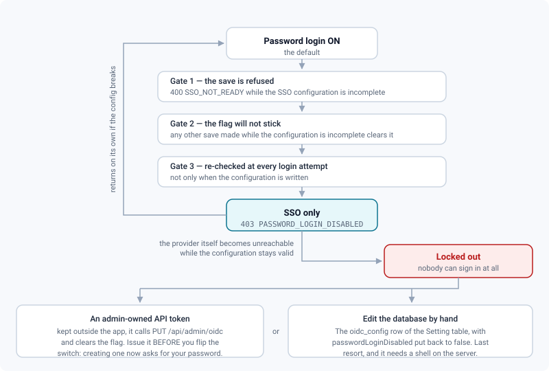

# Identity, API & audit

*SSO, sessions, machine identities, scopes, webhooks and access logs: who gets in, with what powers, and what is traced.*

> Updated: 2026-08-23

Four different things can present themselves to the API, and they are not interchangeable: a
human with a session, a person's API token, a machine's service token, and a client holding a
share link. Most administration mistakes in this area come from treating one as another —
handing a render farm a personal token, or assuming a role change kills a robot.

Everything on this page is administered from two groups of the admin sidebar: *Studio →
**Identity (SSO)*** for the way people sign in, and *Communications → **API & Webhooks*** and
*Communications → **Service tokens*** for the way machines do.

## SSO (OIDC) — *Admin → Studio → Identity (SSO)*

Single sign-on against any OIDC provider, authorization code flow with `state` and `nonce`
carried in a signed cookie.

1. Create OAuth credentials at your provider with the redirect URI
   `https://<your app>/api/auth/oidc/callback` — the screen prints the exact string once the
   public URL is filled in.
2. Fill **App public URL**, **Issuer**, **Client ID** and **Client secret**, then tick the
   enable box and save.
3. Decide about **auto-provisioning** before you tell anyone the button exists.

| Field | Default | Notes |
|---|---|---|
| `enabled` | `false` | The button only appears once the configuration is also *complete* |
| `issuer` | `https://accounts.google.com` | Pre-filled; leave it if you use Google |
| `clientId` | empty | |
| `clientSecret` | empty | **Write-only**: stored AES-256-GCM encrypted and never returned. The API exposes only `hasSecret`, and submitting an empty value keeps the current secret |
| `publicUrl` | empty | Trailing slashes are stripped; the redirect URI is built from it |
| `autoProvision` | `false` | An unknown but **verified** e-mail creates an **`ARTIST`** account on first SSO login; otherwise unknown e-mails are refused |
| `buttonLabel` | pre-filled | Clear the field and the login page falls back to *Sign in with Google*, translated into the reader's language |
| `logoKey` | empty | See below; only keys under `branding/` are accepted |
| `passwordLoginDisabled` | `false` | See [SSO only](#sso-only--turning-off-password-login) |

The provider must return a **verified e-mail**; an account with 2FA still goes through its
code step after SSO. Auto-provisioned logins are audited as `OIDC_PROVISION`, successful ones
as `OIDC_LOGIN`, and configuration saves as `OIDC_CONFIG_UPDATE`. A callback failure redirects
to `/login#ssoerr=<message>` rather than returning JSON, so the error lands on the login page
where the person is looking.

> [!NOTE]
> `GET /api/auth/oidc/status` is public and reports the **effective** state: the button is
> advertised only when the configuration is complete, and `passwordLogin` follows the same
> rule the login route applies. The login page can therefore never show a form the server
> refuses, or hide one it still accepts.

### SSO button logo

Upload a PNG, JPEG or WebP through `POST /api/admin/oidc/logo/presign` (`ADMIN`, a 15-minute
presigned `PUT` to `branding/sso-{timestamp}.{ext}`). It is drawn to the left of the button
label on the login page. **SVG is refused** — these files are served from the application's
own origin and an SVG is a scriptable document. *Remove* falls back to a plain text button.

### SSO only — turning off password login

*Disable password sign-in (SSO only)* removes the e-mail and password form from the login
page and makes `POST /api/auth/login` and self-registration answer
**`403 PASSWORD_LOGIN_DISABLED`**. Everyone then signs in through the provider; 2FA, personal
API tokens and service tokens are unaffected.

Three guards stand between this switch and a locked-out studio:

- the setting **cannot be saved** while the SSO configuration is incomplete — the server
  answers **`400 SSO_NOT_READY`**. "Complete" means `enabled`, `clientId`, `clientSecret` and
  `publicUrl` are all set; the issuer is not checked, since it always has a default;
- any *other* save made while the configuration is incomplete silently coerces the flag back
  to `false`, so a legitimate edit is never blocked by a flag it did not set;
- **the block is re-evaluated on every single login attempt**, not just when the configuration
  is written. The instant the SSO configuration stops being complete — a cleared secret, a
  disabled toggle — password login is back, with no administrative action at all.

That covers a broken *configuration*, not a broken *provider*. If the identity provider itself
becomes unreachable while the configuration stays valid, nobody can sign in, and the way back
is one of the two in the figure.

> [!CAUTION]
> The break-glass token works because an `rvk_` token can currently still reach the internal
> `/api` surface — see [the caveat below](#the-project-binding-and-its-real-boundary). Plan
> the database fallback as well: know which host runs PostgreSQL and how to reach the
> `oidc_config` row of the `Setting` table before you need it, not after.

Note also that in SSO-only mode the password + 2FA path is unreachable in practice: the
intermediate 2FA token is only minted by `POST /api/auth/login`, which is blocked. Only the
SSO → 2FA path works.

## Sessions & offboarding

Every login creates a revocable session — one row per sign-in, whose id travels inside both
the access and the refresh JWT, so revoking the session invalidates both. The person's own
view of them is in [Account security](../user-guide/account-security.md).

| Action | Route | Role |
|---|---|---|
| List own sessions | `GET /api/auth/sessions` | any account |
| Revoke one own session | `DELETE /api/auth/sessions/:sid` | owner |
| Revoke one session of any account | `DELETE /api/admin/sessions/:sid` | `ADMIN` |
| Revoke **all** sessions of an account | `DELETE /api/users/:id/sessions` | `ADMIN` |

Validity is cached in-process for **30 seconds**, so a revocation bites in ≤ 30 s everywhere,
and immediately in the process that performed it.

To cut all access of a leaving collaborator, **disable the account** in *Users*. That is the
intended offboarding move, and it revokes every session **and** every API token in one gesture
— the same as changing their role, resetting their password or changing their login e-mail.
It also leaves the audit trail intact, which a hard delete does not: deleting a user empties
the `userId` of everything they ever did.

| Gesture | Sessions | API tokens | Share links they created | Audit authorship |
|---|---|---|---|---|
| `DELETE /api/users/:id/sessions` | revoked | **kept** | kept | kept |
| Change the role | revoked | revoked | kept | kept |
| **Disable the account** | revoked | revoked | kept | kept |
| Delete the account | revoked | revoked | **revoked** | **lost** |

> [!WARNING]
> Disabling does **not** revoke the share links the person issued. If the departure is
> sensitive, walk their projects' **Shares** tabs, or delete the account — which revokes the
> links but also erases them from the audit log. See
> [Secure distribution](secure-distribution.md).

## API tokens (studio view) — *Admin → Communications → API & Webhooks*

`GET /api/admin/api-tokens` lists every **active** token of the studio, personal **and**
service, with owner, scopes, last use and expiry. `DELETE /api/admin/api-tokens/:id` revokes
immediately — there is no cache, every request re-reads the token — and is audited as
`API_TOKEN_REVOKE`.

People create their own tokens from their profile (`POST /api/auth/tokens`). The clear value,
`rvk_` followed by 40 hex characters, is **shown once** and stored only as a SHA-256 hash. A
token can never create another token.

> [!IMPORTANT]
> **Issuing a token asks for the issuer's current password**, on both routes. Without it,
> `POST /api/auth/tokens` answers `401 CURRENT_PASSWORD_REQUIRED` and
> `POST /api/admin/service-tokens` answers `403 CURRENT_PASSWORD_REQUIRED`. A stolen access
> token can therefore no longer be turned into a ten-year credential. Plan for it: any runbook
> that says "issue a token first" now needs a human who knows the password.

### Scopes

Scopes are `domain:action` pairs over **nine domains**, plus `admin` which grants everything.
`GET /api/auth/scopes` returns the catalogue (authentication required) and it is what feeds
the checkbox grid in both token dialogs — the day a scope leaves the server, it leaves the
screens on its own.

| Domain | Actions | Notes |
|---|---|---|
| `projects` | `read` | Read-only: creating a project is not an integration's job |
| `sequences` | `read`, `write` | |
| `shots` | `read`, `write` | |
| `assets` | `read`, `write` | |
| `tasks` | `read`, `write` | |
| `versions` | `read`, `write` | |
| `media` | `read`, `write` | Publishing a file needs `versions:write` **and** `media:write` |
| `comments` | `read`, `write` | |
| `events` | `read` | The journal is read; it writes itself |
| `admin` | — | Covers every scope above |

The catalogue deliberately describes **only what is actually guarded**. Nine names that no
route ever required — `playlists:*`, `webhooks:*`, `users:*`, `projects:write` and
`events:write` — were removed: a scope that protects nothing is worse than a missing one,
because it gets ticked, documented, and believed. Naming one today is refused with
**`400 UNKNOWN_SCOPE`**.

- **Legacy tokens keep working.** A token holding the old `read` expands to every `*:read`; one
  holding `write` expands to every `*:read` **and** every declared `*:write`, with no exception.
  A stored scope that has since left the catalogue is ignored, and the token loses nothing,
  since no route ever consulted it.
- Granting `d:write` implies `d:read`, in the server and in the picker.
- A coarser guard sits in front of everything: an API token is refused on any
  non-`GET`/`HEAD`/`OPTIONS` request unless it carries `write`, `admin` or some `*:write`
  (`403 SCOPE_WRITE_REQUIRED`). The default scope on a new personal token is `read`, so a
  read token is genuinely read-only everywhere, not only where a scope is declared.
- Tokens have **no expiry by default** (`expiresInDays` is optional, 3650 maximum). An issued
  token lives until it is revoked. Set an expiry on anything handed to a contractor; the
  dialogs offer 30, 90 and 365 days, and preselect 365.

### The project binding, and its real boundary

A token can be **bound to one project**. Cross-project access is then refused with
`403 TOKEN_PROJECT_SCOPE` — **on the `/api/v1` surface**, where the handlers call the check as
soon as they have resolved a project.

> [!CAUTION]
> The internal `/api` routes do **not** apply that check, and do not read scopes either. A
> middleware meant to close the hole — refusing any `rvk_` token outside `/api/v1` with
> `403 API_TOKEN_V1_ONLY` — is written and unit-tested but is **not mounted** in the running
> server, so [API authentication](../api/authentication.md) describes the intended behaviour
> while this page describes the current one. Until it is mounted, treat a project binding as a
> pipeline safety belt, never as a containment boundary, and treat an admin-owned
> write-scoped token as an administrator credential in full.

The one internal router that already refuses API-token callers outright is
`/api/admin/service-tokens`: a token can never mint a machine identity.

The surface a bound read token is genuinely useful on has grown: `GET /api/v1/media/{id}/url`,
`GET /api/v1/media/{id}`, `GET /api/v1/tasks/{id}/versions/latest` and `GET /api/v1/latest`
let a DCC or a farm pull the current delivery of a shot, and there is a first-party
[Python client](../api/python-client.md) that speaks it.

## Service tokens — machine identities

*Admin → Communications → **Service tokens***. `POST /api/admin/service-tokens`
(**`ADMIN` only**) issues a token for a render farm, a pipeline daemon or a bot. There is now
a screen for it, where a `curl` used to be the only way in: the list shows, per identity, the
scope level as a badge, the role of the carrier account, the project it is confined to or
*All projects*, the expiry, the last use and the raw scopes; *Revoke* is in the right-click
menu. The **New service token** dialog carries the name, a description, the role, the project,
the expiry and the same server-driven scope grid as a personal token — plus your own password.

Each token is backed by a service account that:

- **cannot log in** — the login route refuses `isService` accounts with the same message as a
  wrong password, so probing tells an attacker nothing;
- never appears in the directory, presence lists, mail digests, weekly reports, chat,
  assignment pickers or invitations;
- exists so that writes keep an author and an audit trail. Its address is
  `svc-<name>@service.review.invalid`, a domain that cannot be routed.

Choose its role: `SUPERVISOR`, `ARTIST` or `CLIENT`, defaulting to `ARTIST`. **`ADMIN` is not
an accepted value** — a machine identity never administers the studio. Binding the token to a
project also **creates the project membership** for the service account, which an
`ARTIST`-role account needs in order to see the project at all.

Reusing the same service name reuses the account, and may adjust its role. Revoking a service
token leaves the account in place, so every version it published keeps its author.

See [API v1 — pipeline integration](../api/v1-integration.md).

## Outgoing webhooks — same section

All routes are `ADMIN` under `/api/admin/webhooks`, audited as `WEBHOOK_CREATE`,
`WEBHOOK_UPDATE`, `WEBHOOK_DELETE` and `WEBHOOK_REPLAY`. Add a URL, pick the events, and the
**HMAC secret is shown once** at creation before being stored encrypted.

### Scope: the whole studio, or one project

A webhook now carries a **`projectId`**. Left empty it is a studio webhook and receives
everything, as before. Set to a project it receives that project only — and an event that
belongs to no project never reaches it, since nothing can assert that it concerns it. That is
what makes a webhook giveable to one client without leaking every other show's shot codes.
The scope is editable on the row, without recreating the webhook: it is exactly the setting
one discovers too late.

### Delivery, retries and the automatic stop

| Property | Value |
|---|---|
| Body | `{ id, event, timestamp, data }`, where `id` is the delivery id |
| Signature | `sha256=HMAC(secret, "<timestamp>.<body>")` in `X-ReView-Signature` |
| Other headers | `X-ReView-Event`, `X-ReView-Timestamp`, `X-ReView-Delivery` |
| Timeout | 10 seconds, redirects never followed |
| Retries | **5 attempts**, exponential backoff from 10 s, sent from the **worker** container |
| Response kept | Up to 1000 characters, read even on a `2xx` — a "200 OK" carrying an error body is the classic misconfigured relay |
| Test button | Enqueues a real signed delivery with the event name `test` |

> [!WARNING]
> **A webhook deactivates itself after five consecutive exhausted deliveries** and stops
> sending silently. The list marks it, distinctly from a webhook you simply unticked, because
> the two call for different actions. Re-enabling it resets the failure streak; a single
> success resets it too.

Every attempt leaves a row. `GET /api/admin/webhooks/:id/deliveries` pages them newest first
(`limit` 1–100, default 25, `before` cursor), with the status, the attempt count, the HTTP
code and the response excerpt. `POST /api/admin/webhooks/:id/deliveries/:deliveryId/replay`
sends a lost one again as a **new row** carrying `replayOfId` — what was lost stays readable
next to what replaced it — and answers `202`. Replay is refused while the webhook is inactive
(`WEBHOOK_INACTIVE`), because the delivery would sit pending forever, and the interface only
offers it on deliveries that actually failed: replaying a success duplicates it downstream.

### SSRF protection, in two stages

The two checks are not the same, and both matter:

- **At creation**, the URL is matched against hostname patterns: non-HTTP schemes, `localhost`,
  `127.*`, `10.*`, `192.168.*`, `172.16–31.*`, `169.254.*`, `0.0.0.0`, `::1`, anything ending
  in `.local`/`.internal`/`.lan`, and dotless hostnames are refused with `400 BAD_WEBHOOK_URL`.
  No DNS is involved.
- **At delivery**, the hostname **is resolved** and the delivery is refused if any returned
  address is private — RFC1918, loopback, link-local, CGNAT, multicast, and the IPv6
  equivalents including `::ffff:` mapped addresses and NAT64. A public hostname that resolves
  to an internal IP is therefore blocked at send time, and the refusal is recorded on the
  webhook.

The residual gap is DNS **rebinding** between the lookup and the request — unavoidable without
driving the socket directly, and mitigated by refusing redirects. The worker runs inside the
network where MinIO, Redis and PostgreSQL live, which is why this is worth the two checks.

### Which events actually fire

Ten event names are emitted today, and they are the only ones you can subscribe to:

`comment.created`, `comment.resolved`, `media.published`, `review.decision`, `task.created`,
`task.updated`, `task.status_changed`, `task.assigned`, `version.created`,
`version.published`.

The vocabulary itself is larger — `/api/v1/schema` still returns all eighteen names, because a
consumer may hold one from before — but the eight without an emitter
(`project.created`, `project.updated`, `sequence.created`, `shot.created`, `shot.updated`,
`asset.created`, `media.uploaded`, `media.failed`) are **refused at subscription** with a
validation error, instead of succeeding and delivering nothing. A subscription you cannot
honour is worse than a missing event: it looks like a wired alarm.

Two things changed about *when* they fire:

- events are now published from the **service layer**, so the same fact leaves the studio
  whether it came from a script or from a supervisor clicking in the interface. Before, only
  `/api/v1` writes produced them;
- `version.published` is **coalesced** over a five-second window per version, so a publication
  that travels through both a service and a v1 route produces one journal line and one
  delivery, not two.

Separately, the admin form still offers only **three** checkboxes (`media.published`,
`review.decision`, `comment.created`). The other seven are reachable through a direct
`POST` or `PATCH` on `/api/admin/webhooks`, and once subscribed they show as badges on the row.

### When the receiver cannot be reached from outside

A daemon behind the studio firewall polls instead: `GET /api/v1/events` (scope `events:read`,
cursor-based, 1–500 per page, default 100). Called **without** a `since` cursor it
deliberately returns an empty page and the current cursor rather than replaying history —
take the cursor, then poll from it, and a restart neither loses nor repeats anything. It also
filters by project and by event name. `GET /api/v1/schema` (scope `projects:read`) returns the
full scope and event catalogues, so a client never hard-codes an enum.

## Media access log — *Admin → Maintenance → Media access*

`GET /api/admin/media-access` (`ADMIN`, paginated, newest first) gives one line per
consultation, **deduplicated per viewer, per media, over 30 minutes**, covering internal
reviews (the account) and client shares (the link label, the IP, the timestamp). A link that
has since been purged shows a placeholder label rather than dropping the row. Logging is
fire-and-forget: a failure is logged and never blocks the request, so the log is evidence, not
proof of completeness.

It complements the audit log — creations, revocations, 2FA events, configuration changes — in
*Maintenance → Audit*, described in
[System & maintenance](system-and-maintenance.md).

## Use case: giving the render farm write access to one show

*The farm must publish playblasts into one project, and nothing else.*

1. *Admin → Communications → Service tokens → New service token*: a descriptive name, role
   **`ARTIST`**, the project, an expiry, and the scopes it truly needs —
   `versions:write` and `media:write` for a publish, nothing more. The membership is created
   for you, and your password is asked for at the end.
2. Store the returned token in the farm's secret store. It is shown **once**.
3. Have the farm use the **`/api/v1`** endpoints, through the
   [Python client](../api/python-client.md) if you can. That is where the project binding is
   enforced; the internal `/api` routes do not apply it today.
4. Do not choose `SUPERVISOR` "to avoid permission problems" — a supervisor-role service
   account sees and writes to every project in the studio, binding or not.
5. When the show wraps, revoke the token from the right-click menu. The service account stays,
   so every version it published keeps its author.

## Use case: rotating out a compromised token

*A token was pasted into a public CI log.*

1. Revoke it now: *Admin → API & Webhooks*, or `DELETE /api/admin/api-tokens/:id`. Revocation
   is checked on every request with no cache, so it is instant.
2. Work out what it could do. A token carrying `write` or `admin` and owned by an admin
   account could reach every `/api/admin/*` route. If so, treat this as an administrator
   credential compromise, not a token leak.
3. Check *Maintenance → Audit* around the exposure window — `SHARE_CREATE`, `USER_*`,
   `SETTING_UPDATE`, `WEBHOOK_CREATE`, `API_TOKEN_CREATE` — and *Media access* for what was
   downloaded.
4. Reissue with the narrowest scopes that work, an expiry and a project binding. Reissuing now
   requires the owner's password, so do it with the owner rather than for them.
5. Remember that changing the owner's password or e-mail, or disabling their account, **also**
   revokes all of their other API tokens — convenient for a clean slate, disruptive if they
   run other automations.

## Use case: turning on SSO without locking yourself out

1. Configure the provider and enable the SSO **button** first. Leave password login on. Sign
   in through the provider with a **test account** and confirm the e-mail comes back verified.
2. Decide about auto-provisioning. On, any verified e-mail your provider accepts gets an
   `ARTIST` account on first login — appropriate for a studio-owned directory, dangerous for a
   tenant that accepts external identities.
3. Issue a break-glass personal API token on an admin account, **with a write scope**, and
   store it outside the application. You will be asked for that account's password, so do it
   while the person is available.
4. Write down the database fallback too: host, credentials, and the `oidc_config` row.
5. Only then enable *SSO only*. If the configuration is incomplete the save is refused with
   `400 SSO_NOT_READY`, and the checkbox stays disabled until it is.
6. Verify the recovery path once, in a test window: clear the SSO client secret and confirm
   password login comes back on the very next attempt.

## Use case: giving one client a webhook without showing them the studio

1. Create the webhook with **`projectId` set to their show** — the *Scope* selector in the
   creation form, or on the row afterwards.
2. Subscribe it to the events they should see. Three are offered in the form; a direct
   `POST /api/admin/webhooks` reaches the other seven.
3. Hand over the secret shown at creation, and the signature recipe: the HMAC covers
   `"<timestamp>.<body>"`, and `X-ReView-Delivery` is what they deduplicate on.
4. Press the **test** button and read the delivery log. A `2xx` with an error body in the
   excerpt means their relay accepted and dropped it.
5. Come back to the log the first week. A webhook that goes quiet has probably deactivated
   itself after five exhausted deliveries; re-enable it once their endpoint is fixed.

## Troubleshooting

**`400 UNKNOWN_SCOPE` on a scope that used to work.** It left the catalogue because no route
ever required it. Existing tokens holding it keep working and lose nothing.

**`403 SCOPE_WRITE_REQUIRED` on a token that has `media:write`.** That guard is not the
problem; check the method. It only refuses when the token carries no write scope at all.

**`403 CURRENT_PASSWORD_REQUIRED` from an automation that used to mint tokens.** Token
issuing is now a human act, by design. Issue the token once, by hand, and store it.

**A webhook stopped without anyone touching it.** Five consecutive exhausted deliveries
deactivated it. The row is marked; fix the endpoint, re-enable it, and the streak resets.

**Replay is refused.** Either the webhook is inactive (`WEBHOOK_INACTIVE`) or the delivery
succeeded — only failed deliveries are replayable, to avoid duplicating a message the
consumer already has.

**Subscribing to `shot.created` fails validation.** It has no emitter, so it is not offered
and not accepted. Poll `GET /api/v1/events` for what does exist, or follow `task.created`.

**Password login is still available after ticking SSO only.** The configuration is not
complete — the flag was coerced back to `false`, or the save was refused with
`400 SSO_NOT_READY`. Check that the client secret is really stored (`hasSecret`).

## Related pages

- [API authentication](../api/authentication.md)
- [API v1 — pipeline integration](../api/v1-integration.md)
- [Python client](../api/python-client.md)
- [Account security (user)](../user-guide/account-security.md) — where a person issues their own token
- [Users & roles](users-and-roles.md)
- [Secure distribution](secure-distribution.md)
- [System & maintenance](system-and-maintenance.md)
