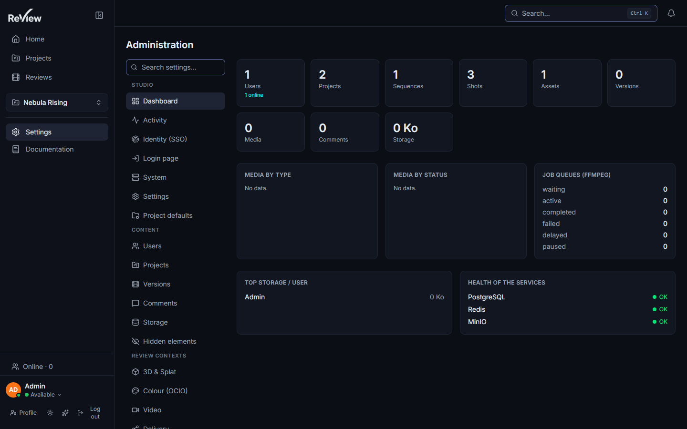
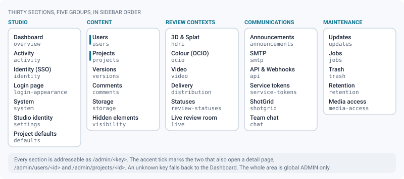
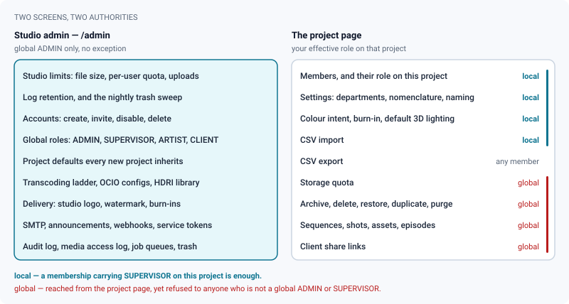

# Admin overview

*Every section of the admin area, who may open it, and which studio powers deliberately live on the project page instead.*

> Updated: 2026-08-23

The admin area lives at `/admin` and is **reserved to accounts whose global role is
`ADMIN`**. The restriction is enforced twice, and both times on purpose: the page itself
refuses any other role with *Access reserved for administrators*, and every `/api/admin/*`
router — the main one plus the three mounted beside it for webhooks, service tokens and
jobs — sits behind `authenticate + requireRole(ADMIN)`. Hiding a tab has never been a
permission; the server has to say no as well.

A global `SUPERVISOR` therefore has **no admin area at all**. That is not an oversight:
supervisors manage *shows*, administrators manage the *studio*. A supervisor can see every
project, create one, archive it, issue share links and run the whole pipeline without ever
being able to change a studio limit, mint an account or read the audit log. See
[Users & roles](users-and-roles.md).

## The map of /admin

Twenty-seven sections, in five sidebar groups. Each is directly addressable as
`/admin/<section>`, so a link in a ticket or a runbook lands exactly where you meant it —
and two of them add an id segment for their per-entity page, `/admin/users/<id>` and
`/admin/projects/<id>`.

| Group | Section | Path | What it settles |
|-------|---------|------|-----------------|
| Studio | Dashboard | `/admin/overview` | Studio metrics — accounts, pipeline counts, media by type and status, queue depth, heaviest projects — each tile linking to the page behind it |
| Studio | Activity | `/admin/activity` | Recent activity across every project, without opening any of them |
| Studio | Identity (SSO) | `/admin/identity` | OIDC single sign-on and the SSO-only switch — see [Identity, API & audit](identity-and-api.md) |
| Studio | Login page | `/admin/login-appearance` | Sign-in page background and wording — see [Branding & notifications](branding-and-notifications.md) |
| Studio | System | `/admin/system` | Host, memory, disk, service health, licence and source URL — see [System & maintenance](system-and-maintenance.md) |
| Studio | Settings | `/admin/settings` | Studio-wide limits, trash retention, default language, accent — see [System & maintenance](system-and-maintenance.md) |
| Studio | Project defaults | `/admin/defaults` | Pipeline values every new project inherits — see [Pipeline settings](pipeline-settings.md) |
| Content | Users | `/admin/users` | Account list, invitations, per-user storage limit, plus a detail page per account — see [Content explorer](content-explorer.md#users--list-and-detail-page) |
| Content | Projects | `/admin/projects` | Every project with its counters and quota, plus a detail page showing the effective settings of each sequence and shot — see [Content explorer](content-explorer.md#projects--list-and-detail-page) |
| Content | Versions | `/admin/versions` | Global filterable list of every version of the studio — see [Content explorer](content-explorer.md#versions--global-list) |
| Content | Comments | `/admin/comments` | Studio-wide comment search and moderation — see [Content explorer](content-explorer.md#comments--search-and-moderation) |
| Content | Storage | `/admin/storage` | MinIO occupancy and the map of where each file type lives — see [Storage map](storage.md) |
| Review contexts | 3D & Splat | `/admin/hdri` | HDRI environment library offered to 3D and splat reviews — see [HDRI library](hdri-library.md) |
| Review contexts | Colour (OCIO) | `/admin/ocio` | Installed OCIO configs and the studio default — see [Colour management](color-management.md) |
| Review contexts | Video | `/admin/video` | HLS transcoding ladder, NVENC, scene detection — see [Transcoding](transcoding.md) |
| Review contexts | Delivery | `/admin/distribution` | Studio logo, viewer watermark, burn-ins and slates — see [Secure distribution](secure-distribution.md) |
| Review contexts | Statuses | `/admin/review-statuses` | The studio's vocabulary of review decisions — see [Review decisions](../user-guide/review-approvals.md) |
| Communications | Announcements | `/admin/announcements` | Studio-wide announcements and their frequency — see [SMTP & announcements](smtp-and-announcements.md) |
| Communications | SMTP | `/admin/smtp` | Outgoing mail relay, and the test that proves it works — see [SMTP & announcements](smtp-and-announcements.md) |
| Communications | API & Webhooks | `/admin/api` | Personal API tokens of the studio and outgoing webhooks — see [Identity, API & audit](identity-and-api.md#api-tokens-studio-view--admin--communications--api--webhooks) |
| Communications | Service tokens | `/admin/service-tokens` | Machine identities — render farm, pipeline daemon, bot — with their own role, project scope, expiry and fine-grained scopes — see [Identity, API & audit](identity-and-api.md#service-tokens--machine-identities) |
| Communications | ShotGrid | `/admin/shotgrid` | Studio-wide ShotGrid sites and credentials — see [ShotGrid integration](shotgrid-integration.md) |
| Maintenance | Jobs | `/admin/jobs` | BullMQ queues (retry, clean) and the derived-files purge — see [System & maintenance](system-and-maintenance.md#jobs--admin--maintenance--jobs) |
| Maintenance | Trash | `/admin/trash` | Soft-deleted projects, restore and purge — see [System & maintenance](system-and-maintenance.md#trash-and-automatic-retention) |
| Maintenance | Retention | `/admin/retention` | How long the nine journals are kept, and the on-demand sweep — see [Data retention](data-retention.md) |
| Maintenance | Audit | `/admin/audit` | The log of sensitive actions, filterable by actor, action and entity — see [System & maintenance](system-and-maintenance.md#audit--admin--maintenance--audit) |
| Maintenance | Media access | `/admin/media-access` | Who opened which media, when, and from where — see [Identity, API & audit](identity-and-api.md#media-access-log--admin--maintenance--media-access) |

An unknown `<section>` falls back to the dashboard rather than erroring, so a stale
bookmark costs a redirect, not a 404.

> [!TIP]
> Two sections are easy to miss because they arrived after the first four groups settled:
> **Retention**, which decides how long the audit and access journals live, and **Service
> tokens**, which is a different screen from *API & Webhooks* — one issues identities for
> machines, the other manages tokens that belong to people.

## What lives on the project page instead

Project-level organisation is deliberately *not* in `/admin`. A supervisor should be able
to run their show from the show, and an administrator should not have to leave the project
they are looking at to fix its quota. The consequence is a split worth memorising: being on
the project page tells you nothing about the role a given action needs.

Reached from the project page and available to a **project supervisor** — an account whose
membership on that project carries `SUPERVISOR`:

- members, and their role on this project;
- project settings: departments, nomenclature, delivery resolution and framerate, upload
  naming rule, burn-in override, default 3D lighting, colour intent;
- the CSV import, and the import template.

Reached from the project page but still requiring a **global `ADMIN` or `SUPERVISOR`**:

- creating, renaming, archiving, deleting, restoring, purging or duplicating the project;
- setting its storage quota, and reading its trash;
- creating sequences, shots and assets;
- **enabling the Episode level, and creating, renaming, reordering or assigning episodes**
  — every episode write is `requireRole(ADMIN, SUPERVISOR)`, so a project supervisor who
  can reorganise the whole pipe still cannot add an episode;
- creating, listing or revoking client share links.

The complete rules, and why a project role never demotes a global one, are in
[Users & roles](users-and-roles.md#the-subtle-case-the-project-supervisor); the operations
themselves in [Project organization & per-project rights](project-organization.md).

## The surfaces that answer without an account

Three parts of the instance respond before anyone signs in. They are small, deliberate, and
worth knowing about because a monitoring system or a client will meet them before you do.

| Surface | What it answers | Why it is open |
|---------|-----------------|----------------|
| `GET /health`, `GET /health/live` | `status`, `version`, `commit`, uptime — no I/O at all | The Docker healthcheck. Restarting a container because Postgres fell over only adds an outage to an outage |
| `GET /health/ready` | Database, Redis and MinIO probed under a timeout; **503** if any is down | What a load balancer or an external monitor reads. Results are cached a few seconds and concurrent calls share one run, so the probe cannot become the load that finishes off a struggling instance |
| `GET /api/version` | Version, commit, build date, Node version, source URL | Support and the About screen read the same source. Publishing the version of AGPL software is not a leak — §13 requires being able to designate the *corresponding* sources |
| `GET /api/docs`, `GET /api/openapi.json` | The interactive API reference | An integrator has to be able to read the contract before holding a token |

> [!IMPORTANT]
> `/api/docs` and the client share pages are the two unauthenticated surfaces that carry
> the AGPL §13 source offer. If you deploy a modified build, point *Admin → Studio → System
> → Source code URL* at **your** sources, not at the upstream repository.

## Reading order for a new administrator

1. [Users & roles](users-and-roles.md) — the two authorisation layers, and how the
   effective role on a project is computed. Nothing else on this list makes sense first.
2. [System & maintenance](system-and-maintenance.md) — the studio limits, and the trash
   retention that silently deletes data if left at its default.
3. [Data retention](data-retention.md) — the nine journals, what they keep, and for how
   long. Set this before the logs are a year old, not after.
4. [Pipeline settings](pipeline-settings.md) — the values every new project inherits, and
   the department order that decides what "latest version" means.
5. [Transcoding](transcoding.md) and [Storage map](storage.md) — what the workers produce
   and where it lands, which is also how you read a full bucket.
6. [Secure distribution](secure-distribution.md) and
   [Identity, API & audit](identity-and-api.md) — everything that reaches outside the
   studio: share links, watermarks, tokens, webhooks, SSO.
7. [ShotGrid integration](shotgrid-integration.md) — only if a tracker leads your shows.
   It is the one integration that can write into someone else's project if misconfigured.

## Common administration tasks

| Situation | Where to go |
|-----------|-------------|
| A new artist starts on Monday | [Users & roles → onboarding](users-and-roles.md#use-case-onboarding-a-three-week-freelancer) |
| A contract ends today | [Users & roles → offboarding](users-and-roles.md#use-case-removing-a-contractor-at-the-end-of-a-contract) |
| A client must see one project and nothing else | [Users & roles → client scoping](users-and-roles.md#use-case-opening-one-project-to-a-client) |
| Somebody has to run a show without running the studio | [Users & roles → appointing a lead](users-and-roles.md#use-case-appointing-a-lead-without-giving-them-the-studio) |
| A new production starts | [Pipeline settings → new production](pipeline-settings.md#use-case-standing-up-the-pipe-for-a-new-production) |
| A studio arrives with a shot list in a spreadsheet | [Project organization → CSV import](project-organization.md#csv-import--export) |
| Delivery is signed off and the show must stop changing | [Project organization → closing a show](project-organization.md#use-case-closing-a-show-without-losing-it) |
| A medium is stuck in processing | [Transcoding → diagnosing](transcoding.md#use-case-diagnosing-a-medium-stuck-in-processing) |
| The bucket is filling up | [Storage map → reclaiming space](storage.md#use-case-reclaiming-space-when-the-bucket-fills-up) |
| A token leaked into a CI log | [Identity, API & audit → rotating a token](identity-and-api.md#use-case-rotating-out-a-compromised-token) |
| Legal asks what the instance keeps, and for how long | [Data retention → answering a GDPR request](data-retention.md#answering-a-gdpr-request) |

## Related pages

- [Users & roles](users-and-roles.md)
- [Project organization & per-project rights](project-organization.md)
- [Content explorer](content-explorer.md)
- [System & maintenance](system-and-maintenance.md)
- [Data retention](data-retention.md)
- [Security model](../infrastructure/security.md)
