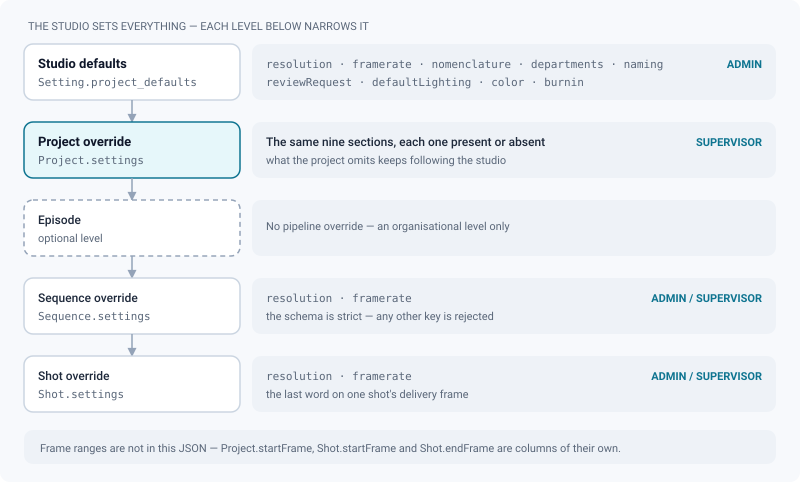
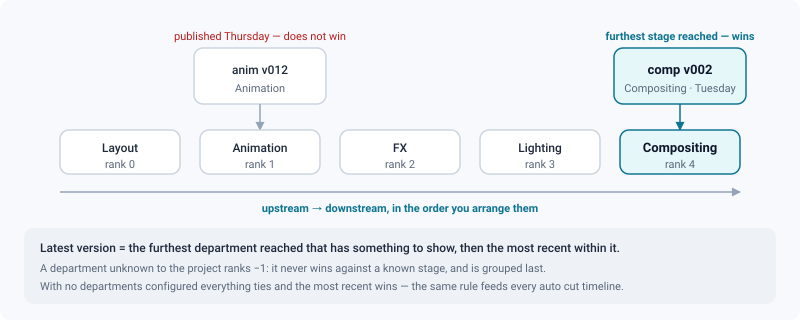

# Pipeline settings

*How delivery format, numbering, departments and colour cascade from the studio down to a shot — and how an override is written, read and handed back.*

> Updated: 2026-08-23

Pipeline settings describe **what the studio delivers**: frame size, framerate, shot
numbering, the ordered list of departments, the naming rule applied to uploads, the default
3D lighting, the colour config and the burn-in template. They cascade **studio → project →
sequence → shot**, each level overriding only the fields it redefines.

Two facts govern everything on this page. First, an override exists **per section**, not per
field: a project either owns `resolution` or inherits it, and there is no half-way. Second,
what the settings screen shows you are the **effective** values — studio plus overrides — so
"what is on screen" and "what this project owns" are not the same thing, and the interface
tells you which is which.

## The levels, and what each one may override

| Level | Where | Who | Stored in |
|-------|-------|-----|-----------|
| Studio defaults | *Admin → Studio → Project defaults* (`/admin/defaults`) | `ADMIN` only (`GET`/`PUT /api/admin/project-defaults`) | `Setting.project_defaults` (JSON) |
| Project override | *Project → Settings* | effective project role `ADMIN`/`SUPERVISOR`, local elevation included (`PATCH`/`PUT /api/projects/:projectId/settings`) | `Project.settings` (JSON) |
| Episode | *Project → Settings → Episodes* switch | global `ADMIN`/`SUPERVISOR` | — no settings column at all |
| Sequence / shot override | On the sequence or the shot | global `ADMIN`/`SUPERVISOR` (`POST`/`PATCH /api/sequences`, `/api/shots`) | `Sequence.settings` / `Shot.settings` (JSON) |

The studio and the project speak in the same eight **sections**. That vocabulary is worth
learning, because it is the unit in which an override exists, is reported by the API and is
reverted in the interface:

| Section | What it holds |
|---------|---------------|
| `resolution` | Delivery width and height, in pixels |
| `framerate` | Delivery framerate, in fps |
| `nomenclature` | Sequence and shot prefixes, digit padding, numbering step |
| `departments` | The ordered pipe of the project |
| `naming` | The upload file-name convention: pattern and mode |
| `defaultLighting` | The HDRI replayed on 3D media that carry none |
| `color` | The OCIO config, display and view of the project |
| `burnin` | The project's partial override of the studio burn-in template |

`resolution` and `framerate` stay separate on purpose: a project may deliver in 4K at the
studio's framerate without owning the framerate.

**Sequence and shot overrides accept only `resolution` and `framerate`.** Their schema
(`pipelineOverrideSchema`) is `.strict()`, so any other key is rejected rather than silently
dropped. Frame ranges are not part of that JSON either: they live on dedicated columns,
`Project.startFrame` and `Shot.startFrame` / `Shot.endFrame`.

> [!NOTE]
> The optional **Episode** level, switched on from *Project → Settings*, is an
> organisational level only. It carries no pipeline override: settings resolution walks
> project → sequence → shot and skips it entirely. A shot inside `EP02` therefore inherits
> from its sequence and its project, never from its episode.

## Built-in defaults and accepted ranges

If `Setting.project_defaults` has never been written — or cannot be parsed — the server
falls back to:

| Setting | Built-in default | Accepted range |
|---------|------------------|----------------|
| Resolution | **1920 × 1080** | 1–16384 per axis, integers |
| Framerate | **24** | 1–240 |
| Sequence prefix | **`SQ`** | ≤ 16 characters |
| Shot prefix | **`SH`** | ≤ 16 characters |
| Numbering padding | **3** (→ `010`) | 1–8 |
| Numbering step | **10** (→ 010, 020, 030) | ≥ 1 |
| Upload naming rule | **empty pattern, mode `off`** | pattern ≤ 200 characters |
| Departments | Modeling, Rigging, Animation, FX, Lighting, Compositing, Look Dev, Layout | key ≤ 40, name ≤ 80 |
| Default 3D lighting | **none** | exposure 0–10 (default 1), rotation −180 to 180 (default 0) |
| Colour | **none** — the studio's default OCIO config applies | config id, display and view ≤ 120 characters |
| Burn-ins | **none** — the studio template applies as is | partial override, known keys only |
| Default start frame | **1001** (`Setting.default_start_frame`) | any integer |

Out-of-range values are **clamped, not rejected**, by the sanitiser; the Zod schema in front
of the route rejects them first, so an out-of-range value can only appear if it was written
to the database directly.

Note that the built-in department order puts Layout last. That is almost never what a real
pipe looks like — reorder it before the first project, because the order is load bearing
(see [Departments](#departments-the-order-is-the-pipe)).

## Writing an override, and handing it back

Three routes read or write the same JSON, and they do not mean the same thing.

| Call | Answers / does | Who |
|------|----------------|-----|
| `GET /api/projects/:projectId/settings` | The **effective** settings, plus `overrides`: the list of sections the project really owns | Any project member |
| `GET /api/projects/:projectId/settings/override` | The **raw override**, the studio defaults, and the same `overrides` list — the editing view | Project manager |
| `PATCH /api/projects/:projectId/settings` | Writes **section by section**: an absent section is unchanged, a `null` section returns to studio inheritance | Project manager |
| `PUT /api/projects/:projectId/settings` | **Replaces the whole override**: sections absent from the body stop being overridden | Project manager |

**The settings screen sends the `PATCH`.** It compares your draft with what it loaded and
posts only the sections you actually touched. That is not a detail of implementation: posting
the full object was the bug this replaced. Because the screen edits *effective* values,
saving in bulk used to freeze the studio's resolution, framerate, nomenclature, burn-ins,
lighting and OCIO into the project — after which changing a studio default had no effect
there, and nothing said so.

> [!WARNING]
> An API client that sends a **partial `PUT`** loses the sections it omitted: they fall back
> to the studio default without a warning. Either send the whole object to `PUT`, or use
> `PATCH` — which is what the interface does and what any new integration should do.

At the top of *Project → Settings* sits the **Studio inheritance** panel. Each row is a
group of sections, tagged *Inherited from the studio* or *Overridden here*, with the studio's
current value beside it and a *Hand back to the studio* button on the rows the project owns.
Handing back sends a `PATCH` with those sections at `null`; the effective values come back
from the server and the form reloads from them, so the screen never keeps a stale draft.

Both writes record an audit entry `PROJECT_SETTINGS_UPDATE` carrying the list of sections
touched — which is what lets you answer "who took this project off the studio framerate, and
when" months later. The studio-level write records `PROJECT_DEFAULTS_UPDATE`.

## Where each section is actually edited

The two screens do not expose the same sections, and that asymmetry surprises people.

| Section | Studio level (*Admin → Project defaults*) | Project level (*Project → Settings*) |
|---------|-------------------------------------------|--------------------------------------|
| `nomenclature` | *Default naming convention* | *Naming convention* (prefixes, step, digits) |
| `resolution`, `framerate` | *Default format & rate* | *Format & rate* |
| `departments` | *Default departments* | *Departments* |
| `naming` | — no control | *Naming convention* (pattern + policy) |
| `defaultLighting` | — no control | *Default 3D lighting* |
| `color` | — no control | *Colour management (OCIO)* |
| `burnin` | — no control | *Burn-ins* |

> [!IMPORTANT]
> Four of the eight sections have **no studio-level control on that screen**: file naming
> rule, default lighting, colour and burn-ins. They still inherit studio → project — the API
> and the cascade know them perfectly well — but the studio values behind them are set
> elsewhere (the burn-in template in *Admin → Review contexts → Delivery*, the OCIO default in
> *Admin → Colour (OCIO)*) or simply left empty. `PUT /api/admin/project-defaults` accepts
> all eight if you drive the studio from a script.

Two more things live on that project screen without being settings sections: the **start
frame** of the project, saved on its own with `PATCH /api/projects/:projectId`, and the
**Episodes** switch, which is the only place the episode level is turned on.

> [!CAUTION]
> `PUT /api/admin/project-defaults` is sanitised against the **built-in fallback**, not
> merged into the stored row: a field you omit is reset to its factory value, not left as it
> was. Always send the whole object. The admin screen does.

## Departments: the order *is* the pipe

The department list of a project is **ordered, upstream → downstream**
(Layout → Animation → FX → Lighting → Compositing). That order is not cosmetic: it defines
what the application calls *the latest version*.

- On an **asset** or a **shot**, the latest version is the one from the **furthest department
  reached that has something to show**, then the most recent within that department. A
  modeling fix published after lookdev does not send the asset backwards in the pipe.
- Every [auto cut timeline](../user-guide/auto-cut-timelines.md) picks a version per shot with
  the same rule.
- A task whose department is **unknown to the project** (rank `-1`) never wins the "furthest
  stage" contest against a known department, and is grouped **last** in display under a
  catch-all heading. A project with no departments configured at all therefore degrades
  gracefully: everything ranks equal and the most recent wins.

Departments are database entities (`Department`), scoped either to the studio
(`projectId = null`) or to one project. A project uses **its own departments if it has any,
otherwise the studio list**. There is no merge: creating a single project-level department
hides the whole studio list for that project. Handing the `departments` section back to the
studio soft-deletes the project's own departments, and the studio list applies again.

Two ways to edit them, with different permissions:

- *Project → Settings → Departments* — goes through the project settings endpoint
  (`requireProjectManage`), so a **project supervisor can reorder the pipe**. The submitted
  list is synced into the `Department` table.
- `POST`/`PATCH`/`DELETE /api/departments…` and `PUT /api/departments/order` — require a
  **global** `ADMIN` or `SUPERVISOR`. Reading is open to any authenticated account, because
  department labels appear in badges and filters everywhere.

Departments carry an optional colour (`#RRGGBB`). Sequences, shots and assets can also declare
**which departments they traverse** — the template of their tasks — through
`PUT`/`PATCH /api/shots/:id/departments` and its siblings; the `PATCH` form adds and removes
one at a time so two quick clicks in a right-click menu cannot overwrite each other.

Tasks carry a department key, set three ways:

- **explicitly at creation**, from the interface or the API;
- **deduced from the task name** for DCC publishes (`anim` → Animation). A publish can also
  address a department explicitly with the `department:task` form —
  `PROJ/SQ010/SH0100/layout:main/v001`. Without it the path keeps its historical meaning
  (task only). See [API v1 integration](../api/v1-integration.md);
- **from a CSV import**, which maps a `department` column (and its synonyms `dept`, `step`,
  `sg_step`, `discipline`, `task_type`…) onto the project's departments and writes it on the
  tasks it creates. The order therefore matters to imports as much as to publishes: import a
  show with a department that is not in the list and every one of its tasks ranks `-1`. See
  [Importing a project](../user-guide/importing-a-project.md).

## Upload naming rule

*Project → Settings → Naming convention* enforces a **JavaScript regex** on uploaded file
names, with three modes:

| Mode | Behaviour | Default |
|------|-----------|---------|
| `off` | no check | ✔ |
| `warn` | non-matching names still upload; the uploader gets a warning | |
| `reject` | non-matching uploads are refused with `400 NAMING_REJECTED` | |

Security and safety properties, all verifiable in `lib/projectSettings.ts`:

- The pattern runs against **every** uploaded file name, on the API event loop. A pattern
  with a quantified group whose body itself contains a quantifier or an alternation (`(a+)+`,
  `(a|a)*`, `((a+))+`…) can block the whole API for the entire studio on one request. Such
  patterns are **refused when saved** (`400 NAMING_PATTERN_UNSAFE`) and, belt and braces,
  **neutralised at upload time** if one ever reached the database. The analysis walks balanced
  parentheses rather than matching a regex against the regex, which is why nested groups are
  caught too.
- An **invalid** regex, an empty pattern or mode `off` never blocks an upload: the check
  reports `pass: true, mode: 'off'`. The convention is a discipline aid, not a security
  control — never rely on it to keep a file shape out.
- The settings panel includes a live tester; use it before switching to `reject`.

## Default 3D lighting

A project can define a **default HDRI** for its 3D media in *Project → Settings*: an HDRI from
the studio library (`hdriId`), `exposure` (0–10, default 1), `rotationDeg` (−180 to 180,
default 0), `showBackground` and `groundShadow` (both default `false`).

It is inherited studio → project and replayed when a 3D medium has no lighting of its own;
reviewers may still tweak it for their own session without changing the saved default. See
[3D review](../user-guide/review-3d.md) and the [HDRI library](hdri-library.md).

### Colour and burn-ins, the two other project-only sections

- **Colour management** — the OCIO config, display and view of the project. An empty config id
  means "use the studio default". Because it is a section like any other, a project that once
  picked its own config can be handed back to studio inheritance in one gesture. See
  [Colour management](color-management.md).
- **Burn-ins** — a *partial* override of the studio template, resolved field by field rather
  than replacing it: a project that only turns the slate on keeps every other field following
  the studio. See [Secure distribution](secure-distribution.md).

## What the resolved settings change in the app

- The review viewer letterboxes at the **resolved delivery aspect**; annotations are anchored
  to that frame, so changing a shot's resolution changes where existing annotations sit
  relative to the guide.
- Frame stepping and timecode use the resolved framerate. The burn-in timecode is drawn at the
  media's probed fps, not at the pipeline framerate — a mismatch between the two shows up as a
  drifting burn-in.
- Uploaded videos are transcoded **once, studio-wide**. Pipeline settings do not re-encode
  anything per level: see [Transcoding](transcoding.md).
- The department order drives every "latest version" badge, every auto cut timeline and every
  grouped listing of versions.

## Use case: standing up the pipe for a new production

*A new show starts on Monday: 2.39:1 at 24 fps, six departments, shots numbered by 10.*

1. Decide whether this is the studio's new normal. If yes, edit *Admin → Studio → Project
   defaults* first — everything created afterwards inherits it, and you avoid repeating the
   work per project. If it is an exception, leave the studio defaults alone and override at
   project level.
2. *Admin → Project defaults* (or *Project → Settings*): set the delivery resolution and
   framerate. Remember the resolution here is the **delivery** frame; the viewer letterboxes
   to its aspect.
3. Set the nomenclature: prefixes, padding and step. Padding 3 with step 10 gives
   `SH010, SH020…`; padding 4 with step 10 gives `SH0010`. Changing this later does **not**
   renumber existing shots.
4. **Order the departments before anyone uploads.** The default list is not in pipe order.
   Delete what the show does not use, then arrange the rest upstream → downstream. Getting
   this wrong does not corrupt data, but every "latest version" in the app, and every auto cut
   timeline, will point at the wrong stage until it is fixed — and nobody will report it as a
   bug, they will just review the wrong file.
5. Set the default start frame (`Setting.default_start_frame`, 1001 out of the box) in
   *Admin → Studio → Settings* if the show uses another convention.
6. Only then create the structure: sequences and shots (global manager role required), or
   import them from CSV — see [Project organization](project-organization.md).
7. Leave the naming convention on `warn` for the first week and read the warnings before
   switching to `reject`. Going straight to `reject` on day one turns every naming
   disagreement into a blocked upload at the worst possible moment.

## Use case: one sequence delivers at a different framerate

*Everything is 24 fps, but SQ090 is a 25 fps broadcast insert.*

Override at the **sequence** level rather than editing the project: set
`settings.framerate = 25` on SQ090. Shots inside it inherit 25 unless they override in turn.
The project stays at 24 for everything else, and the admin project detail page shows an
explicit `override` badge on SQ090 so the next person understands why the timecode differs
there (see [Content explorer](content-explorer.md)).

What this does **not** do: it does not re-encode anything. Media already transcoded keeps its
own probed fps, which is what frame stepping and the burn-in timecode actually use. The
override changes the review frame reference, not the pixels.

## Use case: auditing what a shot really inherits

Open *Admin → Content → Projects → the project*. The hierarchy browser lists every sequence
and shot with its **effective** resolution and framerate after the full studio → project →
sequence → shot resolution, and tags each level `override` or `inherited`. This is the fastest
way to answer "why is this shot letterboxed differently from its neighbour" without reading
three JSON columns.

For the project level itself, the *Studio inheritance* panel of *Project → Settings* answers
the other half of the question — which sections this project owns, and what the studio would
impose if you handed them back.

## Use case: putting a project back under studio control

*A project was set up before the studio defaults were agreed, and now drifts from them.*

Open *Project → Settings*, read the *Studio inheritance* panel, and press *Hand back to the
studio* on every row tagged *Overridden here* that should not be. Each press is one `PATCH`
with those sections at `null`, and the effective values on screen refresh from the server
immediately. From then on the project follows the studio defaults as they evolve, which is
exactly what it stopped doing when someone saved the whole object.

## Troubleshooting

**A studio default changed and one project did not follow.** That project overrides the
section. Open its *Studio inheritance* panel: the row will read *Overridden here*. Hand it
back, or accept the override deliberately.

**`400 NAMING_PATTERN_UNSAFE` on save.** The pattern has a quantified group whose body
contains a quantifier or an alternation. Rewrite it without the nesting — a legitimate naming
convention never needs it.

**A sequence override was refused.** Only `resolution` and `framerate` are accepted there. Any
other key fails validation rather than being ignored.

**The department picker on a task shows a department the project does not have.** The task
carries a key unknown to the project, from an import or an old configuration. It ranks `-1`:
it never wins the latest-version contest and is grouped last. Add the department to the
project, or re-point the task.

**Everything looks right but the "latest version" points at an old stage.** Check the order of
the departments, not the dates. The furthest stage wins; the dates only break ties inside one
stage.

## Related pages

- [Projects & pipeline (user guide)](../user-guide/projects-and-pipeline.md)
- [Project organization & per-project rights](project-organization.md)
- [Importing a project](../user-guide/importing-a-project.md)
- [Transcoding](transcoding.md)
- [Colour management](color-management.md)
- [Content explorer](content-explorer.md)
- [Users & roles](users-and-roles.md)
