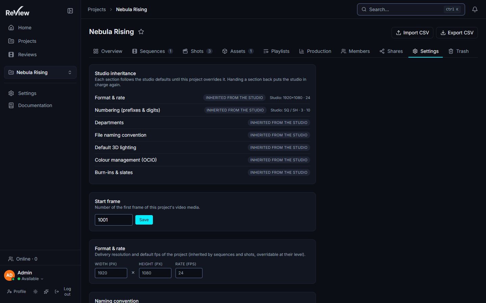

# Project organization & per-project rights

> Updated: 2026-08-21

Tools to structure, protect and delegate projects. They are reached from the project
page rather than from `/admin`, but several of them still require a **global** manager
role — the split is spelled out for each feature below, and in full in
[Users & roles](users-and-roles.md#the-subtle-case-the-project-supervisor).

## Archiving (read-only, restorable)

Archive a project from *Project → Edit → Status → Archived*
(`PATCH /api/projects/:projectId`, **global `ADMIN`/`SUPERVISOR`**).

An archived project is **read-only**: `assertProjectWritable` refuses uploads,
comments, new versions, task changes, structure changes (shots, sequences) and board
edits with `403 PROJECT_ARCHIVED`. Reviews and existing media stay fully viewable,
boards stay readable, and share links keep working.

- Archived projects are hidden from the sidebar, the home page, the reviews list and
  the default *Projects* list.
- Find them under *Projects → Archived*; **Un-archive** returns them to *Active*.
- Archiving is reversible and deletes nothing. It is the correct end-of-show move —
  deletion is not.

Note the guard is a **status check, not a permission check**: an admin gets
`PROJECT_ARCHIVED` too. If you need to fix one thing in an archived show, un-archive
it, fix it, archive it again.

## Deleting, restoring, purging

| Action | Route | Role | Reversible |
|--------|-------|------|-----------|
| Delete a project | `DELETE /api/projects/:projectId` | global `ADMIN`/`SUPERVISOR` | Yes — soft delete |
| Restore | `POST /api/projects/:projectId/restore` | global `ADMIN`/`SUPERVISOR` | — |
| Purge | `DELETE /api/projects/:projectId/purge` | **`ADMIN` only** | **No** — database rows and MinIO objects are destroyed |

A soft-deleted project sits in *Admin → Maintenance → Trash*. It is **not kept
forever**: the daily sweep purges anything soft-deleted for longer than
`trash_retention_days` (default **30**). See
[System & maintenance](system-and-maintenance.md#trash-and-automatic-retention).

## Duplicating a project & templates

*Projects → right-click a project → Duplicate*
(`POST /api/projects/:projectId/duplicate`, **global `ADMIN`/`SUPERVISOR`**).

The copy recreates the **structure only**:

| Copied | Not copied |
|--------|-----------|
| Sequences (name, code, order, pipeline override) | Media, versions, comments |
| Shots (name, code, start/end frame, order, pipeline override) | Assets |
| Project settings JSON, description, start frame | **Members** — the person who duplicates becomes the only member |
| Tasks, if *Copy tasks* is ticked: name, type, order, checklist — status reset, unassigned | **Project-level departments** — see below |

Three things to know before you rely on it:

- **The new project has exactly one member: you.** Rebuild the team explicitly.
- **Project-level departments are not copied.** Departments are rows in the
  `Department` table, and duplication only copies the settings JSON. The copy
  therefore falls back to the **studio** department list. If the source project had a
  custom pipe order, re-enter it on the copy — otherwise "latest version" resolves
  against the wrong order (see
  [Pipeline settings](pipeline-settings.md#departments-the-order-is-the-pipe)).
- A name that slugifies to an existing project is refused with `400 SLUG_TAKEN`.

Mark a project as a template by setting `isTemplate` in its settings, then duplicate
it to start new shows from a known structure. The flag is dropped on the copy, so a
copy is never itself a template.

## Storage quota & usage

*Project → Settings → Storage* shows the project's consumption — the sum of the sizes
of its non-deleted media, across shots and assets — and lets a manager set a **quota**.

- The quota is stored in **bytes** (`Project.storageQuota`); the UI presents GB. Empty
  or `null` means **unlimited**, which is the default for every new project.
- When set, an upload that would push the project past its quota is refused with
  `403 PROJECT_QUOTA` — **for everyone, administrators included**. This is deliberate:
  a quota that an admin can silently blow past is not a quota.
- **Setting the quota requires a global `ADMIN`/`SUPERVISOR`** (it is a field of
  `PATCH /api/projects/:projectId`). A project supervisor can see the usage but not
  change the ceiling.
- Reading usage: `GET /api/projects/:projectId/usage` (any project member) and
  `GET /api/projects/usage` (global `ADMIN`/`SUPERVISOR`, all projects at once).

Do not confuse this with the **per-user** storage limit (`User.storageLimit`, studio
default `storage_limit_user` = 10 GB), which is checked against the total of
everything that account has ever uploaded and from which **administrators are
exempt**. An upload passes only if it clears both.

Full order of upload checks, so you can read an error correctly:

| Order | Check | Failure |
|-------|-------|---------|
| 1 | Project access | `403` |
| 2 | Role can contribute (not `CLIENT`, not a stranger) | `403 ROLE_FORBIDDEN` |
| 3 | Project not archived | `403 PROJECT_ARCHIVED` |
| 4 | `max_file_size` (studio, default 5 GB) | `400 FILE_TOO_LARGE` |
| 5 | `max_concurrent_uploads` (studio, default 5, per uploader) | `429 TOO_MANY_UPLOADS` |
| 6 | Per-user storage limit — **admins exempt** | `403 STORAGE_LIMIT` |
| 7 | Project quota — **nobody exempt** | `403 PROJECT_QUOTA` |
| 8 | Upload naming rule, mode `reject` | `400 NAMING_REJECTED` |

## Upload naming convention

*Project → Settings → Naming convention* applies a regex to uploaded file names in one
of three modes (`off` / `warn` / `reject`). Defaults, the ReDoS refusal
(`400 NAMING_PATTERN_UNSAFE`) and the fail-open behaviour of an invalid pattern are
documented in
[Pipeline settings → upload naming rule](pipeline-settings.md#upload-naming-rule).

Editing it requires the effective project role `SUPERVISOR` — a project supervisor
can do this.

## Per-project roles

*Project → Members → role selector* — requires `requireProjectManage`, so a project
supervisor can manage their own team.

- **Global role** — inherit the studio-wide role;
- **Supervisor** — local elevation: manage this project's members and settings without
  a global manager role;
- **Artist** — contribute (upload, tasks);
- **Client** — read and comment only; no upload, no task creation
  (`403 ROLE_FORBIDDEN`).

Global admins and supervisors keep studio-wide access and are **never demoted** by a
project role; project roles never leak across projects. The full rules, including what
a project supervisor still cannot do, are in
[Users & roles](users-and-roles.md).

## CSV import / export

From the project header: **Import CSV** / **Export CSV**.

| | Route | Role |
|---|-------|------|
| Import | `POST /api/projects/:projectId/import-csv` | effective project `SUPERVISOR` (local elevation OK) |
| Export | `GET /api/projects/:projectId/export-csv` | **any project member**, including `CLIENT` |

That export permission is worth noting: the shot list and task names of a project are
readable — and downloadable — by every member of it, clients included. If a shot code
is itself confidential, do not put a client in the project.

Format:

- Columns `sequence, shot, name, tasks`. **Header row required**, order free, case
  insensitive; only `shot` is mandatory. Tasks are separated by `|`.
- Delimiter is auto-detected: `;` if the header contains `;` and no `,`, otherwise `,`.
  Quoted fields and doubled quotes are handled.
- Import runs a **dry-run preview** first (`commit: false`), reporting
  `sequencesToCreate`, `shotsToCreate`, `tasksToCreate`, `shotsSkipped` and per-row
  errors. Nothing is written until you commit.
- On commit: missing sequences are created; **existing shots are skipped, never
  overwritten** (matching is on the shot code, project-wide). A duplicate shot code
  inside the file is reported as a row error. The commit — not the preview — checks
  that the project is not archived.
- Body limit: 1 000 000 characters.
- Export produces the same format and re-imports as-is. Fields starting with
  `= + - @` (or tab/CR) are prefixed with an apostrophe to neutralise spreadsheet
  formula injection — a shot named `=cmd|…` cannot execute in Excel or Sheets.

Audit action on commit: `PROJECT_IMPORT_CSV`.

## Task checklists

Tasks carry a checklist (`[{ text, done }]`). On the task page the **assignee** (or a
manager) ticks items; managers add and remove items. Checklists **are** copied when a
project is duplicated with *Copy tasks*. See
[Kanban & tasks](../user-guide/kanban-and-tasks.md).

---

## Use case: closing a show without losing it

*Delivery is signed off. The show must stop changing but stay reviewable for a year.*

1. Check nothing is mid-flight: *Admin → Maintenance → Jobs*, media queue empty of
   active and failed jobs for that project.
2. Revoke the client share links that are still open — archiving does **not** revoke
   them, and they keep serving media.
3. *Project → Edit → Status → Archived*. Everything becomes read-only
   (`403 PROJECT_ARCHIVED`); reviews, annotations and comments stay browsable.
4. Do **not** delete it. Deletion starts the retention clock: after
   `trash_retention_days` (30 by default) the daily sweep purges the project and its
   MinIO objects for good, with no confirmation and no undo.
5. If disk pressure is the real motive, enable the **derived purge** instead — it
   drops HLS renditions and timeline sprites of old versions while keeping the proxy
   and the thumbnail, so the show stays watchable. See
   [System & maintenance](system-and-maintenance.md#derived-files-purge).

## Use case: bootstrapping a show from last season's structure

*Season 2 has the same sequence layout and the same task template as season 1.*

1. Make sure season 1's settings are the ones you want inherited — the duplicate
   copies the settings JSON verbatim (minus `isTemplate`).
2. *Projects → right-click season 1 → Duplicate*, new name, **tick *Copy tasks***.
   Tasks arrive reset to `TODO` and unassigned, checklists included.
3. **Add the team back.** You are the only member of the copy.
4. **Re-enter the departments** if season 1 had a project-specific pipe: they are not
   copied and the copy silently falls back to the studio list.
5. Set the storage quota on the new project (global manager role) — quotas are not
   copied either; the copy starts unlimited.
6. Adjust the delivery resolution/framerate if the season changed format, then verify
   on *Admin → Content → Projects → the new project*, whose hierarchy browser shows
   the effective settings per sequence and shot.

If the structure is meant to be reused every season, keep a dedicated project marked
`isTemplate` with no media in it, and duplicate *that* instead — it never accumulates
the previous season's overrides.

## Use case: a project is eating the bucket

*One show is 60 % of the storage report and nobody agrees on who should stop.*

1. *Admin → Content → Storage* ranks projects by bytes — start from facts, not from
   the loudest complaint. See [Storage map](storage.md).
2. Set a quota on the project (global manager role). New uploads then fail with
   `403 PROJECT_QUOTA` for everyone, which converts a slow leak into an immediate,
   visible, negotiable event.
3. Warn the team first. The refusal happens at upload time, after the artist has
   already produced the file; an unannounced quota is experienced as an outage.
4. If the weight is old renditions rather than sources, prefer the derived purge —
   it reclaims the HLS ladder of everything but the last *N* versions and needs no
   negotiation at all.

## Related pages

- [Users & roles](users-and-roles.md)
- [Pipeline settings](pipeline-settings.md)
- [System & maintenance](system-and-maintenance.md)
- [Storage map](storage.md)
- [Projects & pipeline (user guide)](../user-guide/projects-and-pipeline.md)
