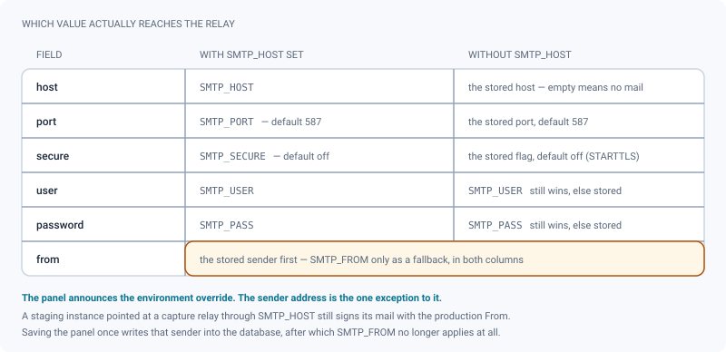
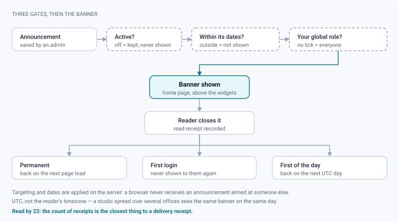

# SMTP & announcements

*Configure outgoing mail, know exactly what breaks without it, and post announcements people still read.*

> Updated: 2026-08-23

Two unrelated ways of reaching everyone in the studio: **outgoing mail**, which leaves the
instance, and **in-app announcements**, which never do. Both live under **Administration →
Communications**, and both are reserved to the `ADMIN` global role.

## The outgoing relay

**Administration → Communications → SMTP** configures the relay ReView sends through.

| Field | What it is | Default when nothing is stored |
|---|---|---|
| **Host** | The SMTP server, `smtp.example.com` | empty — nothing is sent |
| **Port** | TCP port | `587` |
| **Secure connection (TLS)** | Implicit TLS on connect | off, i.e. STARTTLS on 587 |
| **User** | SMTP account | empty — no authentication |
| **Password** | Write-only, encrypted at rest | empty |
| **Sender (From)** | What recipients see, `ReView <no-reply@example.com>` | `SMTP_FROM`, itself defaulting to `ReView <no-reply@review.local>` |

Three behaviours are worth knowing before you touch the form:

- The password is **write-only**: it is encrypted at rest and never returned by the API.
  Leaving the field untouched (`•••••• (unchanged)`) keeps the stored value; typing into it
  replaces it.
- **Send a test email to…** delivers a short message to any address using the *effective*
  configuration, and falls back to your own address if you leave the field blank. It reports
  a failure rather than pretending: a `400` with `SMTP_SEND_FAILED` means either "nothing
  configured" or "the relay refused it". The test message is written in the language of the
  administrator who triggered it.
- Changing the relay is recorded in the audit log under `SMTP_UPDATE`, with the host and
  whether the password changed — never the password itself.

> [!WARNING]
> Whoever controls the outgoing relay can divert every message the instance sends —
> invitations, share links, digests. That is why the change is audited, why the password
> never leaves the database, and why the SMTP form is the one place it can be set.

The stored configuration lives under the `smtp_config` key of the settings table, and that
key is **reserved**: the generic `GET /api/studio/settings` never returns it, and
`PUT /api/studio/settings` refuses it with `400 RESERVED_SETTING`. Only `/api/studio/smtp`
can read or write it, which is what keeps the encryption and the write-only password from
being bypassed by an arbitrary key/value write. The VAPID key pair used for browser push is
reserved the same way — see [Branding & notifications](branding-and-notifications.md).

## Environment versus database

Operators can point an instance at a different relay without touching the database, through
`SMTP_*` environment variables. When `SMTP_HOST` is set, the panel says so with a banner.

The override is **field by field**, and it is not uniform:

| Field | With `SMTP_HOST` set | Without |
|---|---|---|
| host | `SMTP_HOST` | the stored host — empty means nothing is sent |
| port | `SMTP_PORT` (default `587`) | the stored port, default `587` |
| secure | `SMTP_SECURE` (default `false`) | the stored flag, default off |
| user | `SMTP_USER` if set, else the stored user | `SMTP_USER` if set, else the stored user |
| password | `SMTP_PASS` if set, else the stored one, decrypted | same |
| **from** | the **stored** sender first, `SMTP_FROM` only as a fallback | the same, in both directions |

> [!CAUTION]
> The sender address is the one field where the database wins over the environment. An
> operator who points a staging instance at a capture relay through `SMTP_HOST` still sends
> with the production `From` recorded in the database. Worse, the panel pre-fills the
> *Sender* field with the effective value, so pressing **Save** once writes `SMTP_FROM` into
> the database — after which the variable no longer applies at all. If you need a distinct
> sender on a staging instance, set it in the panel, not in the environment.

## What a missing relay breaks

Five features send mail, and two of them also need `APP_URL` — the public address of the
instance — because the message carries a link back into ReView.

| Feature | Needs SMTP | Needs `APP_URL` | Without it | Error code |
|---|---|---|---|---|
| Create a user by invitation | yes | yes | Refused before anything is written — the account is **not created at all**, so the address is not held hostage by an account nobody can activate | `SMTP_NOT_CONFIGURED`, `APP_URL_MISSING` |
| Re-send an invitation | yes | yes | Same refusal. If the relay accepts the request but delivery fails, the invitation row survives so it can be re-sent once the relay is fixed | same, then `SMTP_SEND_FAILED` |
| **Load the ShotGrid crew → Give ReView access** | yes | yes | The panel says so and disables the action *before* you click | — |
| Email a share link | yes | yes | Refused up front; also refused on a link that has been revoked. Up to 10 recipients per send | `SMTP_NOT_CONFIGURED`, `APP_URL_MISSING`, `SHARE_REVOKED` |
| Daily digest | yes | no | Not sent; the pass logs that it was skipped | — |
| Weekly supervisor report | yes | no | Not sent; same | — |
| The SMTP test itself | yes | no | Reports the failure instead of pretending | `SMTP_SEND_FAILED` |

Nothing else depends on the relay: in-app notifications, Socket.io events and browser push
go through their own channels and keep working.

Two scheduling details, since "the digest never arrived" is usually a schedule question and
not a relay question:

- The **daily digest** goes out every day at `DIGEST_HOUR` (default `07`, server local
  time), and the **weekly supervisor report** on Monday at the same hour. Both are queued
  repeatable jobs, so they survive a restart and fire once however many API replicas run.
- Both are **opt-in per person**. The digest only reaches accounts that turned it on in
  their profile, and the weekly report only supervisors and administrators who did. An empty
  week sends nothing at all. See [Personalization](../user-guide/personalization.md).

> [!TIP]
> An invitation link is valid for **7 days**, and re-sending an invitation deletes the
> pending one: a link forgotten in a mailbox stops working the moment you issue a new one.

## What every message looks like

Every email ReView sends goes out in two versions at once: HTML and plain text. The text
version is derived from the HTML, so the two cannot drift apart. This matters more than it
looks: spam filters penalise HTML-only messages, and every preview surface — the inbox list,
a watch notification, a screen reader — renders the text version, not the HTML.

The HTML is built on nested tables rather than `
`s. Outlook on Windows renders mail
with the Word engine, which ignores most modern layout; a table is the only structure it
lays out predictably.

Each message opens with a **preheader**: one hidden line that mail clients show next to the
subject in the inbox list. Without it, clients pick the first visible words — usually "View
this in your browser" or a greeting, which tells the reader nothing.

Two families of headers travel with it:

| Header | On which messages | Why |
|---|---|---|
| `Auto-Submitted: auto-generated` | **every** message | An out-of-office responder would otherwise answer the daily digest |
| `X-Auto-Response-Suppress: All` | **every** message | Same, for clients that only honour the Microsoft header — depending on the relay, the loop can close on itself |
| `List-Unsubscribe` | **recurring** messages only (daily digest, weekly report) | Mail clients turn it into their own Unsubscribe button |
| `List-Unsubscribe-Post` | same | Declares one-click unsubscribe; without it Gmail and Outlook do not show the button |

That button matters for deliverability. A reader who no longer wants the digest and has no
unsubscribe link has exactly one gesture within reach: marking the message as spam — which
damages the reputation of *every* email the studio sends, invitations included.

## One-click unsubscribe

The unsubscribe link carries a signed token: it identifies one account and one kind of
recurring email, nothing more. It opens no session, reveals nothing about the account, and a
forged token does nothing.

The token is `<userId>.<kind>.<HMAC signature>` — readable, verifiable, and stateless. Only
two kinds exist, `emailDigest` and `weeklyReport`; anything else is rejected before the
signature is even checked, and the signature comparison is constant-time so the response
delay leaks nothing.

Following the link by hand shows a short confirmation page. Clicking the client's native
button calls the same address without any page — nobody would read it. Unsubscribing
switches off one preference, and the reader can turn it back on at any time from their
ReView profile.

> [!IMPORTANT]
> The unsubscribe address is built from `APP_URL`. Without it, recurring messages still go
> out but carry **no** `List-Unsubscribe` header — which is precisely the case where readers
> reach for the spam button. Set `APP_URL` on any instance that sends recurring mail.

The unsubscribe page is reachable without signing in, so it carries the **Source code**
notice required by AGPL §13.

## Announcements

**Administration → Communications → Announcements** publishes banners at the top of the
**home page**, above the widgets. Everyone who opens the home page sees the ones that apply
to them; closing a banner records a read receipt. Several active announcements stack, newest
first.

Each announcement carries:

| Field | Values | Notes |
|---|---|---|
| **Title** | 1–200 characters | Shown in bold |
| **Message body** | 1–5000 characters | Plain text; line breaks are preserved, no HTML or Markdown |
| **Type** | *Info*, *Warning*, *Maintenance* | Only changes the colour and icon (blue / amber / red) |
| **Frequency** | *Permanent (on every open)*, *First login (once)*, *First of the day* | Governs when a closed banner comes back |
| **Target** | Any set of roles; **no tick = everyone** | Filtered server-side, never in the browser |
| **Start / end** | Optional timestamps | Empty start = immediately, empty end = no expiry |
| **Active** | On / off | An inactive announcement is kept but never shown |

Creating, editing and deleting announcements is **administrator-only**, and each operation
is written to the audit log (`ANNOUNCEMENT_CREATE`, `ANNOUNCEMENT_UPDATE`,
`ANNOUNCEMENT_DELETE`). The list shows how many people have read each one (*read by 23*),
which is the closest thing to a delivery receipt.

### How frequency actually behaves

Closing a banner posts a read receipt; the frequency decides what that receipt means.

| Frequency | After the reader closes it |
|---|---|
| Permanent | Comes back on the next page load — it stays until the announcement is deactivated or expires |
| First login | Never comes back for that person |
| First of the day | Comes back on the next **UTC** calendar day |

> [!NOTE]
> *First of the day* is evaluated in UTC rather than in the reader's timezone, so that a
> studio spread over several timezones sees the same banner on the same day rather than
> having it reappear at midnight in each office.

Targeting is applied on the server: an artist's browser never receives an announcement aimed
at supervisors, so a targeted message is genuinely private to those roles. Remember that
role targeting matches the **global** role of the account, not a per-project role — someone
who is a supervisor on one project but an artist studio-wide will not see it. See
[Users & roles](users-and-roles.md).

## Writing announcements people read

**Announcing a maintenance window.** Type *Maintenance*, frequency *First of the day*, start
now, end at the beginning of the window, no role targeting.

> **Storage maintenance — Saturday 22:00 to Sunday 02:00 CEST**
> Uploads and transcoding will be unavailable. Reviews already published stay readable.
> Publish anything due Monday before Friday evening.

*First of the day* is the right choice here: a permanent banner during a week-long countdown
gets ignored by day three, while *first login* would miss everyone who was already logged in
when you posted it. Set the **end** date to the start of the window so the banner removes
itself — a stale maintenance notice teaches people to ignore the next one.

**Announcing a new version.** Type *Info*, frequency *First login (once)*, no target, no end
date.

> **ReView 2.14 — status from the right-click menu**
> Right-click a shot, a sequence, a kanban card or a task to change its status without
> opening its page. Press `?` for the full list of shortcuts.

Shown once per person, then gone. For the running list of changes, the **What's new** panel
in the sidebar footer is the better home; use an announcement when you want the change
actively noticed once.

**Reaching supervisors only.** Type *Warning*, frequency *Permanent*, target ticked on the
supervisor role (add the administrator role if they should see it too).

> **Approve the dailies before 16:00**
> The delivery build starts at 16:30. Anything left undecided ships as the previous approved
> version.

**Freezing a period.** Type *Warning*, frequency *Permanent*, with a start and an end
timestamp — the banner appears and disappears on its own, so nobody has to remember to take
it down.

> [!TIP]
> An announcement is not a notification. It reaches whoever opens the home page, in the
> window you set, and nothing chases the people who do not. For something that must reach a
> named person, use a mention, a watch or a message —
> see [Messaging & profiles](../user-guide/messaging-and-profiles.md).

## Related pages

- [Admin overview](overview.md)
- [Users & roles](users-and-roles.md)
- [Branding & notifications](branding-and-notifications.md)
- [ShotGrid integration](shotgrid-integration.md) — the crew invitation depends on SMTP
- [Secure distribution](secure-distribution.md) — emailing a share link
- [Personalization](../user-guide/personalization.md) — where a reader opts in and out
