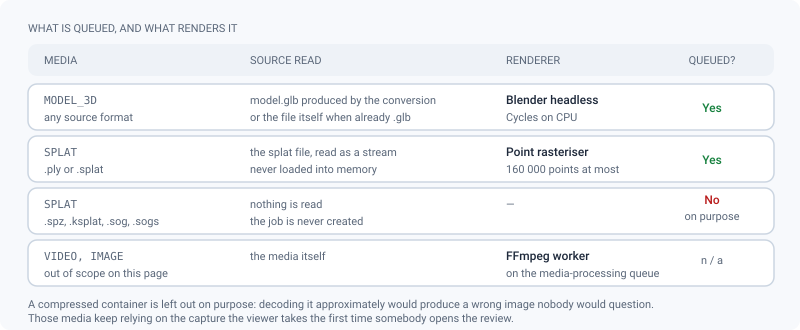
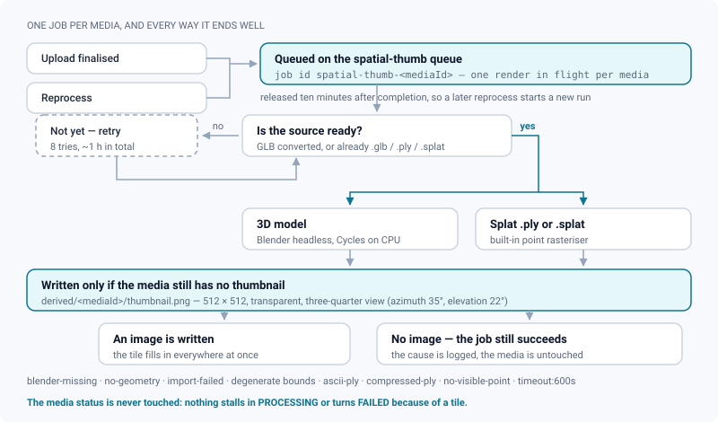

# Spatial thumbnails (3D and Gaussian splat)

*Why 3D and splat tiles carry an image at all, what is rendered, and when nothing legitimately is.*

> Updated: 2026-08-23

Video and image media get their thumbnail from the FFmpeg worker. 3D and splat media used to get
nothing: every tile stayed empty in lists, kanban cards, playlists and dailies until somebody
opened the review and the viewer captured its own canvas. ReView now ships a **dedicated queue
and renderer** for those two kinds, queued as soon as the upload is finalised — or as soon as
the GLB conversion has something to render.

This page is about that job: what it renders, what it refuses to render, and why none of its
failures can ever hurt a media.

## What gets queued, and what renders it

Two chains, with nothing in common but their output:

| Media | Read from | Renderer | Output |
|---|---|---|---|
| `MODEL_3D`, any source format | the derived `model.glb` — or the file itself when it is already a `.glb` | Blender headless, Cycles on CPU, 24 samples | `derived/<mediaId>/thumbnail.png` |
| `SPLAT` as `.ply` or `.splat` | the splat file, read as a stream | built-in point rasteriser, 160 000 points maximum | `derived/<mediaId>/thumbnail.png` |
| `SPLAT` as `.spz`, `.ksplat`, `.sog`, `.sogs` | — | none: **nothing is queued** | — |

Both chains produce a 512 × 512 PNG on a **transparent** background, from the same three-quarter
view (azimuth 35°, elevation 22°), so that 3D assets and scans look consistent side by side in a
list and every tile takes the colour of the active theme.

The splat path is a rasteriser, not a renderer: it projects the gaussian **centres** as coloured
discs with a depth buffer, orthographically. A list tile is 200 pixels wide on screen — the
silhouette is identical, and the file is never loaded into memory, so a multi-gigabyte scan
costs constant RAM.

> [!NOTE]
> Compressed splat containers are left out on purpose. Decoding them approximately would produce
> a *wrong* image that nobody would think to question; those media keep relying on the capture
> the viewer performs the first time someone opens the review.

## The job, end to end

The job is queued when the upload is **finalised**, and again on **reprocess** (which itself is
refused on a published media). Its id is derived from the media — `spatial-thumb-<mediaId>` — so
two uploads or a double reprocess never start two renders for the same media.

That anti-duplicate property has an expiry, and it is the expiry that makes it usable: the
completed job is **released ten minutes after it finishes** (failed jobs are kept a day). A
reprocess an hour later is therefore a new job, not a duplicate swallowed by the queue.

When the media still needs its GLB conversion, the first attempts find nothing to render and
raise a *pending* signal, which BullMQ turns into a reschedule: **8 attempts, 30-second
exponential backoff, a little over an hour in total** — long enough for a heavy USD scene to
finish converting.

Every run ends in one of seven outcomes, all logged with the media id:

| Outcome | Meaning |
|---|---|
| `rendered` | An image was produced and written |
| `exists` | The media already had a thumbnail; nothing was rendered |
| `pending` | The GLB is not there yet — the job is rescheduled |
| `unsupported` | Not a kind this worker renders, or the conversion failed and there is nothing to read |
| `no-render` | The renderer ran and legitimately produced nothing (see the causes below) |
| `raced` | A client capture won between the render and the write; our PNG is deleted |
| `missing` | The media no longer exists |

## What the job guarantees

- **The media status is never touched.** A thumbnail is decorative: a render that cannot happen
  is a *successful* job with no image. No media can be stuck in `PROCESSING`, be marked
  `FAILED`, or have its publication delayed because of a tile.
- **An existing thumbnail is never overwritten.** The key is written with a conditional update
  on `thumbnailKey IS NULL` — the same guard the client-side capture uses — and if a concurrent
  capture won, the freshly uploaded PNG is deleted again. The job is idempotent and safe to
  replay; a thumbnail chosen by hand always wins.
- **Bounded duration.** The Blender render is killed after **10 minutes**. That budget is a code
  constant, not an environment variable: `MODEL_CONVERT_TIMEOUT_MS` (default 15 minutes) can
  only *lower* it, never raise it. Splat files are streamed rather than loaded, so their side has
  no equivalent risk.
- **Isolated from transcoding.** The work runs on its own BullMQ queue, `spatial-thumb`, at
  concurrency 1 — a Cycles render must not starve the `media-processing` queue, which is the one
  users are actually waiting on, and running two renders at once would only make both slower.

> [!IMPORTANT]
> Because an existing thumbnail is never replaced, a reprocess does **not** give a media a new
> tile: the job returns `exists` immediately. And the review of a 3D or splat media offers no
> *set as thumbnail* action, unlike video and image reviews. Changing the tile of a 3D media
> therefore means `POST /api/media/:id/thumbnail` with an image data URL, as a manager — which
> is allowed even after publication.

## Requirements and degraded modes

Blender is only present in the worker image when it is built with
`--build-arg INSTALL_USD_TOOLS=1` (see [3D & USD](3d-usd.md)). Without it:

- 3D thumbnails are skipped. The job logs the cause `blender-missing` and **completes
  successfully**.
- Splat thumbnails are **unaffected**: the point rasteriser has no external dependency.

Cycles on CPU is chosen deliberately over EEVEE: since Blender 4.2, EEVEE Next needs a GPU
exposing OpenGL 4.3, which the worker image does not have — an EEVEE render there fails, or
worse, returns a black image. Cycles is slower and always returns the same picture, everywhere.

Other reasons a job legitimately produces no image, all logged with an explicit cause:

| Cause | Chain | What it means |
|---|---|---|
| `blender-missing` | 3D | The worker image was built without the USD tooling |
| `no-geometry` | 3D | The GLB holds no renderable object |
| `import-failed`, `blender-failed`, `empty-output` | 3D | Blender could not read the file, or produced nothing |
| `timeout:600s` | 3D | The render was killed at the 10-minute budget |
| `ascii-ply` | splat | An ASCII PLY: not a splat container the rasteriser reads |
| `compressed-ply` | splat | A PlayCanvas compressed PLY (a `chunk` element) |
| `no-visible-point` | splat | Every gaussian is below the opacity threshold |
| degenerate bounds | splat | The cloud has no extent to project |

## Operations

The queue appears in *Admin → Jobs* under the label `spatial-thumb`, next to `media`,
`webhooks`, `shotgrid` and the others. Failures there are never user-visible: check them when
tiles stay empty, and look for the cause string in the worker logs.

> [!WARNING]
> **In the current build, the worker process does not start a consumer for this queue.** The
> jobs are enqueued exactly as described above, but nothing pops them: they accumulate in
> `waiting`, which is also what a queue-backlog alert will report. Until a consumer is started,
> a 3D or splat tile is still filled the old way — by the capture the viewer sends the first
> time someone opens the review — and everything on this page describes what happens once the
> queue is drained.

Three things to check when tiles stay empty:

1. **The queue depth** in *Admin → Jobs*. A growing `waiting` count on `spatial-thumb` with no
   `active` job is the symptom above, not a render problem.
2. **The worker image**, if only 3D media are affected while splat scans get their tile: the
   image was almost certainly built without `INSTALL_USD_TOOLS=1`.
3. **The media kind and extension**, if a single media is affected: a `.spz` or `.sog` splat is
   never queued at all, by design.

## Related pages

- [Jobs & workers](../infrastructure/jobs-and-workers.md) — every queue of the instance, and who consumes it
- [3D & USD](3d-usd.md) — the conversion chain that produces the GLB, and the optional tooling
- [Storage](storage.md) — where `derived/<mediaId>/` sits in the bucket
- [HDRI library](hdri-library.md) — the other server-side render of a 3D media
- [3D review (user guide)](../user-guide/review-3d.md) — the viewer capture that fills a tile today
- [Media processing (user guide)](../user-guide/media-processing.md) — what happens to a media after upload
