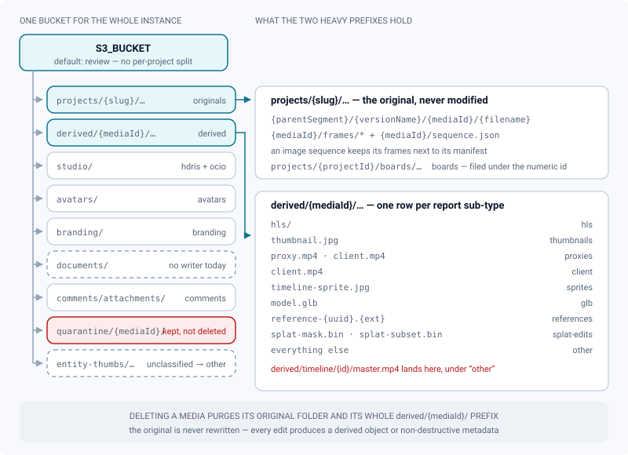
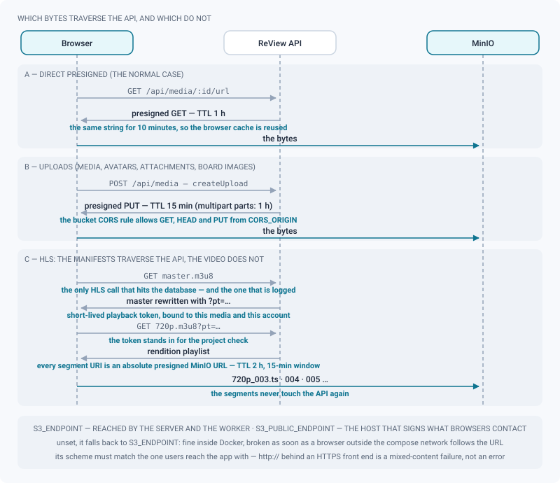

# Storage map (MinIO)

*Where every object lives in the one bucket, what is filling it, and which bytes reach a browser without ever touching the API.*

> Updated: 2026-08-23

The whole instance stores everything in **one S3/MinIO bucket** — `S3_BUCKET`, default
`review`. There is no bucket per project, no bucket per media type: a single flat namespace,
organised by key prefix. That decision is what makes the storage page possible, and it is
what you need in your head before reading a single number on it.

*Admin → Content → Storage* (`/admin/storage`) answers two questions at once: **where does
each kind of file live**, and **what is taking up the space right now**. The first half is a
static map of the key conventions; the second is a live scan of the bucket.

## One bucket, eight named prefixes, and everything else

Two prefixes carry almost all the weight of a working studio, and they are opposites:

- **`projects/{slug}/…` — the originals.** The uploaded file is the source of truth and is
  **never modified**. Every transformation the application offers — transcodes, trims, splat
  edits, USD overrides, colour work — produces derived objects or non-destructive metadata,
  never a rewrite of the source. This is also the only prefix a browser writes directly, by
  presigned `PUT`.
- **`derived/{mediaId}/…` — everything a machine produced.** Renditions, thumbnails, proxies,
  sprites, converted GLB, splat masks. All of it is regenerable, which is why the purge
  described further down only ever touches this half.

The other six named prefixes — `studio/`, `avatars/`, `branding/`, `documents/`,
`comments/`, `quarantine/` — are small by comparison, with one exception noted below.
Anything that matches none of the eight is counted as **`other`**.

> [!NOTE]
> `documents/` is a category the report knows how to count and the in-app map advertises as
> `documents/{timestamp}-{file}`, but no code path in the current build writes it. On a
> normal instance the row reads zero. Objects there are either hand-placed or the residue of
> an older build.

## Key conventions

| File type | Object key | Written by |
|-----------|------------|------------|
| Uploaded original | `projects/{projectSlug}/{parentSegment}/{versionName}/{mediaId}/{filename}` | browser (presigned `PUT`) |
| Image-sequence frames | `projects/…/{mediaId}/frames/{frame}` | browser (one presigned `PUT` per frame) |
| Image-sequence manifest | `projects/…/{mediaId}/sequence.json` | server, at finalisation |
| Board image | `projects/{projectId}/boards/project/{fileId}` or `…/boards/asset/{assetId}/{fileId}` | browser (presigned `PUT`) |
| HLS | `derived/{mediaId}/hls/master.m3u8`, `{height}p.m3u8`, `{height}p_NNN.ts` | FFmpeg worker |
| Thumbnail | `derived/{mediaId}/thumbnail.jpg` (worker) or `.png`/`.webp` (client-supplied) | FFmpeg worker / review |
| Video proxy | `derived/{mediaId}/proxy.mp4` (+ `proxy-trim.mp4`) | FFmpeg worker |
| Client MP4 (slate + burn-ins) | `derived/{mediaId}/client.mp4` | FFmpeg worker |
| Timeline sprite | `derived/{mediaId}/timeline-sprite.jpg` | FFmpeg worker |
| Converted GLB (3D/USD) | `derived/{mediaId}/model.glb` | conversion worker |
| Splat edits | `derived/{mediaId}/splat-mask.bin`, `splat-subset.bin` | splat editor |
| Review reference image | `derived/{mediaId}/reference-{uuid}.{ext}` | 2D review |
| Timeline export | `derived/timeline/{timelineId}/master.mp4` | timeline export |
| HDRI | `studio/hdris/{uuid}.{exr\|hdr}` | admin HDRI library |
| OCIO config | `studio/ocio/{uuid}.ocio` | admin colour management |
| Baked OCIO LUTs | `studio/ocio/luts/{configId}/…` | OCIO bake job |
| Avatar | `avatars/{userId}.{png\|jpg\|webp}` | user profile |
| Branding | `branding/logo-{timestamp}.{ext}`, `login-bg-{timestamp}.{ext}`, `sso-{timestamp}.{ext}` | admin (Delivery, Login page, Identity) |
| Entity thumbnail | `entity-thumbs/{sequence\|shot\|asset}/{id}.{ext}` | sequence/shot/asset thumbnail |
| Comment attachment / voice note | `comments/attachments/{userId}/{timestamp}-{name}` | review threads |
| ShotGrid note attachment | `comments/attachments/shotgrid/{commentId}/{sgId}-{name}` | ShotGrid sync |
| Quarantined upload | `quarantine/{mediaId}/{originalName}` | ClamAV scan |

Three conventions in that table are worth a sentence of their own, because they are where the
report surprises people:

- **Image-sequence frames stay inside the media folder.** They are deliberately filed next to
  the manifest rather than in a namespace of their own, so that the project purge and the
  storage quotas — which already walk `projects/{slug}/` — carry them without a second code
  path to keep in step. For a sequence media, `sequence.json` *is* the stored original: it is
  what lets you reconstruct the delivery years later without the database.
- **Board images are filed under the project's numeric id**, not its slug — `projects/12/…`,
  not `projects/my-show/…`. The project purge sweeps both prefixes, so nothing leaks; but see
  the warning in the next chapter about how that row reads in the report.
- **Deleting a media purges its original folder and its whole `derived/{mediaId}/` prefix.**
  That is the one deletion that removes bytes on both sides of the map.

The code-side source of truth is `backend/src/services/StorageService.ts` for the
conventions, and the FFmpeg worker for everything under `derived/`.

## The live report

`GET /api/admin/storage` (**`ADMIN` only**) walks the **entire bucket** with `ListObjectsV2`,
following continuation tokens to the end, and classifies every key by its prefix:

- **totals** — object count and bytes;
- **per top-level category** — nine buckets: `originals`, `derived`, `studio`, `avatars`,
  `branding`, `documents`, `comments`, `quarantine`, `other`;
- **derived breakdown** — nine sub-types: `hls`, `thumbnails`, `glb`, `proxies`, `client`,
  `sprites`, `references`, `splat-edits`, `other`;
- **studio breakdown** — `hdris`, `ocio` (baked LUTs count inside `ocio`);
- **per project** — the weight of `projects/<slug>/…`, cross-referenced with the database:
  each row links to the project admin page, a slug with **no matching project is flagged as a
  potential orphan**, and projects sitting in the trash are tagged. Sorted by bytes, heaviest
  first.

There is **no server-side cache**: every call re-scans the bucket in full and holds the
listing in memory while it aggregates. The *Re-scan* button forces a refetch; otherwise the
browser reuses the previous result for five minutes.

> [!WARNING]
> On a large bucket the scan takes seconds and costs a full listing of every object. Do not
> put this endpoint on a monitoring cron — it is a page you open, not a metric you poll.

Two prefixes are not classified and therefore inflate `other` in different places:
`entity-thumbs/…` lands in the **top-level** `other` category, while
`derived/timeline/{id}/master.mp4` lands **inside `derived`**, under the `other` sub-type. If
one of the two `other` rows looks unexpectedly large, that tells you which of the two to go
and look at.

And one row lies about being an orphan: because board images live under
`projects/{projectId}/`, the report shows a project row whose "slug" is a **number** and
flags it as having no matching project. It is not residue — it is the board attachments of
project *N*, and deleting it deletes the boards.

## How bytes reach a browser

Almost nothing streams through Node. The API hands out **short-lived presigned URLs** and the
browser talks to MinIO directly:

| Operation | Default lifetime | Notes |
|-----------|-----------------|-------|
| Upload (`PUT`) — media, avatars, branding, comment attachments, board images | **15 minutes** | The `Content-Type` is not part of the signature; the server rewrites it at finalisation |
| Multipart part URLs | **1 hour** | Resumable uploads; already-received parts are the source of truth on resume |
| Read (`GET`) — media, thumbnails, logos, client shares | **1 hour** | Memoised, see below |
| HLS segment URLs | **2 hours** | Signed at the start of a 15-minute window |

**Read URLs are memoised per 10-minute window.** Without it every response carried a fresh
signature, so the browser saw a different URL and re-downloaded the thumbnail it already had
in cache — a page of a hundred shots re-fetched a hundred JPEGs on every navigation. Two
calls for the same object, the same forced content type and the same requested lifetime now
return the *same string*. The signature is dated from the start of the window rather than the
instant of the call, which also makes it stable **between processes** (API and worker), and
the requested lifetime is extended by the width of the window so that memoisation can never
hand back a link shorter-lived than what the caller asked for. Rewriting an object under the
same key drops its memoised URL, so a regenerated thumbnail appears immediately.

**HLS is the one mixed case, and it is no longer the exception it used to be.** The manifests
travel through the API; the video does not:

1. `GET /api/media/:id/hls/master.m3u8` pays the full price — authentication, project access
   check, and a line in the media access log (deduplicated over 30 minutes). The master comes
   back with a short-lived **playback token** appended to each rendition URI.
2. `GET /api/media/:id/hls/720p.m3u8?pt=…` accepts that token in place of the database check.
   The rendition playlist is rewritten on the fly: every segment URI becomes an **absolute
   presigned MinIO URL**, valid two hours, signed at the start of a 15-minute window so that
   twenty people watching the same daily receive byte-identical URLs and any cache in front
   actually works.
3. The player then fetches `720p_003.ts`, `004`, `005`… **straight from object storage**. A
   segment name the playlist did not declare is left relative and falls back to the API
   route, so nothing breaks; it is a safety net, not the normal path.

The consequence for exploitation is direct: HLS traffic is MinIO traffic. Size the storage
front end, not the Node process, and see [HLS delivery](../infrastructure/hls-delivery.md).

## Endpoints, CORS and the variables around them

Two endpoints are configured, and mixing them up is the classic production failure:

| Variable | Default | What it does |
|----------|---------|--------------|
| `S3_ENDPOINT` | required | Reached **from the server and the worker**; used for every server-side operation |
| `S3_PUBLIC_ENDPOINT` | falls back to `S3_ENDPOINT` | The host that **signs presigned URLs** — the one browsers will contact |
| `S3_BUCKET` | `review` | The single bucket of the instance |
| `S3_REGION` | `us-east-1` | Signature region; MinIO does not care, the signer does |
| `S3_FORCE_PATH_STYLE` | `true` | Path-style addressing, which is what MinIO speaks |
| `S3_ACCESS_KEY` / `S3_SECRET_KEY` | required | The server **refuses to start in production** if they are still `minioadmin` |
| `CORS_ORIGIN` | `*` | Drives the bucket CORS rule; `*` is **refused in production** |

> [!CAUTION]
> If `S3_PUBLIC_ENDPOINT` is unset it falls back to `S3_ENDPOINT`. That works inside Docker
> and breaks the moment a browser outside the compose network follows a URL pointing at an
> internal hostname. It must also match the scheme users reach the app with: an `http://`
> public endpoint behind an HTTPS front end produces mixed-content failures, not a helpful
> error message.

At start-up the server applies a CORS rule to the bucket from `CORS_ORIGIN`, allowing `GET`,
`HEAD` and `PUT` from the application origin (`ETag`, `Content-Length` and `Content-Type`
exposed, cached for an hour). Failure to apply it is logged and non-blocking — which is
exactly why a browser upload that fails **immediately** with a CORS error is almost always
`CORS_ORIGIN` not matching the real front-end URL. The same rule is what lets the 3D viewer
fetch a GLB cross-origin.

## Purging derived files

Configured in *Admin → Maintenance → Jobs* (`GET`/`PUT /api/admin/derived-purge`,
`POST /api/admin/derived-purge/run`, `ADMIN` only) and **disabled by default**.

When enabled, every daily maintenance pass keeps the **last `keepVersions` versions** of each
task or asset intact (default 3, allowed range 1 to 100) and, for the video media of older
versions, deletes the `derived/{mediaId}/hls/` prefix and the timeline sprite. The
`proxy.mp4` and the thumbnail stay, so those versions remain watchable at proxy quality and
still look right in a list. The operation is idempotent and marks the media so a second pass
skips it. See [System and maintenance](system-and-maintenance.md).

Nothing about the original is touched — which is what makes this the highest-yield, lowest-
risk lever on a full disk.

## Use case: reclaiming space when the bucket fills up

*The volume is at 85 % and nobody wants to delete a show.*

1. **Measure before acting.** Open *Admin → Content → Storage* and read the split between
   `originals` and `derived`. The remedy is completely different:
   - `derived` dominant → renditions and sprites; recoverable and regenerable.
   - `originals` dominant → source media; only real deletion or archiving helps.
2. **Look for orphans.** A project row flagged as having no matching project is a slug in the
   bucket with nothing in the database — usually the residue of a purge that failed halfway.
   Confirm the slug against *Admin → Content → Projects* and the trash before removing those
   bytes with the MinIO client. Remember that a **numeric** row is not an orphan: it is the
   boards of that project.
3. **Check `quarantine/`.** An infected upload is *moved* there, not deleted: the media goes
   `FAILED`, the bytes stay. After a year of production this can be a surprising amount, and
   none of it is needed once the incident is closed.
4. **Enable the derived purge** with `keepVersions` at 3 to 5. Old versions lose their HLS
   ladder and hover sprite but stay watchable at proxy quality. Run it once by hand (*Run
   now*) and re-scan to measure the gain.
5. **Trim the ladder** so it stops growing: cap the maximum rendition height at 1080 if nobody
   reviews in 4K. See [Transcoding](transcoding.md).
6. **Only then** consider the trash. Emptying it is irreversible, and the daily sweep is
   already purging anything older than `trash_retention_days` on its own.

## Use case: proving where a specific file went

*A supervisor insists a version "disappeared".*

1. *Admin → Content → Versions*, filter by project and name. The version row links to the
   review page of its first media and shows the publication badge and the media count. A row
   that exists with **zero media** is an upload that never finalised.
2. If it is not there, look in *Admin → Maintenance → Trash* (projects) and in the project's
   own trash (`GET /api/projects/:projectId/trash`, supervisor or admin), which lists deleted
   sequences, shots, assets, versions and media.
3. If it is in neither, check the audit log (*Maintenance → Audit*) for `VERSION_DELETE`,
   `VERSION_PURGE`, `MEDIA_DELETE`, `MEDIA_PURGE` or `PROJECT_PURGE` — every one of those
   records the author and the timestamp.
4. If the audit shows nothing and the deletion date would be more than `trash_retention_days`
   ago, it was the **automatic sweep**: soft-deleted items are purged without an audit entry
   and without a confirmation. That is the single most common answer to "it disappeared on
   its own".
5. `MEDIA_QUARANTINED` in the audit means ClamAV took it: the bytes are under
   `quarantine/{mediaId}/`, the original key is gone, and the media is `FAILED`, not deleted.

## Related pages

- [MinIO and files](../infrastructure/storage-minio.md)
- [HLS delivery](../infrastructure/hls-delivery.md)
- [System and maintenance](system-and-maintenance.md)
- [Data retention and log lifecycle](data-retention.md)
- [Transcoding](transcoding.md)
- [Content explorer](content-explorer.md)
