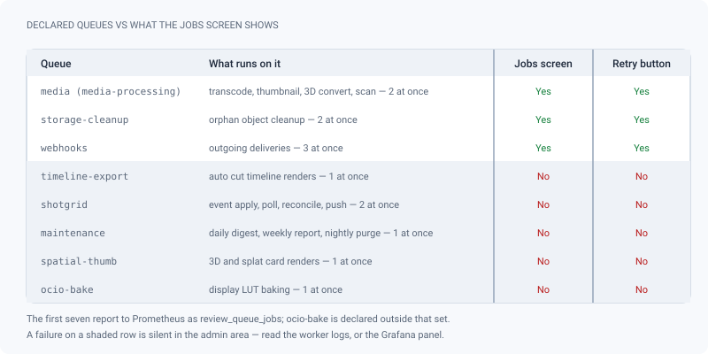

# System & maintenance

*Runtime health, studio limits, queues, trash and audit — the screens to open when something breaks, or deletes itself.*

> Updated: 2026-09-20

This page covers the parts of the admin area that are about the **instance** rather than about
the work: is it healthy, what are its limits, what is queued, what was deleted, and who did
what. Everything here is reserved to the `ADMIN` role — the whole admin area is, and each route
behind it checks again.

Two things on this page delete data on a schedule, without asking: the **trash purge** and the
**retention sweep**. Read [Trash and automatic retention](#trash-and-automatic-retention) before
you put a first show on a new instance, not after.

## The screens this page covers

| Screen | Where | What it is |
|---|---|---|
| **System** | *Studio → System* | Runtime state: host, memory, disk, service health, licence |
| **Studio identity** | *Studio → Studio identity* | What the instance is: name, theme, default language, logo, source URL |
| **Activity** | *Studio → Activity* | The audit journal: sensitive actions, newest first |
| **Jobs** | *Maintenance → Jobs* | Queue counters, failed jobs, retry — and the derived-files purge |
| **Trash** | *Maintenance → Trash* | Deleted projects, restore or purge |
| **Retention** | *Maintenance → Retention* | How long the nine journals are kept — see [Data retention](data-retention.md) |
| **Media access** | *Maintenance → Media access* | Who viewed which media — see [Identity, API & audit](identity-and-api.md) |

There is no *Audit* section any more: the audit journal **is** the *Activity* screen, in the
*Studio* group. And the one section people miss in *Maintenance* is **Retention**, which
governs most of the automatic deletions described below — trash included.

## System — *Admin → Studio → System*

`GET /api/admin/system` reports the **runtime state of the instance**, not its settings:

- **host** — platform, architecture, Node version, CPU count, load average (always `[0,0,0]` on
  Windows), host and process uptime;
- **memory** — total, free, used, and the process RSS;
- **disk** — total and free bytes of the volume holding the server's working directory, when the
  OS supports `statfs`. The panel is simply absent otherwise;
- **service health** — database, Redis and MinIO, each probed live. This is the first place to
  look when uploads or jobs stop working;
- **licence** — AGPL-3.0-or-later, the third-party notices file, and the source URL the instance
  currently publishes (see below).

Studio *limits* are not here — they are in *Settings*. And the screen is a snapshot: use the
**Refresh** button rather than trusting a tab you left open an hour ago.

> [!TIP]
> Free disk trending down faster than the MinIO bucket grows means something outside MinIO is
> filling the volume — usually container logs or an unrotated Postgres WAL. See
> [Backups](../infrastructure/backups.md).

## Studio identity — *Admin → Studio → Studio identity*

Key/value studio settings (`GET`/`PUT /api/studio/settings`, `ADMIN` only, audit action
`SETTING_UPDATE`). Every write is a single `{ key, value }` upsert, applied immediately across
the instance.

This screen used to be the catch-all where every key/value setting landed. It is now the
instance's **identity** — what it is called, what it looks like, what language it defaults to,
where its sources live — and each of the other settings was moved to the screen that already
answers its question. The keys did not change, only where you edit them:

| Setting | Key | Now edited in |
|---|---|---|
| Default start frame | `default_start_frame` | *Studio → Project defaults* — it is a creation default, next to the resolution and framerate it goes with |
| Maximum file size, default quota, concurrent uploads | `max_file_size`, `storage_limit_user`, `max_concurrent_uploads` | *Content → Storage* — they are storage limits, and that screen already shows what the bucket holds |
| Trash retention | `trash_retention_days` | *Maintenance → Retention* — one screen for “how long do we keep what we deleted”, journals and trash together |
| Live broadcast rates | `live_sync_hz_video`, `_image`, `_3d`, `_splat` | *Review contexts → Live review room* |
| Slack webhook | `slack_webhook_url` | *Communications → Team chat*, beside the Discord one |

What is left on this screen:

| Setting | Key | Default | What it does |
|---------|-----|---------|--------------|
| Studio name | `Studio.name` | *(set at first run)* | Shown in the header, the login page, the client portal and every email |
| Studio language | `studio_default_locale` | `en` | Language of accounts that never chose one, and of **every server-rendered email** and chat notification. Changing it does not change your own interface language |
| Accent colour | `studio_accent` | `#00b3c4` | Applied to the application and to the login page; the reset button clears it back to the product accent |
| Source code URL | `studio_source_url` | upstream repository | AGPL §13 obligation, see below |
| Studio logo | `studio_logo_key` | *(none)* | Uploaded here, and reused by the login page, the client portal and the burn-in — see [Branding & notifications](branding-and-notifications.md) |

One save bar covers the whole screen rather than a button per card: eleven separate save
buttons was the worst habit of the old catch-all.

Size fields — wherever they now live — are entered in **MB or GB and stored in bytes**, in
binary units: 1 GB is 1 073 741 824 bytes, the same base the file managers and the MinIO
console count in, and the same one every size shown elsewhere in the administration uses. A
value typed there therefore reads back unchanged. There is **one** `max_file_size` for the
whole instance: it is not per media kind, and an EXR sequence is measured as the sum of what
it uploads.

> [!CAUTION]
> Two keys are **never readable and never writable through this screen**: `smtp_config` and
> `vapid_keys`. They hold secrets — the encrypted SMTP configuration, and the private VAPID key
> that signs every push notification of the instance — and have their own endpoints. A `PUT`
> naming either is refused with `400 RESERVED_SETTING`, and neither is ever returned by the
> `GET`. That exclusion is a list, not a memory: a secret added later must be added to it.

### Source code URL (AGPL §13)

ReView is distributed under AGPL-3.0-or-later. If you deploy a **modified** version, §13 requires
offering the corresponding source to every remote user, including unauthenticated ones.
`studio_source_url` is where you point at *your* sources; it is served with the public branding
and shown on the login page, the client share page and the public API documentation.

Only `http`/`https` values are accepted — anything else **silently falls back** to the upstream
repository, which would not satisfy the obligation for a modified build. Check the System screen
after saving: it displays the URL the instance actually publishes, which is the one that counts.

## Trash and automatic retention

Deletions across the application are **soft deletes**. Deleted projects appear in
*Admin → Maintenance → Trash* (`GET /api/admin/trash`) where they can be restored or purged.
Deleted sequences, shots, episodes, assets, versions and media appear in the **project's own**
trash (`GET /api/projects/:projectId/trash`, `ADMIN` or `SUPERVISOR`).

Purging is permanent: database rows **and** MinIO objects. Purging a project requires `ADMIN`;
purging an entity inside a project is open to `SUPERVISOR` as well, and every purge is audited.

Once a night, a job walks four purges in a fixed order. It is a **repeatable BullMQ job on the
`maintenance` queue**, not a process timer: it survives a restart, fires once no matter how many
API replicas you run, and appears in the queue like any other job. It is armed sixty seconds
after the API starts — so an instance switched back on after a long outage catches up
immediately — and then every twenty-four hours.

| Station | What it deletes | Trace |
|---|---|---|
| 1 · Trash purge | Everything soft-deleted for longer than `trash_retention_days`, children before parents: media, versions, shots, sequences, episodes, assets, projects — rows **and** MinIO objects, at most 2000 items per pass | **None** |
| 2 · Derived purge | Only when enabled: the HLS renditions and timeline sprite of older versions | `DERIVED_PURGE_RUN` |
| 3 · Idempotency purge | Expired API v1 replay records | None |
| 4 · Retention sweep | The nine journals, in batches — including the audit log itself | `RETENTION_SWEEP`, when something was deleted |

> [!WARNING]
> **The trash empties itself.** Station 1 permanently purges anything soft-deleted more than
> `trash_retention_days` ago — **30 days by default** — with no confirmation, no notification and
> no audit entry. If your studio expects the trash to be an archive, set `trash_retention_days`
> to `0`, which disables the sweep entirely, *before* someone discovers the default the hard way.
> Anything you want to keep must be **restored** before the window closes; the sweep will not ask.

Station 4 belongs to a different screen. Retention periods — how long the audit log, the media
access log, notifications, sessions, password resets, invitations, share links, ShotGrid syncs
and API v1 events are kept — are set in *Admin → Maintenance → Retention*. See
[Data retention](data-retention.md) for the defaults and for running a sweep on demand.

## Jobs — *Admin → Maintenance → Jobs*

`GET /api/admin/jobs` shows **three** BullMQ queues — `media`, `storage-cleanup` and `webhooks` —
each with counters (waiting, active, completed, failed, delayed) and the recent failed, active
and waiting jobs, including `failedReason` and `attemptsMade`. The screen refreshes itself every
five seconds.

Actions on that screen:

| Action | Route | Notes |
|---|---|---|
| Retry a failed job | `POST /api/admin/jobs/:queue/:id/retry` | Refuses anything not in the failed state. Audit `JOB_RETRY` |
| Clean the failed list of a queue | `POST /api/admin/jobs/:queue/clean-failed` | Up to 1000 entries. Discards job records; it does **not** fix the media. Audit `JOBS_CLEAN_FAILED` |
| Retry every failed media job | `POST /api/admin/jobs/retry` | **API only** — no button on the screen. Audit `JOBS_RETRY` |

### Three queues on screen, eight in the instance

The instance declares seven queues plus one more outside that set, and the Jobs screen shows the
first three. A failure anywhere else is invisible from the admin area.

> [!IMPORTANT]
> If a ShotGrid push, an auto cut timeline render, a nightly purge, a 3D thumbnail or an OCIO
> bake never lands, the Jobs screen will tell you nothing at all. Read `docker compose logs
> worker`, or the queue depth in Prometheus — the first seven queues are exported as
> `review_queue_jobs` with a stable `queue` label, which is what
> [Monitoring](../infrastructure/monitoring.md) alerts on.

### Derived files purge

Same screen, separate feature (`GET`/`PUT /api/admin/derived-purge`,
`POST /api/admin/derived-purge/run`; audit `DERIVED_PURGE_CONFIG` and `DERIVED_PURGE_RUN`).

| Field | Default | Range |
|-------|---------|-------|
| `enabled` | **`false`** | boolean |
| `keepVersions` | **3** | 1–100 |

When enabled, for each task and each asset it keeps the newest `keepVersions` versions intact
and, on the **video** media of the older ones, deletes the whole `derived/{mediaId}/hls/` prefix
and the timeline sprite, then marks `metadata.hlsPurged = true`.

- **Kept:** the MP4 proxy and the thumbnail — old versions stay watchable at proxy quality, with
  a working card.
- **Lost:** adaptive quality selection, and the timeline hover preview on those media.
- The MinIO deletions are permanent. Regenerating them means reprocessing the media, which a
  published media only allows after a failure and only once
  (`403 REPROCESS_ONLY_AFTER_FAILURE`) — and is in any case usually impossible, because the
  original has been superseded.
- It is idempotent, and once enabled it also runs inside the nightly pass.

Enable it deliberately, not experimentally: it is the one maintenance switch that silently
deletes data across the whole instance the first time the sweep runs.

## Health probes, for a load balancer or a monitor

The *System* screen is for a human. A frontal proxy, a container runtime or an external monitor
wants something narrower, and there are two different questions with two different answers.

| Probe | Auth | What it does | Failure |
|---|---|---|---|
| `GET /health`, `GET /health/live` | none | **Liveness.** No I/O at all: version, commit, process uptime. Never fails because a dependency is down | Only if the process is gone |
| `GET /health/ready` | none | **Readiness.** Database, Redis and MinIO probed in parallel, each under a **2 s** timeout; the result is cached **5 s** and concurrent calls share one run | `503` with `status: degraded` and a per-check reason |
| `GET /api/version` | none | Version, commit, build date, Node version, and the published source URL | — |

Wire the container health check to `/health` and the load balancer to `/health/ready`. The
distinction matters: restarting a container because Postgres fell over only adds an outage to the
outage. Failure reasons are truncated to 120 characters so a raw driver error cannot leak a
connection string, and all three routes are public because the AGPL §13 offer has to be reachable
without an account.

## Activity — the audit journal — *Admin → Studio → Activity*

There is one journal, not two. The *Activity* screen and the audit log were separate screens
showing overlapping things, one of them not a security record at all; *Activity* now renders
the audit journal itself, with each entry's author, their avatar and a link to the entity.

`GET /api/studio/audit` (paginated, thirty per page, newest first) records sensitive actions
with the author, timestamp, entity type and entity id.

| Group | Actions |
|---|---|
| Accounts and access | `USER_CREATE`, `USER_UPDATE`, `USER_ROLE_CHANGE`, `USER_INVITE`, `USER_DISABLE`, `USER_ENABLE`, `USER_DELETE`, `SESSION_REVOKE`, `SESSION_REVOKE_ALL`, `TWOFA_ENABLE`, `TWOFA_DISABLE`, `TWOFA_FAIL`, `TWOFA_BACKUP_USED`, `OIDC_LOGIN`, `OIDC_PROVISION`, `OIDC_CONFIG_UPDATE` |
| API surface | `API_TOKEN_CREATE`, `API_TOKEN_REVOKE`, `WEBHOOK_CREATE`, `WEBHOOK_UPDATE`, `WEBHOOK_DELETE`, `WEBHOOK_REPLAY` |
| Distribution | `SHARE_CREATE`, `SHARE_REVOKE`, `SHARE_VIEW`, `SHARE_EMAIL`, `SHARE_UNLOCK_FAIL` |
| Pipeline content | `PROJECT_CREATE`, `PROJECT_SETTINGS_UPDATE`, `PROJECT_DUPLICATE`, `PROJECT_IMPORT_CSV`, `PROJECT_DELETE`, `PROJECT_RESTORE`, `PROJECT_PURGE`, `EPISODE_DELETE`, `EPISODE_PURGE`, `SEQUENCE_DELETE`, `SEQUENCE_PURGE`, `SHOT_DELETE`, `SHOT_PURGE`, `SHOT_BULK_MOVE`, `ASSET_DELETE`, `ASSET_PURGE` |
| Versions and media | `VERSION_PUBLISH`, `VERSION_DELETE`, `VERSION_PURGE`, `version.decision`, `MEDIA_DELETE`, `MEDIA_PURGE`, `MEDIA_REPROCESS`, `MEDIA_DEDUP`, `MEDIA_QUARANTINED`, `MEDIA_SEQUENCE_UPLOAD`, `MEDIA_USD_OVERRIDE`, `MEDIA_USD_RECOMPOSE` |
| Configuration | `SETTING_UPDATE`, `STUDIO_UPDATE`, `SMTP_UPDATE`, `TRANSCODE_CONFIG_UPDATE`, `BURNIN_CONFIG_UPDATE`, `PROJECT_DEFAULTS_UPDATE`, `DERIVED_PURGE_CONFIG`, `DERIVED_PURGE_RUN`, `RETENTION_CONFIG`, `RETENTION_RUN`, `RETENTION_SWEEP`, `HDRI_ADD`, `HDRI_DELETE`, `OCIO_INSTALL`, `OCIO_DEFAULT`, `OCIO_DELETE`, `OCIO_BAKE`, `ANNOUNCEMENT_CREATE`, `ANNOUNCEMENT_UPDATE`, `ANNOUNCEMENT_DELETE`, `JOB_RETRY`, `JOBS_RETRY`, `JOBS_CLEAN_FAILED` |

Three limits to know:

- The entry's **`metadata` is deliberately not returned** by the API. Secrets pass through
  configuration changes — a chat webhook URL, for instance, is recorded only as "changed" — and a
  readable audit log must not become the new hiding place for them. What you get is who, when,
  what action, on which entity.
- Audit writes are **best effort**: a failure is logged and never fails the user's request. The
  log is a traceability baseline, not a transactional ledger.
- The audit table **is** purged. `auditLog` is the first of the nine retention families and
  defaults to **365 days**; the nightly sweep deletes older rows in batches. Set the audit period
  to `0` in *Maintenance → Retention* if the studio must keep an unbroken trail — that is the only
  value that means "never".

## Use cases

### Preparing the first week of a new instance

*The stack is up and the first show is about to land.*

1. *System*: confirm database, Redis and MinIO are all green. A red MinIO here explains every
   upload failure you are about to get.
2. *Storage*: set `max_file_size` to something the studio actually produces — 5 GiB refuses a
   lot of EXR sequences and plate pulls, and the artist only finds out at the end of the upload.
3. *Storage*: raise `storage_limit_user`, or set per-account limits. 10 GiB is a demo-sized
   default; a single compositor exceeds it in a week.
4. *Retention*: **decide `trash_retention_days` now.** Leaving it at 30 means anything deleted
   today is unrecoverable in a month, silently. It sits with the nine journal periods, which is
   the next step anyway.
5. *Studio identity*: fill `studio_source_url` if you modified the code — it is a licence
   obligation, not a nicety — and set the studio language, which is the language of every email
   the server sends to an account that never chose one.
6. *Retention*: read the nine periods once, and decide the audit one deliberately. See
   [Data retention](data-retention.md).
7. *Jobs*: leave the derived purge **off** until the studio has a real version history. With
   `keepVersions: 3` on a brand-new project it would purge almost nothing, and on an imported back
   catalogue it would purge a great deal.
8. Wire `/health` to the container health check and `/health/ready` to the load balancer, before
   the first busy day rather than during it.

### The monthly maintenance pass

1. *System* — service health and free disk.
2. *Jobs* — clear the failed lists **after** checking why they failed. A queue with hundreds of
   failures is a signal, not a housekeeping chore.
3. Queue depth in Grafana for the five queues that have no screen — a silent `shotgrid` backlog
   is the classic "ShotGrid stopped updating" ticket.
4. *Content → Storage* — re-scan, look at the category split and the heaviest projects. See
   [Storage map](storage.md).
5. *Maintenance → Trash* — restore anything you actually want to keep before its window closes.
6. *Audit* — scan for `SHARE_CREATE` you do not recognise, `USER_ROLE_CHANGE` you did not make,
   `USER_DISABLE`/`USER_ENABLE` around an offboarding, and `SHARE_UNLOCK_FAIL` bursts, which mean
   someone is guessing a share password.
7. *Media access* — see [Identity, API & audit](identity-and-api.md).

### "It disappeared on its own"

In order of likelihood:

1. The **trash purge**: it was soft-deleted more than `trash_retention_days` ago. Nothing was
   recorded, and nothing can be restored. Check the setting, then check when the item was deleted.
2. The **derived purge**: the media still plays but only at proxy quality, with no timeline
   preview. Look for `metadata.hlsPurged` and for a `DERIVED_PURGE_RUN` entry in the audit log.
3. The **retention sweep**: an old audit entry, notification or session is gone. `RETENTION_SWEEP`
   in the audit log says when, and the Retention screen says what the period is.
4. Nothing automatic at all — someone purged it by hand, and the audit log names them.

## Related pages

- [Data retention](data-retention.md)
- [Storage map](storage.md)
- [Transcoding](transcoding.md)
- [Identity, API & audit](identity-and-api.md)
- [Branding & notifications](branding-and-notifications.md)
- [Jobs & workers](../infrastructure/jobs-and-workers.md)
- [Monitoring](../infrastructure/monitoring.md)
- [Backups](../infrastructure/backups.md)
- [Security model](../infrastructure/security.md)
