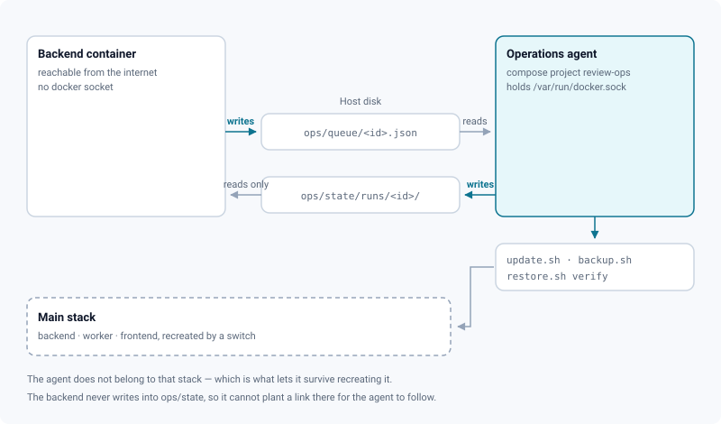

# Updates & backups

*See which release runs, read what a newer one changes, and — when the instance is allowed to act on itself — back up and switch without opening a terminal.*

> Updated: 2026-09-10

**Admin → Maintenance → Updates** answers two questions an operator asks at different moments:
*what is running here, and what would change if I moved?* — and then, sometimes, *do it*.

The first half works everywhere, including on an instance with no outbound access and nothing
installed beyond the stack itself. The second half needs an **operations agent**, which is
optional and which you install deliberately, because of what it holds.

## What the screen reads

| Panel | Source | Works without the agent |
|-------|--------|-------------------------|
| About this instance | `GET /api/version` — the same values the health probe and the support see | yes |
| Available release | the published releases of `RELEASE_REPO`, fetched hourly and cached | yes, with outbound access |
| What it changes | the notes of **every** release published since the one installed | yes, with outbound access |
| Backups | the `manifest.txt` of each directory `scripts/backup.sh` left behind | yes, once the directory is mounted |
| Operation in progress | the run files the agent writes on the host disk | no |

> [!NOTE]
> The screen never shows a greyed-out button. When the instance cannot do something itself —
> no agent, an agent that stopped answering, images built locally — it prints the exact command
> instead, with a copy button. A disabled button suggests a fault and teaches nothing; a command
> gets the operator moving.

## Reading what a release changes

The panel lists the notes of every release published since the installed one, newest first,
the most recent expanded. Skipping three releases at once is the normal case, and what changes
then comes from all three — showing only the last one would be a half-truth.

The notes are the body of the GitHub release, which the release workflow fills from the section
of `CHANGELOG.md` matching the tag. They are **remote markdown**: the reader escapes raw HTML,
so a repository you follow cannot inject anything into your admin screen.

**Check now** forces a fresh check; it is capped at twenty per hour and per account, because
without a token the GitHub API allows sixty calls an hour and per address for the whole studio.

Three answers are not releases and say so plainly: the catalogue could not be reached (no
outbound access), the catalogue is refusing further checks for now (rate limit), or checks are
turned off on this instance (`RELEASE_CHECK_ENABLED=false`).

## Running an update

The button appears only when four things are true at once: the instance runs **published
images**, an agent is present and answering, the operator allowed updates, and a newer release
exists. Otherwise the command is printed.

Confirming asks for your password. That is not a defence against a stolen session — whoever
holds an admin session can also create an account — it stops the accidental click and the tab
left open behind someone, which is most of the real risk for a gesture that interrupts the whole
studio for a few minutes. The second barrier, the one an application compromise does not cross,
is `deploy/agent.conf`; see [Security](../infrastructure/security.md).

The dialog offers to back up first, ticked. Untick it and the screen says what that means:
nothing can be rolled back afterwards.

## What happens during the cut

The instance goes away for one to three minutes. **That is expected, and the screen is built for
it**: the API it was talking to is the container being recreated.

1. The order is written to the host disk and picked up by the agent.
2. The agent runs `scripts/update.sh`, which backs up, switches, and waits for the instance to
   report itself ready from the inside.
3. The screen keeps polling. While the API is gone it says *the instance is restarting*, with no
   error banner and no red toast — a failed request is the expected behaviour at that moment.
4. When the API answers again, it is the **new** version answering. It reads the same run file,
   written by an operation the previous version started, and the screen picks the output back up
   at the byte where it stopped.

Keep the page open. Reloading during the cut is not harmful — the operation is remembered — but
the page will not be served while the frontend container is being recreated either.

## Rolling back, and what it does not undo

If the instance does not come back on the new release, `update.sh` puts the previous one back by
itself and the screen says so.

> [!WARNING]
> The **code** goes back. The **database** may already have been migrated, and Prisma migrations
> do not undo. If the restored version cannot run on the migrated schema, restore the dump taken
> minutes earlier — the screen prints the exact command, filled in with the right backup id.
> Everything written since the update is lost that way, so restore only if the instance is
> unusable.

Restoring is deliberately not a button. `scripts/restore.sh db|all` overwrites without asking and
without a terminal; that stays a gesture made in front of a keyboard.

## Backups

**Back up now** runs `scripts/backup.sh`: a `pg_dump` of the database and an incremental mirror of
the bucket, frozen as a hard-link snapshot in a new dated directory. The instance keeps running
throughout.

Each row shows what the manifest says: when, how big the dump is, which release it was taken from,
and whether the secrets travel with it. That last badge matters — without `env.backup`, a restore
on another machine gives rows that exist and cannot be decrypted.

**Check** runs `scripts/restore.sh verify`: it restores the dump into a throwaway database, counts
what comes out, and drops it. A backup that has never been restored is not a backup.

> [!CAUTION]
> The check is a full `pg_restore` and it runs on the database server that serves the studio.
> Prefer quiet hours on a large instance.

The catalogue reads `manifest.txt` and **nothing else**. The directory also holds `env.backup` —
a copy of the instance secrets — and the dump itself; the mount is read-only and the application
never opens either. If no directory is mounted, the screen says so rather than claiming there is
no backup: those are two different answers.

## Turning the agent on



```bash
bash scripts/ops-agent.sh install
```

That command starts one small container, mounts the backup directory and the order spool into the
backend, and recreates the backend so it sees them. `scripts/install.sh` offers to do it at
installation time.

Three properties are worth knowing before you run it:

- **The agent holds `/var/run/docker.sock`.** On that machine, that is equivalent to root. It is
  therefore the *only* container that has it — the backend, which is reachable from the internet,
  never does — and its vocabulary is three orders with no free-form command: back up, check a
  backup, update.
- **It lives in a separate compose project** (`review-ops`). `update.sh` runs `docker compose up -d`
  without a service list: an executor declared in the main stack would destroy itself in the middle
  of its own work.
- **What it may do is written in `deploy/agent.conf`**, which is mounted in no container of the
  application. Someone who steals an admin session cannot grant themselves what you refused there.

`bash scripts/ops-agent.sh status` shows what the agent sees and when it last answered;
`logs`, `upgrade`, `restart` and `uninstall` do what they say. Removing the agent leaves the backup
catalogue working — you lose the buttons, not the service.

## Known limits

- **Locally built images have no button.** Switching would recompile gigabytes on the studio's
  server, and `git checkout` would rewrite the repository under a running stack. The command is
  printed instead. Move to published images with `scripts/install.sh --images` (see
  [Updating](../getting-started/updating.md)).
- **The agent is not updated with the instance.** It reports its own version, and the screen says
  when it is too old to understand the current release. `bash scripts/ops-agent.sh upgrade` moves it.
- **An update started from a terminal is invisible here.** The screen only knows about operations
  it ordered; there is no shared lock with the host shell.
- **The agent does not see the instance directory at the same path as the host?** Nothing runs
  until that is fixed, and the screen says why: a backup would otherwise mirror the bucket into an
  empty directory without a single error, and no one would find out until the day of a restore.
