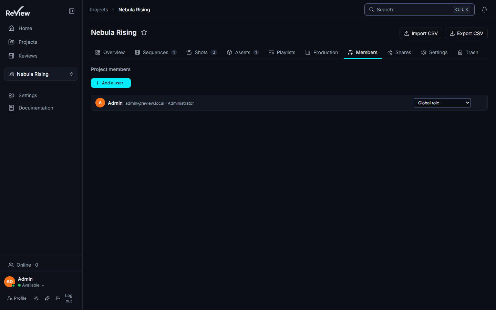

# Users & roles

*The two authorisation layers, how the effective role on a project is computed, and how to offboard without losing history.*

> Updated: 2026-08-23

ReView has **two layers of authorisation**, and confusing them is the most common
administration mistake:

1. a **global role** carried by the account (`User.role`);
2. an optional **project role** carried by a membership (`ProjectMembership.role`), which
   overrides the global role *for that project only*.

Both are the same enum: `ADMIN`, `SUPERVISOR`, `ARTIST`, `CLIENT`. On top of them sit two
account states that are not roles at all and are covered further down — a **disabled**
account (`User.disabledAt`), which is the normal end of a contract, and a **service
account** (`User.isService`), which is a machine wearing a user's clothes.

## How the effective role is computed

`effectiveProjectRole(userId, globalRole, projectId)` answers one question — *what is this
person on this project?* — and it answers it in a fixed order.

- global `ADMIN` → `ADMIN` everywhere, membership ignored;
- global `SUPERVISOR` → `SUPERVISOR` everywhere, membership ignored;
- otherwise: **no membership → no access at all** (`null`); with a membership, the
  effective role is `membership.role ?? globalRole`.

Two consequences worth memorising:

- **A global manager is never demoted by a project role.** Setting an administrator's
  membership to `CLIENT` on a project changes nothing — they remain `ADMIN` there. Project
  roles cannot be used to hide a project from an admin or a supervisor.
- **A project role never leaks across projects.** An `ARTIST` whose membership on *Ligne
  Bleue* says `SUPERVISOR` is a supervisor on *Ligne Bleue* and an ordinary artist
  everywhere else.

> [!NOTE]
> The refusal for a non-member is a real refusal, not a filtered list. The project does not
> appear anywhere, and a guessed URL answers `403` — which is what makes the "one client,
> one project" pattern below actually safe.

## Global roles

| Role | Scope |
|------|-------|
| `ADMIN` | The only role that can open `/admin`. Every `/api/admin/*` route is `ADMIN`-only. Exempt from the per-user storage limit — but **not** from a project quota. |
| `SUPERVISOR` | Studio-wide **content** manager: sees and manages every project without being a member, creates projects, archives them, creates share links, manages the pipeline structure and the Episode level. **No admin area.** Can *list* accounts, and nothing more. |
| `ARTIST` | Contributes to the projects they are a member of: uploads versions, comments, annotates, moves tasks, creates playlists. |
| `CLIENT` | External reviewer. Reads and comments on the projects they are a member of; no upload, no task creation. Also sees a narrowed directory — see below. |

### What `CLIENT` cannot see

The `CLIENT` role is not "the same screens with fewer buttons": the server narrows the data
before it leaves.

- **Directory and presence** (`GET /api/users/presence`) is filtered to people who share at
  least one project with the client. Every other role sees the whole studio.
- **Member profiles** (`GET /api/users/:id/profile`) hide `email` and `phone` from a
  `CLIENT` viewer, and the projects listed on the profile are only those the two people
  share.
- **Upload and task creation** raise `403 ROLE_FORBIDDEN` (`assertCanContribute`).
- **Playlists** require `ADMIN`, `SUPERVISOR` or `ARTIST` — a client cannot create one.

### The subtle case: the project supervisor

A project supervisor is an account whose **global role is `ARTIST`** (or `CLIENT`) but
whose **membership on one project carries `SUPERVISOR`**. This is the intended way to let a
lead run their own show without handing them the studio.

What a project supervisor **can** do on that project — the routes guarded by
`requireProjectManage`, which reads the effective role:

- add and remove members, and set their project role;
- edit the project settings section by section (`PATCH /api/projects/:projectId/settings`):
  departments, nomenclature, delivery resolution and framerate, upload naming rule, burn-in
  override, default 3D lighting, colour intent;
- download the import template and run the CSV import
  (`GET`/`POST /api/projects/:projectId/import-csv…`);
- edit the ShotGrid connection of that project, and bring in crew who **already have an
  account**.

What a project supervisor **cannot** do, because those routes demand a *global*
`ADMIN`/`SUPERVISOR` (`requireRole`):

| Action | Route |
|--------|-------|
| Create, rename, archive, delete, restore or purge the project | `POST`/`PATCH`/`DELETE /api/projects…` |
| Set the project storage quota | `PATCH /api/projects/:projectId` (`storageQuota`) |
| Read the project trash | `GET /api/projects/:projectId/trash` |
| Duplicate the project | `POST /api/projects/:projectId/duplicate` |
| Create sequences, shots or assets | `POST /api/sequences`, `/api/shots`, `/api/assets` |
| Turn the **Episode** level on or off, create, rename, reorder, assign or trash an episode | `/api/episodes…` |
| Create, list or revoke **client share links** | `/api/shares…` |
| Manage departments through the department routes | `/api/departments…` |
| Set an entity thumbnail | `/api/…/thumbnail` |

Two of those deserve a note.

**Departments.** The dedicated department routes are global-role only, but the project
settings endpoint accepts a `departments` array and syncs it to the `Department` table
(`DepartmentService.syncFromSettings`). A project supervisor can therefore reorder the pipe
from *Project → Settings*, but not from the department routes an integration would call.

**Episodes.** Every episode write — including the switch that turns the level on — is
`requireRole(ADMIN, SUPERVISOR)`. A lead who has just rebuilt the whole sequence layout by
CSV still cannot add *EP02*. If your shows are series, plan for a global manager to set the
episode layer up once, at the start.

### Creating accounts is a global privilege

**Only a global `ADMIN` can create an account** through the admin area: `POST /api/users`
is guarded by `requireRole(Role.ADMIN)`. The same applies to `PATCH /api/users/:id`,
`PATCH /api/users/:id/role`, `POST /api/users/:id/invite`, `DELETE /api/users/:id` and
`DELETE /api/users/:id/sessions`. A global `SUPERVISOR` can only *list* accounts
(`GET /api/users`).

There is exactly one other path that mints accounts — the ShotGrid crew invitation — and it
is gated by `canCreateStudioAccounts()`, which accepts a **global `ADMIN` or a global
`SUPERVISOR` and nobody else**. A project supervisor may run the invitation (they manage the
project), but the helper returns `false` for them: existing accounts are added as members,
unknown people are reported as not invitable. This is deliberate — an integration screen
must not become a side door to account creation. See
[ShotGrid integration](shotgrid-integration.md).

### Service accounts

A **service account** (`User.isService`) is not a person and never becomes one. It is
created automatically when you issue a service token, so that every write a machine makes
still has an author: `authorId`, `uploaderId` and the audit log all reference a real user
row, and making those columns nullable would have cost the studio its traceability.

| Property | Behaviour |
|----------|-----------|
| Address | `svc-<name>@service.review.invalid` — a reserved, unroutable domain |
| Password | 32 random bytes, hashed, never shown to anyone |
| Login | **Refused**, `isService` is checked before the password verdict even matters |
| Directory | Never listed: `listUsers` and the presence list filter `isService` out |
| Role | `SUPERVISOR`, `ARTIST` or `CLIENT` — never `ADMIN`; a robot does not administer the studio |
| Project scope | A token scoped to one project makes its account a member of that project, and nothing else |

Retire a machine by revoking its **token**, not by deleting the account: the account is what
keeps its past writes attributable. See
[Identity, API & audit](identity-and-api.md#service-tokens--machine-identities).

## Managing accounts — *Admin → Content → Users*

From `/admin/users` an administrator can:

- search (name, username, email), filter by role, sort by name, role, storage or recency;
- **create an account** with or without a password:
  - **with** a password (8–128 characters, at least one letter and one digit): the account
    is usable immediately;
  - **without** a password — the default: the account is created with a random 32-byte
    secret that nobody, not even the creating administrator, ever sees, and an invitation
    email is sent. The server checks that a mail relay and a public URL are configured
    *before* creating the row, and **deletes the freshly created account** if the mail fails
    to leave, so a broken relay never leaves a silent account squatting an email address.
    Accounts still awaiting activation are flagged `invitePending` in the list, and the
    invitation can be resent — which invalidates the previous link, since only one lives at
    a time.
- open the per-user **detail page** (`/admin/users/<id>`) — see
  [Content explorer](content-explorer.md#users--list-and-detail-page);
- set a **per-user storage limit** (`storageLimit`, in bytes; the field is presented in GB.
  Empty falls back to the studio default `storage_limit_user`, 10 GB);
- change the role, reset the password, change the login email;
- **disable** the account, which is what the delete button actually does — see below.

Users edit their own name, username, job title, bio, phone, avatar and manual presence
status (Available / Away / Do not disturb) from `/profile`. Presence is *not* access:
"Do not disturb" stops notifications, it does not stop a login.

### Side effects you should expect

These are automatic, and none of them is obvious from the screen.

| Action | Automatic consequence |
|--------|----------------------|
| Admin changes a user's **password**, **email**, **role**, or **disables** them from the account screen (`PATCH /api/users/:id`) | *All* of that user's sessions **and** all their API tokens are revoked (`revokeAllCredentials`) |
| User changes their own password or email | All their *other* sessions and all their API tokens are revoked; the current session survives |
| Any role change, by either route | The 30-second identity cache is invalidated immediately — and the invalidation is published on Redis, so every replica forgets the old role at once, not just the one that handled the write |
| Admin **disables** an account | `disabledAt` is stamped, audit action `USER_DISABLE`. Re-disabling an already disabled account keeps the original date: that date is the departure, not the last click |
| Admin **hard-deletes** an account | Every share link that account created is **revoked**, then the row is destroyed and `AuditLog.userId` falls to `NULL` — the log survives, its author does not |

One asymmetry to know if you drive ReView from a script: the dedicated role route
`PATCH /api/users/:id/role` changes the role and invalidates the cache — so the new role
applies within 30 seconds — but it does **not** revoke credentials. The admin screen never
uses it: it sends the whole account with `PATCH /api/users/:id`, which does. Demoting
somebody by the narrow route therefore leaves their sessions and API tokens alive, now
carrying the reduced role; if the point of the demotion was to end an access, cut the
credentials as well.

The role itself is never trusted from the token. Every request reloads the account (cached
30 seconds, invalidated across replicas on write), which is also why a deleted account fails
with `USER_GONE` rather than continuing on a still-valid signature.

## Disabling, re-enabling, deleting

Since the offboarding rework, the destructive gesture is no longer the default one.
`DELETE /api/users/:id` **disables** the account; the hard delete only runs when the caller
sends the literal `?hard=true`, and the admin UI's delete button sends no query string at
all.

| Path | Call | What it does |
|------|------|--------------|
| Disable | `DELETE /api/users/:id`, or `PATCH /api/users/:id` with `disabled: true` | Stamps `disabledAt`, revokes every session and API token, audits `USER_DISABLE`. Comments, versions, tasks and audit entries keep their author |
| Re-enable | `PATCH /api/users/:id` with `disabled: false` | Clears `disabledAt`, audits `USER_ENABLE`. **There is no control for this in the account modal today** — it is an API call, or a database write |
| Hard delete | `DELETE /api/users/:id?hard=true` | Revokes the share links the account created, then destroys the row. No trash entry, no undo |

Two guard rails apply to all three:

- **You cannot delete your own account, and the delete button will not disable it either.**
  Both `deleteUser` and `setDisabled` refuse when the target is the caller. (A raw
  `PATCH /api/users/:id` with `disabled: true` on yourself is not caught by that guard — the
  last-admin guard below is what stops the worst case.)
- **`assertNotLastAdmin` refuses to remove the studio's last administrator** — by role
  change, by disable or by delete. Only *usable* administrators count: service accounts and
  already-disabled accounts are excluded from the tally. The refusal carries the code
  `LAST_ADMIN`. Before this guard, a sole admin could demote themselves and leave the
  instance standing but unadministrable, with the setup route closed and an SQL update as
  the only way back.

> [!WARNING]
> `disabledAt` is **not consulted on the login path**. A disabled account whose password is
> known can still obtain a fresh session, and its role still resolves normally. Disabling
> revokes what exists and keeps the history readable; it is not, today, a lock on the front
> door. To actually cut access, remove the memberships or demote the global role — both are
> instant, and both are described in the offboarding use case below.

## Authentication

- Email and password, JWT session: an **access token** (`JWT_EXPIRES_IN`, default `7d`) and
  a **refresh token** (`JWT_REFRESH_EXPIRES_IN`, default `30d`). Each login creates a
  revocable `UserSession` whose id is embedded in both tokens, so revoking the session kills
  both.
- Session validity and the account's identity are cached in-process for **30 seconds**. A
  revocation or a role change is therefore effective in ≤ 30 s — immediately when the write
  path invalidates the cache, which every account write does, across replicas.
- The login comparison runs even when no account matches, against a decoy hash: a wrong
  address costs exactly as long as a wrong password, so the endpoint says nothing about who
  exists. Addresses are normalised on every write path, so `Alice@Studio.com` and
  `alice@studio.com` are the same account.
- Optional **TOTP two-factor** per account, with single-use backup codes; the secret is
  stored encrypted (AES-GCM). The intermediate 2FA token lives 5 minutes.
- Password rules are enforced server-side: 8–128 characters, at least one letter and one
  digit. Usernames are 2–40 characters, `A-Z a-z 0-9 . _ -`.
- **An API token can never change a password or a login email** — those two fields require a
  real interactive session (`403 API_TOKEN_FORBIDDEN`). Otherwise a token leaked in a CI log
  would be a full account takeover, 2FA included.

Single sign-on, the SSO-only switch and its lockout guards are documented in
[Identity, API & audit](identity-and-api.md).

## Per-project roles — *Project → Members*

Each membership can override the global role:

- **Global role** (default) — inherit the studio-wide role;
- **Supervisor** — local elevation, described above;
- **Artist** — contribute;
- **Client** — read and comment only.

Setting a project role to `CLIENT` is the standard way to bring an external reviewer into
one project. Setting it to `SUPERVISOR` is the standard way to appoint a lead. Both are
reversible at any time and take effect on the next request. Managing members is itself
`requireProjectManage`, so a project supervisor runs their own team.

---

## Use case: opening one project to a client

*A client must review one project and must not learn that the other twelve exist.*

There are two mechanisms; pick according to whether the person needs an account.

**With an account** — they will come back, comment, and be mentioned.

1. *Admin → Users → New account*, role **`CLIENT`**, no password → an invitation is emailed
   and they choose their own password.
2. *Project → Members → Add*, select the account. Leave the project role on *Global role*,
   or set it explicitly to **Client**.
3. Done. The client sees exactly one project. Because non-manager roles have **no access
   without a membership**, every other project is invisible — not merely filtered out of a
   list, but refused server-side. Their directory is narrowed to people they share that
   project with, and they see neither emails nor phone numbers.

Do **not** give them the global role `ARTIST` "to keep it simple": that would let them
upload into any project they are later added to, and would expose the full studio directory,
email addresses included.

**Without an account** — a one-off delivery. Create a share link instead: password, expiry
and view limit included. Note that creating a share link requires a **global** `ADMIN` or
`SUPERVISOR`; a project supervisor cannot do it. See
[Secure distribution](secure-distribution.md) and
[Sharing with clients](../user-guide/sharing.md).

## Use case: onboarding a three-week freelancer

*A compositor joins for a single sequence and leaves at the end of the month.*

1. *Admin → Users → New account*, role **`ARTIST`**, **no password** — the invitation flow
   means you never handle their password, and the account cannot be used until they claim
   it.
2. If their footage is heavy, raise their per-user storage limit on the account
   (`storageLimit`). Otherwise they inherit the studio default of 10 GB and will meet
   `403 STORAGE_LIMIT` mid-upload.
3. *Project → Members → Add*, project role left on *Global role*.
4. Optionally assign their departments (*Compositing*) so the "my department" filters and
   the suggested assignments work.
5. Write the end date in your own calendar **now** — nothing in ReView expires a membership
   automatically.

At the end of the contract, follow the offboarding below. If they might come back, prefer
disabling the account over deleting it: their comments and versions keep a named author, and
one `PATCH` brings them back.

## Use case: removing a contractor at the end of a contract

*Access must stop today; the history must stay readable.*

The one-click answer is the **delete button in *Admin → Content → Users***, which disables
the account: sessions and API tokens are revoked on the spot, and every comment, version and
audit entry keeps its author. That is the whole point of the disable path.

It is not, on its own, a lock — `disabledAt` is not checked at login. So for a departure
that has to be airtight today:

1. **Disable the account** (the delete button, or `PATCH … disabled:true`). Sessions and
   tokens die immediately, and the audit records `USER_DISABLE`.
2. **Remove the memberships** (*Project → Members → remove*). For a non-manager role this
   alone cuts all project access, since access *requires* a membership.
3. **Demote the global role to `CLIENT`** if the account had `ARTIST`, `SUPERVISOR` or
   `ADMIN`. The role change revokes every session and every API token again, and takes
   effect in ≤ 30 s across replicas.
4. **Check their share links.** Links they created keep working until revoked. A hard delete
   revokes them automatically; disabling and demoting do not. Review them in the project's
   share list.
5. If you changed neither role nor state, revoke access explicitly:
   `DELETE /api/users/:id/sessions` **and** revoke their tokens in *Admin → API & Webhooks*
   — that route revokes sessions only, not tokens.
6. Only hard-delete (`?hard=true`) if you are certain: there is no trash entry for accounts,
   and the audit log loses its author.

If the person held a **service token** for a render farm, revoking the token is enough; the
service account behind it stays, so past writes keep an author. See
[Identity, API & audit](identity-and-api.md#service-tokens--machine-identities).

## Use case: appointing a lead without giving them the studio

*A senior artist should run one show end to end.*

Set their **membership** on that project to **Supervisor** and leave the global role at
`ARTIST`. They can then run the members, the settings, the departments, the naming
convention and the CSV import of that project — and nothing at all elsewhere.

Plan for what they still cannot do: archiving the project, setting its storage quota,
duplicating it, creating sequences, shots and assets, touching the Episode level and issuing
client share links all need a global manager. If those are part of the job, the answer is the
global `SUPERVISOR` role — which grants them across **every** project — not a project role.
There is no middle ground today.

## Use case: handing over the last administrator account

*The person who installed the instance is leaving, and they are the only `ADMIN`.*

Do it in this order, or the guard will refuse you:

1. Create or promote the **new** administrator first (`PATCH /api/users/:id/role`, role
   `ADMIN`). The studio now has two.
2. Have the new administrator sign in and confirm they can open `/admin`. A promotion is
   effective in ≤ 30 s, so this is immediate.
3. Only then demote or disable the outgoing account. With a second enabled, non-service
   `ADMIN` in place, `assertNotLastAdmin` lets it through.

Attempting step 3 first fails with `LAST_ADMIN` — which is the guard doing its job, not a
bug. Note also that an administrator cannot disable or delete their own account, so the
handover always involves the two of you.

## Related pages

- [Admin overview](overview.md)
- [Project organization & per-project rights](project-organization.md)
- [Content explorer](content-explorer.md)
- [Identity, API & audit](identity-and-api.md)
- [Data retention](data-retention.md)
- [Sharing with clients](../user-guide/sharing.md)
- [Security model](../infrastructure/security.md)
