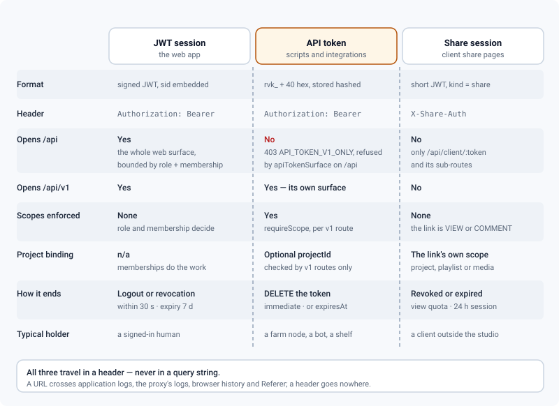

# Authentication & API access

*Every way to prove who you are — sessions, 2FA, SSO, API tokens, share links, webhooks — and exactly what each one opens.*

> Updated: 2026-08-23

Three credentials exist, and they are not interchangeable. A human gets a **JWT session**, a
machine gets an **API token**, a client outside the studio gets a **share session**. They
differ in what they open, in what bounds them, and in how they die.

| Credential | Header | For |
|------------|--------|-----|
| **JWT session** | `Authorization: Bearer <jwt>` | The web app — login, refresh, all of `/api` and `/api/v1` |
| **API token** | `Authorization: Bearer rvk_<40 hex>` | Scripts and integrations, on `/api/v1` |
| **Share session** | `X-Share-Auth: <jwt>` | The public client share pages, and nothing else |

All three travel in a **header, never in the query string**. A URL crosses application logs,
the reverse proxy's logs, browser history and the `Referer` header; a header goes nowhere.
The historical `?token=` fallback has been removed from the authentication middleware — the
HLS player sets its own `Authorization` header, the socket has its handshake, and `/metrics`
reads its own query.



Examples below assume:

```bash
export REVIEW="https://review.mystudio.com"
```

## JWT sessions

### Sign in

```bash
curl -s -X POST "$REVIEW/api/auth/login" \
  -H "Content-Type: application/json" \
  -d '{ "email": "nina@mystudio.com", "password": "•••••••••" }'
```

```json
{
  "token": "eyJhbGciOiJIUzI1NiIsInR5cCI6IkpXVCJ9…",
  "refreshToken": "eyJhbGciOiJIUzI1NiIsInR5cCI6IkpXVCJ9…",
  "user": {
    "id": 5, "email": "nina@mystudio.com", "username": "nina",
    "displayName": "Nina", "initials": "NB", "avatarUrl": "https://minio…",
    "jobTitle": "Compositor", "bio": null, "phone": null,
    "role": "ARTIST", "status": "AVAILABLE"
  }
}
```

That `user` object is one shared view: `POST /api/auth/login`, `POST /api/auth/2fa/verify`,
`POST /api/auth/invitation/:token` and `GET /api/auth/me` all return the same fields, so a
client has one shape to model. `displayName` follows username, then full name, then first
and last, then the email.

Every login creates a **revocable session**; its id (`sid`) is embedded in both tokens.
Access tokens live `JWT_EXPIRES_IN` (default `7d`), refresh tokens
`JWT_REFRESH_EXPIRES_IN` (default `30d`). The email is normalised before lookup, so
`Alice@Studio.com` reaches the account registered as `alice@studio.com`.

If the account has 2FA enabled the response is `{ "requires2fa": true, "tmpToken": "…" }`
instead — see [Two-factor authentication](#two-factor-authentication-totp).

| Status | Body | When |
|--------|------|------|
| 401 | `{ "error": "Invalid credentials", "code": "BAD_CREDENTIALS" }` | Wrong email or password, **or** a service account trying to sign in |
| 403 | `{ "error": "Password sign-in is off — use SSO", "code": "PASSWORD_LOGIN_DISABLED" }` | The studio is in SSO-only mode |
| 429 | `{ "error": "Trop de requêtes, réessayez plus tard." }` | More than 50 attempts / 15 min from one IP |

> [!NOTE]
> A wrong password and an unknown address take the same time to refuse: bcrypt is run
> against a throwaway hash when no account matches. Without it the "no such account"
> answer returned about 100 ms early — enough to enumerate a studio's addresses without
> ever guessing a password.

### Refresh

```bash
curl -s -X POST "$REVIEW/api/auth/refresh" \
  -H "Content-Type: application/json" \
  -d '{ "refreshToken": "eyJhbGciOi…" }'
```

```json
{ "token": "eyJhbGciOi…", "refreshToken": "eyJhbGciOi…" }
```

The session must still be active — revoked or expired gives `401 SESSION_REVOKED` — and the
call slides its expiry. The response carries **no `user`**: refresh is a token exchange, not
a re-login. A legacy refresh token minted before sessions existed is handed a session on the
way through, so nobody is logged out by the upgrade.

### Sessions, and revoking them

```bash
curl -s -H "Authorization: Bearer $JWT" "$REVIEW/api/auth/sessions"
```

```json
{
  "sessions": [
    {
      "id": "6f1c9b2e4a7d43f0b58c1e9a2d3f4c5b",
      "userAgent": "Mozilla/5.0 …",
      "ip": "10.0.0.14",
      "createdAt": "2026-08-19T08:02:11.004Z",
      "lastSeenAt": "2026-08-21T09:55:00.812Z",
      "current": true
    }
  ]
}
```

| Call | Who | Effect |
|------|-----|--------|
| `POST /api/auth/logout` | You | `204`. Revokes the current session; both tokens die with it |
| `DELETE /api/auth/sessions/:sid` | You | `204`. Revokes one of your sessions (the id is exactly 32 characters) |
| `DELETE /api/users/:id/sessions` | Administrator | Revokes **every** session of an account — the offboarding gesture |
| `DELETE /api/admin/sessions/:sid` | Administrator | Revokes one named session, studio-wide |

Revocation is enforced by the authentication middleware, which caches session state for at
most **30 s** — so a revoked token stops working within half a minute, not at its expiry.

### Registration and invitations

Open sign-up is **closed by default**: `POST /api/auth/register` answers
`403 REGISTRATION_DISABLED` unless `ALLOW_SELF_REGISTRATION=true`, and creates an `ARTIST`
when it is on. Passwords are 8–128 characters with at least one letter and one digit, hashed
with bcrypt (cost 12).

The normal path is an administrator invitation, activated on two public routes:

```bash
curl -s "$REVIEW/api/auth/invitation/$INVITE_TOKEN"          # preview shown on the activation page
curl -s -X POST "$REVIEW/api/auth/invitation/$INVITE_TOKEN" \
  -H "Content-Type: application/json" -d '{ "password": "chosen-pass-9" }'
```

The `POST` returns the same `{ token, refreshToken, user }` triple as a login — choosing
your password signs you in. Both routes share the 50 / 15 min limiter. Sending an invitation
needs `APP_URL` **and** a working SMTP configuration, otherwise the administrator is stopped
up front with `400 APP_URL_MISSING` or `400 SMTP_NOT_CONFIGURED`, and with
`400 SMTP_SEND_FAILED` if the relay refuses the message.

### Who am I

```bash
curl -s -H "Authorization: Bearer $JWT" "$REVIEW/api/auth/me"
```

```json
{ "user": { "id": 5, "email": "nina@mystudio.com", "displayName": "Nina", "role": "ARTIST", "…": "…", "twoFaEnabled": false } }
```

The same session-user view as a login, plus `twoFaEnabled`.

### Authentication failures

| Status | `code` | Cause |
|--------|--------|-------|
| 401 | `TOKEN_REQUIRED` | No `Authorization: Bearer` header at all |
| 403 | `TOKEN_INVALID` | Signature invalid, expired, or the wrong kind of token — a refresh, 2FA, share or OIDC-state token presented as an access token |
| 401 | `SESSION_REVOKED` | The session behind the token was revoked or has expired |
| 401 | `USER_GONE` | The account no longer exists |
| 403 | `API_TOKEN_INVALID` | API token unknown, revoked or past `expiresAt` |
| 403 | `SCOPE_WRITE_REQUIRED` | API token with no write scope at all, on a non-`GET`/`HEAD`/`OPTIONS` request |
| 403 | `SCOPE_REQUIRED` | API token missing the scope a v1 route demands |
| 403 | `TOKEN_PROJECT_SCOPE` | API token bound to one project, aimed at another |

Only an **access** token authenticates a request: the middleware whitelists tokens with no
`kind` and a numeric `id`, so a new kind of token added tomorrow is refused by default
rather than accepted by omission.

## Two-factor authentication (TOTP)

Enrolment, authenticated:

```bash
curl -s -X POST "$REVIEW/api/auth/2fa/setup" -H "Authorization: Bearer $JWT"
```

```json
{
  "secret": "JBSWY3DPEHPK3PXP",
  "otpauth": "otpauth://totp/Mystudio:nina@mystudio.com?secret=JBSWY3DPEHPK3PXP&issuer=Mystudio"
}
```

Render the `otpauth://` URI as a QR code, then confirm with a code from the app:

```bash
curl -s -X POST "$REVIEW/api/auth/2fa/enable" \
  -H "Authorization: Bearer $JWT" -H "Content-Type: application/json" \
  -d '{ "code": "492013" }'
```

```json
{
  "enabled": true,
  "backupCodes": ["3f9a1c4e-02b7d5a1-9c4e7f30-11aa62bd", "…"]
}
```

**Ten** one-time backup codes, each 128 random bits written in hexadecimal and cut into four
blocks of eight for copying, shown **once** and stored hashed. Calling `/setup` again while
2FA is on returns `400 TWOFA_ALREADY_ENABLED`; a wrong confirmation code returns
`401 TWOFA_BAD_CODE`.

Login with 2FA is a two-step exchange. `POST /api/auth/login` answers
`{ "requires2fa": true, "tmpToken": "…" }` — that token is valid **5 minutes** — then:

```bash
curl -s -X POST "$REVIEW/api/auth/2fa/verify" \
  -H "Content-Type: application/json" \
  -d '{ "tmpToken": "eyJhbGciOi…", "code": "492013" }'
```

Returns the normal `{ token, refreshToken, user }`. `code` accepts the TOTP **or** an unused
backup code, which is then consumed permanently. An expired `tmpToken` gives
`401 TWOFA_TOKEN_EXPIRED`, a bad code `401 TWOFA_BAD_CODE`, and this endpoint has its own
limiter: **15 attempts / 15 min per IP**.

`POST /api/auth/2fa/disable { password }` turns it off and answers `{ "enabled": false }`.
The TOTP secret is stored encrypted (AES-GCM, key `APP_ENCRYPTION_KEY` or derived from
`JWT_SECRET`); audit events cover `TWOFA_ENABLE`, `TWOFA_DISABLE`, `TWOFA_FAIL` and
`TWOFA_BACKUP_USED`.

> [!IMPORTANT]
> A TOTP code is accepted **once**. Verification consumes it, so an intercepted code cannot
> be replayed for the rest of its 30-second window plus tolerance — the refusal is
> indistinguishable from a wrong code. If a user genuinely mistypes and retries within the
> same window, they must wait for the next code.

## Single sign-on (OIDC)

When an administrator has configured it (*Admin → Studio → Identity (SSO)*), the login page
shows an SSO button.

| Route | Public | What it does |
|-------|--------|--------------|
| `GET /api/auth/oidc/status` | Yes | `{ enabled, label, logoUrl, passwordLogin }` — `passwordLogin` is the *effective* state, so the page never shows a form the server would refuse |
| `GET /api/auth/oidc/login` | Yes | Redirects to the provider (authorization code flow). `state` and `nonce` travel in a signed, `httpOnly`, `SameSite=Lax` cookie scoped to `/api/auth/oidc` and valid 10 minutes |
| `GET /api/auth/oidc/callback` | Yes | Exchanges the code, then signs you in |

The callback is strict on purpose: it requires a **verified email** from the provider
(`email_verified === true`), matches the account by that email, and creates one as `ARTIST`
only if auto-provisioning is enabled — otherwise it refuses rather than inventing an
account. If the matched account has 2FA on, it redirects into the same code step as a
password login. Tokens are handed to the SPA through the URL **fragment**
(`/login#sso=…&refresh=…`), which browsers never send to any server; failures come back as
`/login#ssoerr=…`.

SSO-only mode makes password sign-in answer `403 PASSWORD_LOGIN_DISABLED` — including
self-registration, so nobody can pre-book a colleague's address before their first OIDC
login.

## API tokens

Format: `rvk_` followed by 40 hexadecimal characters. Only the SHA-256 hash is stored, and
`lastUsedAt` is refreshed at most once per minute per token.

### Personal tokens

Created from the profile page, or directly. **Your current password is part of the request**:

```bash
curl -s -X POST "$REVIEW/api/auth/tokens" \
  -H "Authorization: Bearer $JWT" -H "Content-Type: application/json" \
  -d '{
        "name": "nuke-publish",
        "description": "Laptop publish shelf",
        "scopes": ["versions:write", "media:write"],
        "expiresInDays": 90,
        "projectId": 3,
        "currentPassword": "•••••••••"
      }'
```

`201 Created`:

```json
{
  "token": "rvk_0123456789abcdef0123456789abcdef01234567",
  "apiToken": {
    "id": 7, "name": "nuke-publish", "description": "Laptop publish shelf",
    "kind": "PERSONAL", "scopes": ["versions:write", "media:write"],
    "projectId": 3, "lastUsedAt": null,
    "expiresAt": "2026-11-19T09:14:02.311Z",
    "createdAt": "2026-08-21T09:14:02.311Z"
  }
}
```

The plaintext `token` is returned **once**.

| Field | Rule |
|-------|------|
| `name` | 1–80 characters, required |
| `description` | ≤ 300 characters |
| `scopes` | At least one entry; defaults to `["read"]`. An unknown scope is refused with `400 UNKNOWN_SCOPE`, naming the offender |
| `expiresInDays` | 1–3650. Omitted means no expiry |
| `projectId` | Optional binding. The project must exist and not be in the trash |
| `currentPassword` | **Required.** Missing or wrong gives `401 CURRENT_PASSWORD_REQUIRED` |

- `GET /api/auth/tokens` lists your active tokens — never the secret.
- `DELETE /api/auth/tokens/:id` revokes one (`204`, effective immediately).
- An API token **cannot create another token**: the request is refused with `400`.

> [!CAUTION]
> The password re-check is not ceremony. A token can live 3650 days and survives closing the
> tab, so one forged from a stolen access token turns a passing session theft into permanent
> access — which "sign out everywhere" does not even suspect. The password is the one thing
> the attacker does not have.

### Service tokens

`POST /api/admin/service-tokens` (administrator, session JWT only) issues a token backed by
a **service account**: a real `User` row flagged `isService`, which cannot log in — the login
route refuses it — and never appears in the directory. The detour through a real account is
deliberate: every write in the product references an author, and a token "with no user"
would mean nullable author columns and no audit trail.

| Field | Rule |
|-------|------|
| `role` | `SUPERVISOR`, `ARTIST` or `CLIENT`. **Never `ADMIN`** — a robot does not administer the studio. Default `ARTIST` |
| `projectId` | Optional. When set, the service account is made a member of that project, otherwise it would see nothing of the project it is meant to feed |
| `currentPassword` | Required, like a personal token. Missing or wrong gives `403 CURRENT_PASSWORD_REQUIRED` |

Reusing a name reuses the service account and may adjust its role. `DELETE
/api/admin/service-tokens/:id` revokes the token; the carrier account survives so its past
writes keep an author. See [API v1](v1-integration.md).

### Scopes

A scope is `domain:action`, and the catalogue lists **only what a route actually guards** —
a scope that protects nothing is worse than an absent one, because it gets ticked at
creation and read in documentation, promising a limit that does not exist. Nine domains,
seventeen scopes:

| Domain | Actions | Note |
|--------|---------|------|
| `projects` | `read` | Creating a project is not part of the integration API |
| `sequences`, `shots`, `assets` | `read`, `write` | The pipeline entities |
| `tasks`, `versions` | `read`, `write` | |
| `media` | `read`, `write` | Includes asking for a presigned URL |
| `comments` | `read`, `write` | |
| `events` | `read` | The journal is written by the server, never by a client |
| `admin` | — | Covers everything |

```bash
curl -s -H "Authorization: Bearer $JWT" "$REVIEW/api/auth/scopes"
```

```json
{
  "scopes": ["projects:read", "sequences:read", "sequences:write", "…", "admin"],
  "legacy": ["read", "write"]
}
```

Granting `x:write` implies `x:read`. Legacy tokens carrying `read` or `write` keep working
and are expanded on the fly — `read` to every `*:read`, `write` to every `*:read` plus every
declared `*:write`. A stored scope that is no longer in the catalogue (a `playlists:read`
from an earlier release) is ignored without invalidating the token, and without costing it
anything, since no route ever consulted it.

A scope never grants more than its bearer already has: role and project membership are
enforced first, and the scope only narrows what is left.

### Which surface a token opens

The design is that an API token opens `/api/v1` and nothing else. Scopes (`requireScope`)
and project binding (`assertTokenProject`) are posted route by route, and only v1 routes
post them; `/api` is not annotated per domain and cannot enforce either.

```bash
curl -s -H "Authorization: Bearer rvk_…" "$REVIEW/api/v1/projects"   # this is the way
```

> [!WARNING]
> The guard that would enforce this — `apiTokenSurface`, which answers
> `403 API_TOKEN_V1_ONLY` — exists and is unit-tested, but **`createApp()` never mounts
> it**. Today `curl -H "Authorization: Bearer rvk_…" "$REVIEW/api/projects"` succeeds, and
> so do `/api/media/:id/url` and `/api/admin/*`. Worse, a token bound to project 3 reads and
> writes **every** project as soon as it aims at `/api`, because the binding is only checked
> inside v1. Until the middleware is mounted, treat the restriction as a rule you keep, not
> one the server keeps for you: point every integration at `/api/v1`, and do not hand an
> `rvk_` token to code you have not read.

Everything an integration needs exists in v1: identity (`/api/v1/me`), accepted values and
the scope list (`/api/v1/schema`), reading files (`/api/v1/media/:id/url`), the event journal
(`/api/v1/events`). The public documentation endpoints (`/api/docs`, `/api/openapi.json`)
serve the same bytes to everyone and are reachable with any credential or none.

The coarse write gate applies wherever a token goes: an API token carrying no write scope at
all is refused with `403 SCOPE_WRITE_REQUIRED` on any non-`GET` method, before the route
runs.

## Share links (client access)

A supervisor creates a link with `POST /api/share`, and the client uses `/api/client/*`,
which is gated by the link token rather than a JWT.

```bash
curl -s -X POST "$REVIEW/api/share" \
  -H "Authorization: Bearer $JWT" -H "Content-Type: application/json" \
  -d '{
        "projectId": 3,
        "permission": "COMMENT",
        "label": "Client review — week 34",
        "password": "•••••",
        "maxViews": 20,
        "expiresInDays": 14,
        "scope": "MEDIA",
        "mediaIds": [128, 129, 130]
      }'
```

| Field | Values | Default |
|-------|--------|---------|
| `permission` | `VIEW`, `COMMENT` | `VIEW` |
| `scope` | `PROJECT`, `PLAYLIST` (+ `playlistId`), `VERSION` (+ `versionId`), `MEDIA` (+ `mediaIds`, up to 200) | `PROJECT` |
| `password` | 4–200 characters | none |
| `maxViews` | 1–1 000 000 | unlimited |
| `expiresInDays` | 1–3650 | never expires |
| `label` | 1–120 characters | none |

A scope that names no target is refused with `400 SCOPE_TARGET_MISSING`, and one naming a
playlist, version or media that belongs to another project with `400 SCOPE_TARGET_FOREIGN` —
a share link can never reach outside the project it was created in.

`GET /api/share?projectId=` lists a project's links, `GET /api/share/candidates?projectId=`
lists the published media a `MEDIA` scope may point at, `POST /api/share/:id/email` mails the
link to up to **10** recipients with an optional note (≤ 1000 characters), and
`DELETE /api/share/:id` revokes it.

On the client side:

```bash
# 1. open the link — emits the share session and consumes a view
curl -s "$REVIEW/api/client/$SHARE_TOKEN"

# 2. if the link is password-protected, exchange the password for that session
curl -s -X POST "$REVIEW/api/client/$SHARE_TOKEN/unlock" \
  -H "Content-Type: application/json" -d '{ "password": "•••" }'
# → { "shareAuth": "eyJhbGciOi…" }

# 3. every sub-route requires it
curl -s -H "X-Share-Auth: $SHARE_AUTH" "$REVIEW/api/client/$SHARE_TOKEN/media/128/url"
curl -s -H "X-Share-Auth: $SHARE_AUTH" "$REVIEW/api/client/$SHARE_TOKEN/media/128/comments"
```

A password-protected link with no session answers `{ "locked": true, studio }` and nothing
else — not even the project name. The share session is a short JWT (`kind: "share"`, 24 h)
bound to that one link, which is what stops a caller from skipping step 1 and dodging the
view counter or the password. Links only ever expose **published and ready** media, they are
revocable, and both `/api/share` and `/api/client` are limited to 300 requests / 15 min per
IP, with the unlock endpoint limited to 10 attempts / 15 min per IP **and per link**. See
[Sharing](../user-guide/sharing.md) and
[Secure distribution](../admin-guide/secure-distribution.md).

## Outgoing webhooks

Configured in *Admin → Communications → API & Webhooks*, or directly. Administrator only.

```bash
curl -s -X POST "$REVIEW/api/admin/webhooks" \
  -H "Authorization: Bearer $ADMIN_JWT" -H "Content-Type: application/json" \
  -d '{
        "url": "https://hooks.mystudio.com/review",
        "events": ["media.published", "review.decision", "task.status_changed"],
        "projectId": 3
      }'
```

`201 Created` — the HMAC `secret` is shown **once**:

```json
{
  "webhook": { "id": 2, "url": "https://hooks.mystudio.com/review",
               "events": ["media.published", "review.decision", "task.status_changed"],
               "active": true, "projectId": 3,
               "lastStatus": null, "lastError": null, "lastDeliveryAt": null,
               "failureStreak": 0, "createdAt": "2026-08-21T10:20:00.000Z" },
  "secret": "b41c…"
}
```

`projectId` is the field that makes a webhook givable: set it, and the hook receives that
project and nothing else — `null` (the default) makes it studio-wide, and a studio-wide
event with no project never reaches a project-bound hook. It is accepted on create and on
`PATCH`, and validated against an existing project.

### The ten events you can subscribe to

`events` must hold at least one name from the list below. It is deliberately shorter than
the type catalogue: eight names in `WEBHOOK_EVENTS` have **no emission point** in the code
(`project.created`, `project.updated`, `sequence.created`, `shot.created`, `shot.updated`,
`asset.created`, `media.uploaded`, `media.failed`) and are rejected by the Zod enum with a
`400`. A subscription that can never fire is worse than a missing event — it looks like a
wired alarm.

| Event | Fires when |
|-------|-----------|
| `media.published` | A media is published |
| `review.decision` | A review decision is recorded |
| `comment.created`, `comment.resolved` | A note is written, or resolved |
| `task.created`, `task.updated`, `task.status_changed`, `task.assigned` | The task lifecycle |
| `version.created`, `version.published` | The version lifecycle |

A private, loopback, link-local or non-HTTP target is refused up front with
`400 BAD_WEBHOOK_URL`, as is a bare hostname with no dot.

### What ReView sends

```
POST <your url>
Content-Type: application/json
User-Agent: ReView-Webhook/1.0
X-ReView-Event: media.published
X-ReView-Timestamp: 1784480000000
X-ReView-Delivery: 4821
X-ReView-Signature: sha256=<hex>

{ "id": 4821, "event": "media.published", "timestamp": 1784480000000, "data": { … } }
```

`id` and `X-ReView-Delivery` are the same delivery identifier — deduplicate on it, and use
it to find the row in the journal or to ask for a replay.

Verify the signature as `HMAC_SHA256(secret, timestamp + "." + rawBody)`, compared in
constant time, against the **raw** body, and reject a timestamp that is too old:

```python
import hmac, hashlib

def valid(secret: str, timestamp: str, raw_body: bytes, header: str) -> bool:
    expected = "sha256=" + hmac.new(
        secret.encode(), (timestamp + ".").encode() + raw_body, hashlib.sha256
    ).hexdigest()
    return hmac.compare_digest(expected, header)
```

### Retries, the journal, and replay


Delivery is a BullMQ job in the worker container, on the `webhooks` queue at concurrency 3:

- **5 attempts** per delivery, exponential backoff from 10 s;
- a **10 s** request timeout, and redirects are refused rather than followed — replaying a
  signed `POST` towards an unverified target is exactly the hole this closes;
- private, loopback and link-local targets are re-checked **after DNS resolution**, so a
  public name pointing at `127.0.0.1` or `169.254.169.254` is rejected at delivery time;
- the response body is read even on success, capped at 64 KB and stored as a 1000-character
  excerpt — a `200 OK` carrying an error body is the classic misconfigured relay;
- the last outcome is recorded on the webhook (`lastStatus`, `lastError`, `lastDeliveryAt`)
  and visible in the admin.

Every delivery opens a journal row **before** the first attempt, so a delivery that will
fail five times is visible in the first second rather than appearing — or not — at the end.

| Call | Answer | Use |
|------|--------|-----|
| `POST /api/admin/webhooks/:id/test` | `202 { queued: true, deliveryId }` | Queues a probe delivery, signed like any other. It does not send inline, so the id is what you follow |
| `GET /api/admin/webhooks/:id/deliveries?limit=1..100&before=<id>` | `{ deliveries, nextCursor }` | The journal, newest first (`limit` defaults to 25): event, status, attempts, HTTP status, response excerpt, error, `replayOfId` |
| `POST /api/admin/webhooks/:id/deliveries/:deliveryId/replay` | `202 { queued: true, deliveryId }` | Re-queues a lost delivery as a **new** row pointing at the old one. `400 WEBHOOK_INACTIVE` if the hook is disabled, `404` if the delivery is not its own |

After the fifth attempt a delivery is *exhausted* and the webhook's `failureStreak` goes up
by one. **Five exhausted deliveries in a row switch the webhook off** (`active: false`): a
dead endpoint stops being written to, and stays in the database, one checkbox away.
`PATCH { "active": true }` re-enables it and resets `failureStreak` to `0` — without that
reset it would disable itself again on the very next failure. Any successful delivery also
clears the streak.

> [!TIP]
> A consumer behind a firewall should not rely on push at all. Poll the journal instead:
> `GET /api/v1/events` walks the same facts by cursor, and misses nothing when your endpoint
> is unreachable. See [API v1](v1-integration.md).

## Media access log

Every media consultation — internal review or client share — is journaled, deduplicated per
30 minutes, and browsable in *Admin → Maintenance → Media access*. It is the record that
answers "who saw this cut, and when", including for people who never had an account.

## Related pages

- [API overview](overview.md) — surfaces, conventions, errors, rate limits, realtime
- [API v1 — pipeline integration](v1-integration.md) — scopes in practice, service tokens,
  the event journal
- [Python client & DCC integrations](python-client.md) — the client shipped in `clients/`
- [Identity & API (admin)](../admin-guide/identity-and-api.md) — the same settings from the
  administration screens
- [Account security (user)](../user-guide/account-security.md) — 2FA and sessions for a
  reader who is not an integrator
- [Security model](../infrastructure/security.md)
