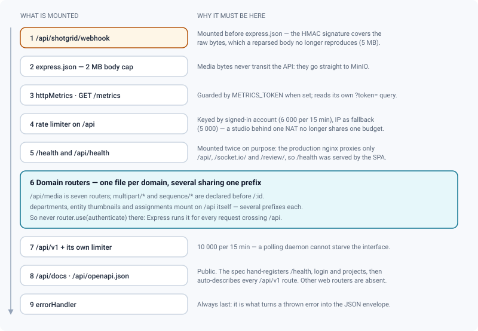
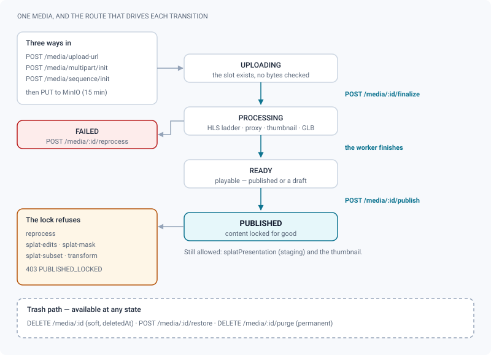

# API domains

*A route map of the web API: which router owns which prefix, and why the mount order explains the surprises.*

> Updated: 2026-08-23

`/api` is the surface the web interface consumes. It is assembled in
`backend/src/app.ts` from one router per domain (`backend/src/routes/*.routes.ts`), and
this page is the map of that assembly: what lives behind each prefix, which prefixes are
shared by several routers, and which paths are declared before `/:id` so that a literal
segment is not read as an identifier.

It is a map, not a reference: it names endpoints and says what they are for. Request and
response shapes, field-by-field, live in the source of each router and — for `/api/v1`
only — in the interactive reference. Conventions shared by every route (envelope,
pagination, error codes, rate limits) are on the [API overview](overview.md); the stable
integration contract is [API v1 — pipeline integration](v1-integration.md).

> [!IMPORTANT]
> `/api/docs` does **not** describe the routers listed on this page. The OpenAPI document
> hand-registers five operations (`GET /health`, `POST /api/auth/login`, `GET` and
> `POST /api/projects`, `GET /api/projects/{projectId}`) and then auto-generates every
> `/api/v1` route from its own Zod schemas. Nothing else on this page appears in the spec,
> so `/api/docs` cannot supply its parameter detail.

## Mount order, and the surprises it explains

Express tries handlers in the order they were mounted. Several oddities of this API are
not oddities at all once that order is on the page.

Three consequences worth knowing before reading the tables below.

- **Literal sub-paths come before `/:id`.** `/api/tasks/board`, `/api/comments/export`,
  `/api/media/multipart/init`, `/api/media/sequence/init` and `/api/episodes/settings` are
  all declared ahead of the `/:id` route of their own router. Reverse the order and Express
  captures `board` as a task id, then refuses it in validation.
- **Several routers share one prefix.** `/api/media` is served by **seven** routers,
  `/api/auth` by four (`auth`, `auth/2fa`, `auth/oidc`, `auth-security`), `/api/studio` by
  three, `/api/projects` by three, `/api/admin` by two, `/api/shotgrid` by four.
- **Three routers are mounted on `/api` itself** — departments, entity thumbnails and
  assignments — because each carries several prefixes (`/api/projects/:id/departments`,
  `/api/shots/:id/thumbnail`…). Such a router must **never** call `router.use(authenticate)`:
  Express would run it for every request crossing the `/api` mount point, public client
  share routes included. That exact mistake once made `/api/client/:token` answer `401`.
  Authentication goes on each route instead.

## Outside `/api`

Two families answer outside the `/api` prefix, and one of them is mounted twice.

| Route | What it answers |
|-------|-----------------|
| `GET /health`, `GET /health/live` | Liveness. No I/O, never fails on a dependency: `{ "status": "ok", "version", "commit", "uptimeSec" }` |
| `GET /health/ready` | Readiness. Probes Postgres, Redis and MinIO under a 2 s deadline each, result cached 5 s; `200 ready` or `503 degraded` with a `checks` breakdown |
| `GET /api/health`, `GET /api/health/ready` | The same router, mounted a second time |
| `GET /api/version` | `{ version, commit, builtAt, node, source }` — public, and the AGPL §13 source offer |
| `GET /metrics` | Prometheus text format, guarded by `METRICS_TOKEN` when set (`?token=` or `Authorization`) |

The double mount is deliberate. The production nginx proxies only `/api/`, `/socket.io/`
and `/review/` to the backend, so `GET /health` was being answered by the SPA — a `200` of
HTML that said "everything is fine" whatever the API was doing — while `/api/health` did
not exist at all. The container's own probe still calls `/health` directly.

> [!TIP]
> Point an external monitor at `/api/health/ready`, not at `/health`. Liveness is the
> question "is this process alive", and restarting a container because Postgres fell over
> only adds an outage to an outage.

## Authentication and identity

| Prefix | Domain |
|--------|--------|
| `/api/setup` | First-run studio and admin creation, empty database only: `GET /status`, `POST /`. Rate-limited to 10 per 15 min per IP |
| `/api/auth` | Login, refresh, logout, registration, invitation activation, current user |
| `/api/auth/2fa` | TOTP: `setup`, `enable`, `disable`, `verify` |
| `/api/auth/oidc` | SSO: `status`, `login`, `callback` |
| `/api/auth/sessions`, `/api/auth/tokens`, `/api/auth/scopes` | Active sessions, personal API tokens, and the grantable scope catalogue (`{ scopes, legacy }`) |
| `/api/users` | Directory, member sheet, avatar, preferences, departments; `DELETE /:id/sessions` (admin) |
| `/api/unsubscribe` | Public unsubscribe endpoint for recurring mail — called by mail clients without a session |

Full reference, including the refusal codes and the share-link session:
[Authentication & API access](authentication.md).

## Studio and pipeline

| Prefix | Domain |
|--------|--------|
| `/api/studio` | Studio settings, appearance and branding, SMTP configuration |
| `/api/studio/hdris` | HDRI library |
| `/api/studio/ocio` | OCIO configurations |
| `/api/projects` | Projects CRUD, membership, settings; plus `GET /usage`, `GET /:projectId/usage`, `POST /:projectId/duplicate`, `POST /:projectId/import-csv`, `GET /:projectId/export-csv` |
| `/api/projects/:projectId/stats`, `/production`, `/schedule` | Production overview: statistics, sequences × departments and what is late, calendar and Gantt |
| `/api/episodes` | The optional **Episode** level — see below |
| `/api/sequences`, `/api/shots` | Shot hierarchy, per-level pipeline overrides, `GET /shots/:id/tree`, permalink `GET /shots/:id/latest` |
| `/api/assets` | Assets CRUD |
| `/api/{sequences\|shots\|assets}/:id/thumbnail` | Entity thumbnail: `POST …/presign`, then `PUT` the key (managers) |
| `/api/{projects\|sequences\|shots\|assets\|users}/…/departments` | Departments an entity goes through |
| `/api/departments` | Department reference — studio-wide, or per project; `PUT /departments/order` |
| `/api/tasks` | Tasks CRUD, statuses, assignment; `GET /tasks/board?projectId=` returns a whole kanban in one request |
| `/api/versions` | Versions, publication (publish lock), `POST /:id/decision`, `GET /:id/decisions`, restore and purge |
| `/api/review-statuses` | Studio review statuses (approval circuit) |
| `/api/pipeline-statuses` | Task and shot pipeline statuses |
| `/api/context` | `GET /:entity/:id` — breadcrumb and surrounding context for any entity |

### The Episode level

A series is organised in episodes; a feature is not. The level therefore exists per project
and is **off by default**, and the router carries the refusal itself rather than leaving
each screen to guess.

| Route | Purpose |
|-------|---------|
| `GET /api/episodes/settings?projectId=` | Is the level on for this project? Readable by any member — screens need it to decide what to show |
| `PUT /api/episodes/settings` | Turn it on or off (admin, supervisor). Turning it off destroys nothing: episodes and their sequence attachments survive and come back intact |
| `GET /api/episodes?projectId=` | Paginated list |
| `POST /api/episodes`, `POST /api/episodes/bulk` | Create one, or up to 200 at once |
| `POST /api/episodes/reorder` | Reorder, by a list of ids |
| `POST /api/episodes/assign` | Attach sequences to an episode — `episodeId: null` detaches them |
| `GET /api/episodes/:id`, `PATCH /api/episodes/:id` | Detail, then name, code, order, description, pipeline status |
| `DELETE /api/episodes/:id`, `POST /:id/restore`, `DELETE /:id/purge` | The shared trash routes, as for sequences, shots and assets |

While the level is off, every route except `/settings` answers
`409 { "code": "EPISODES_DISABLED" }`. Once it is on, `/api/shots` accepts an
`?episodeId=` filter, where the literal `none` means "shots outside any episode" — the
same convention as `?sequenceId=none`.

## Media

`/api/media` is served by **seven** routers sharing the prefix. They are listed here by the
paths they own, in the order Express tries them.

| Route | Domain |
|-------|--------|
| `POST /api/media/upload-url` | Simple presigned PUT upload, for small files |
| `POST /api/media/multipart/{init,:id/parts,:id/complete,:id/abort}` | Resumable multipart upload (16 MiB parts), deduplicated by content hash |
| `POST /api/media/sequence/{init,:id/urls,:id/complete}`, `GET /api/media/sequence/:id/frames` | Image sequences: N files become **one** media — see below |
| `POST /api/media/:id/finalize` | Close an upload: magic-byte check, size, quotas, enqueue processing |
| `GET /api/media`, `/reviews`, `/drafts`, `/:id`, `/:id/url` | Listing, review feed, drafts, detail, presigned read URL |
| `POST /api/media/:id/publish`, `/reprocess`, `/thumbnail`, `/auto-thumbnail` | Publish, retry a failed job, set or compute a thumbnail |
| `GET /api/media/:id/hls/:file` | HLS manifests and segments |
| `DELETE /api/media/:id`, `POST /:id/restore`, `DELETE /:id/purge` | Trash, restore, permanent purge |
| `POST /api/media/:id/trim` | Non-destructive video trim, before publication |
| `…/:id/splat-edits`, `/splat-mask`, `/splat-subset`, `/splat-presentation` | Splat edits, masks, subsets and staging |
| `…/:id/usd/recompose`, `/usd/override` | USD variant recomposition and the ReView override layer |
| `…/:id/markers` (+ `/:markerId`) | Shared timeline markers |
| `POST /api/media/:id/references`, `DELETE …/references/:refId` | Review reference images |

There is **no `/api/media-reference` prefix**: reference images live under
`/api/media/:id/references`. The file name of a router is not a URL.

### Image sequences

An EXR or DPX delivery is thousands of files that must become one reviewable media. That
cannot ride the two-call publish flow, so it has its own family, and it is the only route
that accepts a `%04d`-style pattern.

| Call | What it does |
|------|--------------|
| `POST /api/media/sequence/init` | Opens — or resumes — a sequence: `versionId`, `pattern`, the full `frames` list (2 to 10 000 entries, each name ≤ 200 characters, with its size), optional `framerate` |
| `POST /api/media/sequence/:id/urls` | Presigned PUT URLs for a batch of frame names |
| `POST /api/media/sequence/:id/complete` | Checks which frames arrived, writes the manifest, enqueues the assembly (proxy, HLS ladder, thumbnail, hover sprite) |
| `GET /api/media/sequence/:id/frames` | The original delivery back, frame by frame, as presigned URLs |
| `POST /api/media/multipart/:id/abort` | Cancels the upload — this one route aborts a multipart, a simple PUT **and** a sequence |

> [!NOTE]
> `POST /api/v1/publish` refuses a sequence pattern up front with
> `400 SEQUENCE_NOT_SUPPORTED_HERE`, and there is no v1 equivalent of this family. A DCC
> integration that renders EXR therefore publishes the encoded movie its pipeline produces,
> or drives these web routes with a session token. See
> [Image sequences](../user-guide/image-sequences.md).

## Collaboration and sharing

| Prefix | Domain |
|--------|--------|
| `/api/comments` | Comments and annotations: threads, resolution, mentions, reactions, voice-note attachments (`POST /attachments/presign`), comment to task (`POST /:id/task`), and `POST /:id/share`, which pushes a note written on an auto-cut timeline into the shot's own review |
| `/api/comments/export` | Notes out: `?scope=media\|version\|shot\|playlist\|timeline&id=&format=csv\|edl\|otio\|sheet`. Declared **before** `/:id` precisely because `export` is not an id; rate-limited to 20 per minute per identity |
| `/api/chat` | Internal messaging: `conversations`, messages, members, `unread` |
| `/api/boards` | Excalidraw boards, per project or asset |
| `/api/playlists` | Dailies playlists — ordered versions per project, chained playback; `GET /playlists/candidates?projectId=` searches the versions to add |
| `/api/live` | Live review sessions in progress, per project (the LIVE badges) |
| `/api/timelines` | Auto-cut timelines: snapshots, comments, export |
| `/api/watch` | Notification subscriptions: watch or unwatch a shot, an asset or a version |
| `/api/notifications`, `/api/push` | Notifications; Web Push subscription (`GET /push/key`) |
| `/api/announcements` | Studio announcements |
| `/api/favorites` | Favorites |
| `/api/search` | Multi-entity search (Ctrl+K) |
| `/api/dashboard` | Home dashboard aggregates |
| `/api/bulk` | Bulk operations on a multi-selection |
| `/api/share` | Share links: create, list, revoke (supervisor and above) |
| `/api/client` | Public client access by share token: `GET /:token`, `POST /:token/unlock`, `GET /:token/media/:id/url`, media comments |

`/api/share` and `/api/client` share a dedicated limiter of **300 requests per 15 min**:
they are the only prefixes reachable without an account.

## Administration

| Prefix | Domain |
|--------|--------|
| `/api/admin` | `project-defaults`, `transcode`, `burnin`, `derived-purge` (+ `/run`), `oidc` (+ `oidc/logo/presign`), `api-tokens` (+ `/:id`), `media-access`, `dashboard`, `stats`, `system`, `trash`, `jobs/retry` |
| `/api/admin` (content explorer) | `users/:id`, `projects`, `projects/:id`, `versions`, `comments`, `storage`, `DELETE /sessions/:sid` |
| `/api/admin/webhooks` | Outgoing webhooks: list, create, update, delete, `POST /:id/test`, plus the delivery journal `GET /:id/deliveries?limit=&before=` and `POST /:id/deliveries/:deliveryId/replay` |
| `/api/admin/service-tokens` | Machine identities for the v1 API (admin only) |
| `/api/admin/jobs` | BullMQ dashboard: `GET /`, `POST /:queue/:id/retry`, `POST /:queue/clean-failed` — `queue` is one of `media`, `storage-cleanup`, `webhooks` |

> [!WARNING]
> Replaying a delivery towards a **disabled** webhook is refused with
> `400 WEBHOOK_INACTIVE` rather than queued: the delivery worker stops on an inactive hook,
> so the replayed row would wait forever. Re-enable the webhook first. Subscriptions are
> also validated against the ten events that are actually published — see
> [Identity, API & audit](../admin-guide/identity-and-api.md).

## Integrations

| Prefix | Domain |
|--------|--------|
| `/api/shotgrid` | ShotGrid connection settings, sync, entity mapping, crew — see [ShotGrid integration](../admin-guide/shotgrid-integration.md) |
| `/api/shotgrid/webhook` | ShotGrid webhook receiver. Mounted **before** the JSON body parser, with a 5 MB raw limit: the HMAC signature covers the bytes as received |
| `/api/v1` | The stable pipeline integration surface — see [API v1 — pipeline integration](v1-integration.md). Its own rate-limit budget of 10 000 per 15 min |
| `/api/docs`, `/api/openapi.json` | The interactive reference and its OpenAPI 3.0 document, both public in read |

> [!CAUTION]
> An API token (`rvk_…`) is **not** currently confined to `/api/v1`. The middleware that
> was written for it (`apiTokenSurface`, with its own unit tests) is not mounted in
> `createApp()`, so `authenticate` accepts an `rvk_` token on any prefix in this page's
> tables — where neither the fine-grained scopes nor the project binding are consulted.
> Until it is mounted, treat an API token as carrying the **full power of its bearer over
> every project they can see**: issue it as a service token with a non-`ADMIN` role, grant
> the minimum scopes, and set an expiry.

## Related pages

- [API overview](overview.md) — envelope, pagination, error codes, rate limits
- [Authentication & API access](authentication.md) — sessions, 2FA, SSO, tokens, webhooks
- [API v1 — pipeline integration](v1-integration.md) — the stable surface for tools
- [Python client & DCC integrations](python-client.md) — the client shipped in `clients/`
- [Monitoring & operations](../infrastructure/monitoring.md) — what to probe, and with what
