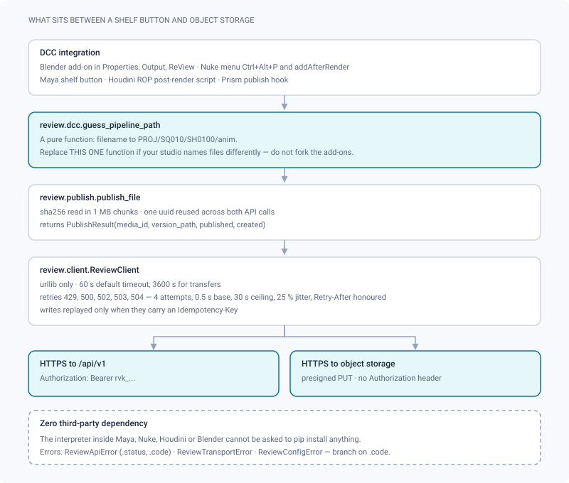
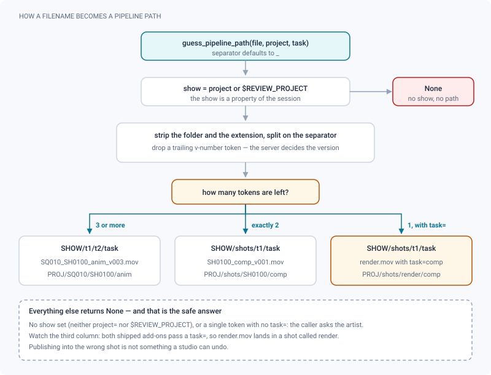

# Python client & DCC integrations

*The stdlib-only Python client and its Blender and Nuke add-ons: install, publish, read back, name files.*

> Updated: 2026-08-23

The repository ships a client for the [v1 API](v1-integration.md) in
[`clients/python/`](../../clients/python/README.md), and two thin integrations built on it
in [`clients/dcc/`](../../clients/dcc/). They are AGPL-3.0-or-later like the rest of
ReView, and depend on **nothing outside the Python standard library** — a farm node or a
DCC interpreter cannot be asked to `pip install` anything.

## Install on a workstation

Put the folder on `PYTHONPATH` and set the studio environment; a launcher usually does
both:

```bash
export PYTHONPATH="/mnt/pipeline/ReView-app/clients/python:$PYTHONPATH"
export REVIEW_URL="https://review.mystudio.com"
export REVIEW_TOKEN="rvk_0123456789abcdef0123456789abcdef01234567"
export REVIEW_PROJECT="PROJ"          # used to guess pipeline paths from filenames

python -m review whoami
# svc-farm-publisher@service.review.invalid (ARTIST) via api_token
```

Where a package *can* be installed, `pip install -e clients/python` also provides a
`review` command (Python ≥ 3.10). Issue the token as a **service token bound to the
project** — see [Authentication & API access](authentication.md#api-tokens). The service
account's address is derived from the token name: `farm-publisher` becomes
`svc-farm-publisher@…`, which is what `whoami` prints back.

> [!CAUTION]
> Two guarantees usually claimed for such a token — "it cannot touch another show" and "it
> opens `/api/v1` only" — currently rest on a middleware (`apiTokenSurface`) that is
> written and unit-tested but **not mounted** in the backend. Inside `/api/v1` the project
> binding is enforced on every resolved project; on `/api` it is not consulted at all. So
> deploy the token as if it carried its bearer's full reach: non-`ADMIN` role, minimum
> scopes, an expiry date, and a rotation plan.

## What sits between a shelf button and the API

Five layers, and only the second one is meant to be replaced by a studio.



Nothing above the client knows about HTTP, and nothing below it knows about Blender. That
is why the add-ons are fifteen lines each: a studio that names its files differently
replaces `guess_pipeline_path`, not the add-ons.

## Publish and read from Python

```python
from review import ReviewClient

review = ReviewClient()                       # reads REVIEW_URL / REVIEW_TOKEN

result = review.publish(
    "PROJ/SQ010/SH0100/anim",
    "/renders/PROJ/SQ010/SH0100/SH0100_anim_v001.mov",
    start_frame=1001,
    end_frame=1096,
)
print(result.version_path, result.media["status"])
# proj/SQ010/SH0100/anim/V01 PROCESSING

answer = review.latest("PROJ/SQ010/SH0100", department="comp")
plate = answer["version"]["media"][0]
review.download(plate["id"], "/tmp/" + plate["filename"])   # signs its own URL, streams
```

| Call | What it does |
|---|---|
| `publish(path, file, …)` | The two API calls and the transfer, one idempotency key, streamed upload |
| `latest(path \| task_id=…, published=, urls=, department=, expires_in=)` | The version a viewer would open |
| `media_url(id, variant="source"\|"proxy"\|"thumbnail", expires_in=)` | A presigned URL |
| `download(id, destination, variant=)` | Streams a media to disk, 1 MB at a time |
| `resolve(path)` | Pipeline path → entities |
| `me()`, `schema()` | Token powers, accepted values |
| `events(since=, limit=, project=, events=)` | Event journal, by cursor |
| `request(method, path, body=, params=, headers=)` | The escape hatch: any v1 endpoint, with the retry and error handling |

Everything is retried on `429` and `5xx` with exponential backoff and jitter, `Retry-After`
honoured. Writes are replayed **only** when they carry an `Idempotency-Key` — which
`publish()` does, so a timeout never opens a second version. Failures raise
`ReviewApiError` (with the stable `.code`, plus `.status`, `.payload` and `.is_retryable`),
`ReviewTransportError` or `ReviewConfigError`, all sharing the base `ReviewError`; branch
on `.code`, never on the message.

### Everything `publish()` accepts

`publish()` forwards to `review.publish.publish_file`, and returns a `PublishResult` with
`media_id`, `media`, `version`, `published`, `created`, `idempotency_key` and the
`version_path` property.

| Option | Default | What it is for |
|--------|---------|----------------|
| `version_name` | computed | Impose `V07` instead of letting the server pick the next name |
| `reuse_version` | `False` | Attach to an existing version of that name instead of failing |
| `kind` | inferred | `VIDEO`, `IMAGE`, `MODEL_3D`, `SPLAT` — the extension is still checked against it |
| `content_type` | per kind | Override the MIME type sent with the presigned PUT |
| `publish` | `True` | `False` uploads without exposing the media — a nightly that publishes later |
| `submit_for_review` | `False` | Move the version to `REVIEW` without publishing it |
| `create_missing` | `True` | `False` fails instead of creating sequence, shot and task |
| `start_frame`, `end_frame`, `shot_name` | — | Applied **only when the shot is created** |
| `usd` | — | `{"variants": {...}, "purpose": "render"}` — the selection that saves a second full Blender conversion |
| `content_hash` | `True` | Turn off for a very large file on a slow disk, at the cost of the corruption check |
| `idempotency_key` | a fresh uuid | For a caller that owns its own key, e.g. a farm scheduler that retries jobs itself |

### Tuning the client

`ReviewClient(base_url=None, token=None, *, timeout=60.0, retry=None, opener=None, sleep=…, rand=…)`.

| Knob | Default | Note |
|------|---------|------|
| `timeout` | `60.0` s | API calls only. Transfers use their own `UPLOAD_TIMEOUT` of `3600.0` s |
| `retry` | `RetryPolicy()` | `attempts=4`, `backoff=0.5` s, `max_sleep=30.0` s, `jitter=0.25` |
| `opener`, `sleep`, `rand` | real ones | Injection points, so the suite runs without a socket and without waiting |

The jitter is what un-synchronises a farm: fifty nodes that all back off by exactly 0.5 s
come back at exactly the same moment. `Retry-After` wins over the computed delay when the
server sends one in a numeric form; an HTTP-date falls back to the exponential backoff.

Uploads re-open the file on **every** attempt — a spent file handle uploads nothing — and
carry no `Authorization` header, because object storage refuses a request that presents two
authentication mechanisms.

## The `review` command line

A studio launcher wires these four subcommands, not the Python API.

| Command | Arguments and flags |
|---------|---------------------|
| `review publish <path> <file>` | `--version-name` · `--kind VIDEO\|IMAGE\|MODEL_3D\|SPLAT` · `--no-publish` · `--submit-for-review` · `--strict-path` (fail instead of creating structure) · `--start-frame` / `--end-frame` · `--no-hash` |
| `review latest <path>` | `--drafts` · `--department` · `--urls` · `--download DIR` |
| `review resolve <path>` | — |
| `review whoami` | — |

Global flags: `--url` and `--token` (default `$REVIEW_URL` / `$REVIEW_TOKEN`), and `--json`,
which prints the raw answer instead of the one-line human form.

```bash
review publish PROJ/SQ010/SH0100/anim /renders/SH0100_anim_v001.mov
# published proj/SQ010/SH0100/anim/V01 (PROCESSING)

review latest PROJ/SQ010/SH0100 --department comp
# proj/SQ010/SH0100/comp/V03: SH0100_comp_v003.mov

review latest PROJ/SQ010/SH0100 --download /tmp
# /tmp/SH0100_comp_v003.mov

review whoami --json
# { "user": {…}, "auth": { "kind": "api_token", "tokenId": 12, "scopes": [...], "projectId": 3 }, … }
```

`--download` deliberately does **not** ask for URLs up front: it signs each one media by
media, at the moment it fetches it. A URL minted before a forty-gigabyte transfer would
expire halfway through.

| Exit code | Meaning |
|-----------|---------|
| `0` | Success |
| `1` | The API refused, or nothing answered — `status code: message` on stderr |
| `2` | The workstation is not configured (no URL, no token) |

> [!TIP]
> A post-render script should branch on the exit code, and treat `2` as "tell the artist"
> rather than "retry": there is nothing transient about a missing `REVIEW_TOKEN`. The
> console encoding is handled for you — a ReView message carrying French quotation marks
> will not crash the publish on a cp1252 Windows console.

## Filenames become pipeline paths

`review.dcc.guess_pipeline_path` implements one convention, and only one. It is a pure
function, unit-tested away from `bpy` and `nuke`, and it is the single thing a studio with a
different naming scheme should replace.



```python
guess_pipeline_path(filepath, *, project=None, task=None, separator="_")
```

| Filename | `task=` | Guessed path |
|---|---|---|
| `SQ010_SH0100_anim_v003.mov` | — | `PROJ/SQ010/SH0100/anim` |
| `SQ010_SH0100_anim_v003.mov` | `comp` | `PROJ/SQ010/SH0100/comp` — the argument overrides the third token |
| `SH0100_comp_v001.mov` | — | `PROJ/shots/SH0100/comp` (a shot with no sequence) |
| `render.mov` | — | `None` — too little said, ask the artist |
| `render.mov` | `comp` | `PROJ/shots/render/comp` — **a shot literally called `render`** |

`PROJ` comes from `$REVIEW_PROJECT` (or the `project=` argument): the show is a property of
the session, not of the filename. Without it the answer is always `None`. A trailing
`_v003` is dropped — the version number is decided by the server. The separator is a
parameter (`separator="-"`).

> [!WARNING]
> The last row is the one to watch. Both shipped add-ons pass a `task=` (`anim` for
> Blender, `comp` for Nuke), so a single-token filename does **not** return `None` for them:
> a Nuke Write left at its default `render.mov` publishes into a brand-new shot called
> `render`. Publishing into the wrong shot is not something a studio can undo, so either
> fill the `review_path` knob or make the function stricter for your naming scheme.

## Blender — a "Publish to ReView" button

Full add-on: [`clients/dcc/blender_review_publish.py`](../../clients/dcc/blender_review_publish.py).
Install it with Edit, Preferences, Add-ons, Install…; the panel then sits in Properties,
Output, ReView. It adds two scene properties:

| Field | Empty means |
|-------|-------------|
| **Path** (`scene.review_path`) | Guess from the `.blend` name with `task="anim"`; the panel shows an error line when that guess is impossible |
| **File** (`scene.review_file`) | Publish the movie of the render output — `scene.render.frame_path(frame=scene.frame_start)` |

The frame range is taken from the scene (`frame_start`, `frame_end`) and sent as the shot
framing. The core is short enough that a studio wanting a different trigger — a handler on
`render_complete`, a shelf script — can start from this:

```python
# Blender 4.2+ — Text Editor ▸ Run Script, or paste into an add-on operator.
import bpy

from review import ReviewClient, ReviewError
from review.dcc import guess_pipeline_path


class REVIEW_OT_publish(bpy.types.Operator):
    """Send the rendered movie to ReView"""

    bl_idname = "review.publish"
    bl_label = "Publish to ReView"

    def execute(self, context):
        scene = context.scene
        # SQ010_SH0100_anim_v003.blend → PROJ/SQ010/SH0100/anim (PROJ from $REVIEW_PROJECT)
        path = guess_pipeline_path(bpy.data.filepath, task="anim")
        movie = bpy.path.abspath(scene.render.frame_path(frame=scene.frame_start))
        if not path:
            self.report({"ERROR"}, "Set REVIEW_PROJECT, or type the pipeline path")
            return {"CANCELLED"}
        try:
            result = ReviewClient().publish(
                path, movie, start_frame=scene.frame_start, end_frame=scene.frame_end
            )
        except ReviewError as exc:
            self.report({"ERROR"}, str(exc))
            return {"CANCELLED"}
        self.report({"INFO"}, f"Published {result.version_path}")
        return {"FINISHED"}


bpy.utils.register_class(REVIEW_OT_publish)
# bpy.ops.review.publish()   ← what the panel button calls
```

Blender writes a single file only when the output format is a movie (FFmpeg video). For an
image-sequence output, `frame_path()` returns one frame, not the delivery — publish the
encoded movie your pipeline produces afterwards, or send the sequence through the web API
(see [What you can publish](#what-you-can-publish-and-what-you-cannot)).

## Nuke — publish a Write node, by hand or after every render

Full integration: [`clients/dcc/nuke_review_publish.py`](../../clients/dcc/nuke_review_publish.py).
Drop it in a folder listed in `NUKE_PATH` and add `import nuke_review_publish` to your
`menu.py`. Importing it registers everything:

| Surface | What it does |
|---------|--------------|
| ReView ▸ **Publish selected Write** (`Ctrl+Alt+P`) | Adds the knobs if needed, then publishes each selected Write |
| ReView ▸ **Add ReView knobs** | Adds the two knobs without publishing |
| `review_path` knob | The pipeline path; empty means guess from the rendered filename with `task="comp"` |
| `review_auto` knob | Off by default. When ticked, the `afterRender` hook publishes that Write at the end of every render |

The `afterRender` hook is registered for every `Write` node but stays silent unless
`review_auto` is ticked, and it reports to the Nuke log rather than a dialog — a modal box
on a farm node would block it until the job times out.

```python
# menu.py — the minimal version, if you prefer to write your own.
import os

import nuke

from review import ReviewClient, ReviewError
from review.dcc import guess_pipeline_path


def publish_write():
    node = nuke.thisNode() if nuke.thisNode() else nuke.selectedNode()
    rendered = nuke.filename(node, nuke.REPLACE)
    # SQ010_SH0100_comp_v003.mov → PROJ/SQ010/SH0100/comp
    path = guess_pipeline_path(rendered or "", task="comp")
    if not path or not os.path.isfile(rendered):
        nuke.tprint("ReView: nothing to publish for %s" % node.name())
        return
    try:
        result = ReviewClient().publish(
            path, rendered, start_frame=int(node.firstFrame()), end_frame=int(node.lastFrame())
        )
    except ReviewError as exc:
        nuke.tprint("ReView: %s" % exc)
        return
    nuke.tprint("ReView: published %s" % result.version_path)


nuke.menu("Nuke").addCommand("ReView/Publish this Write", publish_write, "ctrl+alt+p")
nuke.addAfterRender(publish_write, nodeClass="Write")   # every render, every Write
```

`nuke.addAfterRender` fires on the machine that renders, farm nodes included — which is
exactly what you want, and why the token must be a service token rather than an artist's.
Drop the last line if you only want the menu command.

## Maya, Houdini, Prism

The same three lines fit anywhere a Python interpreter runs:

```python
from review import ReviewClient
ReviewClient().publish("PROJ/SQ010/SH0100/anim", playblast_path, start_frame=1001, end_frame=1096)
```

- **Maya** — a shelf button that playblasts to a temporary movie, then publishes it.
- **Houdini** — a post-render script on the ROP: `hou.node(...).parm("picture").eval()`
  gives the file, the ROP frame range gives the frames.
- **Prism or another pipeline manager** — call it from the state manager's publish hook;
  use `create_missing=False` if the manager owns the hierarchy and a missing shot must fail
  loudly rather than be created.

## What you can publish, and what you cannot

ReView validates file headers, not just extensions, and it does so at step 1 — before you
transfer anything. The accepted list is wider than most pipelines assume:

| Kind | Extensions |
|------|------------|
| `VIDEO` | `mp4` `m4v` `mov` `mkv` `webm` `avi` `mxf` `ts` `m2ts` `mts` |
| `IMAGE` | `jpg` `jpeg` `png` `webp` `gif` `bmp` `exr` `dpx` `tif` `tiff` `tga` |
| `MODEL_3D` | `glb` `gltf` `fbx` `obj` `usd` `usda` `usdc` `usdz` `dae` `stl` `zip` |
| `SPLAT` | `ply` `splat` `spz` `ksplat` `sog` `sogs` |

Broadcast masters in MXF, AVI captures and MPEG-TS are accepted as they are: re-encoding
them before publishing costs an hour and a generation of quality for nothing. `.abc` is
**not** in the 3D list — `publish("…", "cam.abc")` raises `ReviewApiError` with
`code="KIND_UNKNOWN"`.

**Image sequences do not go through this client.** Passing a `%04d`-style filename to
`publish()` is refused up front with `ReviewApiError(code="SEQUENCE_NOT_SUPPORTED_HERE")`,
because a sequence is N files that must become **one** media: it needs N presigned URLs, a
resumable manifest and an assembly job. The only route that accepts one is
`POST /api/media/sequence/init` on the web API, which needs a session token. Publish the
encoded movie your pipeline produces, or drive those routes directly — see
[Image sequences](../user-guide/image-sequences.md).

Two more refusals worth catching by `.code`: `UNSUPPORTED_FORMAT` (the extension is not
readable as the `kind` you passed; the message lists what is accepted) and
`NAMING_REJECTED` (the studio enforces a filename convention). The full list is in
[API v1 — pipeline integration](v1-integration.md#errors-and-limits).

## Tests

The client is covered by `unittest` — the standard library again, because the suite must
run inside a DCC interpreter:

```bash
cd clients/python
python -m unittest discover -s . -t .
```

No socket is opened and no second passes: the tests inject a fake `urllib` opener, a fake
clock and a fake random source, so retries, backoff, jitter and idempotency keys are all
asserted without waiting and without a server.

## Related pages

- [API v1 — pipeline integration](v1-integration.md) — the HTTP contract this client speaks
- [Authentication & API access](authentication.md) — issuing and binding a token
- [Pipeline settings](../admin-guide/pipeline-settings.md) — what "latest" means for a shot
- [Image sequences](../user-guide/image-sequences.md) — the delivery that takes another road
