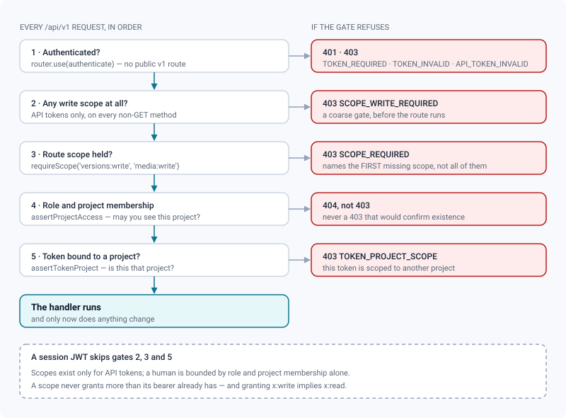
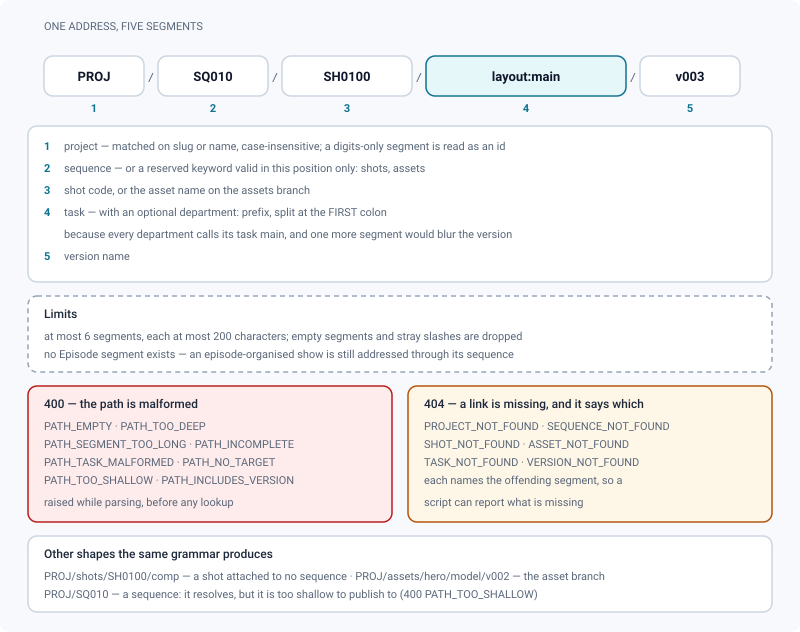
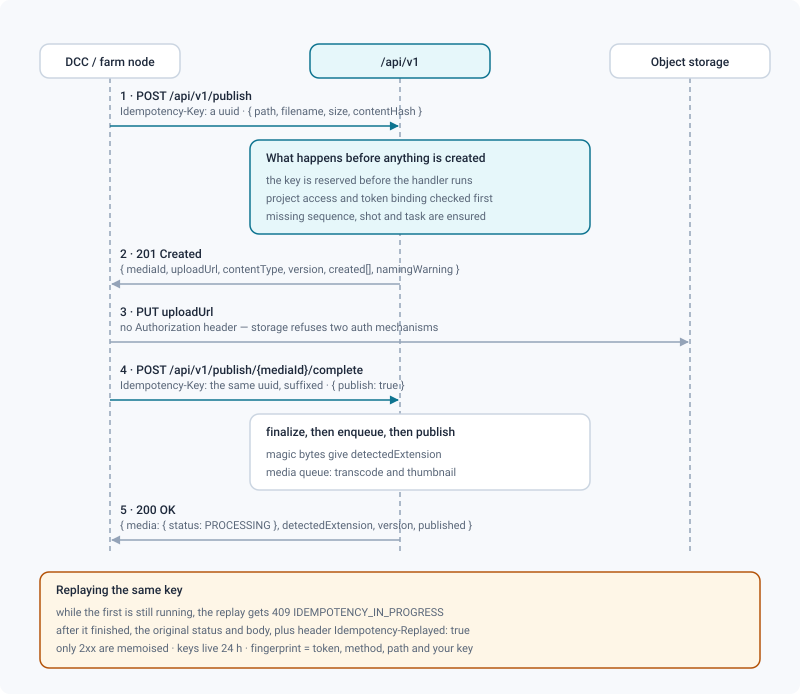

# API v1 — pipeline integration

*The stable contract for pipeline tools: pipeline paths, idempotent publish, reading back, scopes and events.*

> Updated: 2026-08-23

**`/api/v1`** is the surface meant for tools: DCCs (Maya, Blender, Houdini, Nuke), pipeline
managers (Prism), bots and third-party synchronisations. It sits next to `/api`, which
serves the web interface and follows the product.

The separation is deliberate. The web API changes at the pace of the screens, while an
integration installed on a studio's workstations cannot be updated at every release. What
is published here does not move without a version bump.

Interactive reference: **`/api/docs`** (spec: `/api/openapi.json`). Every v1 endpoint is
generated from its own Zod validation schemas and from the mount table in
`backend/src/routes/v1/index.ts`, so an endpoint cannot exist without appearing there.

All examples below assume:

```bash
export REVIEW="https://review.mystudio.com"
export TOKEN="rvk_0123456789abcdef0123456789abcdef01234567"
```

## What makes it different from `/api`

| | `/api` (web) | `/api/v1` (integration) |
|---|---|---|
| Addressing | numeric ids | **pipeline paths** *and* ids |
| Creation | fails if it exists | **idempotent** (`ensure`) |
| Retries | no contract | `Idempotency-Key` on the two publish endpoints |
| Authorisation | role + membership | role + membership + **scopes** + project binding |
| Stability | follows the product | frozen within `v1` |

Every `/api/v1` route requires authentication — `router.use(authenticate)` sits at the
mount point, and there is no public v1 endpoint.

A ready-made client lives in the repository: [`clients/python/`](../../clients/python/README.md),
plus Blender and Nuke integrations built on it — see
[Python client & DCC integrations](python-client.md). Everything below is the HTTP contract
it speaks, for the languages it does not cover.

## Authentication

Send `Authorization: Bearer <token>` — either a session JWT or an API token (`rvk_…`).
See [Authentication & API access](authentication.md).

Two kinds of API token:

- **Personal** (`POST /api/auth/tokens`) — acts as its bearer, with their role.
- **Service** (`POST /api/admin/service-tokens`, admin only) — backed by a service account
  that cannot log in and never appears in the directory. Meant for a render farm, a daemon
  or a bot.

Both may be **bound to a single project** (`projectId`), which the v1 routes enforce on
every resolved project id. That binding is what makes a token safe to deploy on a farm
working on one film.

> [!CAUTION]
> The binding, and the "v1 only" rule, hold **inside `/api/v1`**. The middleware written to
> confine an `rvk_` token to that prefix (`apiTokenSurface`) is not mounted in
> `createApp()`: an API token pointed at `/api` is accepted there, and the web API consults
> neither the fine-grained scopes nor the project binding. Until that changes, assume a
> leaked token carries the **full power of its bearer over every project they can see** —
> so give it a non-`ADMIN` role, the minimum scopes, and an expiry date.

### Issuing a service token

An administrator, signed in with a **session JWT** (an API token may not create identities
— the request is refused with `400`):

```bash
curl -s -X POST "$REVIEW/api/admin/service-tokens" \
  -H "Authorization: Bearer $ADMIN_JWT" \
  -H "Content-Type: application/json" \
  -d '{
        "name": "farm-publisher",
        "description": "Publishes renders from the farm",
        "scopes": ["versions:write", "media:write", "shots:write", "tasks:write"],
        "role": "ARTIST",
        "projectId": 3,
        "expiresInDays": 365
      }'
```

`201 Created`:

```json
{
  "token": "rvk_0123456789abcdef0123456789abcdef01234567",
  "apiToken": {
    "id": 12,
    "name": "farm-publisher",
    "description": "Publishes renders from the farm",
    "kind": "SERVICE",
    "scopes": ["versions:write", "media:write", "shots:write", "tasks:write"],
    "projectId": 3,
    "lastUsedAt": null,
    "expiresAt": "2027-08-21T09:14:02.311Z",
    "createdAt": "2026-08-21T09:14:02.311Z"
  }
}
```

The plaintext `token` is returned **once**; only its SHA-256 hash is stored. Field rules:
`name` 1–80 characters, `description` ≤ 300, `scopes` at least one entry of ≤ 40 characters
each, `role` one of `SUPERVISOR` / `ARTIST` / `CLIENT` (never `ADMIN` — a robot does not
administer the studio; the default is `ARTIST`), `expiresInDays` 1–3650.

The service account's address is derived from the name: `farm-publisher` becomes
`svc-farm-publisher@service.review.invalid`. Binding the token to a project also makes that
account a member of the project — otherwise an `ARTIST` service account would see nothing.
Reusing the same name reuses the same account, and re-issuing with a different `role`
adjusts it.

Revoke with `DELETE /api/admin/service-tokens/:id` (`204`, immediate — the token hash is
looked up on every request).

## Scopes, and the gates a request crosses

Scopes are `domain:action`, over **nine domains**, and the catalogue only declares what a
route actually guards. A scope that protects nothing is worse than a missing one: it gets
ticked when a token is created, it gets read in the documentation, and it suggests a
confinement that does not exist.

| Domain | `:read` | `:write` |
|--------|:-------:|:--------:|
| `projects` | yes | — creating a project is not the integration API's business |
| `sequences` | yes | yes |
| `shots` | yes | yes |
| `assets` | yes | yes |
| `tasks` | yes | yes |
| `versions` | yes | yes |
| `media` | yes | yes |
| `comments` | yes | yes |
| `events` | yes | — the journal writes itself |

Sixteen fine-grained strings, plus **`admin`**, which covers everything: **17 grantable
values**. Granting `x:write` implies `x:read`. Playlists, webhooks and the user directory
have no scope because they are not exposed by `/api/v1` at all — they live on the web API.

Read the list from `GET /api/v1/schema`, under `scopes`. The web API serves the same list
plus the legacy names at `GET /api/auth/scopes`, which needs a session JWT:

```bash
curl -s -H "Authorization: Bearer $TOKEN" "$REVIEW/api/v1/schema" # → .scopes
curl -s -H "Authorization: Bearer $JWT"   "$REVIEW/api/auth/scopes"
# → { "scopes": ["projects:read", "sequences:read", "…", "admin"], "legacy": ["read", "write"] }
```

Tokens issued before scopes existed carry `read` / `write` and keep working: they are
expanded on the fly — `read` to every `*:read`, `write` to every `*:read` **and** every
declared `*:write`. A stored scope that has since left the catalogue (an old
`playlists:read`) is ignored like any unknown string: the token stays valid and loses
nothing, since no route ever consulted it.



A scope never grants more than its bearer already has: role and project membership are
still enforced behind it. **Scopes are only checked when the caller presents an API
token**; a session JWT is governed by role and membership alone.

`requireScope` may name several scopes, and a route that touches two families names both.
The refusal reports the **first** missing one, in declaration order — so a token missing
two scopes needs two round trips to discover both.

## Pipeline paths

A DCC knows names, not database ids. A path spells them out and becomes an address.



```
PROJ                              project
PROJ/SQ010                        sequence
PROJ/SQ010/SH0100                 shot
PROJ/SQ010/SH0100/anim            task
PROJ/SQ010/SH0100/anim/v003       version
PROJ/SQ010/SH0100/layout:main     task "main" of department "layout"
PROJ/shots/SH0100                 shot with no sequence
PROJ/assets/hero/model/v002       asset branch
```

`shots` and `assets` are reserved keywords **in second position only**; they disambiguate
"a sequence named X" from "a shot named X with no sequence". A path has at most **6
segments**, each at most **200 characters**; empty segments and stray slashes are dropped.
Resolution is **case-insensitive** — a DCC writes `sh0100` where production typed `SH0100`.
A segment made only of digits is read as a numeric id rather than a code.

The `PROJ/shots/<code>` branch matches **only shots with no sequence**. To reach a shot
whose sequence you do not know, use the `?shot=` query filter on the collection endpoints
instead, which searches the whole project.

The department is **prefixed to the task name** rather than taking a segment of its own:
pipelines commonly name `main` the task of every department, and one more positional
segment would make `.../modeling/main` indistinguishable from `.../anim/v003`. The split
happens at the **first** colon. Without a colon, the segment is read as a task name (the
historical form) and the department is deduced from that name. Supplying it narrows the
lookup: `modeling:main` and `lookdev:main` resolve to two different tasks. It also decides
what "latest version" means — see [Pipeline settings](../admin-guide/pipeline-settings.md).

> [!WARNING]
> The department is **not** written back into the `path` a resource carries. `toTask`
> builds it as `parent.path + "/" + task.name`, so `modeling:main` and `lookdev:main` both
> serialise to `proj/SQ010/SH0100/main`. Feed that value back to `/resolve` or `/publish`
> and it matches by name alone — which may land on the other department's task. Keep the
> prefixed form your own tool built; do not round-trip the returned `path` for a task whose
> name is shared across departments.

There is no **Episode** segment. The level exists in the product and can be enabled per
project (`/api/episodes`), but a path addresses an episode-organised show through its
sequence exactly like any other: `SHOW/<sequence>/<shot>/<task>`.

### Resolving a path

`GET /api/v1/resolve` — scope `projects:read`, query `path` (1–1200 characters).

```bash
curl -s -H "Authorization: Bearer $TOKEN" \
  --get --data-urlencode "path=PROJ/SQ010/SH0100/anim" \
  "$REVIEW/api/v1/resolve"
```

```json
{
  "kind": "task",
  "path": "PROJ/SQ010/SH0100/anim",
  "project": {
    "id": 3, "code": "proj", "name": "PROJ", "status": "ACTIVE",
    "description": null, "startFrame": 1001, "path": "proj",
    "createdAt": "2026-05-04T08:00:00.000Z", "updatedAt": "2026-08-19T15:22:41.006Z"
  },
  "sequence": {
    "id": 11, "code": "SQ010", "name": "SQ010", "order": 0,
    "projectId": 3, "project": { "slug": "proj" }
  },
  "shot": {
    "id": 42, "code": "SH0100", "name": "SH0100", "startFrame": 1001, "endFrame": 1096,
    "order": 0, "projectId": 3, "project": { "slug": "proj" },
    "sequence": { "id": 11, "code": "SQ010" }
  },
  "asset": null,
  "task": {
    "id": 87, "name": "anim", "type": "ANIMATION", "department": "anim",
    "status": "IN_PROGRESS", "order": 0, "startDate": null, "dueDate": null,
    "assignee": { "id": 5, "name": "Nina Roy", "username": "nina", "email": "nina@studio.example" },
    "shot": { "id": 42, "code": "SH0100", "projectId": 3,
              "project": { "slug": "proj" }, "sequence": { "code": "SQ010" } },
    "asset": null,
    "createdAt": "2026-06-01T10:12:00.000Z", "updatedAt": "2026-08-20T17:03:12.884Z"
  },
  "version": null
}
```

Two things to read carefully here, because `/resolve` is the one v1 endpoint that does
**not** serialise through the shared resource shapes:

- Only `project` goes through them, which is why it alone carries `code` and `path`. The
  `sequence`, `shot`, `asset`, `task` and `version` objects are the database rows as
  selected: they expose `project: { slug }` instead of a `path`, `task.assignee` carries
  `username` and `email`, and `task` carries its `shot` or `asset` directly rather than a
  `parent`. A client written against the shapes returned by `/latest` or `/versions/:id`
  will find `undefined` where it expects `path` here.
- The top-level `path` is your own input, **normalised** — parsed and re-joined, so empty
  segments disappear and the `shots` / `assets` keyword and the `department:` prefix are
  put back. It is not read from the database, so its case is the case you sent.

`kind` is one of `project`, `sequence`, `shot`, `asset`, `task`, `version`, and names the
last entity the path designates.

A malformed path returns `400` with one of `PATH_EMPTY`, `PATH_TOO_DEEP`,
`PATH_SEGMENT_TOO_LONG`, `PATH_TASK_MALFORMED`, `PATH_INCOMPLETE`. A missing link returns
`404` naming the offending segment, so a script can say *what* is missing:

```json
{ "error": "Shot « SH0999 » not found", "code": "SHOT_NOT_FOUND" }
```

The complete family is `PROJECT_NOT_FOUND`, `SEQUENCE_NOT_FOUND`, `SHOT_NOT_FOUND`,
`ASSET_NOT_FOUND`, `TASK_NOT_FOUND`, `VERSION_NOT_FOUND`.

## Publishing from a DCC

Two calls. The file never transits through the API — it goes straight to object storage,
which is what makes a multi-gigabyte render viable.



**1. Open the publication.** Missing links in the path are created (sequence, shot, task);
the version number is computed unless you impose one. Scopes: **`versions:write` *and*
`media:write`** — the call creates a version, but it also opens a slot in storage and
attaches a media there. A token holding only the first is refused with
`403 SCOPE_REQUIRED` naming `media:write`.

```bash
curl -s -X POST "$REVIEW/api/v1/publish" \
  -H "Authorization: Bearer $TOKEN" \
  -H "Idempotency-Key: 4f2a1c90-2f2b-4c3f-9c11-2a0f6d3b7e51" \
  -H "Content-Type: application/json" \
  -d '{
        "path": "PROJ/SQ010/SH0100/anim",
        "filename": "SH0100_anim_v001.mov",
        "size": 184320000,
        "contentHash": "9f86d081884c7d659a2feaa0c55ad015a3bf4f1b2b0b822cd15d6c15b0f00a08",
        "shot": { "startFrame": 1001, "endFrame": 1096 }
      }'
```

`201 Created`:

```json
{
  "projectId": 3,
  "version": {
    "id": 512, "name": "V01", "status": "DRAFT", "published": false,
    "author": { "id": 9, "name": "farm-publisher" },
    "reviewStatus": null,
    "task": { "id": 87, "name": "anim" },
    "asset": null,
    "projectId": 3,
    "path": "proj/SQ010/SH0100/anim/V01",
    "createdAt": "2026-08-21T09:31:44.201Z",
    "updatedAt": "2026-08-21T09:31:44.201Z"
  },
  "versionCreated": true,
  "created": ["shot", "task"],
  "mediaId": 128,
  "uploadUrl": "https://minio.mystudio.com/review/projects/proj/shots/SQ010/SH0100/V01/128/SH0100_anim_v001.mov?X-Amz-Algorithm=…",
  "uploadMethod": "PUT",
  "contentType": "video/mp4",
  "namingWarning": false
}
```

Request fields:

| Field | Type | Notes |
|-------|------|-------|
| `path` | string, 1–1200 | Must reach at least a shot or an asset |
| `filename` | string, 1–255 | Drives kind inference and the storage key |
| `contentType` | string, 1–160, optional | Falls back to `video/mp4` / `image/png` / `application/octet-stream` per kind |
| `kind` | `VIDEO`\|`IMAGE`\|`MODEL_3D`\|`SPLAT`, optional | Overrides inference — but the extension is still checked against it |
| `size` | integer ≥ 0, optional | Checked against the file-size limit and quotas |
| `contentHash` | 64 hex chars, optional | Client-side sha256, re-checked by the worker |
| `versionName` | string, 1–60, optional | Imposes a version name instead of the computed one |
| `reuseVersion` | boolean, optional | Reuse an existing version of that name instead of failing |
| `createMissing` | boolean, **default `true`** | `false` fails instead of creating structure |
| `shot.name` / `shot.startFrame` / `shot.endFrame` | optional | Applied when the shot is created |
| `usd` | object, optional | See below; `MODEL_3D` only |

Without `versionName`, the next name is `V01`, `V02`, … derived from the highest trailing
number among existing names — not from their count.

`created` is a subset of `["asset","sequence","shot","task","version"]` and is `[]` when
`createMissing` is `false`. `namingWarning` is `true` when the filename does not follow the
studio's naming convention; the publication still proceeds. Note that the `version` object
returned here carries **no** `media` key: nothing has been attached yet.

**2. Upload, then close it.**

```bash
curl -s -X PUT --upload-file SH0100_anim_v001.mov \
  -H "Content-Type: video/mp4" "$UPLOAD_URL"

curl -s -X POST "$REVIEW/api/v1/publish/128/complete" \
  -H "Authorization: Bearer $TOKEN" \
  -H "Idempotency-Key: 4f2a1c90-2f2b-4c3f-9c11-2a0f6d3b7e51-complete" \
  -H "Content-Type: application/json" -d '{ "publish": true }'
```

`200 OK`:

```json
{
  "media": {
    "id": 128, "kind": "VIDEO", "status": "PROCESSING",
    "filename": "SH0100_anim_v001.mov", "mimeType": "video/mp4",
    "size": 184320000, "published": true,
    "createdAt": "2026-08-21T09:31:44.244Z"
  },
  "detectedExtension": "mov",
  "version": { "id": 512, "name": "V01", "status": "REVIEW", "…": "…" },
  "published": true
}
```

The path segment is the **media id** returned by step 1, and `complete` requires the same
two scopes. It validates the file (magic bytes → `detectedExtension`, size, quotas),
triggers transcoding or thumbnailing, and publishes the media. Two body fields, both
optional booleans: `publish` (**omitting it publishes** — only `publish: false` holds the
media back) and `submitForReview`.

The **version** is only moved to `PUBLISHED` if the caller is a supervisor or an
administrator; otherwise it lands in `REVIEW`. An artist publishes their media without the
call failing over a decision that is not theirs to make — and a version update refused by
the publish lock is swallowed rather than turned into an error, so read `version.status` in
the response if it matters to you.

### Accepted formats, and the refusals that come before the upload

The media kind is inferred from the extension, case-insensitively, in the order
`VIDEO`, `IMAGE`, `MODEL_3D`, `SPLAT` — first match wins. This table is the single source
of truth (`lib/fileSignatures`), and it is the same list the header validation knows how to
recognise: nothing is advertised here that would be refused after the transfer.

| Kind | Extensions |
|------|------------|
| `VIDEO` | `mp4` `m4v` `mov` `mkv` `webm` `avi` `mxf` `ts` `m2ts` `mts` |
| `IMAGE` | `jpg` `jpeg` `png` `webp` `gif` `bmp` `exr` `dpx` `tif` `tiff` `tga` |
| `MODEL_3D` | `glb` `gltf` `fbx` `obj` `usd` `usda` `usdc` `usdz` `dae` `stl` `zip` |
| `SPLAT` | `ply` `splat` `spz` `ksplat` `sog` `sogs` |

`.abc` (Alembic) is **deliberately absent**: no signature is recognised for it and no
converter produces a GLB from one, so `cam.abc` gets `400 KIND_UNKNOWN` rather than a 3D
media that never converts. Alembic *cameras* are handled elsewhere — see
[3D & Alembic](../admin-guide/3d-alembic.md).

Three refusals happen at step 1, before you transfer a byte. That is the whole point of the
two-call flow: a format rejected here costs one round trip, rejected at `complete` it costs
the whole master.

| Code | Status | When |
|------|--------|------|
| `KIND_UNKNOWN` | 400 | No kind claims the extension — `Cannot tell the media kind of « render.foo » — pass « kind »` |
| `UNSUPPORTED_FORMAT` | 400 | The extension is not readable as the `kind` you passed; the message lists what is accepted for that kind |
| `SEQUENCE_NOT_SUPPORTED_HERE` | 400 | The filename is a `%04d`-style pattern — it must go through `POST /api/media/sequence/init` |

> [!IMPORTANT]
> There is **no v1 route that publishes an image sequence**. A `SH0100_comp_v003.%04d.exr`
> delivery is N files that must become one media, which needs N presigned URLs, a resumable
> manifest and an assembly job — the three-call family on the web API
> (`/api/media/sequence/*`). A DCC integration that renders EXR therefore publishes the
> encoded movie its pipeline produces afterwards, or drives those web routes with a session
> token. See [Image sequences](../user-guide/image-sequences.md).

### Publishing a USD scene with a variant selection

A DCC knows which variants and which purpose the scene should be shown with — it knew
before it wrote the file. Pass that selection as `usd` and the **first** conversion is
already the right one:

```bash
curl -s -X POST "$REVIEW/api/v1/publish" \
  -H "Authorization: Bearer $TOKEN" \
  -H "Content-Type: application/json" \
  -d '{
        "path": "PROJ/assets/hero/model",
        "filename": "hero_model_v001.usd",
        "usd": {
          "variants": { "/World/Hero": { "modelingVariant": "damaged" } },
          "purpose": "render"
        }
      }'
```

- `variants` — the chosen option per variant set, keyed by USD prim path. Optional,
  defaults to `{}` (each variant set keeps the selection authored in the scene). At most 64
  prims; a prim path is at most 1024 characters, a variant set name and a variant name at
  most 200.
- `purpose` — `render`, `proxy` or `guide`. Optional, defaults to `render`.

Without it the conversion runs with the defaults, and matching the intended look then costs
a `POST /api/media/{id}/usd/recompose` — a **full Blender conversion run a second time** for
a selection the client already knew. The selection is stored on the media, so it also
survives job retries and later reprocessing.

Prim paths and variant names are **not** validated against the scene at this point: it has
not been analysed yet. They are filtered at conversion time against the variant sets
actually found, so an invented value is dropped rather than breaking the job. The field
only applies to `MODEL_3D`; sending it with a video or an image is refused (`USD_NOT_3D`)
rather than silently ignored.

See [USD & 3D conversion](../admin-guide/3d-usd.md) for what the conversion does with it.

## Reading back — the version to open, and the file behind it

Publishing is half a pipeline. The other half is *fetching*: a Nuke script that needs the
approved plate, a farm node that needs the layout, a tool that shows what the review is
looking at. Three endpoints cover it.

### The version to open

`GET /api/v1/latest` — scope `versions:read`.

```bash
curl -s -H "Authorization: Bearer $TOKEN" \
  --get --data-urlencode "path=PROJ/SQ010/SH0100" --data "urls=true" \
  "$REVIEW/api/v1/latest"
```

```json
{
  "version": {
    "id": 514, "name": "V03", "status": "PUBLISHED", "published": true,
    "author": { "id": 9, "name": "farm-publisher" },
    "reviewStatus": { "id": 1, "name": "Approved", "color": "#3fb950" },
    "task": { "id": 91, "name": "comp" },
    "asset": null,
    "projectId": 3,
    "path": "proj/SQ010/SH0100/comp/V03",
    "media": [
      {
        "id": 128, "kind": "VIDEO", "status": "READY",
        "filename": "SH0100_comp_v003.mov", "mimeType": "video/mp4",
        "size": 184320000, "published": true,
        "createdAt": "2026-08-20T10:00:00.000Z",
        "url": "https://minio.mystudio.com/review/…?X-Amz-Algorithm=…"
      }
    ],
    "createdAt": "2026-08-20T10:00:00.000Z",
    "updatedAt": "2026-08-20T11:04:12.006Z"
  }
}
```

| Query | Default | Meaning |
|---|---|---|
| `path` | — | Pipeline path down to a shot, an asset or a task (**not** a version) |
| `published` | `true` | `false` includes drafts — but only **your own**: an unpublished media belongs to whoever uploaded it |
| `urls` | `false` | `true` adds a presigned `url` to every media of the version — always the `source` variant |
| `expiresIn` | `3600` | Validity of those URLs, 60 – 86 400 seconds |
| `department` | — | Restrict the election to one pipeline step (`comp`, `anim`…), matched on the task's department key |

On a **shot or an asset**, "latest" is the *most advanced pipeline step* that has something
to show, then the most recent version at that step — the same rule the web interface
applies, so the API and the screen never disagree. An animation published after a
compositing does not win. On a **task**, where the step is constant, it reduces to the most
recent. The elected version always carries at least one readable media; when nothing
qualifies the answer is `404 NO_LATEST_VERSION`.

A `path` that names a version is refused with `400 PATH_INCLUDES_VERSION` — there is
nothing to elect; read it with `GET /api/v1/versions/{id}`. A path that stops at a project
or a sequence gets `400 PATH_TOO_SHALLOW`.

`GET /api/v1/tasks/:id/versions/latest` is the same answer for a task you already hold the
id of (same query parameters, minus `path`).

### The file behind it

`GET /api/v1/media/:id/url` — scope `media:read`.

```bash
curl -s -H "Authorization: Bearer $TOKEN" "$REVIEW/api/v1/media/128/url?variant=source"
```

```json
{
  "mediaId": 128,
  "variant": "source",
  "expiresIn": 3600,
  "url": "https://minio.mystudio.com/review/…?X-Amz-Algorithm=…",
  "media": { "id": 128, "kind": "VIDEO", "status": "READY", "filename": "SH0100_comp_v003.mov",
             "mimeType": "video/mp4", "size": 184320000, "published": true,
             "createdAt": "2026-08-20T10:00:00.000Z" }
}
```

Three variants, and `expiresIn` is bounded to 60 – 86 400 seconds (default 3 600):

| `variant` | What you get |
|---|---|
| `source` (default) | The file as published — or the transcoded proxy once the original has been reclaimed |
| `proxy` | The review MP4, **including the non-destructive trim** when one exists: what the review actually plays |
| `thumbnail` | The still used in lists and playlists |

A variant the media does not carry answers `404 VARIANT_UNAVAILABLE` rather than a URL that
would fetch nothing. Then `GET` the URL **without** the `Authorization` header: object
storage refuses a request that carries two authentication mechanisms.

`GET /api/v1/media/:id` returns the media resource alone (`{ media, versionId }`), for a
tool that needs the metadata without minting a URL.

Adaptive playback (HLS) stays on the web API: it is a player concern, and a workstation
wants the file, not a manifest.

> [!NOTE]
> Visibility follows the rest of the product: a media in the trash, or an unpublished one
> uploaded by somebody else, answers `404` — not `403`, which would confirm it exists.

## Use case 1 — a publish shelf button in a DCC

Maya, Houdini and Nuke all ship a Python 3 interpreter, but none guarantees `requests`. The
script below uses only the standard library, so it runs from a shelf button, a ROP
post-render script or a Nuke write callback without installing anything.

> In Python, prefer the shipped client — `review.ReviewClient().publish(path, file)` does
> exactly this, with retries and an idempotency key handled for you. See
> [Python client & DCC integrations](python-client.md). The script below is the same three
> calls written out, for the languages the client does not cover.

```python
# review_publish.py — publish the file the DCC just wrote.
import hashlib, json, os, urllib.request, uuid

REVIEW = os.environ["REVIEW_URL"]          # https://review.mystudio.com
TOKEN  = os.environ["REVIEW_TOKEN"]        # rvk_…


def _call(method, path, body=None, headers=None):
    data = json.dumps(body).encode() if body is not None else None
    req = urllib.request.Request(REVIEW + path, data=data, method=method)
    req.add_header("Authorization", "Bearer " + TOKEN)
    if data:
        req.add_header("Content-Type", "application/json")
    for key, value in (headers or {}).items():
        req.add_header(key, value)
    try:
        with urllib.request.urlopen(req, timeout=60) as resp:
            return json.loads(resp.read() or b"{}")
    except urllib.error.HTTPError as exc:
        payload = json.loads(exc.read() or b"{}")
        # code is stable, error is a human message that may be localised
        raise RuntimeError("%s %s: %s" % (exc.code, payload.get("code"), payload.get("error")))


def sha256_of(path):
    digest = hashlib.sha256()
    with open(path, "rb") as handle:
        for chunk in iter(lambda: handle.read(1 << 20), b""):
            digest.update(chunk)
    return digest.hexdigest()


def publish(pipeline_path, filepath, start_frame=None, end_frame=None):
    key = str(uuid.uuid4())                # survives a retry after a timeout
    shot = {}
    if start_frame is not None:
        shot["startFrame"] = start_frame
    if end_frame is not None:
        shot["endFrame"] = end_frame

    opened = _call("POST", "/api/v1/publish", {
        "path": pipeline_path,
        "filename": os.path.basename(filepath),
        "size": os.path.getsize(filepath),
        "contentHash": sha256_of(filepath),
        **({"shot": shot} if shot else {}),
    }, {"Idempotency-Key": key})

    # 2. straight to object storage — the API never sees the bytes
    with open(filepath, "rb") as handle:
        put = urllib.request.Request(opened["uploadUrl"], data=handle.read(), method="PUT")
        put.add_header("Content-Type", opened["contentType"])
        urllib.request.urlopen(put, timeout=3600).read()

    done = _call("POST", "/api/v1/publish/%d/complete" % opened["mediaId"],
                 {"publish": True}, {"Idempotency-Key": key + "-complete"})

    return opened["version"]["path"], done["media"]["status"]


if __name__ == "__main__":
    print(publish("PROJ/SQ010/SH0100/anim",
                  "/renders/PROJ/SQ010/SH0100/SH0100_anim_v001.mov",
                  start_frame=1001, end_frame=1096))
```

Notes that matter in production:

- Read the file **once** for the hash and once for the upload; for multi-gigabyte renders,
  stream the PUT from the file object instead of `handle.read()`.
- Reuse the same `Idempotency-Key` on a retry after a network timeout: the second call
  returns the original response with `Idempotency-Replayed: true` instead of creating a
  second version.
- Catch `SHOT_NOT_FOUND` only if you run with `createMissing: false`; by default the
  structure is created for you.
- Bind the token to the project the farm works on, and give it a `role` of `ARTIST`.

## Use case 2 — a bot that follows status changes

A bot behind a studio firewall cannot receive webhooks. It polls the event journal, keeps
the cursor, and never loses or replays an event across restarts.

```python
# review_bot.py — relay task status changes to an internal chat.
import json, os, time, urllib.parse, urllib.request

REVIEW = os.environ["REVIEW_URL"]
TOKEN  = os.environ["REVIEW_TOKEN"]        # needs events:read
STATE  = "/var/lib/review-bot/cursor"


def get(path):
    req = urllib.request.Request(REVIEW + path)
    req.add_header("Authorization", "Bearer " + TOKEN)
    with urllib.request.urlopen(req, timeout=30) as resp:
        return json.loads(resp.read())


def load_cursor():
    if os.path.exists(STATE):
        return int(open(STATE).read().strip())
    # First run: take the current head instead of replaying a month of history.
    return get("/api/v1/events")["cursor"]


def save_cursor(value):
    os.makedirs(os.path.dirname(STATE), exist_ok=True)
    with open(STATE, "w") as handle:
        handle.write(str(value))


def run():
    cursor = load_cursor()
    wanted = "task.status_changed,version.published,review.decision"
    while True:
        query = urllib.parse.urlencode({"since": cursor, "limit": 200, "events": wanted})
        page = get("/api/v1/events?" + query)
        for event in page["events"]:
            print(event["createdAt"], event["event"],
                  (event["actor"] or {}).get("name"), event["payload"])
        cursor = page["cursor"]
        save_cursor(cursor)
        if not page["hasMore"]:
            time.sleep(30)                 # caught up — back off


if __name__ == "__main__":
    run()
```

What the journal guarantees:

```bash
curl -s -H "Authorization: Bearer $TOKEN" \
  "$REVIEW/api/v1/events?since=8123&limit=200&events=task.status_changed"
```

```json
{
  "events": [
    {
      "id": 8124,
      "event": "task.status_changed",
      "projectId": 3,
      "entityType": "task",
      "entityId": 87,
      "payload": { "task": { "id": 87, "name": "anim", "…": "…" },
                   "from": "IN_PROGRESS", "to": "PENDING_REVIEW" },
      "createdAt": "2026-08-21T09:40:02.117Z",
      "actor": { "id": 5, "name": "Nina Roy", "username": "nina" }
    }
  ],
  "cursor": 8124,
  "hasMore": false
}
```

- `since` is **exclusive** (`id > since`), so passing back the returned `cursor` never
  replays the last event.
- `limit` defaults to `100`, minimum `1`, maximum `500`.
- A call **without** `since` returns `{ "events": [], "cursor": <head>, "hasMore": false }` —
  the current head, not a month of history. `cursor` is `0` on an empty journal.
- `events` is a comma-separated filter; entries outside the catalogue are dropped silently,
  so a client written against a newer catalogue degrades instead of failing.
- `project` accepts an id, a slug or a name and restricts the page to that project;
  otherwise the page is limited to what the caller can see (all projects for
  `ADMIN`/`SUPERVISOR`, the token's project when it is bound, the caller's memberships
  otherwise).
- `entityType` is lower-case (`task`, `version`, `comment`), and the payload shape depends
  on the event: task events carry the whole `task` resource, `task.status_changed` adds
  `from` and `to`, `task.assigned` adds `assigneeId`.
- Events are retained **30 days** by default (an administrator can change it), then purged
  in batches by the daily sweep. A daemon that stays down longer than that loses the gap —
  reconcile with the collection endpoints.

### The catalogue, and the ten names that actually fire

`GET /api/v1/schema` returns eighteen event names under `events`. They are the vocabulary,
and the `?events=` filter accepts all of them — but **only ten have an emission point in
the code**:

```
media.published    review.decision     comment.created    comment.resolved
task.created       task.updated        task.status_changed  task.assigned
version.created    version.published
```

The eight others — `project.created`, `project.updated`, `sequence.created`,
`shot.created`, `shot.updated`, `asset.created`, `media.uploaded`, `media.failed` — are
declared but never published. Wiring them means touching the corresponding write services,
and a unit test re-reads the sources so the list cannot quietly drift.

> [!WARNING]
> Filtering the pull journal on one of those eight returns an empty page, forever, with no
> error to tell you why. On the push side the refusal is explicit: `POST /api/admin/webhooks`
> validates its `events` array against the **ten**, so subscribing to `media.failed` is
> rejected with a `400`. An alert you cannot honour is worse than a missing event — see
> [Identity, API & audit](../admin-guide/identity-and-api.md) and
> [Authentication & API access](authentication.md#outgoing-webhooks).

## Use case 3 — a pipeline tool that creates its own tasks

A production tool that owns the breakdown declares the structure itself. Every creation
endpoint is an `ensure`: `201` with `created: true` the first time, `200` with
`created: false` afterwards, so the whole script is safe to re-run.

```bash
# 1. sequence
curl -s -X POST "$REVIEW/api/v1/projects/PROJ/sequences" \
  -H "Authorization: Bearer $TOKEN" -H "Content-Type: application/json" \
  -d '{ "code": "SQ020", "name": "Rooftop chase", "order": 20 }'
```

```json
{ "sequence": { "id": 14, "code": "SQ020", "name": "Rooftop chase", "order": 20,
                "projectId": 3, "path": "proj/SQ020" },
  "created": true }
```

```bash
# 2. shot inside it
curl -s -X POST "$REVIEW/api/v1/projects/PROJ/shots" \
  -H "Authorization: Bearer $TOKEN" -H "Content-Type: application/json" \
  -d '{ "code": "SH0210", "sequenceCode": "SQ020", "startFrame": 1001, "endFrame": 1240 }'

# 3. the tasks this shot goes through
for TASK in layout anim lighting comp; do
  curl -s -X POST "$REVIEW/api/v1/shots/57/tasks" \
    -H "Authorization: Bearer $TOKEN" -H "Content-Type: application/json" \
    -d "{ \"name\": \"$TASK\" }"
done
```

```json
{ "task": { "id": 91, "name": "anim", "type": "ANIMATION", "status": "TODO", "order": 0,
            "startDate": null, "dueDate": null, "assignee": null,
            "parent": { "kind": "shot", "id": 57, "code": "SH0210", "projectId": 3,
                        "path": "proj/SQ020/SH0210" },
            "projectId": 3, "path": "proj/SQ020/SH0210/anim",
            "createdAt": "2026-08-21T10:02:11.500Z",
            "updatedAt": "2026-08-21T10:02:11.500Z" },
  "created": true }
```

`type` is optional: when omitted it is inferred from the task name, case-insensitively —
`anim`/`animation` → `ANIMATION`, `model`/`modeling`/`modelling`/`mod` → `MODELING`,
`rig`/`rigging` → `RIGGING`, `fx`/`effects`/`vfx` → `FX`, `light`/`lighting`/`lgt` →
`LIGHTING`, `comp`/`compositing` → `COMPOSITING`, `look`/`lookdev`/`shading`/`surf` →
`LOOKDEV`, `layout`/`lay`/`blocking` → `LAYOUT`, anything else → `OTHER`.

```bash
# 4. assign and schedule
curl -s -X PATCH "$REVIEW/api/v1/tasks/91" \
  -H "Authorization: Bearer $TOKEN" -H "Content-Type: application/json" \
  -d '{ "status": "IN_PROGRESS", "assigneeId": 5, "dueDate": "2026-09-15" }'
```

`PATCH` accepts `status`, `assigneeId` (nullable) and `dueDate` (nullable, coerced to a
date) and returns `{ "task": { … } }`. It emits `task.status_changed` (only when the status
actually changed), `task.assigned` (when `assigneeId` is present) and always `task.updated`
— which is exactly what the bot in use case 2 consumes.

### The write surface, in full

| Endpoint | Scope | What it does |
|----------|-------|--------------|
| `POST /api/v1/projects/:ref/sequences` | `sequences:write` | Ensure a sequence |
| `POST /api/v1/projects/:ref/shots` | `shots:write` | Ensure a shot (`sequenceCode` optional) |
| `POST /api/v1/projects/:ref/assets` | `assets:write` | Ensure an asset |
| `POST /api/v1/shots/:id/tasks` · `POST /api/v1/assets/:id/tasks` | `tasks:write` | Ensure a task on a shot or an asset |
| `PATCH /api/v1/tasks/:id` | `tasks:write` | Status, assignee, due date |
| `POST /api/v1/tasks/:id/versions` | `versions:write` | Ensure a version (`name`, `reuseExisting`) |
| `PATCH /api/v1/versions/:id` | `versions:write` | Rename, or move the status. Goes through `VersionService`, so the publish lock and the supervisor rule apply; moving to `PUBLISHED` emits `version.published` |
| `POST /api/v1/versions/:id/decision` | `versions:write` | A review decision — supervisors and administrators only, always `201` |
| `POST /api/v1/media/:id/comments` | `comments:write` | Leave a note: `content` (1–10 000), `timestamp` and `duration` in seconds, `parentId` to reply. `201 { comment }` |
| `POST /api/v1/comments/:id/resolve` | `comments:write` | `{ resolved: true }` by default; emits `comment.resolved` when it closes a note |
| `POST /api/v1/publish`, `POST /api/v1/publish/:id/complete` | `versions:write` **+** `media:write` | The two-call publish flow |

Graphical annotations and attachments stay out of this API: they need a file upload and an
image geometry that only the interface produces correctly.

Writing back a review decision:

```bash
curl -s -X POST "$REVIEW/api/v1/versions/512/decision" \
  -H "Authorization: Bearer $TOKEN" -H "Content-Type: application/json" \
  -d '{ "statusId": 4, "comment": "Retake on the last 20 frames." }'
```

`statusId` references one of the studio's custom review statuses — read them from
`GET /api/v1/schema` rather than hard-coding ids.

### Everything the tool needs to read back

| Endpoint | Scope | Returns |
|----------|-------|---------|
| `GET /api/v1/projects` | `projects:read` | paginated, ordered by name; `?status=` filter. A bound token sees only its project, even if its bearer is an admin |
| `GET /api/v1/projects/:ref` | `projects:read` | `{ project }` |
| `GET /api/v1/projects/:ref/sequences` | `sequences:read` | `{ sequences }` — not paginated |
| `GET /api/v1/projects/:ref/shots` | `shots:read` | paginated; `?sequence=` filter |
| `GET /api/v1/projects/:ref/assets` | `assets:read` | paginated; `?type=` filter |
| `GET /api/v1/projects/:ref/tasks` | `tasks:read` | paginated; `?status=`, `?assigneeId=`, `?shot=`, `?asset=` |
| `GET /api/v1/projects/:ref/versions` | `versions:read` | paginated; `?status=`, `?published=true\|false` |
| `GET /api/v1/shots/:id` · `GET /api/v1/assets/:id` | `shots:read` · `assets:read` | `{ shot }` · `{ asset }` |
| `GET /api/v1/shots/:id/tasks` · `GET /api/v1/assets/:id/tasks` | `tasks:read` | `{ tasks }` |
| `GET /api/v1/tasks/:id` · `GET /api/v1/tasks/:id/versions` | `tasks:read` · `versions:read` | `{ task }` · `{ versions }` |
| `GET /api/v1/versions/:id` · `GET /api/v1/versions/:id/media` | `versions:read` · `media:read` | `{ version }` · `{ media }` |
| `GET /api/v1/media/:id/comments` | `comments:read` | paginated; `?resolved=true\|false` |
| `GET /api/v1/versions/:id/comments` | `comments:read` | `{ comments }` — not paginated |

Paginated collections take `page` (≥ 1, default 1) and `pageSize` (1–100, default 100) and
answer with the shared envelope:

```json
{ "items": [], "total": 0, "page": 1, "pageSize": 100, "pageCount": 1, "hasMore": false }
```

`pageCount` and `hasMore` are the two fields a client needs to stop looping — do not
recompute them from `total`. `sort` and `order` are accepted and validated but each
collection has a fixed ordering; do not rely on them. Note that `published` and `resolved`
are the **strings** `"true"` / `"false"`, not JSON booleans.

## Idempotency

`POST /api/v1/publish` and `POST /api/v1/publish/:id/complete` accept an `Idempotency-Key`
header. **No other v1 route honours it**; the ensure endpoints do not need it because they
converge by nature.

The key is trimmed and must be 1–200 characters — an out-of-range value is treated as
absent rather than rejected. It is **reserved before** the request runs, not recorded
after, so a fast retry (or a second farm worker) cannot slip through the window between
handling and recording and create the duplicate the key exists to prevent:

- replay of a completed request → the original status code and body, with the response
  header `Idempotency-Replayed: true`;
- replay while the first is still running →
  `409 { "error": "…", "code": "IDEMPOTENCY_IN_PROGRESS" }`;
- **only 2xx responses are memoised**; a failed request releases the key, so a legitimate
  retry can succeed instead of being frozen for 24 hours.

Keys are kept **24 hours** and fingerprinted over
`(API token id, or the literal "session" for a JWT) × HTTP method × path × your key`. Two
tokens, or the same token on two endpoints, cannot collide — but all JWT sessions share one
bucket, so prefer a token for automated writes.

Creation endpoints (`ensure`) are idempotent by nature: `201` with `created: true` on the
first call, `200` with `created: false` afterwards. One case cannot converge: when the name
is held by an entity sitting in the trash, the ensure answers `409` with a named code
(`SEQUENCE_IN_TRASH`, `SHOT_IN_TRASH`, `ASSET_IN_TRASH`, `VERSION_IN_TRASH`) — restore or
purge the entity, then replay.

## Discovering an instance

`GET /api/v1` is the entry point and needs no scope:

```json
{
  "name": "ReView API",
  "version": "v1",
  "documentation": "/api/docs",
  "openapi": "/api/openapi.json",
  "capabilities": {
    "pathResolution": true,
    "idempotency": "Idempotency-Key",
    "events": "/api/v1/events",
    "publish": "/api/v1/publish",
    "latest": "/api/v1/latest",
    "mediaUrl": "/api/v1/media/{id}/url"
  }
}
```

`GET /api/v1/schema` (scope `projects:read`) returns the enumerations this instance accepts
*and* the studio's custom review statuses — which is what a review decision references.
Read it at startup instead of hard-coding values that diverge at the first change:

```json
{
  "enums": {
    "projectStatus": ["ACTIVE", "ON_HOLD", "COMPLETED", "ARCHIVED"],
    "assetType": ["CHARACTER", "PROP", "ENVIRONMENT", "VEHICLE", "FX", "OTHER"],
    "taskType": ["MODELING", "RIGGING", "ANIMATION", "FX", "LIGHTING", "COMPOSITING", "LOOKDEV", "LAYOUT", "OTHER"],
    "taskStatus": ["TODO", "IN_PROGRESS", "PENDING_REVIEW", "APPROVED", "REJECTED", "RETAKE"],
    "versionStatus": ["DRAFT", "REVIEW", "PUBLISHED"],
    "mediaKind": ["VIDEO", "IMAGE", "MODEL_3D", "SPLAT"],
    "mediaStatus": ["UPLOADING", "PROCESSING", "READY", "FAILED"],
    "role": ["ADMIN", "SUPERVISOR", "ARTIST", "CLIENT"]
  },
  "reviewStatuses": [
    { "id": 1, "name": "Approved", "color": "#3fb950", "isApproval": true, "isRetake": false, "isDefault": false }
  ],
  "scopes": ["projects:read", "…", "admin"],
  "events": ["media.published", "…", "media.failed"]
}
```

`GET /api/v1/me` (no scope required) returns the effective identity, the **expanded** scopes
of the presented token, and the project it is bound to:

```json
{
  "user": { "id": 9, "email": "svc-farm-publisher@service.review.invalid", "role": "ARTIST" },
  "auth": {
    "kind": "api_token",
    "tokenId": 12,
    "scopes": ["media:read", "media:write", "shots:read", "shots:write",
               "tasks:read", "tasks:write", "versions:read", "versions:write"],
    "projectId": 3
  },
  "projects": [{ "projectId": 3, "role": "ARTIST" }]
}
```

With a session JWT, `auth` is `{ "kind": "session", "scopes": null, "projectId": null }`.
`projects` is the string `"all"` for an `ADMIN` or a `SUPERVISOR`.

> [!TIP]
> Call `/api/v1/me` at startup and fail loudly if a scope you rely on is missing — better
> than discovering it on the first write of a render night.

## Errors and limits

Same envelope as the rest of the API: `{ "error": "…", "code": "…" }`. Zod validation
failures are the exception — they answer `400` with `details` and **no `code`**:

```json
{ "error": "Validation échouée", "details": { "path": ["Required"] } }
```

**Branch on `code`, never on `error`** — the message is human-facing and part of it is still
French. A few `404`/`403` responses raised by the shared ownership guard carry no `code` at
all (`"Shot not found"`, `"Version not found"`, `"Média not found"`, `"No access to this
project"`); treat a missing `code` with a 4xx status as fatal for that item rather than
retrying.

| Family | Codes |
|--------|-------|
| Authentication | `TOKEN_REQUIRED` (401), `TOKEN_INVALID`, `API_TOKEN_INVALID` (403). `API_TOKEN_V1_ONLY` exists in the code but cannot currently fire — see the caution under [Authentication](#authentication) |
| Authorisation | `SCOPE_REQUIRED`, `SCOPE_WRITE_REQUIRED`, `TOKEN_PROJECT_SCOPE`, `ROLE_FORBIDDEN` (403) |
| Path | `PATH_EMPTY`, `PATH_TOO_DEEP`, `PATH_SEGMENT_TOO_LONG`, `PATH_TASK_MALFORMED`, `PATH_INCOMPLETE`, `PATH_TOO_SHALLOW`, `PATH_INCLUDES_VERSION`, `PATH_NO_TARGET` (400), plus the `*_NOT_FOUND` family (404) |
| Format | `KIND_UNKNOWN`, `UNSUPPORTED_FORMAT`, `SEQUENCE_NOT_SUPPORTED_HERE`, `USD_NOT_3D`, `INVALID_FILE`, `NOT_FINALIZED` (400) |
| Quotas and size | `FILE_TOO_LARGE` (400), `STORAGE_LIMIT`, `PROJECT_QUOTA` (403), `TOO_MANY_UPLOADS` (**429**) |
| State | `VERSION_EXISTS`, `NAMING_REJECTED` (400), `PROJECT_ARCHIVED` (403), `NO_LATEST_VERSION`, `VARIANT_UNAVAILABLE` (404), `IDEMPOTENCY_IN_PROGRESS` and the `*_IN_TRASH` family (409) |

Rate limits are counted over a 15-minute window in Redis and shared by every replica.
`/api/v1` has its own budget of **10 000 requests**, counted per IP — but a v1 request also
crosses the global `/api` limiter mounted above it, and that one only recognises a valid
**JWT** as an identity. An opaque `rvk_` token therefore falls back to the anonymous IP
counter: **5 000 per 15 min is the real ceiling for an API token**, and it is shared with
everything else leaving that address. Over the limit, the response is `429` with a plain
`{ "error": "…" }` body. See [rate limits](overview.md#rate-limits).

## Related pages

- [Python client & DCC integrations](python-client.md) — the shipped client, Blender, Nuke
- [API overview](overview.md) — conventions shared with `/api`
- [Domains](domains.md) — route map of the web API
- [Authentication & API access](authentication.md)
- [Pipeline settings](../admin-guide/pipeline-settings.md) — what "latest" means for a shot
- [Image sequences](../user-guide/image-sequences.md) — the one delivery v1 cannot publish
