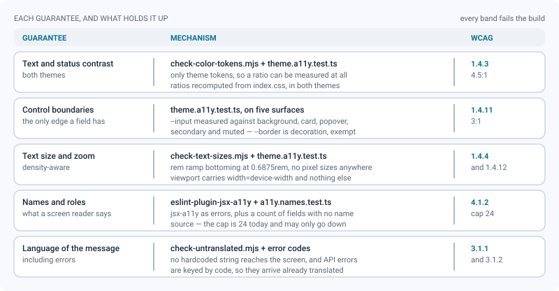
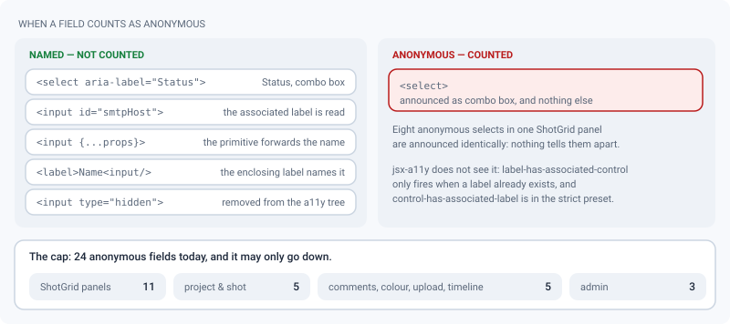

# Accessibility

*What ReView guarantees for WCAG 2.1 AA, what the suite measures on every build, and the debt that is left.*

> Updated: 2026-08-23

ReView aims at WCAG 2.1 level AA. This page states what is **guaranteed**, what is **measured
by the validation suite**, and what is **still missing** — in that order, because a
conformance claim is only worth the tests behind it.

The target audience is a studio workstation: desktop browsers, keyboard and mouse, long
sessions in a dark room. That shapes the priorities — contrast, focus, text size — but does
not remove any obligation. Where a guarantee is measured, the measurement is in the
repository and reruns on every build; where it is not, this page says so.

## What is guaranteed

| Area | Guarantee |
|------|-----------|
| Zoom | The page can be zoomed and reflowed. The viewport meta tag sets `width=device-width, initial-scale=1.0` and nothing else — no `user-scalable=no`, no `maximum-scale` (WCAG 1.4.4). |
| Text contrast | `--foreground` and `--muted-foreground` hold at least 4.5:1 on `--background` in both themes (WCAG 1.4.3). |
| Status contrast | The status hues — `--success`, `--warning`, `--info`, `--destructive`, `--accent-2` — hold 4.5:1 on the page *and* on the `/15` badge that sits on top of it, in both themes. The tightest case is light `--warning` at 4.53:1 on its badge. |
| Control boundaries | `--input`, the border of every text field and select, holds at least 3:1 against `--background`, `--card`, `--popover`, `--secondary` and `--muted` (WCAG 1.4.11). `--border` is decoration only — separators, card edges — and is deliberately not held to that threshold. |
| Text size | The type ramp is expressed in `rem` and bottoms out at `0.6875rem` (11 px). The compact density lowers the root font size to 15 px, so the smallest text on screen is 10.3 px — never below 10. |
| Keyboard focus | A global `:focus-visible` outline is drawn from `--ring` on every focusable element. Primitives that draw their own ring disable it, so there is never a double ring. |
| Dialogs | Every modal goes through the Radix primitive (`components/ui/dialog.tsx`): portal, focus trap, `Escape`, `aria-labelledby` from the title. No hand-rolled overlay. |
| Motion | `prefers-reduced-motion: reduce` sets `--duration-fast` to `0ms`, which removes the colour and layout transitions built on it. |
| Images | Every `img` carries an `alt`; decorative icons are `aria-hidden`. |
| Language | `<html lang>` and `dir` follow the reader's language, set by `applyDocumentLocale()`. |
| Error messages | API errors are translated by their code, so a screen reader announces them in the reader's language rather than in English — see [how a server error reaches the reader's language](i18n.md#how-a-server-error-reaches-the-readers-language). |

> [!NOTE]
> Contrast is only meaningful because **every colour in the interface comes from a theme
> token**. `scripts/check-color-tokens.mjs` refuses a raw Tailwind palette class
> (`bg-blue-500`) or an arbitrary colour (`bg-[#1e293b]`): without that rule the ratios above
> would describe the tokens rather than the screen.

## What the validation suite measures

These run inside `scripts/validate.sh`, so a regression fails the build rather than waiting
for an audit.

| Check | What it enforces |
|-------|------------------|
| `frontend/src/theme.a11y.test.ts` | Recomputes, from `src/index.css` and in **both** themes: the 4.5:1 on `--foreground` and `--muted-foreground`, and the 3:1 of `--input` against the five surfaces. Also checks the typographic floor in both densities and the absence of `user-scalable=no` / `maximum-scale` in `index.html`. |
| `frontend/src/a11y.names.test.ts` | Counts input, select and textarea elements with **no** name source and fails if the count rises. Separately asserts that the kanban status picker — one per card, the worst possible case — carries an `aria-label` on both of its selects. |
| `scripts/check-color-tokens.mjs` | No raw Tailwind palette class and no arbitrary colour: every colour comes from a theme token. |
| `scripts/check-text-sizes.mjs` | No font size in pixels. A `text-[10px]` would ignore the density setting and escape the floor — there were about 160 of them before the rule. |
| `eslint-plugin-jsx-a11y` (recommended set, as errors) | Roles, `alt`, keyboard handlers on interactive elements, label association when a label exists. |
| `scripts/check-untranslated.mjs` | No hard-coded UI string, including strings returned by label functions and label tables — a screen reader must not read French out of a Japanese page. |
| `scripts/check-backend-english.mjs` | Server error messages stay in English, which is what lets the client key them by code and speak them in the reader's language. Without it, a French sentence thrown by a route would be read out on a public share page. |

Two honest caveats about the table above. The **status-hue ratios are measured but not
recomputed**: they were computed at the 2026-08-21 audit, the tuned values and their ratios
are recorded in `src/index.css` next to each token, and the test rechecks the text and
boundary ratios only. And `jsx-a11y` runs the *recommended* preset, not the strict one — see
the next chapter for the rule that is missing from it and what stands in.

## The anonymous-field count

A `select` posted with no name announces itself as "combo box" and nothing else. `jsx-a11y`
does not catch it: `label-has-associated-control` only fires when a `label` already exists,
and `control-has-associated-label` belongs to the strict preset, which is not enabled. So
`a11y.names.test.ts` counts them instead, syntactically — no render, no accessibility tree —
and fails when the total rises.

A field is **named**, and therefore not counted, as soon as it carries any of `aria-label`,
`aria-labelledby`, `id`, `title` or `placeholder`, sits inside a labelling element
(`label`, or a component whose name ends in `Field`), or spreads props from a caller
(`{...props}` — a primitive forwards whatever name it is given). `title` and `placeholder`
are poor names, but the check targets total silence, which is the only unambiguous fault.
Hidden fields are excluded: `type="hidden"` and the file picker hidden behind a styled button
(`className="hidden"`) are out of the accessibility tree, and the visible button carries the
name.

The cap stands at **24**, and it may only go down. Where they are, today:

| Area | Count | Components |
|------|-------|------------|
| ShotGrid panels | 11 | `SgSettingsPanel` (8), `SgDiffPanel`, `SgStepsPanel`, `SgSyncPanel` |
| Project and shot pages | 5 | `ProjectActivity`, `ProjectSettingsTab`, `MembersTab`, `ShotAssets` (2) |
| Comments, colour, upload, timeline | 5 | `ColorPicker` (2), `CommentItem`, `TaskPickerDialog`, `MontagePanels` |
| Administration | 3 | `LoginAppearanceTab` (2), `SmtpTab` |

> [!TIP]
> `SgSettingsPanel` alone holds a third of the debt, and its fields already have visible
> labels next to them. Wiring `id` and `htmlFor` — or an `aria-label` where the layout has no
> room for a label — would take the cap from 24 to 16 in one pass, in one file.

## What is still missing

- **24 form controls have no accessible name** — the table above. They are counted and capped
  by `a11y.names.test.ts`; the cap only ever goes down.
- **`jsx-a11y/control-has-associated-label` is not enabled** (it belongs to the strict
  preset). The count above stands in for it until the remaining controls are named.
- **No right-to-left language is shipped.** The mechanism exists (`dir` on `<html>`, a `dir`
  field per locale) but the code uses physical spacing utilities (`ml-`, `pr-`, `text-left`)
  rather than logical ones (`ms-`, `pe-`, `text-start`), so enabling an RTL language would
  need a sweep first. See [Internationalisation](i18n.md#the-intl-field).
- **No screen-reader pass** has been run on the review viewers — timeline scrubbing,
  annotation tools, the 3D gizmo. The static checks say nothing about them.
- **Touch pinch-zoom over 3D, splat and board canvases has not been re-verified** since the
  viewport was unlocked. If a canvas turns out to swallow or fight the browser gesture, the
  fix belongs on that canvas (`touch-action`), never back on the viewport.
- **The drag-only interactions have no documented keyboard path**: the curve editor handles,
  the wipe divider, and the numeric field's drag-to-scrub — that last one does accept typed
  input, which is the accessible path.
- **The viewer surfaces delivered on 2026-08-22 are in the same un-audited category**, and
  they widened it. Four of them are pointer-driven by nature and were shipped without a
  keyboard or screen-reader review:

  | Surface | The gesture, and what has no equivalent yet |
  |---|---|
  | Audio waveform strip | Scrubbing by dragging under the timeline |
  | Video zoom and pan | Wheel to zoom, drag to pan — the keyboard shortcuts exist, the pan does not announce its position |
  | Live pointers in a review room | Each participant's cursor is broadcast; there is no non-pointer way to point |
  | CSV import mapping | A preview table of column pickers, several of which are `select` elements sitting in a scrolling grid |

## Reporting a problem

Accessibility defects are ordinary bugs: open an issue with the page, the assistive technology
and its version, and what you expected to hear or see. A regression that one of the checks
above should have caught is worth reporting as two bugs — the defect, and the blind spot.

Fixes to this page are welcome too — see [CONTRIBUTING](../../CONTRIBUTING.md).

## Related pages

- [Internationalisation](i18n.md) — how a message reaches the screen in the reader's language
- [Validation and tests](validation-and-tests.md) — the full suite and how to run it
- [Conventions](conventions.md) — theme tokens, UI primitives, component budgets
