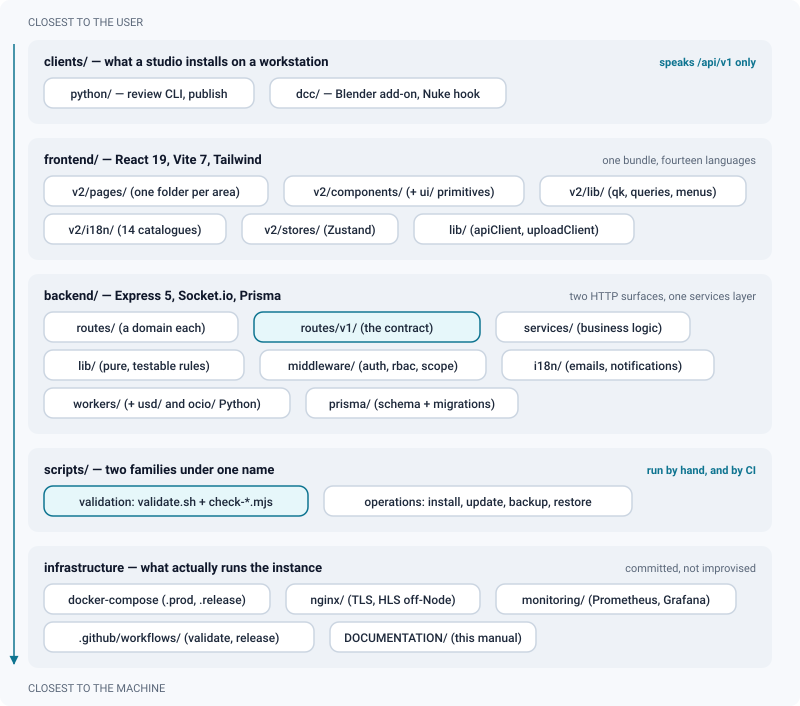
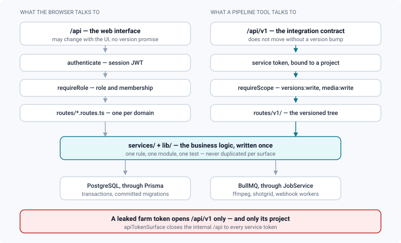

# Code structure

*Where every kind of code lives — clients, frontend, backend, workers, operations — and the path a feature travels through them.*

> Updated: 2026-08-23

ReView is one repository holding five kinds of code that answer to different masters: what a
studio installs on an artist's workstation, what a browser downloads, what the server runs,
what checks all of it, and what deploys it. They are separate folders because they have
separate release rhythms — a Blender add-on on a farm node cannot be redeployed as casually
as a React component.

Read this page before your first change. It says where a thing goes; [Conventions](conventions.md)
says how to write it once you are there.

## The shape of the repository



```
ReView-app/
├── docker-compose.yml           # dev stack: postgres, minio, redis, backend, worker, frontend
├── docker-compose.prod.yml      # production overlay: nginx, monitoring, no source mounts
├── docker-compose.release.yml   # the same, from published images instead of a local build
├── DOCUMENTATION/               # this manual (English, committed, served on /docs)
├── monitoring/                  # Prometheus targets, alert rules, Grafana provisioning
├── nginx/                       # TLS termination, and HLS segments served without Node
├── scripts/                     # two families: the validation checkers, and operations
├── clients/
│   ├── python/                  # the client and the `review` CLI — standard library only
│   └── dcc/                     # Blender add-on, Nuke menu and afterRender hook
├── backend/
│   ├── prisma/schema.prisma     # single source of truth for the data model
│   ├── prisma/migrations/       # committed, generated by `prisma migrate dev`
│   └── src/
│       ├── server.ts, app.ts    # bootstrap Express + Socket.io, router mounting
│       ├── config/env.ts        # Zod-validated environment; refuses to start without it
│       ├── i18n/                # server-side catalogs (emails, notifications)
│       ├── lib/                 # prisma, redis, jwt, errors, hls, pagination, safeFetch, metrics…
│       ├── middleware/          # auth (JWT), rbac, scope (v1), validate (Zod), error, rateLimit
│       ├── services/            # business logic, one file per domain
│       │   └── shotgrid/        # the integration, split by concern (see below)
│       ├── workers/             # ffmpeg, shotgrid, webhook, maintenance, storageCleanup,
│       │   ├── usd/             #   timelineExport, spatialThumb — plus two folders
│       │   └── ocio/            #   of Python helpers, compiled by the validation suite
│       ├── integration/         # *.itest.ts — run against the Docker stack
│       └── routes/              # one thin router per domain (≤ 200 lines)
│           └── v1/              #   the versioned integration API, mounted on /api/v1
└── frontend/
    ├── e2e/                     # Playwright: the smoke path, and the documentation captures
    ├── scripts/build-docs.mjs   # DOCUMENTATION/ → public/docs + manifest
    └── src/
        ├── v2/                  # the app
        │   ├── App.tsx          # routing
        │   ├── components/ui/   # shadcn-style primitives (shared)
        │   ├── components/      # annotation, chat, comments, entity, palette, production,
        │   │                    #   shell, shotgrid, tokens, upload
        │   ├── pages/           # one folder per area (review, project, admin, kanban…)
        │   ├── i18n/            # 14 catalogs + the t() runtime
        │   ├── lib/             # query keys, query hooks, menus, shortcuts, infiniteList…
        │   ├── stores/          # Zustand (auth, density, theme, recents…)
        │   └── types/api.ts     # one entity = one type definition
        ├── lib/                 # apiClient, uploadClient
        └── stores/              # Zustand (global uploads)
```

> [!NOTE]
> `scripts/` holds two unrelated families under one name. The checkers (`validate.sh` and the
> `check-*.mjs` it chains) run on your machine and in CI; the operations scripts
> (`install.sh`, `update.sh`, `backup.sh`, `restore.sh`) run on a studio's server, on data
> nobody will ever see again. Do not put a checker's assumption inside an operations script.

## Two API surfaces, one services layer

The backend answers on two HTTP trees, and the difference between them is a promise, not a
prefix. `/api` serves the web interface and moves whenever the interface does. `/api/v1` is
the integration contract: it is what the Python client, the Blender add-on and a studio's
render farm call, and it does not change shape without a version bump.



| | `/api` | `/api/v1` |
|---|---|---|
| Who calls it | The browser, on a session | A pipeline tool, on a service token `rvk_…` |
| Identity | Session JWT (`middleware/auth.ts`) | Service token bound to one project (`lib/apiTokens.ts`) |
| Permission | `requireRole` + membership filtering | The same, **plus** `requireScope` (`middleware/scope.ts`) |
| Stability | Follows the UI | Versioned; a breaking change means `/api/v2` |
| Rate limit | The global limiter | Its own window: 10 000 requests per 15 minutes |
| Router files | `backend/src/routes/*.routes.ts` | `backend/src/routes/v1/` |

A scope is a `domain:action` pair — `versions:write`, `media:read` — declared per route.
`lib/apiScopes.ts` holds the catalogue, and it deliberately only lists what a route really
guards: a scope that protects nothing is worse than an absent one, because it gets ticked
when a token is created and suggests a boundary that does not exist. A route that touches two
families names both, so publishing from a DCC needs `versions:write` **and** `media:write`.

Two guards make a leaked farm token survivable. `assertTokenProject` refuses a request that
resolves to a project the token is not bound to, and `apiTokenSurface` — mounted on `/api` —
refuses a service token anywhere outside `/api/v1`, answering `API_TOKEN_V1_ONLY`. Both
surfaces then call the same `services/`: business logic is written once, and never once per
surface. See [v1 integration](../api/v1-integration.md) and
[Authentication](../api/authentication.md).

## Where things go

| You are adding | It belongs in |
|---|---|
| A new HTTP endpoint for the interface | `backend/src/routes/<domain>.routes.ts`, mounted in `app.ts` |
| An endpoint a pipeline tool will call | `backend/src/routes/v1/<domain>.routes.ts` + a `requireScope` |
| The logic behind either | `backend/src/services/<Domain>Service.ts` |
| A reusable, side-effect-free rule | `backend/src/lib/<thing>.ts`, with `<thing>.test.ts` next to it |
| An outbound HTTP call | Never `fetch` — `backend/src/lib/safeFetch.ts` |
| A bounded list endpoint | The shared helpers of `backend/src/lib/pagination.ts` |
| A background job | `backend/src/workers/<name>.worker.ts` + an enqueue helper in `services/JobService.ts` |
| A Prometheus metric | `backend/src/lib/metrics.ts`, exposed on `GET /metrics` |
| A dependency health probe | `backend/src/routes/health.routes.ts` (`/live`, `/ready`) |
| A screen | `frontend/src/v2/pages/<area>/` |
| A widget used by two screens | `frontend/src/v2/components/` |
| A generic primitive (dialog, menu, badge) | `frontend/src/v2/components/ui/` |
| A query key | `frontend/src/v2/lib/query.ts` (`qk`) |
| A fetch or mutation hook | `frontend/src/v2/lib/queries.ts`, or `lib/<domain>Api.ts` for a large domain |
| A list screen that can grow past one page | `frontend/src/v2/lib/infiniteList.ts` + `components/ListSentinel.tsx` |
| Pure UI logic worth testing (menu shapes, filters, formatting) | `frontend/src/v2/lib/<thing>.ts` + `<thing>.test.ts` |
| A user-visible string | `frontend/src/v2/i18n/messages/*.json`, via `scripts/i18n-add.mjs` |
| An email or notification string | `backend/src/i18n/messages/*.json`, same script with `--set=backend` |
| A manual page | `DOCUMENTATION/<section>/<page>.md`, registered in `frontend/scripts/build-docs.mjs` |
| A task an operator runs on their server | `scripts/*.sh`, with its invariants in `scripts/ops-scripts.test.mjs` |

Four rules explain most of that table:

- **Routes are thin**: validate (Zod) → call a service or a lib → respond. Business logic
  lives in `services/` and `lib/`, testable in isolation. The suite enforces the shape by
  refusing any route file over 200 lines.
- **One entity, one type** (`v2/types/api.ts`), composed with `Pick` and intersections —
  never re-declared locally, because two declarations of the same shape drift apart in a
  week.
- **Data fetching is TanStack Query only**: keys in `lib/query.ts` (`qk.*`), hooks in
  `lib/queries.ts` or a per-domain `*Api.ts`; mutations invalidate targeted keys and give
  user feedback.
- **Size budgets**: a component or a page at 300 lines of code, a backend route file at 200 —
  enforced by ESLint `max-lines` and by the validation script respectively.

Tests are **colocated**: `DepartmentService.ts` and `DepartmentService.test.ts` sit in the
same folder. Integration tests are the exception — they live in `backend/src/integration/`
as `*.itest.ts` because they need the Docker stack.

## A feature end to end

The department picker is a compact example of the whole path. Reading these five files in
order shows the shape every feature follows.

| Layer | File | What it does |
|---|---|---|
| Route | `backend/src/routes/departments.routes.ts` | Declares the Zod schemas, applies `authenticate` and `requireRole`, calls the service |
| Service | `backend/src/services/DepartmentService.ts` | Resolves project → studio inheritance, validates that a step belongs to the project or the studio |
| Types | `frontend/src/v2/types/api.ts` | The `Department` shape, shared by every consumer |
| Query layer | `frontend/src/v2/lib/departmentsApi.ts` | `useDepartments`, `useSetEntityDepartments`, `useToggleEntityDepartment` and their invalidations |
| UI | `frontend/src/v2/lib/assignMenu.ts` + `useAssignMenu.tsx` | Pure menu description, then the hook that renders it and writes |

Two details from that file are worth copying rather than rediscovering:

- The router is mounted on `/api` because it serves several prefixes (`/departments`,
  `/projects/:id/departments`). It therefore **must not** call `router.use(authenticate)`:
  Express would run it for every request crossing that mount point, public routes included.
  Authentication is applied route by route.
- The menu is described as data in a pure module and rendered by a hook. That split is what
  makes the shape testable without a DOM, and it keeps the component under its line budget.

### A list is a contract on both sides

Any list that can outgrow one screen is written twice, and the two halves have to agree.

On the server, `lib/pagination.ts` provides the shared Zod query schema and the envelope
every list endpoint answers with:

```ts
{ items, total, page, pageSize, pageCount, hasMore }   // and nextCursor in cursor mode
```

`DEFAULT_PAGE_SIZE` is 100 — what a screen gets when it asks for nothing — and
`MAX_PAGE_SIZE` is 500, beyond which it is not a page but an export. The two used to be the
same number, which meant a caller could never ask for more than it was already being served
and the pagination existed only on paper. Large lists (shots, tasks) also accept an opaque
`cursor`, which neither duplicates nor skips a row when a creation slips in mid-read, and
spares Postgres from walking N rows before returning any.

On the client, `lib/infiniteList.ts` stacks the pages, de-duplicates by `id` and says how
many rows are loaded out of how many exist; `components/ListSentinel.tsx` renders that
counter plus a sentinel that asks for the next page 400 px before the bottom, and carries a
real button so the list is reachable without an `IntersectionObserver` and from the keyboard.

> [!WARNING]
> A screen that consumes `items` and throws the rest of the envelope away is lying: it shows
> a hundred shots out of twelve hundred, and nothing on screen says so. If you add a list
> endpoint, add its counter and its sentinel in the same change.

## What a studio installs on a workstation

`clients/` is the only part of the repository that leaves the server. It is a standard
library only Python package — no `requests`, nothing to install on a farm node — targeting
Python 3.10 and importable on the 3.8 and 3.9 interpreters older DCCs still ship.

| Path | What it is |
|---|---|
| `clients/python/review/client.py` | The session: retries, errors, the `/api/v1` calls |
| `clients/python/review/publish.py` | Publish a render: creates the missing sequence, shot and task, uploads, publishes |
| `clients/python/review/cli.py` | The `review` command (`python -m review whoami`, `review publish …`) |
| `clients/python/review/dcc.py` | What a DCC integration needs to open the right file |
| `clients/dcc/blender_review_publish.py` | Blender add-on |
| `clients/dcc/nuke_review_publish.py` | Nuke menu entry and `afterRender` hook |
| `clients/python/tests/` | Its own test suite — `python -m unittest discover -s . -t .`, standard library only |

Three environment variables drive all of it, normally set by the studio launcher:
`REVIEW_URL`, `REVIEW_TOKEN` (a service token, bound to the project) and `REVIEW_PROJECT`.

> [!IMPORTANT]
> `clients/` is outside the roots scanned by `scripts/add-license-headers.mjs`, and its
> Python tests are run by neither `validate.sh` nor CI. A file added here gets no SPDX header
> and no test run unless you do it yourself. Copy the header from a neighbouring file and run
> the client tests by hand until that gap is closed.

Reference documentation: [Python client](../api/python-client.md) and
[v1 integration](../api/v1-integration.md).

## Reading the ShotGrid integration

`backend/src/services/shotgrid/` is the largest service folder and the one where the split
carries the most meaning. Each file is one concern, and the boundaries are the ones that were
paid for in bugs.

| File | Responsibility |
|---|---|
| `ShotgridClient.ts` | HTTP transport, auth, retries, streaming downloads — through `safeFetch` |
| `ShotgridConfigService.ts` | Sites and per-project connections; the remote project name is re-checked before every sync |
| `shotgridSettings.ts` | The settings schema, `can()`, URL safety checks |
| `shotgridProjectGuard.ts` | Project isolation: `projectFilter`, `belongsToProject` |
| `shotgridTemplateGuard.ts` | Refusal to link or write inside a template project |
| `ShotgridGuardService.ts` | Local-creation lock: on a project driven from ShotGrid, a shot created in ReView would be an orphan |
| `ShotgridSyncService.ts` | Orchestration, single-flight, merging of deferred requests |
| `ShotgridSyncPasses.ts` | Which passes to run, and on which entities — running them all every time was wrong twice over |
| `ShotgridSyncJournal.ts` | The run journal, stored as i18n key plus variables so it reads back in the reader's language |
| `ShotgridPullService.ts` | Hierarchy import, conflict arbitration, status patching |
| `ShotgridPushService.ts` | Every ReView → ShotGrid write, one function per job type |
| `ShotgridEventService.ts` | Event-driven incremental sync, from a webhook or the site's event log |
| `ShotgridVersionSync.ts` | Versions, media transfer, published files |
| `ShotgridVersionLookup.ts` | Does a Version with this code already exist on the site, before creating a duplicate? |
| `ShotgridMediaNaming.ts` | Realigns the names of media imported before the naming rule, on re-read rather than by migration |
| `ShotgridNoteSync.ts` | Notes ↔ comments, both directions |
| `ShotgridNoteAttachments.ts` | Attachments of a note → attachments of the comment; this is how the flattened annotation image travels |
| `ShotgridPlaylistSync.ts` | ShotGrid playlists ↔ dailies playlists, order preserved |
| `ShotgridStatusSync.ts` | Status reference data, both directions |
| `ShotgridSteps.ts` | Pipeline Steps → ReView departments |
| `ShotgridEpisodes.ts` | The optional episode level |
| `ShotgridCrewService.ts` | Bringing the remote project crew into ReView |
| `ShotgridTouched.ts` | What a pass actually touched — one batched emission instead of twelve thousand |
| `ShotgridConflictService.ts` | Manual conflict resolution |
| `ShotgridDiffService.ts` | The comparison report (read-only) |
| `ShotgridSchedule.ts` | Repeatable jobs — deliberately creates **no** `Worker` |

`ShotgridSchedule.ts` is separate from `shotgrid.worker.ts` for a reason that generalises: a
module that a route may call must never instantiate a queue consumer, or the API process
starts competing with the worker for jobs.

See [ShotGrid integration](../admin-guide/shotgrid-integration.md) for the behaviour these
files implement.

## Operations and infrastructure as code

What runs an instance is committed next to what it runs. A studio that installs ReView never
edits a configuration file by hand, and neither should you.

| Path | What it does |
|---|---|
| `scripts/install.sh` | Interactive installer: secrets, domain, timezone, data root, TLS mode, nginx configuration, first boot, health check, then the setup URL |
| `scripts/update.sh` | Backup, switch, migrations, health probe — and an automatic rollback if the probe fails |
| `scripts/backup.sh` | PostgreSQL dump plus an object **mirror**, timestamped, with rotation (`BACKUP_KEEP`) |
| `scripts/restore.sh` | `all`, `db`, `minio` or a non-destructive `verify` against a backup folder |
| `docker-compose.yml` | The development stack |
| `docker-compose.prod.yml` | Production overlay: nginx in front, monitoring, no source mounts |
| `docker-compose.release.yml` | The same from published images, for a studio that does not build |
| `nginx/nginx.conf` | TLS termination, and HLS segments served without traversing Node |
| `monitoring/` | Prometheus targets, `rules/alerts.yml`, provisioned Grafana datasource and dashboard |
| `.github/workflows/validate.yml` | The validation suite, twice, on every push and pull request |
| `.github/workflows/release.yml` | Tag guard, the suite again, image build and publication, GitHub release |

These files pass through no compiler, so their invariants are locked by tests instead:
`ops-scripts.test.mjs`, `infra-config.test.mjs`, `release-config.test.mjs` and
`hls-delivery.test.mjs` all run inside the ordinary unit test step. They exist because the
regressions they catch — a default secret surviving installation, an update that switches
without a backup, an nginx path that quietly routes video back through the API — are invisible
until the day they are not.

See [Installation](../getting-started/installation.md), [Updating](../getting-started/updating.md),
[Backups](../infrastructure/backups.md) and [Monitoring](../infrastructure/monitoring.md).

## Related pages

- [Conventions](conventions.md)
- [Validation & tests](validation-and-tests.md)
- [Internationalisation](i18n.md)
- [Licensing](licensing.md)
- [Writing documentation](documentation-style.md)
- [Architecture](../infrastructure/architecture.md)
- [Jobs & workers](../infrastructure/jobs-and-workers.md)
- [v1 integration](../api/v1-integration.md)
