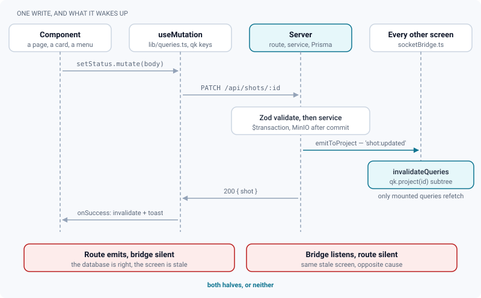
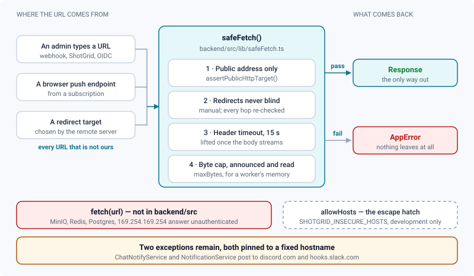

# Conventions

*The house rules a change must satisfy: languages, licensing, data fetching, layout, right-click, and the backend's safety rules.*

> Updated: 2026-08-23

These are the rules that are not obvious from reading the code, and that cost a bug each time
they were rediscovered. [Code structure](code-structure.md) says *where* a thing goes; this
page says *how* it is written once it is there. Everything below is checked by
[`scripts/validate.sh`](validation-and-tests.md) unless the text says otherwise.

## Languages and commits

- **Code comments and commit messages: French.**
- **UI text is never hardcoded**: everything goes through `t()`, with English-first catalogues
  in fourteen languages — see [Internationalisation](i18n.md).
- **Backend error messages: English**, because they reach the screen verbatim, including on
  the public client-share page. See [Errors travel as a code](#errors-travel-as-a-code).
- **This documentation: English**, including the figures.
- Commits use the prefixes `feat:` / `fix:` / `refactor:` / `chore:` / `docs:` / `test:`, on
  the single `dev` branch.

A commit message states the problem before the solution, because the diff already shows the
solution:

```
fix(shotgrid): réparer la synchronisation des statuts de bout en bout

- runSync jetait toute demande arrivée pendant qu'une passe tournait, en la
  déclarant réussie. Les demandes sont désormais fusionnées et rejouées.
- conflictPolicy n'était lu nulle part : « ReView gagne » se comportait comme
  « ShotGrid gagne ».
```

> [!TIP]
> `git log` is the project's long-term memory: the plans and journals are not committed, the
> messages are. A commit that says what broke is worth three that say what changed.

## Licensing headers and dependencies

Every source file carries the SPDX header. Do not type it by hand — run the generator, which
is idempotent, preserves the file's line endings, and slips the header under a shebang rather
than above it:

```bash
node scripts/add-license-headers.mjs
```

```ts
// SPDX-FileCopyrightText: 2026 Yvig Bidon
// SPDX-License-Identifier: AGPL-3.0-or-later
```

| What the generator covers | Detail |
|---|---|
| Comment style `//` | `.ts`, `.tsx`, `.js`, `.jsx`, `.mjs`, `.cjs`, `.prisma` |
| Comment style `#` | `.sh`, `.py` |
| Block comment | `.css` |
| Scanned roots | `backend/src`, `backend/scripts`, `backend/prisma`, `frontend/src`, `frontend/scripts`, `frontend/e2e`, `scripts` |
| Named extras | The nine package-root config files (`vitest.config.ts`, `eslint.config.js`, `playwright.config.ts`, `tailwind.config.js`…) |
| Never scanned | `node_modules`, `dist`, `build`, `coverage`, `generated`, `migrations` |

> [!IMPORTANT]
> The scan stops at those seven roots. A file created under `clients/`, `monitoring/` or
> `nginx/` gets **no header and no failure** — the check passes and the file ships
> unlicensed. Copy the two lines from a neighbouring file when you add one there.

A new dependency must be AGPL-compatible and is followed by
`node scripts/generate-notices.mjs`, which refuses anything outside the allow-list. Both
checks run first in `validate.sh`, before anything is compiled. Details:
[Licensing](licensing.md).

## Frontend

- **TypeScript strict**; no unjustified `any`; ESLint and Prettier clean, zero warnings.
- **Theme tokens only** for colours (`bg-primary`, `text-muted-foreground`…) — never raw
  Tailwind palette classes. `scripts/check-color-tokens.mjs` rejects `bg-blue-500` and
  arbitrary values like `bg-[#1e293b]`.
- Reusable primitives live in `src/v2/components/ui/`; no hand-rolled overlays.
- Never define a component inside another component's render.
- **Simple UI rule**: a new action goes to the right-click context menu, the Ctrl+K palette, a
  contextual HUD or a shortcut first — a visible button is the last resort.

### Data fetching

Fetching in a `useEffect` is not allowed, and ESLint rejects it outright. Every read is a
TanStack Query hook keyed from `qk` (`lib/query.ts`), and every mutation invalidates the keys
it touched **and** gives feedback:

```tsx
const qc = useQueryClient();
const setStatus = useMutation({
  mutationFn: (body: StatusPatch) => api.patch(`/api/shots/${id}`, body),
  onSuccess: async () => {
    await qc.invalidateQueries({ queryKey: qk.project(projectId) });
    toast.success(t('status.updated'));
  },
});
```

Keys are hierarchical on purpose: invalidating `qk.project(id)` also invalidates
`qk.projectActivity(id)`, `qk.projectSettings(id)` and the rest of that subtree.

Server-pushed changes go the same way. Routes emit with `emitToProject`, and
`lib/socketBridge.ts` translates each socket event into targeted invalidations — an
invalidation only refetches queries that are currently mounted, so screens that do not display
the entity pay nothing.



> [!WARNING]
> **A backend write that users watch live must emit its event, and the bridge must listen for
> it.** Several kinds of update reached the database but never reached an open screen because
> one half of that pair was missing — and the symptom is identical whichever half is absent:
> the data is right and the screen is stale.

### Lists that can outgrow one screen

A list endpoint answers with the shared envelope of `lib/pagination.ts` — `items`, `total`,
`page`, `pageSize`, `pageCount`, `hasMore`, and `nextCursor` in cursor mode. A list screen
must consume all of it:

- stack the pages with `lib/infiniteList.ts`, which also de-duplicates by `id` — in
  page/pageSize mode a creation slipping in mid-read shifts everything and page 2 repeats a
  row of page 1;
- render `ListCount` and the sentinel of `components/ListSentinel.tsx`, so the screen says
  *300 of 2041 loaded* instead of implying that 300 is all there is;
- keep the sentinel's button, which is the only command reachable from the keyboard and
  without an `IntersectionObserver`.

The server defaults to 100 rows and refuses more than 500. Do not raise the ceiling to avoid
paginating a screen: past 500 rows it is an export, and exports have their own routes.

### Layout

- Pages render `PageShell`, never the `Shell` itself: `Shell` is a router layout mounted once
  for every authenticated route, and pages live in its `<Outlet/>`. Titles and breadcrumbs are
  portalled into the top bar.
- `PageShell` takes a `width`, and the gutter belongs to the container, not to `<main>`:

  | Value | Rendering | Used by |
  |---|---|---|
  | `default` | Centred, capped at 1600 px, 24 px gutter | Every data page |
  | `fluid` | Full width, same gutter | Kanban, board |
  | `flush` | Full width, no gutter, full height | Review, timeline player |

- Page headers use `PageHeader` (`components/ui/page.tsx`), which wraps title and actions onto
  separate lines instead of squeezing them.
- Supported window widths: **900 px to 3440 px**. Below 1100 px (`NARROW_WIDTH_QUERY` in
  `lib/useMediaQuery.ts`) the sidebar collapses on its own and overlays the content when
  reopened.
- Tab bars overflow into a `…` menu (`components/Tabs.tsx`); never horizontal scrolling, which
  pushes the whole page sideways.

### Right-click

- Right-click is **only** for business menus attached to a target. On anything else nothing
  opens, and the browser menu stays blocked (`ContextMenuGuard`). Page-wide actions belong in
  the Ctrl+K palette.
- Never call `preventDefault` on `contextmenu` inside a `ContextMenuTrigger`: Radix composes
  handlers with `checkForDefaultPrevented`, so the business menu would silently never open.
- Describe menus as data (`lib/menuSpec.ts`) and render them with
  `components/ui/entity-menu.tsx`, which also handles keyboard opening (Menu key / Shift+F10)
  and nesting.
- No action may exist *only* behind a right-click: mirror it in Ctrl+K.
- When a clicked card belongs to the current multi-selection, the action applies to the whole
  selection (`lib/entityActions.ts`).

A menu is a value, so its shape is unit-testable without a DOM:

```ts
const entries: MenuEntry[] = [
  { id: 'open', label: t('entity.open'), onSelect: open },
  separator('status'),
  {
    kind: 'submenu',
    id: 'status',
    label: t('status.title'),
    // A radio group, not a list of actions: the current status is *ticked*,
    // instead of being guessed from the colour of a dot.
    items: [{ kind: 'radiogroup', id: 'status', value: current, onValueChange: setStatus, items }],
  },
];
```

`tidyMenu` runs before rendering: it drops empty submenus and removes leading, trailing and
duplicated separators, so a menu whose actions are half hidden by permissions does not show
lines in the void. It handles radio groups *before* the separator branch — the **Status**
submenu contains nothing else, and counting a group as "not an entry" would throw away a
submenu that is in fact full.

### Colour and type

- Status colours coming from data (ShotGrid, studio) go through `statusSwatch()`
  (`lib/contrast.ts`), which keeps the hue and fixes the lightness so text holds 4.5:1 in both
  themes.
- Theme status tokens must pass WCAG AA on the page background *and* on a `bg-X/15` badge —
  enforced by `lib/themeTokens.test.ts`.
- Font sizes use the rem ramp (`text-2xs`, `text-xs`, …). Pixel sizes are rejected by
  `scripts/check-text-sizes.mjs`: they ignore the density setting, which scales the root font
  size while everything else is sized in `rem`.
- Focus rings are global (`:focus-visible` in `index.css`); never remove an outline without
  providing a replacement. See [Accessibility](accessibility.md).

## Backend

- **Every input Zod-validated** (`middleware/validate`); never touch raw `req.body` or
  `req.query`.
- **RBAC on every route** (`authenticate` + `requireRole`); reads filtered by membership. A
  route also reachable through `/api/v1` declares its scope on top of that, with
  `requireScope` — see [two API surfaces](code-structure.md#two-api-surfaces-one-services-layer).
- Multi-step writes in `prisma.$transaction`; MinIO effects after commit.
- Typed errors from `lib/errors` (`badRequest`, `unauthorized`, `forbidden`, `notFound`,
  `conflict`), each carrying a stable code; pino logging, never `console.log`.
- Schema changes only via `prisma migrate dev`, with the migration committed.

A route reads like a declaration, not like a program:

```ts
const bodySchema = z.object({ name: z.string().min(1).max(60) });

router.post(
  '/projects/:projectId/departments',
  authenticate,
  requireRole(Role.ADMIN, Role.SUPERVISOR),
  validate({ params: projectParam, body: bodySchema }),
  async (req, res) => {
    res.status(201).json({
      department: await DepartmentService.create(Number(req.params.projectId), req.body),
    });
  },
);
```

Three traps that have each cost a bug:

- **A router mounted on `/api` must never call `router.use(authenticate)`.** Express runs it
  for every request crossing the mount point, public routes included — client shares answered
  `401` instead of serving the page. Apply authentication route by route.
- **Never widen a permission by merging defaults.** When a client sends only the section it
  changed, merge one level deep from the *normalised* current value. A flat merge re-parses
  the untouched sections with their schema defaults, and defaults are usually permissive.
- **A fallback fails closed.** If configuration cannot be parsed, fall back to the restrictive
  shape, never to the schema defaults.

### Outbound requests go through one gate

The API and the workers run **inside** the application network, where MinIO, Redis, Postgres,
Grafana and — on a cloud host — the metadata service on `169.254.169.254` answer without
authentication. A URL that comes from anywhere else is therefore a capability to make
arbitrary requests from that network, and never goes to `fetch` as it is.



`lib/safeFetch.ts` bundles the four protections that only work together:

| # | Protection | Why it cannot be split off |
|---|---|---|
| 1 | `assertPublicHttpTarget` on the resolved address | http(s) only, and refusal if **any** resolved address of the name falls in an internal range |
| 2 | `redirect: 'manual'` | A redirect is a second request to a target nobody vetted — the classic way around a check done before the call. Each followed hop is re-checked, and only GET/HEAD are replayed |
| 3 | Timeout on the **headers** (15 s by default) | Deliberately lifted once the body streams: a dailies master takes longer than thirty seconds, and cutting mid-stream broke the ShotGrid sync |
| 4 | `maxBytes` | Both the announced `Content-Length` and the bytes actually read, so a remote server cannot inflate a worker's memory |

Failures are typed: `OutboundBlockedError` (502), `OutboundTimeoutError` (504),
`OutboundTooLargeError`. `allowHosts` is the single escape hatch, and exists for the
development ShotGrid simulator (`SHOTGRID_INSECURE_HOSTS`), which lives on a private address
on purpose.

> [!CAUTION]
> Two bare `fetch` calls remain in `backend/src`, in `ChatNotifyService` and
> `NotificationService`, and they are only safe because the hostname is pinned before the
> call — `discord.com`, `discordapp.com`, `hooks.slack.com`, over https, checked in
> `lib/sanitize.ts`. Do not take them as precedent: a new outbound call goes through
> `safeFetch`.

### Errors travel as a code

The server writes its messages in **English** and attaches a stable `code`; the interface
translates by that code. `apiClient` looks up `error.<CODE>` in the catalogue and falls back
to the server's English text when the code is absent from the catalogue or from the
response — an untranslated error stays readable, and is never replaced by its key.

```ts
throw conflict('A project already uses this code', 'CODE_TAKEN');
```

Two consequences worth internalising:

- **Callers test the code, never the text.** The text is a trace; the code is the fault.
- **A French message is a bug, not a style issue.** It reaches the screen verbatim, including
  on the public client-share page where the reader is not even a studio employee.
  `scripts/check-backend-english.mjs` fails the suite on French function words in a thrown
  message, and it looks at the words, not the accents: *Media introuvable* carries none and
  is still French.

### Naming and side effects

- Services export named functions, not classes, unless they hold state.
- A function that queues work is named `enqueue*` and never throws into the caller's path: a
  remote system being down must not fail a local action.
- A pure rule worth testing gets its own module — `arbitrate(policy)`,
  `statusPatch(code, statuses)`, `mergeSyncOptions(a, b)` are all one-line decisions extracted
  so the decision itself has a test.
- A module a route may call must never instantiate a BullMQ `Worker`, or the API process
  starts competing with the worker for jobs.

## Testing

- New code ships with tests (vitest backend and frontend, happy-dom on the frontend,
  colocated).
- Never comment out, skip or delete a test to get the suite green — `@vitest/eslint-plugin`
  fails on `.only`, `.skip` and a commented-out test before the suite even runs.
- Prefer testing the pure module over the component: `statusMenu.test.ts` covers what the menu
  offers and what it PATCHes; the hook that renders it needs no DOM assertions.
- Configuration that no compiler reads gets a test too — compose files, nginx, the operations
  scripts and the CI workflow all have one under `scripts/`.

> [!TIP]
> When a bug turns out to be a one-line decision buried in a component or a route, extract the
> decision into `lib/` before fixing it. The fix then has a test, and the next reader finds
> the rule instead of reconstructing it.

## Related pages

- [Code structure](code-structure.md)
- [Validation & tests](validation-and-tests.md)
- [Internationalisation](i18n.md)
- [Accessibility](accessibility.md)
- [Licensing](licensing.md)
- [Writing documentation](documentation-style.md)
