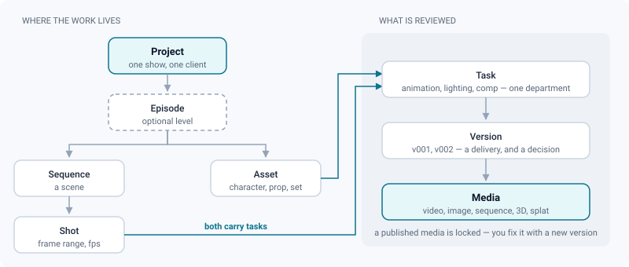

# Writing documentation

*The shape of a page, the five callouts, and the figure contract every diagram must honour.*

> Updated: 2026-08-23

`DOCUMENTATION/` is a deliverable, not a scratchpad. It is committed with the code, read on
GitHub, and served inside the application at `/docs` — where a reader browses it by chapter,
follows links between pages, and reads it in the interface language of their choice while the
prose itself stays English.

That double life is the reason for the conventions below. A page that follows them looks
right in both places and is checked mechanically by `node scripts/check-docs.mjs`, which the
validation suite runs. A page that does not is not rejected for style: it loses its subtitle,
its date, or its figure.

## The shape of a page

Every page opens with the same three lines, in this order and nothing between them:

```markdown
# Video review

*Frame-accurate playback, comparison modes and timeline markers for delivered shots.*

> Updated: 2026-08-23
```

| Line | What it becomes |
|------|-----------------|
| `# Title` | The page title, in the table of contents and in the reader header |
| `*One-line subtitle.*` | The subtitle under the title, and part of what the search box matches |
| `> Updated: YYYY-MM-DD` | The date shown in the reader header, formatted in the reader's language |

The reader renders those three from the manifest and **removes them from the body**: writing
them is not duplication, it is how the header gets filled.

Then the body, in `##` chapters. Chapters are the unit the reader navigates: they appear as a
sub-menu under the open page, and the one being read is highlighted as you scroll. Aim for
three to eight of them, each answering one question a reader actually has. `###` splits a
chapter that has genuinely distinct parts; `####` is a last resort.

### Voice

- **Second person, present tense.** "Press `I` to set the loop in point", not "the user may".
- **Say what happens, then what it costs.** A limit, a lock or a side effect belongs in the
  same paragraph as the feature it constrains, not in a caveats section at the bottom.
- **Name the surface exactly as the interface does** — `Admin → Settings → Storage`, the
  `Reprocess` entry of the right-click menu, the `I/O` chip in the transport.
- **English, and the production glossary stays in English everywhere**: shot, sequence,
  dailies, playblast, version, annotation, review, board, kanban, retake. See
  [Internationalisation](i18n.md).

## Callouts

Five callouts, in GitHub alert syntax. They render as coloured boxes in the application and
on GitHub, with the label translated into the reader's language in the app.

```markdown
> [!NOTE]
> Neutral aside — context a careful reader wants, and can skip.

> [!TIP]
> A faster way to do what the paragraph just described.

> [!IMPORTANT]
> Something the reader must know to succeed at the task on this page.

> [!WARNING]
> An action with consequences: data movement, a lock, a cost.

> [!CAUTION]
> Irreversible, or a security exposure.
```

> [!TIP]
> One callout per chapter at most. A page of coloured boxes has no emphasis left — the
> reader stops seeing them and reads the plain paragraphs instead.

## Tables

Tables carry facts with a shape: a setting and its default, a role and its permissions, a
shortcut and what it does. They render with a header band and a scrolling frame, so a wide
table is fine.

| Column | Rule |
|--------|------|
| First column | The thing being looked up — the key the reader scans |
| Values | Written as the interface writes them, in `code` when they are literal |
| Defaults | Always stated, never implied |

Prose that happens to have three items is a list, not a table.

## Figures

A figure earns its place by showing a structure prose has to spell out slowly: an order of
operations, a hierarchy, a state machine, the anatomy of a screen, who may do what. A figure
that repeats the sentence next to it is decoration; delete it.

Figures are **hand-written SVG**, committed to `assets/<section>/<slug>.svg`, and referenced
like any image. The alt text becomes the visible caption in the application, so write it as a
caption — a full sentence saying what the figure shows:

```markdown

```



### The figure contract

Five rules, all enforced by `scripts/check-docs.mjs`:

1. `viewBox` present — the figure scales with the column instead of overflowing it.
2. `role="img"` and a `<title>` — a reader using a screen reader gets the point of the
   figure, not a filename. Add a `<desc>` when the title cannot carry it alone.
3. A `@media (prefers-color-scheme: dark)` block — **dark is the default theme of ReView**,
   and a figure designed only for white paper is a white rectangle in the middle of a dark
   page. Note that an SVG loaded as an image follows the **operating system's** scheme, not
   the theme picked inside the application: a reader on a dark desktop who forces the light
   theme gets dark figures. That is why every figure draws its own background — it has to
   read as a self-contained card either way, exactly like the screenshots around it.
4. Tags balanced, `</svg>` last — a malformed figure renders as nothing at all.
5. Referenced by at least one page — an orphan figure is dead weight.

### The palette

Copy this block verbatim into every figure and use only these classes. It is what makes a
hundred figures written at different times look like one set.

```svg
<style>
  .bg { fill: #f7f9fc; }
  .panel { fill: #ffffff; stroke: #cbd5e1; stroke-width: 1.5; }
  .panel-a { fill: #e6f7fa; stroke: #0e7490; stroke-width: 1.5; }
  .panel-w { fill: #fef6e7; stroke: #b45309; stroke-width: 1.5; }
  .panel-d { fill: #fdeceb; stroke: #b91c1c; stroke-width: 1.5; }
  .panel-o { fill: #ffffff; stroke: #94a3b8; stroke-width: 1.5; stroke-dasharray: 5 4; }
  .band { fill: #eef2f7; stroke: none; }
  .t { fill: #0f172a; font: 600 13px ui-sans-serif, system-ui, "Segoe UI", Roboto, Helvetica, Arial, sans-serif; }
  .l { fill: #1e293b; font: 500 12px ui-sans-serif, system-ui, "Segoe UI", Roboto, Helvetica, Arial, sans-serif; }
  .d { fill: #5a6779; font: 400 11px ui-sans-serif, system-ui, "Segoe UI", Roboto, Helvetica, Arial, sans-serif; }
  .m { fill: #5a6779; font: 400 11px ui-monospace, SFMono-Regular, Menlo, Consolas, monospace; }
  .a { fill: #0e7490; font: 600 11px ui-sans-serif, system-ui, "Segoe UI", Roboto, Helvetica, Arial, sans-serif; }
  .ok { fill: #15803d; }
  .no { fill: #b91c1c; }
  .conn { stroke: #94a3b8; stroke-width: 1.5; fill: none; }
  .conn-a { stroke: #0e7490; stroke-width: 1.5; fill: none; }
  .conn-o { stroke: #94a3b8; stroke-width: 1.5; fill: none; stroke-dasharray: 5 4; }
  .head { fill: #94a3b8; }
  .head-a { fill: #0e7490; }
  @media (prefers-color-scheme: dark) {
    .bg { fill: #0d121b; }
    .panel { fill: #151b27; stroke: #2a3348; }
    .panel-a { fill: #06262c; stroke: #22d3ee; }
    .panel-w { fill: #2a2109; stroke: #f5b301; }
    .panel-d { fill: #2b1113; stroke: #f87171; }
    .panel-o { fill: #151b27; stroke: #4a5872; }
    .band { fill: #111725; }
    .t { fill: #e6ebef; }
    .l { fill: #cfd7e2; }
    .d { fill: #93a0b4; }
    .m { fill: #93a0b4; }
    .a { fill: #22d3ee; }
    .ok { fill: #34d399; }
    .no { fill: #f87171; }
    .conn { stroke: #4a5872; }
    .conn-a { stroke: #22d3ee; }
    .conn-o { stroke: #4a5872; }
    .head { fill: #4a5872; }
    .head-a { fill: #22d3ee; }
  }
</style>
<defs>
  <marker id="arrow" viewBox="0 0 10 10" refX="9" refY="5" markerWidth="6" markerHeight="6" orient="auto-start-reverse">
    <path class="head" d="M0 0 L10 5 L0 10 z"/>
  </marker>
  <marker id="arrow-a" viewBox="0 0 10 10" refX="9" refY="5" markerWidth="6" markerHeight="6" orient="auto-start-reverse">
    <path class="head-a" d="M0 0 L10 5 L0 10 z"/>
  </marker>
</defs>
```

### Drawing rules

- **Canvas 800 wide**, height whatever the content needs. The reading column is 768 px, so a
  figure drawn at 800 renders at roughly one to one — text stays the size it looks.
- **Background first**: `<rect class="bg" x="0" y="0" width="800" height="H" rx="10"/>`. The
  figure is a card, legible whatever the page behind it does.
- **Boxes** `rx="9"`, height 46 for one line plus a caption, 34 for a bare label. Title on the
  first line (`.t` or `.l`), the qualifier under it in `.d`.
- **Accent sparingly.** `.panel-a` marks the one or two boxes that carry the point.
  `.panel-o` (dashed) marks what is optional. Everything else is `.panel`.
- **Right angles, not curves.** Elbow paths (`M… L… L…`) with `marker-end="url(#arrow)"` are
  easier to follow and never cross a label. Route connectors around boxes, not through them.
- **No shadows, no gradients, no icons, no emoji.** Nothing that needs a font that is not on
  the machine — an SVG loaded as an image cannot fetch one.
- **Look at it.** Open the file in a browser before committing: half of figure bugs are two
  labels sitting on top of each other, and no checker sees that.

## Screenshots

Screenshots are for interfaces a reader must recognise on sight — a page they will land on, a
panel they will hunt for. They date faster than anything else on the page, so keep them few.

`assets/<section>/<feature>.png`, captured against the local Docker stack, alt text written as
a caption. A screenshot never carries information that is not also in the text: a reader on a
slow link, or one using a screen reader, must lose nothing.

## Links, anchors and new pages

- Link between pages with relative paths — the application turns them into in-app navigation
  and GitHub follows them as files:

  ```markdown
  [Annotations](annotations-and-comments.md) and [errors](../api/overview.md#errors)
  ```

- Anchors are GitHub's heading slugs: lowercase, punctuation dropped, **every space becomes a
  hyphen**. `## Transport & timeline` is `#transport--timeline` — two hyphens, because the
  removed `&` leaves its spaces behind. Both the checker and the application compute them the
  same way, so an anchor that passes the check works in both.
- A new page must be registered in `PAGE_ORDER` in `frontend/scripts/build-docs.mjs`, in the
  place a reader should meet it. An unregistered page still ships, at the end of its section,
  and the build says so.

## Before committing

```bash
node scripts/check-docs.mjs --list
```

Preambles, internal links, anchors, images and figures. It runs inside
[`scripts/validate.sh`](validation-and-tests.md), so a broken link fails the suite rather than
waiting for a reader to click it.
