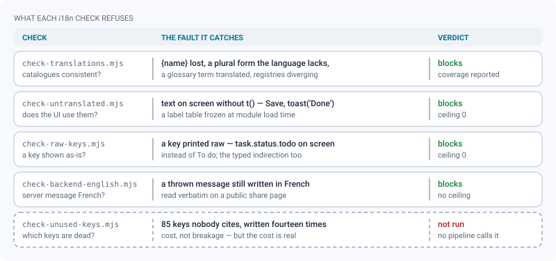

# Internationalisation

*How a string reaches the screen in the reader's language, and the checks that keep it there.*

> Updated: 2026-08-23

ReView ships in fourteen languages. English is the source language: `en.json` defines every
message key, and any key missing elsewhere falls back to it. A partial catalogue is therefore
useful from its very first line — there is no "all or nothing" threshold, and no language is
ever half-broken because a batch of keys landed late.

**Every language other than English is machine-translated and has had no human
proofreading.** ReView says so wherever a language is selected, and in the README.
Corrections from native speakers are the only thing that improves these catalogues, and they
are very welcome — especially for the regional languages, which have far fewer people
reading software strings than English does.

Two roads carry text to a reader. An interface label goes through the catalogues; a server
error goes through a stable code that the client translates on arrival. Both end in the
reader's language, and both are enforced.


## The fourteen languages

| Code | Endonym | English name | Notes |
|------|---------|--------------|-------|
| `en` | English | English | Source language, human-written |
| `fr` | Français | French | |
| `es` | Español | Spanish | |
| `de` | Deutsch | German | Formal register (*Sie*) |
| `pt` | Português | Portuguese | Brazilian-leaning |
| `zh-Hans` | 简体中文 | Chinese (Simplified) | `other` plural form only |
| `ko` | 한국어 | Korean | `other` plural form only |
| `ja` | 日本語 | Japanese | Polite register (*です・ます*), `other` only |
| `hi` | हिन्दी | Hindi | |
| `br` | Brezhoneg | Breton | Regional |
| `eu` | Euskara | Basque | Regional |
| `co` | Corsu | Corsican | Regional |
| `gsw-FR` | Elsässisch | Alsatian | Regional |
| `oc` | Occitan | Occitan | Regional |

Every catalogue is at **100 % coverage** today: 2 904 keys on the frontend, 74 on the
backend, in each of the fourteen languages. Coverage is measured, not assumed —
`node scripts/check-translations.mjs` prints it per language on every run.

> [!NOTE]
> `regional: true` is not decoration. The language picker labels those five as regional
> languages ReView deliberately stands up for, and `machineTranslated` drives the warning
> shown next to them. Flip `machineTranslated` to `false` only once a speaker has read the
> catalogue end to end — the warning then disappears for that language, and only for it.

## Where the files live

Two independent catalogue sets share one language registry:

```
frontend/src/v2/i18n/          backend/src/i18n/
├── locales.json  ←── must be byte-identical ──→  ├── locales.json
├── locales.ts        (typed view of the registry) ├── locales.ts
├── index.ts          (t, useT, setLocale…)        ├── index.ts     (t)
└── messages/                                      └── messages/
    ├── en.json   ← source of truth for keys           ├── en.json
    └── <code>.json × 13                               └── <code>.json × 13
```

The two sets have **different keys on purpose**: the server has no use for interface labels,
and the interface has no use for email templates. Only the language registry is shared, and
`scripts/check-translations.mjs` refuses any divergence between the two copies of
`locales.json`, or between either copy and the `Locale` union in `locales.ts`.

Loading differs by side, because the constraints differ.

| Side | Strategy | Cost |
|------|----------|------|
| Frontend | `en.json` is bundled; every other catalogue is a lazy chunk resolved by `import.meta.glob('./messages/*.json')` and fetched when the language is chosen | 155–260 kB raw per language, **46–57 kB gzipped**; a reader who never leaves English pays nothing |
| Backend | All fourteen catalogues are imported eagerly at startup | 74 keys each, a few dozen kilobytes in total — the server answers several languages at once |

> [!IMPORTANT]
> Adding a language costs nothing to readers who do not pick it, but it is not free for the
> one who does: a catalogue is roughly 50 kB over the wire. Dead keys therefore cost
> fourteen times over — see [the fifth check](#the-five-checks), which counts them.

Dropping a new `messages/<code>.json` into the folder is enough to make it loadable: the glob
is resolved at build time, so there is no import list to update.

## The shape of a message

Keys are flat and dotted, grouped by surface: `login.submit`, `nav.projects`,
`digest.subject`. Values are either a string or a set of CLDR plural forms:

```json
{
  "common.save": "Save",
  "login.greeting": "Welcome back, {name}.",
  "language.coverage": {
    "one": "{translated} of {total} phrase translated",
    "other": "{translated} of {total} phrases translated"
  }
}
```

- **Interpolation**: `{name}` placeholders, filled from the second argument of `t()`. A
  placeholder with no matching value is left visible rather than blanked — a visible
  `{name}` is a bug report, an empty gap is a mystery.
- **Plurals**: `t('language.coverage', { count: n, translated: n, total: 67 })`. The form is
  selected from `count`; `other` is mandatory and serves as the fallback. Provide only the
  categories your language actually distinguishes — Japanese, Korean and Simplified Chinese
  have `other` alone, and Breton keeps nouns singular after a numeral, so one form covers
  every count.

Usage, on each side:

```tsx
// Frontend — reactive, re-renders on language change
const t = useT();
<button>{t('common.save')}</button>;

// Backend — the recipient's language is explicit, never the server's
await sendMail(user.email, t(locale, 'digest.subject'), html);
```

`MessageKey` is derived from `en.json`, so a typo in a key is a compile error on both sides.

## Adding a string to the interface

The rule is short: **no literal ever reaches the screen.** Not a French one, not an English
one. Every visible string goes through `t()`, and every key exists in all fourteen catalogues
before the change is validated.

### 1. Write the key in English first

`en.json` defines the key set; the other catalogues answer it. Write the source string as you
want it read, then translate. Naming is `<surface>.<intent>`, dotted and flat
(`jobs.purgeNow`, `shares.expiresOn`).

A counted variant of an existing key gets **its own name** (`projects.trashed` →
`projects.trashedCount`). Never reuse a key with a different shape: `i18n-add.mjs` overwrites
in place, and the old caller quietly starts displaying an unsubstituted `{count}`.

### 2. Write the whole batch in one file, then run the script

```bash
node scripts/i18n-add.mjs my-batch.json          # frontend catalogues
node scripts/i18n-add.mjs my-batch.json --set=backend
```

```json
{
  "jobs.purgeNow": { "en": "Purge now", "fr": "Purger maintenant", "ja": "今すぐ削除", "…": "…" },
  "jobs.attempts": {
    "en": { "one": "{count} attempt", "other": "{count} attempts" },
    "ja": { "other": "{count} 回試行" }
  }
}
```

The script refuses a batch that misses a language, inserts each key next to its siblings so
the catalogues stay readable, and updates a key that already exists. Fourteen hand edits is
fourteen chances to forget one — and the forgotten one only shows up on screen, in the
language nobody proof-reads. The script writes; `check-translations.mjs` remains the
authority on whether what it wrote is coherent.

### 3. Rules the checkers enforce

- **`count` is reserved for plural selection and must be a number.** To display a
  pre-formatted number (`toLocaleString`), name the placeholder something else — `{value}`.
- **A translated string is never an identifier.** Grouping, sorting and lookup keys stay
  stable strings; the label is what gets translated. An admin section once carried its group
  *label* as its key, the labels were translated, and the whole sidebar emptied out in every
  language but French.
- **Label tables declared as module constants freeze the language at import time.**
  `const STATUS_LABEL = {...}` at module scope is evaluated once, before any language change.
  Turn it into a function taking `t`. Grep for `^const [A-Z_]+` before migrating a file —
  this is the most frequent trap.
- **Dates and numbers follow the reader**: `toLocaleDateString(intlLocale())`, never a
  hard-coded `'fr-FR'`; relative times through `Intl.RelativeTimeFormat`.
- **Name label props after the known list** — `label`, `title`, `hint`, `placeholder`, `alt`,
  `description`, `message`, `aria-label`, `subtitle`, `tooltip`, `confirmLabel`… A component
  that invents a short prop name (`<Row k= v=>`) hides its text from the checker. Rename the
  prop rather than weaken the check.
- **A prop whose name ends in `Key` carries a key on purpose**, for the receiving component
  to translate. That is the supported way to pass an untranslated key around, and the raw-key
  checker trusts it.
- **Technical literals go inside `code`, `pre`, `kbd` or `samp` tags.** That is how you
  declare "this is not prose": a shell command, an HTTP header, a bucket prefix, a key cap.
  The checker trusts those tags instead of guessing.
- **Reuse before you add.** `common.*` already covers save/cancel/delete/publish/send,
  pagination, moving up and down. Check `en.json` before creating a near-duplicate.

## How a server error reaches the reader's language

The backend does **not** translate its own error messages, and that is a deliberate
arbitration rather than an omission. A route throws an English message and, where it matters,
a stable code:

```ts
throw notFound('No published version for this asset', 'NO_PUBLISHED_VERSION');
throw badRequest('A sequence with this code already exists', 'CODE_TAKEN');
```

The error middleware answers `{ error, code }` on every failure — including the two it
manufactures itself, `VALIDATION_FAILED` for a refused Zod schema and `INTERNAL_ERROR` for an
unhandled throw, which would otherwise be the two most common untranslatable faults. On the
client, `apiErrorMessage()` builds the key `error.<CODE>`, looks it up in the catalogue, and
falls back to the server's English text when the code has no key — or no code at all.

| Server answers | What the reader sees |
|----------------|----------------------|
| `{ error: 'Email already in use', code: 'EMAIL_TAKEN' }`, key present | The catalogue's sentence, in the reader's language |
| Same, key absent from `en.json` | `Email already in use` — degraded, never wrong |
| `{ error: … }` with no code | The server's English text |
| No parseable body | `common.error.http`, with the status interpolated |

There are **46 `error.*` keys** in `en.json` today. Two rules keep the channel honest:

- A fallback code is attached **only when the message is also left to the default**. Writing
  `notFound('Media not found')` says something more precise than "not found", so it gets no
  generic `NOT_FOUND` code — pinning one would show the generic translation instead. Give the
  precise message its own code if you want it translated.
- Backend messages stay **in English**, checked by `scripts/check-backend-english.mjs`. They
  are read verbatim on surfaces where nobody logged in, the public client share page first
  among them; a French sentence there is unreadable to the reader and untranslatable by the
  client.

> [!TIP]
> Adding a translation for an existing error is a two-line change: add `error.<CODE>` to the
> batch you pass to `i18n-add.mjs`, and nothing else. No server change is needed — the code
> is already on the wire.

## Production terminology stays in English

Artists read `shot`, `sequence`, `dailies`, `playblast`, `version`, `annotation`, `review`,
`board`, `kanban`, `retake` in English in every pipeline they touch. Translating them
("plan-séquence" for shot, "prise de vue" for playblast) makes the tool *harder* to read, not
more accessible. The full list lives in `scripts/i18n-glossary.json` — thirty terms today,
from `shot` and `timeline` to `HDRI`, `LUT`, `OCIO`, `USD` and `HLS` — and the check fails if
a term present in the English message is missing from a translation.

Matching is on a word prefix and case-insensitive, so `boards`, `ReViewera` and `board로` all
count as `board`. The rule holds in every language, including those with a different script:
Japanese reads `新しい version`, Chinese `已发布 version`. This is deliberate and consistent.

> [!WARNING]
> When you write an English source string, avoid using a glossary word in its ordinary
> English sense: it would force every translation to keep the word. "…without human review"
> becomes "…with no human proofreading"; a button that fits the image to the frame is
> labelled *Fit*, not *Frame*.

## Which language a reader gets

**Frontend**, in order:

1. An explicit choice stored on this device (`localStorage.locale`).
2. Otherwise, the account preference (`preferences.locale`), applied when the shell loads.
3. Otherwise, a negotiation against `navigator.languages`.
4. Otherwise, English.

An explicit device choice always wins: it is the one made last, knowingly. Negotiation drops
the region when it has to (`fr-CA` → `fr`), and maps the simplified-Chinese family explicitly
(`zh`, `zh-CN`, `zh-SG`, `zh-MY` → `zh-Hans`). Traditional Chinese (`zh-TW`, `zh-Hant`) is not
shipped and deliberately falls through to English rather than being served simplified text.

The chosen language is applied to the document as well: `applyDocumentLocale()` sets
`<html lang>` and `dir` so a screen reader switches voice with the interface. See
[Accessibility](accessibility.md).

**Backend** (emails, notifications), in order:

1. The recipient's `preferences.locale`.
2. Otherwise the studio default, set in **Admin → Settings → Studio language**
   (`studio_default_locale`).
3. Otherwise English.

The server's own locale is never used — an email always goes out in a language somebody
decided on. Notifications that the frontend will render travel as a **key**
(`messageKey: 'notification.mentioned'`) rather than as text, so they are translated at
display time, in the reader's language and not the sender's.

## Adding a language

Three steps, no build configuration to touch:

1. Add an entry to the `locales` array of **both** `locales.json` files (they must stay
   byte-identical):

   ```json
   {
     "code": "nl",
     "native": "Nederlands",
     "english": "Dutch",
     "dir": "ltr",
     "regional": false,
     "machineTranslated": true,
     "intl": { "plural": ["nl"], "format": ["nl"] }
   }
   ```

2. Add the code to the `Locale` union in **both** `locales.ts` files.
3. Create `messages/nl.json` in both `messages/` folders. Copy `en.json` and translate what
   you can — untranslated keys fall back to English, so a partial catalogue ships.

Then run `node scripts/check-translations.mjs`. It reports coverage per language and fails on
anything inconsistent.

### The `intl` field

`plural` and `format` are ordered lists of BCP-47 tags handed to `Intl.PluralRules` and to the
number, date and list formatters. The runtime keeps the **first tag ICU actually knows**, so a
language with no CLDR data of its own can name a neighbour as its fallback without pretending
to be it.

| Language | `plural` | `format` | Why |
|----------|----------|----------|-----|
| `co` Corsican | `["co", "it"]` | `["co", "fr"]` | Pluralises like Italian (`0` is plural), written with French number and date conventions |
| `gsw-FR` Alsatian | `["gsw", "de"]` | `["fr"]` | `gsw` exists in ICU but carries Swiss conventions (apostrophe thousands separator); Alsace follows French usage |
| `br` Breton | `["br"]` | `["br", "fr"]` | Own plural rules; falls back to French formats where ICU has none |
| `oc` Occitan | `["oc", "ca"]` | `["oc", "fr"]` | Catalan is the closest plural model |
| `eu` Basque | `["eu"]` | `["eu"]` | CLDR data suits it as-is |

Without this filtering, `new Intl.PluralRules("co")` silently falls back to the root locale and
every count lands in `other`, wiping out the singulars.

> [!CAUTION]
> No right-to-left language ships yet. The registry has a `dir` field and the document
> honours it, but the stylesheets use physical spacing utilities (`ml-`, `pr-`,
> `text-left`) rather than logical ones (`ms-`, `pe-`, `text-start`). Adding an RTL language
> means doing that sweep first, not just dropping a catalogue in.

## The five checks

Four i18n checks run inside `scripts/validate.sh`, in this order, and each answers a different
question. A fifth exists and is tested, but nothing calls it.



### `check-translations.mjs` — are the catalogues consistent?

It **tolerates incompleteness** (and reports coverage per language) but **rejects
inconsistency**:

| Blocking | Reported only |
|----------|---------------|
| Key absent from the English catalogue | Missing plural form (falls back to `other`) |
| Interpolated variable lost or invented | Coverage below 100 % |
| Missing `other` plural form | |
| Plural category the language does not distinguish | |
| Empty message | |
| Glossary term translated away | |
| The two `locales.json` registries differing | |
| `Locale` union out of step with `locales.json` | |

### `check-untranslated.mjs` — does the interface actually use the catalogues?

A complete catalogue proves nothing if the screen still holds literals. This one parses the
TypeScript AST of `frontend/src` and reports **every literal that reaches the user**: JSX
text, visible props, arguments of `toast`/`confirm`/`alert`, template fragments around an
interpolation, fallback values such as `{name ?? 'Anonymous'}`. Identifiers, CSS classes,
URLs, GLSL, units, acronyms and glossary terms are excluded explicitly, in `SKIP` and
`ALLOWED` — not guessed.

The count is compared against a ceiling that currently sits at **0**. It may only go down.

```bash
node scripts/check-untranslated.mjs --list   # what is left, file by file
```

> [!NOTE]
> Two earlier versions of this check passed while the interface was half French in Chinese.
> The first only read single-line JSX; the second looked for *French markers* (accents,
> function words), which words like "Port", "Cadence", "Objets" or "Import CSV" simply do not
> carry. Hence the current criterion, which depends on no language at all: any literal on
> screen is a defect.

### `check-raw-keys.mjs` — does a key reach the screen unresolved?

The symmetrical fault, and the one the previous check *cannot* see: `task.status.todo` printed
instead of *To do*. A bare key looks exactly like a technical identifier — no space, no
accent, a dot in the middle — so the hardcoded-text detector rightly skips it, and the screen
shows the key with nothing protesting.

Two forms exist, and only the first is visible in the text of a file:

1. the forgotten literal, `<span>{'task.status.todo'}</span>`;
2. the indirection, `<span>{TASK_STATUS_LABEL_KEY[s]}</span>`, where nothing in the source
   looks like a key — it is the *type* that gives the omission away.

So this check asks the TypeScript type checker rather than a regular expression: it reports
any expression reaching the screen whose possible values are all catalogue keys. An
already-translated value has type `string`, never a union of literals, so it never shows up.
Ceiling **0**.

### `check-backend-english.mjs` — is a thrown server message still French?

Backend messages were French once — 174 occurrences across 70 files — and arrived on screen
verbatim, public share page included. The arbitration was to rewrite them in English rather
than translate them; this check stops French coming back through the next fix.

Detection is on French function words, not accents: *Media introuvable* carries none and is
still French, while *déjà* in a comment concerns nobody — only the literal passed to
`badRequest`, `notFound`, `forbidden`, `conflict`, `unauthorized`, `tooManyRequests` or
`new Error` is read.

### `check-unused-keys.mjs` — which keys does nobody cite? (not wired in)

A dead key breaks nothing; it costs. Each one is written fourteen times, and one more language
means fourteen more translations to produce, review and maintain for text nobody will ever
display. The check reads the AST to distinguish a direct citation (`t('shots.add')`) from a
**constructed** key (`` t(`shotgrid.domain.${d}`) ``), where the literal prefix is recorded and
every key beneath it counts as used.

It also knows that the backend cites *frontend* keys — a notification travels as
`messageKey` — so backend sources count towards the frontend set.

```bash
node scripts/check-unused-keys.mjs --list --set=frontend
```

> [!WARNING]
> It reports **85 dead frontend keys** against a ceiling of 0 today, and neither
> `validate.sh` nor CI calls it. Run it by hand before adding a language: 85 keys × 14
> catalogues is a real translation bill for text nobody displays.

## Contributing a correction

A correction is a one-line edit in a JSON file — no build step, no framework to learn.

1. Find the key in `frontend/src/v2/i18n/messages/<code>.json` or
   `backend/src/i18n/messages/<code>.json`.
2. Fix the wording, keeping `{placeholders}` and glossary terms intact.
3. Run `node scripts/check-translations.mjs`.
4. Open a pull request. External contributions require a signed CLA — see
   [CONTRIBUTING.md](../../CONTRIBUTING.md).

Once a language has been reviewed end to end by a speaker, set `machineTranslated: false` in
both `locales.json` files: the machine-translation warning disappears for that language, and
only for it.

## Related pages

- [Accessibility](accessibility.md) — why the language of a message is an accessibility guarantee
- [Validation and tests](validation-and-tests.md) — the full suite and how to run it
- [Conventions](conventions.md) — theme tokens, UI primitives, component budgets
- [Writing documentation](documentation-style.md) — the prose here stays English, whatever the reader's language
