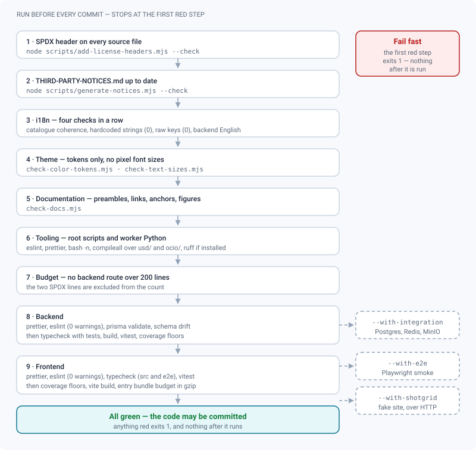
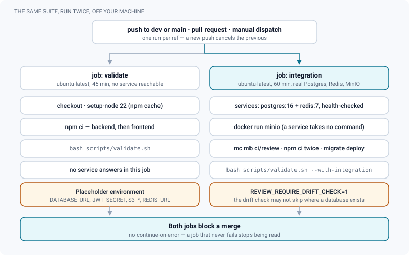

# Validation & tests

*What `validate.sh` and CI check, in what order, and the ratchets that may only ever tighten.*

> Updated: 2026-08-23

`scripts/validate.sh` is the single answer to "is this committable?". It is a **protected
principle** of the repository: it may be extended, never weakened. No skipping a step, no
commenting out a test, no `|| true` on a command, no raised `--max-warnings`. A change that
cannot pass the suite is not finished — and if the suite is checking the wrong thing, the fix
is to change what it checks, in the same commit, not to step around it.

The same script runs in continuous integration, twice. It is not a lighter variant there: CI
is the proof that you ran it, not a substitute for running it.

## Running the suite

```bash
bash scripts/validate.sh                     # every static check + unit tests
bash scripts/validate.sh --with-integration  # + integration tests (docker stack required)
bash scripts/validate.sh --with-e2e          # + Playwright smoke (implies --with-integration)
bash scripts/validate.sh --with-shotgrid     # + the end-to-end ShotGrid harness
```

| Flag | What it adds | What it needs |
|---|---|---|
| *(none)* | Everything that runs without a service | Node 22, both `node_modules` installed |
| `--with-integration` | `backend/src/integration/*.itest.ts` | Postgres, Redis and MinIO reachable |
| `--with-e2e` | The Playwright smoke path — **also turns on `--with-integration`** | The above, plus a browser (`E2E_CHANNEL=msedge` on local Windows) |
| `--with-shotgrid` | `run-shotgrid-e2e.mjs`: a simulated site with three same-coded projects, plus the scenario | A **running** ReView backend, reached over HTTP |

Flags combine: `--with-integration --with-shotgrid` is valid.

> [!IMPORTANT]
> `--with-shotgrid` is deliberately outside `--with-integration`. The integration tests mount
> the app in memory; the ShotGrid harness talks to the backend over HTTP, so it **writes into
> your development database** and leaves its test project behind. It is worth running anyway:
> it exercises the integration's most expensive invariant — never spilling into the
> neighbouring project.

## What it checks, in order

The script fails at the first red step, and nothing after it runs.



1. **Licensing** — SPDX headers on every source file
   (`add-license-headers.mjs --check`), then `THIRD-PARTY-NOTICES.md` freshness against the
   lockfiles (`generate-notices.mjs --check`). Both come first because they are the cheapest
   checks and the ones a reviewer cannot see.
2. **i18n — four checks**: catalogue coherence (`check-translations.mjs`: a lost `{variable}`,
   a plural category the language does not distinguish, an orphan key, a glossary term
   translated); hardcoded UI strings (`check-untranslated.mjs`, ceiling 0); raw translation
   keys reaching the screen (`check-raw-keys.mjs`, ceiling 0); and **backend messages still
   written in French** (`check-backend-english.mjs`), which arrive on screen verbatim,
   including on the public client-share page. Incompleteness of a catalogue is tolerated and
   quantified; incoherence is not. See [Internationalisation](i18n.md).
3. **Theme** — no raw Tailwind palette classes or arbitrary colour values outside theme tokens
   (`check-color-tokens.mjs`); no pixel font sizes (`check-text-sizes.mjs`), which would ignore
   the density setting since density scales the root font size and everything else is sized in
   `rem`.
4. **Documentation** — preambles, internal links, anchors, images and the SVG figure contract
   (`check-docs.mjs`). A dead link fails the suite instead of waiting for a reader to click it.
   See [Writing documentation](documentation-style.md).
5. **Tooling** — ESLint on the root `scripts/*.mjs` (`lint-scripts.mjs`, driving the backend's
   ESLint through the Node API), a Prettier check on the same files, `bash -n` on every
   `scripts/*.sh`, and `python -m compileall` over `backend/src/workers/usd` and
   `backend/src/workers/ocio` — plus `ruff` when it happens to be installed. The Python
   helpers run in production; a syntax error there used to surface at a studio's first USD
   upload.
6. **Backend route size budget** — 200 lines per route file, the two SPDX lines excluded from
   the count. Over budget means the business logic belongs in `services/`.
7. **Backend** — Prettier check; **ESLint, zero warnings**; `prisma validate` (with a
   placeholder `DATABASE_URL`, no database needed); **schema drift**
   (`check-prisma-drift.mjs`, below); typecheck through `tsconfig.eslint.json`, which unlike
   the build tsconfig **includes tests, `prisma/` and `scripts/`**; build (prisma generate +
   tsc); vitest unit tests, which also collect `../scripts/**/*.test.mjs`, followed by the
   coverage floors when the provider is installed. Integration tests slot in here when asked
   for.
8. **Frontend** — Prettier check (`src/**/*.{ts,tsx,css}`, `e2e/**/*.ts`, `scripts/**/*.mjs`
   and the root `*.config.ts`); **ESLint, zero warnings**; typecheck (`tsc --noEmit` for `src/`
   *and* `tsconfig.e2e.json` for `e2e/` and the config files); vitest unit tests plus coverage
   floors; Vite build; then the **entry bundle budget** (`check-bundle-budget.mjs`) — the gzip
   size of everything the browser downloads before the first screen, so route-level code
   splitting cannot silently regress.
9. **Optional tails** — the Playwright smoke path, then the ShotGrid harness.

`check-prisma-drift.mjs` deserves its own paragraph, because `prisma validate` only says "the
file parses". A model changed without `migrate dev` used to go green: the generated client knew
the column, the database served by `migrate deploy` in production did not, and the failure
surfaced on the first query. The drift check replays the migrations on a shadow database and
compares the result with `schema.prisma`. Divergences that cannot be expressed in the schema —
a trigram GIN index living only in a migration's SQL — are listed one by one in
`scripts/prisma-drift-allowed.json`, and that list is strict both ways: an unexpected statement
fails, and a listed statement that no longer appears fails too, because the entry has become a
lie.

### Steps that skip themselves

Three steps can be absent from a developer's machine without being absent from the suite. Each
says so out loud rather than pretending to have run.

| Step | Skips when | Forced by |
|---|---|---|
| Python `compileall` (and `ruff`) | No `python3` or `python` on `PATH` | — |
| `check-prisma-drift.mjs` | No Postgres reachable | `REVIEW_REQUIRE_DRIFT_CHECK=1`, which the CI integration job sets |
| `check-coverage.mjs` | `@vitest/coverage-v8` is not installed in that package | Installing it (`npm i -D @vitest/coverage-v8`) |

## The ratchets, and which way they may move

Several checks carry a number rather than a rule. Each of those numbers is a debt written down,
and each may move in exactly one direction.

| Check | Unit | Current value | Allowed direction | Declared in |
|---|---|---|---|---|
| `check-untranslated.mjs` | Hardcoded UI literals | `0` | Down only | `scripts/check-untranslated.mjs` (`CEILING`) |
| `check-raw-keys.mjs` | Keys reaching the screen unresolved | `0` | Down only | `scripts/check-raw-keys.mjs` (`CEILING`) |
| `a11y.names.test.ts` | Form controls with no accessible name | `24` | Down only | `frontend/src/a11y.names.test.ts` |
| `check-coverage.mjs` | Statements and branches, **per folder** | Unset — the provider is not installed yet | Up only | `scripts/coverage-floors.json` |
| `check-bundle-budget.mjs` | Gzip bytes before the first screen | `430 000` (measured at about 401 kB) | Down only | `scripts/check-bundle-budget.mjs` (`ENTRY_BUDGET_GZIP`) |
| Route budget | Lines per backend route file | `200` | Down only | `scripts/validate.sh` |
| `max-lines` | Code lines per component or page | `300` | Down only | `frontend/eslint.config.js` |
| ESLint | Warnings | `0` | Fixed | Both ESLint configs |

Coverage floors are **per folder** on purpose: a single global number is inflated by the easy
files. `lib/` is pure computation and should be covered hard; `routes/` crosses the database
and is covered much less. One threshold would average them into meaninglessness.

> [!WARNING]
> `node scripts/check-coverage.mjs <package> --update` raises the floors that were reached and
> **refuses to lower any**. Going down therefore requires editing
> `scripts/coverage-floors.json` by hand, which is visible in review — which is the entire
> point of keeping the numbers outside `vitest.config`, a file that does not know how to refuse
> a regression.

## Continuous integration

`.github/workflows/validate.yml` runs on every push to `dev` or `main`, every pull request and
every manual dispatch, under Node 22 — the version the runtime images use. Concurrency is one
run per ref: a new push cancels the previous one.



| Job | What it runs | Blocking |
|---|---|---|
| `validate.sh (unitaire)` | `bash scripts/validate.sh`, 45 min timeout | Yes |
| `validate.sh --with-integration` | The same plus the integration tests, against `postgres:16`, `redis:7` and a MinIO container, 60 min timeout | Yes |

Three details of that workflow are worth knowing before you change it:

- **The placeholder environment is not optional.** `backend/src/config/env.ts` validates the
  environment at import and stops the process if a variable is missing, so without it every
  unit test that imports the configuration would die before running. Nothing in that block is
  a secret, and nothing it names is reachable in that job.
- **MinIO is started with `docker run`, not as a service container.** A GitHub Actions service
  container takes neither command nor arguments, and the MinIO image needs `server /data` to
  start anything other than its help text.
- **Neither job is allowed `continue-on-error`.** The integration job was non-blocking for a
  while, because the resumable-upload test was getting a `429` from the rate limiter — saturated
  by the suite itself, two hundred calls on the same app from the same address.
  `createApp({ rateLimit: false })` fixed the cause, and the exemption was removed. A job that
  never fails stops being read, which is exactly what had happened.

> [!NOTE]
> `.github/workflows/release.yml` runs the suite a third time. A tag `vX.Y.Z` first passes a
> guard (the version must have a `CHANGELOG.md` entry), then `validate.sh`, and only then are
> the images built, published under an immutable tag and turned into a GitHub release. Nothing
> is published from a red suite.

## ESLint rule sets

Both packages run `npm run lint` (`eslint . --max-warnings 0`) and offer `npm run lint:fix`.

### Backend (`backend/eslint.config.mjs`)

- `@eslint/js` recommended + `typescript-eslint` recommended;
- **type-aware promise safety** (through `tsconfig.eslint.json`): `no-floating-promises`,
  `no-misused-promises`, `await-thenable`, `no-unnecessary-type-assertion`,
  `prefer-promise-reject-errors`;
- `no-console` — **pino is the only log channel** — off for CLI scripts (`prisma/seed.ts`,
  `scripts/`), with one justified fail-fast exception in `config/env.ts`;
- `no-restricted-syntax` bans the `'fr-FR'` literal (server logs use ISO timestamps);
- `@vitest/eslint-plugin` on tests: `no-focused-tests`, `no-disabled-tests`,
  `no-identical-title`, `no-commented-out-tests`, `no-standalone-expect`, `valid-expect` with
  `maxArgs: 2`, since `expect(value, message)` is supported vitest usage in a loop.

### Frontend (`frontend/eslint.config.js`)

Everything the backend has, in its browser flavour, plus:

- `eslint-plugin-react-hooks` v7 recommended with the analysis rules (`static-components`,
  `set-state-in-effect`, `immutability`, `purity`) as errors; `react-refresh/only-export-components`;
- type-aware promise safety on `src/` (through `projectService`), with `no-misused-promises`
  tolerating async handlers in JSX attributes (`checksVoidReturn.attributes: false`) — a
  fire-and-forget call must be explicit (`void doThing()`);
- `eslint-plugin-jsx-a11y` recommended, with two rules off and justified: `media-has-caption`
  (VFX dailies and playblasts have no captions) and `no-autofocus` (deliberate in dialogs, per
  the ARIA Authoring Practices);
- `no-console` allowing `warn` and `error` only;
- `no-restricted-syntax` bans the `'fr-FR'` literal (use `intlLocale()`) and `fetch()` inside a
  `useEffect` (data fetching goes through TanStack Query);
- `max-lines` 300 code lines on components and pages — tests and `e2e/` are exempt.

### Deliberately not enabled, yet

- `typescript-eslint` `recommendedTypeChecked` / `strict` extras (the `no-unsafe-*` family,
  `restrict-template-expressions`…): a large violation surface, to be taken on as a dedicated
  pass rather than mixed into feature work;
- stylistic rule sets — formatting is Prettier's job;
- markdownlint and stylelint: two CSS files, low value, and Prettier already formats CSS.

> [!NOTE]
> "Not enabled yet" is a promise, not an excuse. Any evolution must **extend** the suite;
> a check is never traded away for another.

## Test layout

- **Colocated**: `foo.ts` and `foo.test.ts` next to each other, backend and frontend alike.
- Root tooling scripts (`scripts/*.mjs`) keep their tests beside them (`*.test.mjs`), collected
  by the **backend** vitest run; the frontend's `scripts/build-docs.mjs` is covered by the
  frontend run.
- Frontend tests run under happy-dom. Pure logic is extracted into testable modules (`v2/lib/`,
  `pages/docs/…`) rather than asserted through a full page.
- Integration tests (`backend/src/integration/*.itest.ts`) need Postgres, Redis and MinIO, and
  are written to pass against a virgin database as well as an already populated one.
- Accessibility is measured inside the ordinary frontend run: `theme.a11y.test.ts` checks the
  contrast of every theme token, `a11y.names.test.ts` counts unnamed form controls against its
  ceiling. See [Accessibility](accessibility.md).

### The suite tests itself

A growing family of tests covers files that no compiler reads, and they run in the ordinary
unit step:

| File | What it locks down |
|---|---|
| `validate-suite.test.mjs` | The steps exist, none is neutralised by `\|\| true`, and CI demands the ones only it can run |
| `ci-workflow.test.mjs` | The CI command is neither truncated nor disabled, and both packages are installed |
| `ops-scripts.test.mjs` | `install`, `update`, `backup`, `restore`: no default secret survives installation, no update switches without a backup |
| `release-config.test.mjs` | Nothing publishes without the suite, no release without notes, no production image on a moving tag |
| `infra-config.test.mjs` | `start.sh`, compose, nginx, `.env.example` — including the `db push --accept-data-loss` fallback that could empty a production database |
| `prisma-schema.test.mjs` | Foreign-key indexes and the other data-model guarantees the compiler cannot see |
| `hls-delivery.test.mjs` | The Express route, the manifest rewriting and the nginx configuration still agree |

### What nothing runs

Two suites exist and are executed by no pipeline. Know about them before you rely on green.

> [!CAUTION]
> `clients/python/tests/` — `test_client.py`, `test_publish.py`, `test_cli.py`, `test_dcc.py` —
> is invoked by neither `validate.sh` nor either CI job. Run it by hand
> (`cd clients/python && python -m unittest discover -s . -t .`) after touching the client or a
> DCC add-on. Likewise `scripts/check-unused-keys.mjs` is written and tested but wired into
> nothing, so dead catalogue keys accumulate unseen; run it manually
> (`node scripts/check-unused-keys.mjs --list`) when you delete a screen.

## Documentation screenshots

The `.png` images under `DOCUMENTATION/assets/` are **generated**, never taken by hand:

```bash
cd frontend && E2E_DOCS=1 DOCS_FIXTURES=/path/to/fixtures E2E_CHANNEL=msedge \
  npx playwright test e2e/docs-capture.spec.ts
```

`E2E_DOCS=1` is not optional: without it the capture spec is in `testIgnore` and Playwright
runs nothing at all, quietly. `DOCS_FIXTURES` points at the demo media, and defaults to
`../../tmp/review-demo`.

`e2e/docs-capture.spec.ts` signs in, forces the interface to English, builds a neutral demo
project (`Nebula Rising`) if it is missing, and captures the screens the documentation refers
to. Re-run it after a visual change: a stale screenshot misleads more than no screenshot at
all.

Three rules are enforced by the script itself, and matter if you extend it:

- **Nothing from a real production.** The repository is public. Other projects of the studio
  are hidden from the sidebar, and the demo data uses invented names.
- **Nothing that only exists in development.** The TanStack Query devtools button and the
  account's own overlays (pending drafts, ongoing uploads) are hidden.
- **Wait for content, never for a delay.** Heavy pages load lazily; a fixed timeout used to
  capture a `Loading…` on an empty background.

Demo media (FFmpeg test patterns) stay **outside** the repository — they weigh more than the
whole documentation. Regenerate them:

```bash
ffmpeg -y -f lavfi -i "testsrc2=size=1920x1080:rate=24:duration=6" -f lavfi -i "sine=frequency=440:duration=6" -c:v libx264 -pix_fmt yuv420p -c:a aac -shortest SH010_comp_v001.mp4
```

> [!TIP]
> Figures are different: they are hand-written SVG, not captures, and they do not date. When a
> screen changes shape, prefer redrawing the figure to re-shooting the screenshot. The
> [figure contract](documentation-style.md#the-figure-contract) says what one must satisfy.

## Related pages

- [Conventions](conventions.md)
- [Code structure](code-structure.md)
- [Internationalisation](i18n.md)
- [Accessibility](accessibility.md)
- [Licensing](licensing.md)
- [Writing documentation](documentation-style.md)
- [Installation](../getting-started/installation.md)
