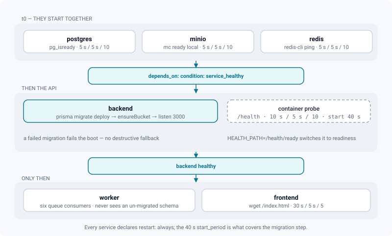
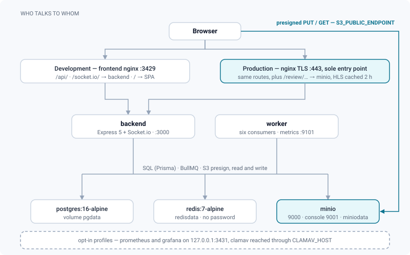

# Docker stack

*The containers behind a ReView instance: what each one does, how they gate each other at start-up, and where the data actually lives.*

> Updated: 2026-08-23

`docker-compose.yml` defines **six services started by default**, three more behind opt-in
profiles, and six named volumes. Two overlays layer on top: `docker-compose.override.yml`
(development, auto-loaded) and `docker-compose.prod.yml` (production, explicit), which adds a
seventh service — the TLS front.

Read this page when you need to know which container to look at. Most operational questions
resolve to one of three answers: the backend is not answering, the worker is not consuming, or
the browser cannot reach MinIO.

## Default services

| Service | Image / build | Role |
|---------|---------------|------|
| `postgres` | `postgres:16-alpine` | Primary database (Prisma schema). No host port in the base file |
| `minio` | `minio/minio:RELEASE.2025-04-22T22-12-26Z` (pinned, override with `MINIO_VERSION`) | S3-compatible object storage for every binary — originals, HLS renditions, thumbnails, attachments, HDRIs |
| `redis` | `redis:7-alpine` | BullMQ queue backend. No host port in the base file, and **no password** |
| `backend` | built from `backend/` | Express 5 API + Socket.io realtime server. Host port `BPORT` → container `3000` |
| `worker` | built from `backend/`, `command: node dist/workers/ffmpeg.worker.js` | One process, six BullMQ consumers (below). No HTTP port; metrics on `9101`, internal only |
| `frontend` | built from `frontend/Dockerfile` (context = repo root) | React app built by Vite, served by nginx; proxies `/api/` and `/socket.io/` to the backend. Host port `PORT` → container `80` |

`backend` and `worker` are built from the **same** image definition. Only the worker passes
`INSTALL_USD_TOOLS` (default `1`), which adds Blender and a `usd-core` virtualenv and takes
the image from ~1.6 GB to ~3.6 GB. Set `INSTALL_USD_TOOLS=` in `.env` to build the light
image — USD then falls back to `guc`/assimp, and fails if neither can read the file.

The single worker process runs six queue consumers:

| Consumer | What it handles |
|----------|-----------------|
| Media processing | FFmpeg HLS renditions, thumbnails, timeline sprites, waveforms; Blender/assimp conversions; antivirus scan. Concurrency 2 |
| Storage cleanup | Retries deletion of orphaned objects in MinIO |
| Webhook delivery | Outgoing `POST`s, so they never leave from the web process |
| Timeline export | Auto-cut timeline renders. Concurrency 1 |
| ShotGrid synchronisation | Events, periodic polling, reconciliation, outgoing writes, catch-up after an outage |
| Maintenance | Daily digest, Monday weekly report, retention purges — these used to be `setInterval` calls in the API process |

> [!NOTE]
> A digest that never leaves, a weekly report that never arrives, or a purge that never runs
> is a **worker** problem, not an API one. `docker compose logs worker` is the first place to
> look, not `logs backend`.

### The production front

| Service | Image | Role |
|---------|-------|------|
| `nginx` | `nginx:1.27-alpine` (added by `docker-compose.prod.yml`) | Terminates TLS on `80`/`443` and is the **only** exposed service. Reads `./nginx/certs/fullchain.pem` + `privkey.pem`, waits for `backend` and `minio` to be healthy, proxies `/api/`, `/socket.io/`, `/review/…` and `/` |

## Profile services

```bash
docker compose --profile monitoring up -d
docker compose --profile antivirus up -d
```

| Service | Profile | Role |
|---------|---------|------|
| `prometheus` | `monitoring` | `prom/prometheus` (pinned, `PROMETHEUS_VERSION`). Scrapes `backend:3000/metrics` and `worker:9101/metrics` every 15 s |
| `grafana` | `monitoring` | `grafana/grafana-oss` (pinned, `GRAFANA_VERSION`). Dashboard on `GRAFANA_BIND:GRAFANA_PORT`, default `127.0.0.1:3431`. Sign-up and anonymous access disabled |
| `clamav` | `antivirus` | `clamav/clamav:stable`. Point `CLAMAV_HOST=clamav` at it on `backend` **and** `worker` |

> [!IMPORTANT]
> The compose file mounts `monitoring/prometheus.yml` and the data volume, but **not**
> `monitoring/rules/`. Prometheus loads its rule files from a glob, which matches nothing
> inside the container, so the shipped alert rules of `monitoring/rules/alerts.yml` are not
> evaluated: you get metrics and dashboards, not alerts. Add
> `- ./monitoring/rules:/etc/prometheus/rules:ro` to the `prometheus` service to turn them on.
> The glob is deliberate — a supervision stack that refuses to start over a missing alerts
> file is worse than one without alerts.

## Start-up order and healthchecks

Every service declares `restart: always`. Dependencies are gated on **health**, not on
container start:



| Service | Healthcheck | Waits for |
|---------|-------------|-----------|
| `postgres` | `pg_isready -U $POSTGRES_USER`, 5 s / 5 s / 10 retries | — |
| `minio` | `mc ready local`, 5 s / 5 s / 10 retries | — |
| `redis` | `redis-cli ping`, 5 s / 5 s / 10 retries | — |
| `backend` | `fetch('http://127.0.0.1:3000' + HEALTH_PATH)`, default `/health`, 10 s / 5 s / 10 retries, `start_period: 40s` | `postgres`, `minio`, `redis` healthy |
| `worker` | none | `postgres`, `minio`, `redis` healthy **and `backend` healthy** |
| `frontend` | `wget /index.html`, 30 s / 5 s / 5 retries | `backend` healthy |
| `nginx` (prod) | none | `backend` and `minio` healthy, `frontend` started |
| `clamav` | `clamdscan --ping 1`, 30 s / 10 s / 10 retries, `start_period: 180s` | — |

The worker waiting on the backend healthcheck is deliberate: the backend applies the Prisma
migrations during boot (`backend/start.sh`), so the worker never talks to an un-migrated
schema. The 40 s `start_period` exists for the same reason. A migration that cannot apply
fails the boot loudly and leaves the database untouched — there is no destructive fallback.

`/health` is a **liveness** probe by design: a container is not restarted because Postgres is
down, which would only add an outage to an outage. Set `HEALTH_PATH=/health/ready` in `.env`
to make the container health status follow the dependencies instead; see
[Monitoring & operations](../infrastructure/monitoring.md#health-probes).

Both `backend` and `worker` declare `extra_hosts: host.docker.internal:host-gateway` so the
ShotGrid development simulator running on the host machine is reachable.

## How a request travels



1. **Application traffic** goes to the **frontend** nginx (`:3429`) in development, or to the
   TLS `nginx` (`:443`) in production. Either one serves the SPA and proxies `/api/` and
   `/socket.io/` to the backend.
2. **Media never transits the frontend container, in either direction.** The backend issues a
   **presigned URL** and the browser writes straight to **MinIO**, then reads back the same
   way — uploads do not pass through the API and neither do playbacks. Object
   keys are stored in PostgreSQL (`MediaObject.storageKey`). This is why
   `S3_PUBLIC_ENDPOINT` — the origin those URLs are signed for — has to be reachable *from the
   browser*, not from the container.
3. **In production the TLS front is the storage path.** `/review/…` is proxied to MinIO by
   `nginx`, which additionally caches HLS segments (`proxy_cache review_hls`, 2 h) so a room
   full of reviewers scrubbing the same shot does not hit object storage once per person. See
   [HLS delivery](../infrastructure/hls-delivery.md).
4. **On finalize**, the backend enqueues a processing job in **Redis**; the **worker** picks it
   up (FFmpeg, Blender, assimp…), writes derived files back to MinIO and moves the media
   through `UPLOADING → PROCESSING → READY | FAILED`.
5. **Realtime events** — presence, notifications, media status, live review — are pushed over
   **Socket.io**, which rides the same `/socket.io/` proxy.

## Volumes

| Volume | Content | Backed up by `scripts/backup.sh` |
|--------|---------|-----------------------------------|
| `pgdata` | PostgreSQL data | yes (`pg_dump -Fc`) |
| `miniodata` | All media objects | yes (incremental mirror + hard-linked snapshot; `BACKUP_MODE=archive` for a whole-volume tar) |
| `redisdata` | Queue state | no — rebuildable |
| `clamav_db` | ClamAV virus database (profile) | no |
| `prometheus_data` | Metrics TSDB (profile) | no |
| `grafana_data` | Grafana state (profile) | no |

Back up `pgdata` and `miniodata` **together**: the database references MinIO object keys, and
either half alone restores to an instance full of dangling references. See
[Backups & restore](../infrastructure/backups.md).

On an instance created by `scripts/install.sh`, `deploy/compose.site.yml` rebinds `pgdata`,
`miniodata` and `redisdata` under `DATA_ROOT` — so the media are on the pool you chose, not in
`/var/lib/docker/volumes`.

## Resource bounds and logs

Every service caps its Docker logs at **10 MB × 5 files**, roughly 450 MB for the whole stack.
Without that cap the default `json-file` driver writes without bound, and on a NAS it is the
system pool that fills first — the failure then is not ReView, it is the machine.

| Service | Memory bound | Why that number |
|---------|--------------|-----------------|
| `worker` | `WORKER_MEM_LIMIT`, default **8g** | Two simultaneous HLS transcodes plus a headless Blender loading a whole USD scene. Below ~4 GB heavy USD conversions are OOM-killed instead of failing cleanly |
| `backend` | `BACKEND_MEM_LIMIT`, default **2g** | A single replica; the bound exists so a leak cannot take the host with it |
| `postgres` | `POSTGRES_MEM_LIMIT`, default **2g**, plus `POSTGRES_SHM_SIZE` **256mb** | The container default of 64 MB for `/dev/shm` is too small for parallel sorts, which fail with *could not resize shared memory segment* |
| `minio` | deliberately **unbounded** | It buffers multipart uploads; an OOM-kill there would corrupt an upload in flight rather than protect the host. Set `MINIO_MEM_LIMIT` yourself if the machine demands it |

Third-party images are pinned rather than tracking `latest`, so two installations made on two
dates run the same software. Details and overrides:
[Containers & configuration](../infrastructure/containers-and-configuration.md).

## Everyday commands

```bash
docker compose ps                                # state of every service
docker compose logs -f backend worker            # follow both application logs
docker compose exec postgres psql -U review -d review -c '\dt'
docker compose exec backend npx prisma migrate status
docker compose restart worker                    # after changing VIDEO_ENCODER
docker compose up -d --build backend worker      # rebuild only the Node images
docker compose down                              # stop (volumes are kept)
docker compose down -v                           # stop AND destroy all data
```

Scaling the worker — it is stateless and pulls from the same Redis:

```bash
docker compose up -d --scale worker=3
```

> [!WARNING]
> `docker compose down -v` removes the named volumes, which means the database *and* every
> media object. On an installer-made instance the volumes are bind-mounted under `DATA_ROOT`,
> so the files survive the volume removal — but do not rely on that as a safety net.

## Frontend build context

The frontend image is built with the **repo root** as Docker context (`build.context: .`,
`dockerfile: frontend/Dockerfile`) so the build can copy `DOCUMENTATION/` next to the frontend
sources and embed it into the app (the `/docs` page, via the `prebuild` script). The root
`.dockerignore` keeps that context small. A new frontend image therefore also refreshes the
in-app documentation.

## Overlays

| File | Loaded | Effect |
|------|--------|--------|
| `docker-compose.override.yml` | automatically by `docker compose up` | Publishes PostgreSQL and Redis on `DEV_BIND` (default `127.0.0.1`), forces `NODE_ENV=development` on `backend` and `worker` |
| `docker-compose.prod.yml` | only with an explicit `-f` | Adds the TLS `nginx` service, removes every host port from `frontend`/`backend`/`minio` (`ports: !reset []`, Compose ≥ 2.24), makes the critical secrets mandatory |
| `docker-compose.release.yml` | only with an explicit `-f` | Runs the **published images** (`REVIEW_IMAGE_PREFIX`/`REVIEW_IMAGE_TAG`) instead of building them on the server |
| `deploy/compose.site.yml` | written by `scripts/install.sh` | Everything specific to this site: the rendered nginx configuration, and the volumes bind-mounted under `DATA_ROOT` |

```bash
# development
docker compose up -d
# production, by hand — both -f flags, always
docker compose -f docker-compose.yml -f docker-compose.prod.yml up -d
```

On an instance created by `scripts/install.sh` this is settled once and for all: the installer
writes `COMPOSE_FILE` (plus `COMPOSE_PATH_SEPARATOR=:`) into `.env` with the exact list of
files, so a bare `docker compose up -d` starts the right stack and cannot fall back to the
development overlay. One exception is worth knowing: with `--tls none` that list is the base
stack plus the site overlay only — no production overlay, and therefore host ports still
published. See [Installation](installation.md#install-a-studio-instance).

## Related pages

- [Installation](installation.md) — environment variables, ports, production guards
- [Updating](updating.md) — published images, rollback
- [Architecture](../infrastructure/architecture.md)
- [Containers & configuration](../infrastructure/containers-and-configuration.md) — env precedence, limits, logging
- [Jobs & workers](../infrastructure/jobs-and-workers.md)
- [HLS delivery](../infrastructure/hls-delivery.md)
- [MinIO storage](../infrastructure/storage-minio.md)
- [Monitoring & operations](../infrastructure/monitoring.md)
