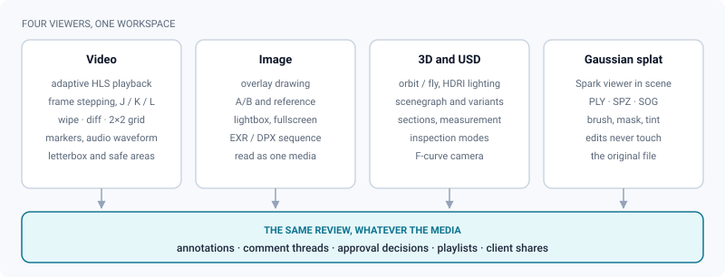

# Feature tour

*Everything ReView can do, in one page — with a link to the guide for each of them.*

> Updated: 2026-08-23

ReView is a collaborative media review platform for VFX studios, post-production teams and
creative departments. One instance serves one studio: projects, media, review, tasks,
distribution and administration live in the same place, on your own infrastructure.

This page is the map. It lists what the application does, area by area, and points at the
guide that explains each one. Read it once to know what exists; come back to it when you
wonder whether ReView already covers something.

## Review

### Video

Adaptive multi-rendition **HLS** playback, frame-accurate navigation, `J`/`K`/`L` shuttle,
in→out looping, hover thumbnails from a sprite generated at transcode time, timeline markers
shared with the team, audio waveform, zoom and pan inside the frame.

Compare versions side by side, through an orientable **wipe** bar, as a GPU-composited
**difference** with a heatmap, or four at once in a **2×2 grid**. A letterbox guide draws the
delivery aspect, with centre cross and action/title safe areas.

→ [Video review](../user-guide/review-video.md) · [The review workspace](../user-guide/review-workspace.md)

### Image and image sequences

Overlay annotations, A/B comparison, reference image, lightbox and fullscreen. A delivered
**EXR/DPX/TIFF sequence** is ingested as a single media and reviewed like a clip, frame by
frame, with a web-playable proxy built for it.

→ [Image review](../user-guide/review-image.md) · [Image sequences](../user-guide/image-sequences.md)

### 3D and USD

A DCC-style Three.js viewer: unified orbit/fly navigation, **HDRI** lighting with a studio
library and a shadow-catcher ground, focal length in millimetres on a 36 mm sensor.

**End-to-end USD** — `.usd`, `.usdc`, `.usda`, `.usdz` and zipped archives are converted
natively through Blender and `usd-core`, keeping `UsdPreviewSurface` materials, variants and
`UsdSkel` animation. The real prim tree shows in the Scene panel, clicking in the viewport
selects, `F` frames the selection, and per-prim overrides (transform, visibility, variant) are
stored by ReView without touching the file.

Inspection modes (shaded, wireframe, normals, matcap, UV), a technical sheet, a texture
inspector, section planes, measurement, camera bookmarks, turntable, and **3D A/B** with
linked cameras. GLB animation is reliable: skeletal rigs, morph targets, clip selector.

→ [3D review](../user-guide/review-3d.md) · [USD pipeline](../admin-guide/3d-usd.md)

### Gaussian splats

A **Spark (SparkJS)** viewer inside the Three.js scene — PLY, SPZ and SOG/SOGS playback. The
editor is **non-destructive**: brush and volume selection, masking, tint, transform. The
original file is never modified, and every edit is replayed identically for everyone. Cleaned
splats export to SPZ.

→ [Splat review](../user-guide/review-splat.md)

### Camera animation

An F-curve camera on Hermite channels, edited in a dopesheet and a graph editor, importable
from an **Alembic** `.abc` camera. The staging is stored per media and replayed identically for
every viewer.

→ [Camera animation](../user-guide/camera-animation.md) · [Alembic cameras](../admin-guide/3d-alembic.md)

## Collaboration

- **Annotations** anchored to the delivery frame — shapes, polygons, freehand — persisting
  over an in→out range during playback.
- **Comment threads** with `@` mentions, five colour-coded states, reactions, **voice notes**,
  local drafts, deep links to a frame or a comment, and conversion of a comment into a kanban
  task.
- **Approval** on customisable per-studio statuses: a decision is recorded per version and
  shows as a badge everywhere the version appears.
- **Dailies**: cross-shot playlists built beside the project catalogue, chained playback, and
  a synchronised **live review room** where one driver broadcasts playback, navigation,
  comparison, 3D camera and cursor to everyone, handing over control in one click.
- **Boards**: Excalidraw canvases per project and per asset, for mood and references.
- **Messaging**: direct and group messages beside the presence panel, with member profiles.

→ [Annotations & comments](../user-guide/annotations-and-comments.md) ·
[Approvals](../user-guide/review-approvals.md) ·
[Playlists & live review](../user-guide/playlists-and-live-review.md) ·
[Boards](../user-guide/boards.md) · [Messaging](../user-guide/messaging-and-profiles.md)

## Production

- **Hierarchy**: project → (episode) → sequence → shot or asset → task → version → media.
  Drafts before publication, and a **publication lock** — published content is immutable, and
  you correct it with a new version.
- **Inherited delivery settings** from studio to project to sequence to shot: resolution,
  framerate, frame ranges.
- **Kanban** built on your own statuses, grouped into collapsible families, with checklists,
  multi-select and bulk actions; shared filters and saved presets across kanban, shots and
  assets.
- **Auto-cut timelines**: a sequence page shows its cut on top, assembled from the latest
  version of each shot and snapshotted when you need a fixed reference.
- **Production reporting**: where the project stands by sequence and department, what is late
  or blocked, who carries what and at what pace, plus a deadline calendar, a per-sequence
  Gantt, review statistics and a weekly email to supervisors.
- **Project templates, duplication and restorable archiving**, storage quotas, per-project
  roles, naming conventions, **CSV import with preview** and export (ShotGrid, Ftrack, Kitsu).
- **ShotGrid integration**, bidirectional: shots, assets, tasks, crew, statuses and notes,
  with a hard project boundary on every request.

→ [Projects & pipeline](../user-guide/projects-and-pipeline.md) ·
[Kanban & tasks](../user-guide/kanban-and-tasks.md) ·
[Auto-cut timelines](../user-guide/auto-cut-timelines.md) ·
[Production reporting](../user-guide/production-reporting.md) ·
[ShotGrid](../admin-guide/shotgrid-integration.md)

## Distribution

Hardened client share links — password, expiry, view limit, revocation, access audit — opening
a clean client page in the studio's colours, with the frame-accurate player and the 3D and
splat viewers. **Burn-ins** (shot, version, timecode, logo) are baked in at transcode time, an
identification **slate** can head a share, and a **per-viewer name watermark** marks who
received what.

Notes leave ReView as CSV, EDL, OTIO or an annotated contact sheet.

→ [Sharing](../user-guide/sharing.md) · [Secure distribution](../admin-guide/secure-distribution.md) ·
[Exporting notes](../user-guide/exporting-notes.md)

## Identity and API

OIDC **SSO**, **TOTP two-factor** with backup codes, revocable per-device sessions, and a media
access log. Personal **API tokens** with scopes drive the REST API; **HMAC-signed webhooks**
push events out per project. The interactive reference (OpenAPI, rendered with Scalar) is
served at `/api/docs`, and a read-only **public API v1** comes with a **Python client** plus
Blender and Nuke add-ons.

→ [Account security](../user-guide/account-security.md) · [Identity & API](../admin-guide/identity-and-api.md) ·
[API overview](../api/overview.md) · [Python client](../api/python-client.md)

## Administration

Studio settings, users and roles, project organisation, pipeline defaults, transcoding
profiles, **OCIO colour management** applied to the pixels, HDRI library, spatial thumbnails,
SMTP and announcements, branding, data retention, storage and quotas, content explorer, job
dashboard, audit log, backups and maintenance.

→ [Admin guide](../admin-guide/overview.md)

## Everyday comfort

Light, dark and system themes · display density · **14 interface languages** · reconfigurable
shortcuts with a `?` cheatsheet · `Ctrl+K` palette and right-click menus everywhere ·
favourites · saved list views · resume where you left off · studio theme on the login screen ·
Web Push, Slack and Discord notifications · an in-app "What's new" · an onboarding tour · and
this documentation, served inside the application at `/docs`.

→ [Navigation & search](../user-guide/navigation-and-search.md) ·
[Personalisation](../user-guide/personalization.md)

## Operations

A single Docker Compose stack — PostgreSQL, MinIO, Redis, backend, worker, frontend, plus
optional Prometheus, Grafana and ClamAV. FFmpeg workers on BullMQ produce multi-rendition HLS
(with optional NVENC), thumbnails and sprites, 3D conversions and splat operations. Uploads are
resumable and deduplicated by SHA-256. Backups, restore, health probes, metrics and a scripted
installer and updater with rollback complete the set.

→ [Installation](installation.md) · [Architecture](../infrastructure/architecture.md) ·
[Jobs & workers](../infrastructure/jobs-and-workers.md) · [Backups](../infrastructure/backups.md)
