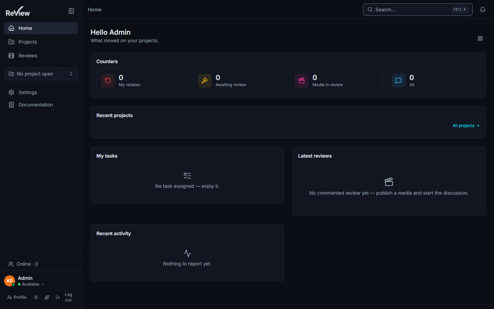

# First run

> Updated: 2026-08-21



## Setup page

On an empty database, every route redirects to **`/setup`**. This one-time wizard
creates:

- the **studio** (name — one ReView instance hosts exactly one studio), and
- the first **administrator** account.

Once setup completes, the app switches to the normal login flow and `/setup` is no
longer accessible.

### The setup endpoints

The wizard is backed by two routes (`backend/src/routes/setup.routes.ts`), both public
by nature — no account exists yet. The whole `/api/setup` prefix is rate-limited to
**10 requests per 15 minutes per IP**, on top of the `studio.count() > 0` guard.

```bash
curl -s http://localhost:3430/api/setup/status
```

```json
{ "needsSetup": true }
```

```bash
curl -s -X POST http://localhost:3430/api/setup \
  -H "Content-Type: application/json" \
  -d '{
        "studioName": "Mystudio",
        "adminEmail": "admin@mystudio.com",
        "adminPassword": "correct-horse-9",
        "adminName": "Alex"
      }'
```

`201 Created`:

```json
{
  "studio": { "id": 1, "name": "Mystudio", "slug": "mystudio" },
  "user": { "id": 1, "email": "admin@mystudio.com", "name": "Alex", "role": "ADMIN" },
  "token": "eyJhbGciOiJIUzI1NiIsInR5cCI6IkpXVCJ9…"
}
```

Field rules, as validated:

| Field | Rule |
|-------|------|
| `studioName` | 2–120 characters. The slug is derived from it |
| `adminEmail` | valid email, ≤ 254 characters, normalised before storage |
| `adminPassword` | 8–128 characters, **at least one letter and one digit** |
| `adminName` | optional, ≤ 120 characters |

The response returns an **access token only** — no refresh token; the SPA calls
`POST /api/auth/login` on the next visit. The token carries a revocable session id, so
even this very first administrator token can be revoked.

Replaying the call once a studio exists returns `409`:

```json
{ "error": "The studio is already set up", "code": "ALREADY_SETUP" }
```

## Seed accounts (development)

The development seed (`backend/prisma/seed.ts`) is idempotent (upserts on unique keys)
and creates a demo studio `ReView Studio` with:

| Account | Password | Role |
|---------|----------|------|
| `admin@review.local` | `admin1234` | ADMIN |
| `artist@review.local` | `artist1234` | ARTIST |

plus a sample project with one sequence, one shot, one task with a version, and one
reusable asset.

```bash
docker compose exec backend npm run seed
```

These credentials are public knowledge. **Never run the seed on an instance reachable
from anywhere but your workstation**, and delete the accounts if you ever do.

Verify the login works:

```bash
curl -s -X POST http://localhost:3430/api/auth/login \
  -H "Content-Type: application/json" \
  -d '{ "email": "admin@review.local", "password": "admin1234" }'
```

```json
{
  "token": "eyJhbGciOiJIUzI1NiIsInR5cCI6IkpXVCJ9…",
  "refreshToken": "eyJhbGciOiJIUzI1NiIsInR5cCI6IkpXVCJ9…",
  "user": { "id": 1, "email": "admin@review.local", "name": "Admin", "role": "ADMIN" }
}
```

## First steps

1. Sign in as an administrator.
2. Open **Admin** (sidebar) and review the studio settings. The defaults that matter
   most, with the values applied when the setting row is absent
   (`backend/src/lib/settings.ts`):

   | Setting | Key | Default |
   |---------|-----|---------|
   | Maximum file size | `max_file_size` | 5 GiB |
   | Per-user storage limit | `storage_limit_user` | 10 GiB |
   | Concurrent uploads | `max_concurrent_uploads` | 5 |
   | Trash retention | `trash_retention_days` | 30 days (`0` disables the purge) |
   | Default start frame | `default_start_frame` | 1001 |
   | Studio default language | `studio_default_locale` | English |
   | Source URL (AGPL §13) | `studio_source_url` | upstream repository |

   Pipeline defaults (resolution / framerate / frame range) and the video transcoding
   ladder live in the same section — see [Pipeline settings](../admin-guide/pipeline-settings.md)
   and [Transcoding](../admin-guide/transcoding.md).
3. Configure SMTP if you want invitations, digests and the weekly report to leave the
   instance ([SMTP & announcements](../admin-guide/smtp-and-announcements.md)). Without
   `SMTP_HOST` — or an SMTP configuration saved in the admin — nothing is sent.
4. Create a **project**, then sequences/shots and assets, or import your structure.
5. Invite users from **Admin → Users** and set their roles
   (see [Users & roles](../admin-guide/users-and-roles.md)). Self-registration
   (`POST /api/auth/register`) is disabled unless `ALLOW_SELF_REGISTRATION=true`.
6. Upload a first media on a task version and open it in review.

## Checking the instance is fully wired

```bash
# API alive
curl -s http://localhost:3430/health                 # {"status":"ok"}

# Queues visible (empty counters are fine, a missing metric is not)
curl -s http://localhost:3430/metrics | grep review_queue_jobs

# Worker consuming
docker compose logs --tail=20 worker                 # "[ffmpeg.worker] démarré."

# Object storage reachable — the bucket is created at backend boot
docker compose exec minio mc ls local/review
```

If `GET /health` answers but uploads stay in `UPLOADING`, the worker or Redis is the
problem — see [Jobs & workers](../infrastructure/jobs-and-workers.md).

## Related pages

- [Installation](installation.md)
- [Docker stack](docker-stack.md)
- [Projects & pipeline](../user-guide/projects-and-pipeline.md)
- [Upload & publishing](../user-guide/upload-and-publishing.md)
- [Admin overview](../admin-guide/overview.md)
