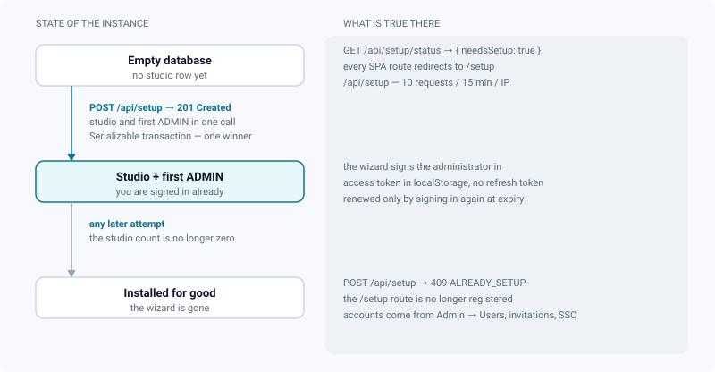
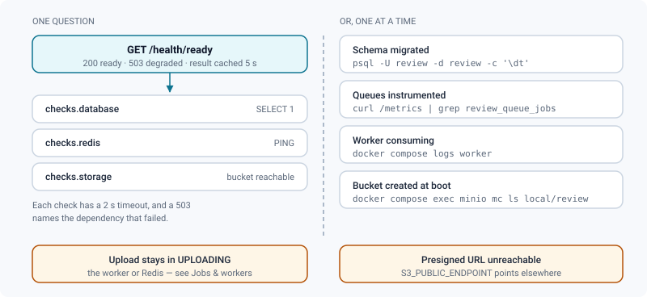

# First run

*Create the studio and its first administrator, set the defaults that matter, and prove the instance is really wired.*

> Updated: 2026-08-23

A freshly started stack holds an empty database. There is no studio, no account, and no way
in — which is why every route of the application redirects to a one-time wizard at `/setup`.
Ten minutes later you have a studio, an administrator, the settings a studio actually cares
about, and a first media that has travelled the whole pipeline.

This page walks that path, then gives you the two ways to check that PostgreSQL, Redis and
MinIO are all answering — because an instance that looks fine and cannot process a single
upload is the failure mode worth catching on day one.

## The setup wizard

On an empty database, every route redirects to **`/setup`** — the URL `scripts/install.sh`
prints when it finishes. The wizard has two steps and creates exactly two things: the
**studio** (one ReView instance hosts exactly one studio) and the first **administrator**
account.



Submitting the second step signs you in immediately: the access token returned by the call is
stored in the browser and you land on the home dashboard, already an `ADMIN`. Nothing else has
to be done to "log in the first time".


> [!IMPORTANT]
> The wizard closes for good. Once a studio row exists, the `/setup` route is no longer
> registered by the application and `POST /api/setup` answers `409`. Every later account comes
> from **Admin → Users**, from an invitation, or from SSO provisioning — self-registration
> stays off unless you set `ALLOW_SELF_REGISTRATION=true`.

## The setup endpoints

The wizard is backed by two routes (`backend/src/routes/setup.routes.ts`), both public by
nature — no account exists yet. The whole `/api/setup` prefix is rate-limited to **10 requests
per 15 minutes per IP**, on top of the `studio.count() > 0` guard.

```bash
curl -s http://localhost:3430/api/setup/status
```

```json
{ "needsSetup": true }
```

```bash
curl -s -X POST http://localhost:3430/api/setup \
  -H "Content-Type: application/json" \
  -d '{
        "studioName": "Mystudio",
        "adminEmail": "admin@mystudio.com",
        "adminPassword": "correct-horse-9",
        "adminName": "Alex"
      }'
```

`201 Created`:

```json
{
  "studio": { "id": 1, "name": "Mystudio", "slug": "mystudio" },
  "user": { "id": 1, "email": "admin@mystudio.com", "name": "Alex", "role": "ADMIN" },
  "token": "eyJhbGciOiJIUzI1NiIsInR5cCI6IkpXVCJ9…"
}
```

Field rules, as validated:

| Field | Rule |
|-------|------|
| `studioName` | 2–120 characters. The slug is derived from it |
| `adminEmail` | valid email, ≤ 254 characters, normalised before storage |
| `adminPassword` | 8–128 characters, **at least one letter and one digit** |
| `adminName` | optional, ≤ 120 characters |

The creation runs inside a **Serializable** transaction with the studio count *inside* it, so
two installers racing each other cannot both win: the loser gets a serialization conflict,
which is translated into the same `409` as a late replay.

```json
{ "error": "The studio is already set up", "code": "ALREADY_SETUP" }
```

The response carries an **access token only** — no refresh token. That does not mean you have
to sign in again on the next visit: the token is stored in the browser and stays valid for
`JWT_EXPIRES_IN` (7 days by default). It means the session cannot be renewed silently, so
your first real sign-in happens when that token expires. The token also carries a revocable
session id, so even this very first administrator token can be cut off — see
[Sessions & offboarding](../admin-guide/identity-and-api.md#sessions--offboarding).

## Seed accounts (development)

The development seed (`backend/prisma/seed.ts`) is idempotent — it upserts on unique keys —
and creates a demo studio `ReView Studio` with:

| Account | Password | Role |
|---------|----------|------|
| `admin@review.local` | `admin1234` | ADMIN |
| `artist@review.local` | `artist1234` | ARTIST |

plus a sample project with one sequence, one shot, one task carrying a version, and one
reusable asset. It also creates the four **global review statuses** that make the approval
workflow usable immediately:

| Status | Colour | Flag |
|--------|--------|------|
| `Pending` | `#F5A623` | default |
| `Approved` | `#2ECC71` | approval |
| `Retake` | `#E74C3C` | retake |
| `CBB` | `#3498DB` | — |

(Those four are also bootstrapped on a production instance the first time the status list is
read, so a studio that never runs the seed still gets them. Rename or replace them from
**Admin → Review contexts → Statuses** — see
[Review decisions & approvals](../user-guide/review-approvals.md).)

```bash
docker compose exec backend npm run seed
```

> [!CAUTION]
> These credentials are public knowledge. **Never run the seed on an instance reachable from
> anywhere but your workstation**, and delete the accounts if you ever do.

Verify the login works:

```bash
curl -s -X POST http://localhost:3430/api/auth/login \
  -H "Content-Type: application/json" \
  -d '{ "email": "admin@review.local", "password": "admin1234" }'
```

```json
{
  "token": "eyJhbGciOiJIUzI1NiIsInR5cCI6IkpXVCJ9…",
  "refreshToken": "eyJhbGciOiJIUzI1NiIsInR5cCI6IkpXVCJ9…",
  "user": { "id": 1, "email": "admin@review.local", "name": "Admin", "role": "ADMIN" }
}
```

Unlike the setup call, a normal login *does* return a refresh token — that is the pair the
application renews sessions with.

## First steps

You are already signed in as the administrator the wizard created. In order:

1. **Open Admin** (sidebar) and review the studio settings. The defaults that matter most,
   with the values applied when the setting row is absent (`backend/src/lib/settings.ts`):

   | Setting | Key | Default |
   |---------|-----|---------|
   | Maximum file size | `max_file_size` | 5 GiB |
   | Per-user storage limit | `storage_limit_user` | 10 GiB |
   | Concurrent uploads | `max_concurrent_uploads` | 5 |
   | Trash retention | `trash_retention_days` | 30 days (`0` disables the purge) |
   | Default start frame | `default_start_frame` | 1001 |
   | Studio default language | `studio_default_locale` | English |
   | Source URL (AGPL §13) | `studio_source_url` | upstream repository |

   Pipeline defaults (resolution, framerate, frame range) and the video transcoding ladder
   live in the same section — see
   [Pipeline settings](../admin-guide/pipeline-settings.md) and
   [Transcoding](../admin-guide/transcoding.md).

2. **Configure SMTP** if you want invitations, digests and the weekly report to leave the
   instance ([SMTP & announcements](../admin-guide/smtp-and-announcements.md)). Without
   `SMTP_HOST` — or an SMTP configuration saved in the admin, which takes precedence —
   nothing is sent.

3. **Create a project**, then its sequences, shots and assets. One decision belongs to this
   moment: the optional **Episode** level. It is a per-project switch
   (`Project.episodesEnabled`, off by default) that inserts a level above sequences and drives
   navigation, breadcrumbs, filters and creation. A feature film should never see it; a series
   should turn it on before the structure is built. See
   [Projects & pipeline](../user-guide/projects-and-pipeline.md).

4. **Or import the structure you already have.** A CSV of shots, sequences, tasks and
   assignees can be previewed, dry-run and then applied —
   [Importing a project](../user-guide/importing-a-project.md).

5. **Invite users** from **Admin → Users** and set their roles (see
   [Users & roles](../admin-guide/users-and-roles.md)).

6. **Upload a first media** on a task version and open it in review. That single round trip
   exercises the presigned upload, the queue, the worker and the realtime channel at once —
   it is the real acceptance test of an installation.

> [!TIP]
> Wiring a pipeline tool to the instance is the natural next step. Issue a **service token**
> (`POST /api/admin/service-tokens`, `ADMIN` only) — a machine identity that cannot log in and
> never appears in the directory — then read the scoped
> [v1 integration](../api/v1-integration.md). The surrounding model — sessions, tokens,
> webhooks, audit — is [Identity, API & audit](../admin-guide/identity-and-api.md).

## Checking the instance is fully wired

One call answers for all three dependencies at once, and names the culprit when one is down:

```bash
curl -s http://localhost:3430/health/ready
```

```json
{
  "status": "ready",
  "version": "2.3.0",
  "commit": null,
  "cached": false,
  "checks": {
    "database": { "ok": true, "ms": 3 },
    "redis": { "ok": true, "ms": 1 },
    "storage": { "ok": true, "ms": 12 }
  }
}
```

A failing dependency turns the response into `503` with `"status": "degraded"` and an `error`
on the offending check. Each probe is bounded at 2 s and the report is cached 5 s, so it is
safe to poll.

When you want to know *why* rather than *whether*, ask the four questions one at a time:



```bash
# Schema migrated — the backend applies the migrations at boot
docker compose exec postgres psql -U review -d review -c '\dt'

# Queues instrumented (empty counters are fine, a missing metric is not)
curl -s http://localhost:3430/metrics | grep review_queue_jobs

# Worker consuming
docker compose logs --tail=20 worker                 # "[ffmpeg.worker] démarré."

# Object storage reachable — the bucket is created at backend boot
docker compose exec minio mc ls local/review
```

Two symptoms are worth recognising immediately. If `/health` answers but uploads stay in
`UPLOADING`, the worker or Redis is the problem — see
[Jobs & workers](../infrastructure/jobs-and-workers.md). If the media uploads but the browser
cannot fetch it back, `S3_PUBLIC_ENDPOINT` is pointing somewhere the browser cannot reach —
see [Installation](installation.md#object-storage).

## Related pages

- [Installation](installation.md)
- [Docker stack](docker-stack.md)
- [Projects & pipeline](../user-guide/projects-and-pipeline.md)
- [Importing a project](../user-guide/importing-a-project.md)
- [Upload & publishing](../user-guide/upload-and-publishing.md)
- [Review decisions & approvals](../user-guide/review-approvals.md)
- [Admin overview](../admin-guide/overview.md)
- [v1 integration](../api/v1-integration.md)
