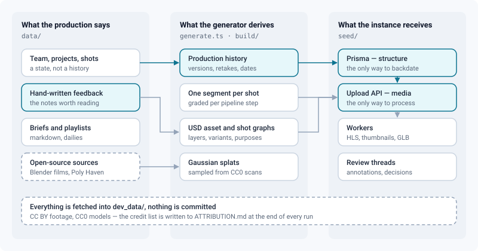

# Sample project

*Fill a local instance with a studio that looks like a studio — a series in production, a team, real media, and a review history worth reading.*

> Updated: 2026-08-29

An empty ReView instance proves nothing. You cannot judge a review workspace on a single
uploaded file, and you cannot show a pipeline to anyone with one shot called `test`. The
sample project generator builds the thing you actually want to look at: a three-episode
series in production, fifteen people with jobs and departments, video, images, USD scenes and
Gaussian splats that really went through the pipeline, and four months of review history —
versions, retakes, annotations, decisions.

Everything it uses is free to redistribute: the Blender Open Movies for footage (CC BY),
Poly Haven for models and HDRIs (CC0). Nothing is committed to the repository — the media are
fetched and built into `dev_data/`, which git ignores.

## Running it

The stack must be up (`docker compose up -d`) and `ffmpeg` on the PATH. Blender is needed for
the USD and splat parts; set `SAMPLE_BLENDER_BIN` if it is not in the usual place.

```bash
cd backend
npm run sample
```

The first run downloads the film masters — about two gigabytes, once — and takes roughly
twenty-five minutes end to end. Later runs reuse everything cached and take a few minutes.

| Command | What it does |
| --- | --- |
| `npm run sample` | Everything: structure, media, review history |
| `npm run sample -- --skip-media` | Structure only, a few seconds — useful when iterating |
| `npm run sample -- --reset` | Delete the sample project first, then rebuild |
| `npm run sample -- --concurrency=2` | Fewer parallel uploads on a small machine |

Every sample account signs in with the password `sample1234`. The generator prints the
addresses at the end; `ada.vermeer@sample.review` is the administrator.

## What you get



The project is **Caminandes**, the Blender comedy series: a guanaco, a road, an electric
fence, and a penguin. Three episodes, eight sequences, thirty-one shots, eleven assets, and
around three hundred versions.

| Episode | State | What it is there to show |
| --- | --- | --- |
| **EP01 — Llama Drama** | Delivered | A finished episode: everything approved and published, nothing left to do |
| **EP02 — Gran Dillama** | Delivered | The hero prop (the fence), an FX-heavy sequence, and the orbital pull-back shot |
| **EP03 — Llamigos** | In production | The live part: shots at every stage from brief to comp, open retakes, dailies, a montage |

The episode level is enabled, which is the only way to see that rung of the hierarchy in the
breadcrumb, the filters and the montage.

Beyond the hierarchy, the generator populates what usually stays empty in a demonstration and
is exactly what people look for: playlists ready for tomorrow's daily, client share links with
a password and an expiry, a montage with a frozen revision, entity briefs written in the block
editor, a moodboard on the project board, team chat threads, notifications, favourites and
watches, an HDRI library, API tokens for a render farm, and audit entries.

## What is real, and what is imitated

The distinction matters when you show the instance to someone.

**Real**: every media file went through the actual upload path — presigned URL, magic-byte
check, processing queue. Videos have an HLS ladder, a timeline sprite and a thumbnail. USD
archives were converted to GLB by Blender, with their scene graph, variant sets and purposes
read back into the technical sheet. Splats are standard 3DGS files. Image sequences arrived
frame by frame and were assembled into one media.

**Imitated**: the footage is cut from finished films, then graded per pipeline step so a
layout looks like a layout and a comp looks like a comp. Nobody actually animated these shots.
The people are invented, and so are their notes — though the notes are written the way review
notes are written, because a data set full of "looks great, approved" demonstrates nothing.

## The USD graph

The 3D assets are not single files. Each one is a proper asset graph, the way a studio ranges
it: an interface layer that shots reference, a payload that can be unloaded, a geometry layer
written by Blender, a material library, a binding layer, a look variant set, and render and
proxy purposes. Shots stack their own layers on top — layout, animation, lighting, fx — in
composition order, referencing the assets rather than importing them.

That structure is why the review shows a real scene graph, offers the variant switch, and can
recompose the scene without touching a single source file. It is also the part worth opening
in a text editor: the archives are `.usda` where it counts.

## Regenerating

The generator is idempotent and resumable. It skips media already uploaded, reuses cached
segments, models and USD graphs, and retries what failed. To start over completely, delete
`dev_data/sample-project/` and pass `--reset`.

## Attribution

Every run rewrites `ATTRIBUTION.md` at the root of the repository with the works used, their
authors and their licences. CC BY requires the credit; keep the file with the data if you
publish screenshots or a demonstration built from it.
