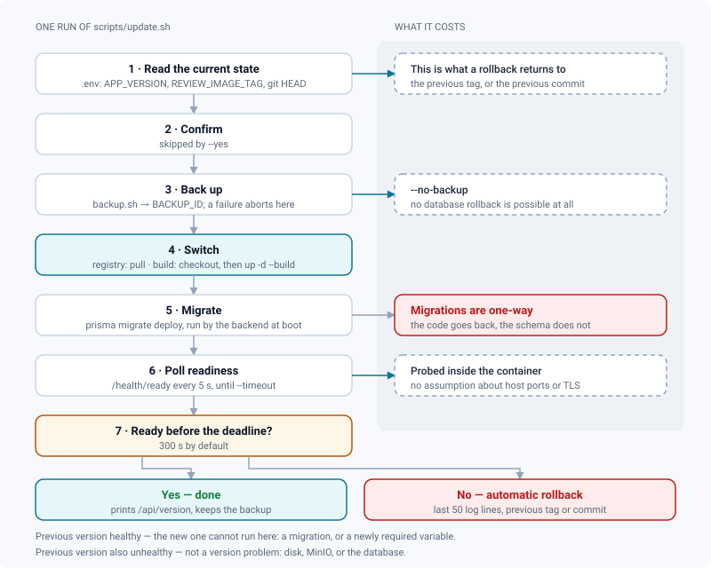
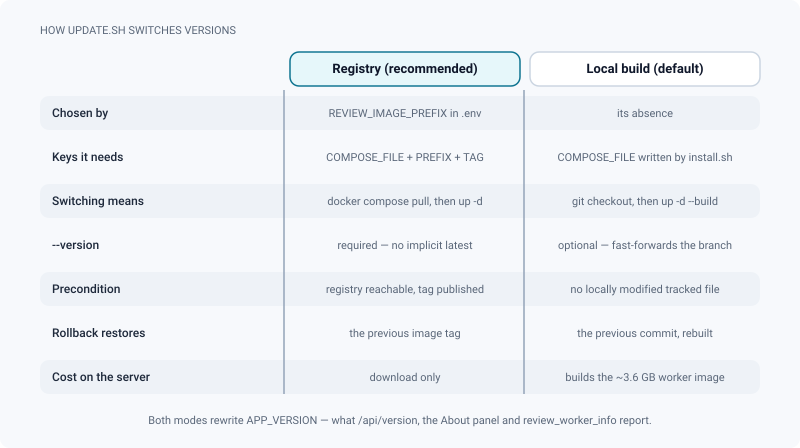

# Updating

*Move an instance to a new version in one command: backup first, switch, wait for a real health gate, roll back automatically if it does not come up.*

> Updated: 2026-08-23

Updating a ReView instance is one command. It backs up first, switches, waits for the instance
to report itself healthy from the inside, and puts the previous version back if it does not.

```bash
cd /path/to/ReView-app
bash scripts/update.sh --version v2.3.0
```

Nothing about that command assumes host ports, a TLS front, or a particular deployment style:
the readiness probe runs *inside* the backend container, and the compose files it acts on are
the ones your `.env` already names.

## What it does, in order



1. **Reads the current state** — `APP_VERSION` (and `REVIEW_IMAGE_TAG` in registry mode) from
   `.env`, plus the current git commit. That is what a rollback goes back to.
2. **Asks for confirmation**, unless you pass `--yes`.
3. **Backs up** — runs `scripts/backup.sh` and refuses to continue if it fails. At this point
   nothing has been switched, so a failed backup leaves the instance exactly as it was.
4. **Switches** — pulls the published images, or checks out the tag and rebuilds, and writes
   the new `APP_VERSION` so the instance can name itself.
5. **Migrates** — the backend container runs `prisma migrate deploy` at boot. There is no
   destructive fallback: a failed migration fails the boot, which fails the next step.
6. **Verifies** — polls `GET /health/ready` inside the backend container every 5 s until every
   dependency answers `"status": "ready"`, for up to `--timeout` seconds (default 300).
7. **Rolls back if needed** — dumps the last 50 backend log lines, restores the previous tag
   or commit, restarts, and re-checks. If the previous version does not come back either, it
   says so: the problem is not the version.

> [!WARNING]
> `--no-backup` does not just skip a slow step. It means **no database rollback is possible at
> all** afterwards — the script says so and then proceeds. Use it only when another snapshot
> of the same moment exists, a ZFS one for instance.

## Two ways to switch

The mode is chosen from `.env`, not from a flag: if `REVIEW_IMAGE_PREFIX` is set, the script
pulls published images; otherwise it moves the git checkout and rebuilds.



### Published images (recommended)

No compilation on the studio's server: the release workflow publishes `review-backend`,
`review-worker` and `review-frontend` for every tag. Point the instance at them once, in
`.env`:

```dotenv
COMPOSE_PATH_SEPARATOR=:
COMPOSE_FILE=docker-compose.yml:docker-compose.prod.yml:docker-compose.release.yml:deploy/compose.site.yml
REVIEW_IMAGE_PREFIX=ghcr.io/yvigunderscore
REVIEW_IMAGE_TAG=v2.3.0
```

`update.sh` then requires `--version`: there is no implicit `latest` in production, because an
instance that cannot name its version cannot be supported — nor can it point at the
*corresponding* sources the AGPL asks for.

> [!CAUTION]
> Do not paste that `COMPOSE_FILE` line blindly. It is right for an instance installed with a
> TLS mode, but an instance installed with `--tls none` has
> `COMPOSE_FILE=docker-compose.yml:deploy/compose.site.yml` on purpose. Adding
> `docker-compose.prod.yml` to it removes every host port the instance was reachable on and
> turns five variables into hard requirements — the update will simply refuse to start.
> Insert `docker-compose.release.yml` **into the list you already have**, keeping the rest
> untouched.

### Local build

The default after `scripts/install.sh`. `update.sh` fetches tags, checks out the requested one
(or fast-forwards the tracked branch when you pass no `--version`) and rebuilds. It refuses to
run with locally modified tracked files — commit or discard them first. This is exactly why
the installer never edits a versioned file: everything specific to your site lives in `.env`
and `deploy/`.

The cost is the ~3.6 GB worker image, rebuilt on the studio server: Blender and `usd-core`
make it the largest thing in the stack.

## What an update does not touch

Three things stay exactly as the installer left them, and knowing which ones saves an hour of
searching:

| Not refreshed | Consequence |
|---------------|-------------|
| `deploy/nginx.conf` | Rendered once by `scripts/install.sh` for your domain. A version that changes `nginx/nginx.conf` upstream does **not** propagate; re-render it yourself (`sed "s/YOUR_DOMAIN/<domain>/g" nginx/nginx.conf > deploy/nginx.conf`) and restart nginx |
| TLS certificates | `update.sh` never renews them. Let's Encrypt renewal stays a job of yours — see [Installation](installation.md#install-a-studio-instance) |
| `.env`, apart from two keys | Only `APP_VERSION` and, in registry mode, `REVIEW_IMAGE_TAG` are rewritten. A new release that introduces a **required** variable will fail the health gate until you add it |

## Versions and release notes

Versions are `vX.Y.Z` git tags. Two changelogs, on purpose:

- [`CHANGELOG.md`](https://github.com/YvigUnderscore/ReView/blob/main/CHANGELOG.md) at the
  repository root — the **operator** log: what each version requires (breaking changes,
  migrations, manual steps, images). Read it before updating.
- `DOCUMENTATION/CHANGELOG.md` — the **product** notes, the ones your artists read in the
  in-app *What's new* panel.

After the update, the running version is visible in three places: `GET /api/version`,
**Admin → System → About this instance**, and the `review_worker_info` metric.

> [!NOTE]
> An instance can name its **version**, not its commit. `/api/version` reports `commit` and
> `builtAt` as `null`: they come from `GIT_SHA` and `BUILD_DATE`, which the release workflow
> passes as build arguments that no shipped Dockerfile declares, and which neither script
> writes into `.env`. Quote `version` when you ask for support.

## Rolling back on purpose

```bash
bash scripts/update.sh --version v2.2.4 --yes
```

The same machinery runs in reverse, with one caveat the script prints and this page repeats:
**the code goes back, the database does not.** Prisma migrations are one-way. If the older
version cannot run on the migrated schema, restore the dump taken just before the update:

```bash
docker compose stop backend worker
bash scripts/restore.sh db backups/<timestamp>/db.dump
docker compose up -d backend worker
```

Everything written since the update is lost by that restore — do it only if the instance is
unusable. Restoring media objects as well is
`bash scripts/restore.sh all backups/<timestamp>`.

## Checking a backup before you need it

```bash
bash scripts/restore.sh verify backups/<timestamp>
```

Restores the dump into a throwaway database, counts what came out, compares the object
snapshot with the live bucket, then drops the throwaway database. Nothing on the instance is
touched. Worth scheduling monthly — a backup that has never been restored is not a backup. See
[Backups & restore](../infrastructure/backups.md).

```
▶ Restauration d'essai dans la base jetable review_restore_check_1787412217…
  base   : 57 tables, 40 comptes, 20054 médias
  objets : 2290 dans l'instantané, 2295 dans le bucket vivant
✅ Sauvegarde 20260822-172229 vérifiée (rien n'a été modifié sur l'instance).
```

A small object delta is normal — uploads that landed after the mirror ran. The check only
fails on something that means the backup is not usable: an empty snapshot, or a dump that
restores fewer than eleven tables.

## If something goes wrong

| Symptom | Meaning | What to do |
|---------|---------|-----------|
| `la sauvegarde n'a pas abouti` | `backup.sh` failed before anything was switched | The instance is untouched. Check disk space and `docker compose ps postgres minio` |
| Rollback ran, previous version healthy | The new version cannot start here | Read `docker compose logs --tail=100 backend`; a failed migration or a newly required variable is the usual cause |
| Rollback ran, previous version *also* unhealthy | Not a version problem | Look at the dependencies: disk full, MinIO down, database unreachable |
| `des fichiers suivis sont modifiés localement` | Someone edited a versioned file on the server | `git diff` to see what, then commit or `git checkout --` it. Site configuration belongs in `.env` and `deploy/` |
| `mode registre : préciser la version` | Registry mode with no `--version` | There is no implicit `latest`; pass the tag you mean |
| `récupération des images impossible` | Registry unreachable, or the tag was never published | Check the registry and that the release workflow finished for that tag |
| Update succeeded but users see the old interface | Browser cache on `index.html` | The bundled nginx sends `no-cache` for `index.html`; a custom front proxy must not cache it |

## Related pages

- [Installation](installation.md)
- [Docker stack](docker-stack.md) — overlays, images, startup gates
- [Backups & restore](../infrastructure/backups.md)
- [Monitoring & operations](../infrastructure/monitoring.md) — probes, metrics, alerts
- [Containers & configuration](../infrastructure/containers-and-configuration.md)
