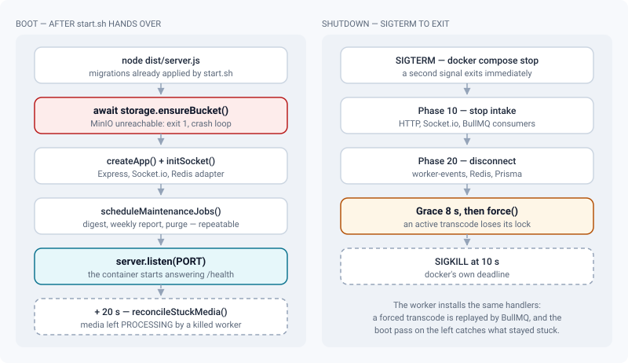
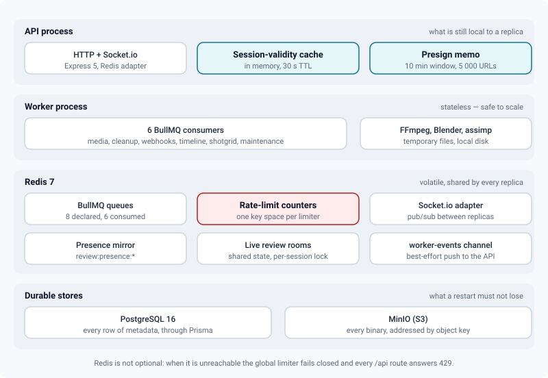

# Architecture

*How the API, the worker, Redis, PostgreSQL and MinIO fit together — and which one takes the instance down.*

> Updated: 2026-08-23

One instance is one studio. It is six containers in the default stack, seven in production,
and it holds exactly three kinds of state: rows in PostgreSQL, objects in MinIO, and
everything volatile in Redis. This page is the map an operator needs before reading a log
line: what runs where, what each process owns, and what a reader actually loses when one of
the three backing services stops answering.

The single most important sentence on the page is this one: **media bytes do not follow the
request path.** The browser uploads to MinIO and reads from MinIO directly, over presigned
URLs the API issues after an RBAC check. Sizing the Node process for video traffic is sizing
the wrong thing.

## What runs, and what talks to what

| Service | Image | Role | Host port (dev) |
|---------|-------|------|-----------------|
| `frontend` | built from `frontend/Dockerfile`, `nginx:1.27-alpine` | Serves the SPA and proxies `/api/` and `/socket.io/` to the backend | `PORT`, default `3429` |
| `backend` | built from `backend/Dockerfile` | Express 5 API + Socket.io, `node dist/server.js` | `BPORT`, default `3430` |
| `worker` | same build, `INSTALL_USD_TOOLS=1` adds Blender + usd-core | BullMQ consumers, `node dist/workers/ffmpeg.worker.js` | none |
| `postgres` | `postgres:16-alpine` | All metadata, through Prisma | `5432` (dev overlay only) |
| `redis` | `redis:7-alpine` | Queues, rate-limit counters, Socket.io adapter, presence, live rooms | `6379` (dev overlay only) |
| `minio` | `minio/minio` (pinned) | One bucket, every binary | `9000` / `9001`, bound to `127.0.0.1` |
| `nginx` (production only) | `nginx:1.27-alpine` | TLS termination; the only exposed service | `80` / `443` |

`prometheus`, `grafana` and `clamav` sit behind compose profiles and are off unless you ask
for them. See [Docker stack](../getting-started/docker-stack.md) for the full service list and
[Monitoring](monitoring.md) for the profile.

A browser therefore talks to exactly two origins: the application, and object storage — and in
production, behind the TLS proxy, even those two share one hostname.

## The API process

**Express 5 on TypeScript, Prisma over PostgreSQL.** Routes are deliberately thin (validate →
service → respond, 200 lines maximum) and the business logic lives in `services/` and `lib/`.
Every route validates its input with Zod (`middleware/validate`) and carries RBAC
(`middleware/auth` + `middleware/rbac`); reads are filtered by project membership rather than
checked afterwards. Errors are typed (`lib/errors`) and logging is pino, with a request id on
every response.

Multi-step writes run inside `prisma.$transaction`. MinIO side effects happen **after** the
commit, and a side effect that fails is pushed onto a retry queue instead of rolling the
transaction back — see [MinIO storage](storage-minio.md#deletion-and-the-two-known-leaks).

**Socket.io** carries presence, notifications, media processing status, project rooms and live
review. It runs with the `@socket.io/redis-adapter` on two dedicated Redis connections, so an
emission produced by one process reaches clients connected to another.



### Boot

`backend/start.sh` runs `npx prisma generate`, then `npx prisma migrate deploy`, then
`node dist/server.js`. A failed migration **stops the container** with its stderr intact and
the database untouched; initialising an empty database without versioned migrations is a
deliberate act (`PRISMA_DB_PUSH=1`, refused under `NODE_ENV=production`). The gates are
described in [Containers & configuration](containers-and-configuration.md#the-schema-gate-at-boot).

`server.ts` then, in order:

1. `await storage.ensureBucket()` — creates the bucket if missing and applies the CORS rules;
2. builds the Express app and attaches Socket.io with its Redis adapter and its presence and
   live-room mirrors;
3. `scheduleMaintenanceJobs(DIGEST_HOUR)` — (re)poses the three repeatable jobs on the
   `maintenance` queue;
4. registers the shutdown tasks and installs the signal handlers;
5. `server.listen(PORT)`;
6. twenty seconds later, `reconcileStuckMedia()` sweeps media frozen in `PROCESSING` with no
   live job left in the queue — the residue of a worker killed mid-transcode. The delay exists
   so a worker that is merely slow to connect is not mistaken for a dead one.

> [!IMPORTANT]
> Step 1 runs **before** the listener. That is the single most consequential ordering decision
> in the design: with MinIO down the API never opens a port at all, and under
> `restart: always` the container crash-loops instead of serving a half-working instance.

### Shutdown

`docker compose stop`, `restart` and `up --build` all send `SIGTERM` and then `SIGKILL` ten
seconds later. Both processes install handlers (`lib/gracefulShutdown`) that run their
registered tasks **by phase**, in parallel within a phase, under an eight-second grace period:

| Phase | Tasks | Why it comes first |
|-------|-------|--------------------|
| `10` — stop intake | `server.closeIdleConnections()`, `io.close()`, BullMQ consumers `close()`, queue producers, the OCIO bake queue | Stop accepting new work while in-flight work finishes |
| `20` — disconnect | `worker-events` pub/sub, Redis clients, `prisma.$disconnect()` | Nothing needs them once nothing is running |

A consumer's soft `close()` waits for its active jobs, which is right for a webhook and wrong
for a twenty-minute transcode: when the grace period expires the task's `force()` runs, the
job loses its BullMQ lock and is replayed. A second signal exits immediately — an operator who
presses Ctrl-C twice wants it to stop, not to negotiate.

## The worker process

The worker runs the same code base in a separate container, with a different entry point and,
when `INSTALL_USD_TOOLS=1`, a heavier image (1.6 GB → 3.6 GB) that also carries Blender and
`usd-core`. It starts **six** consumers in one process:

| Queue | Concurrency | Work | Retries |
|-------|------------|------|---------|
| `media-processing` | 2 | HLS ladder, MP4 proxy, thumbnails, sprite sheet, trim, image-sequence assembly, 3D → GLB conversion, splat processing, antivirus scan | 3, exponential from 5 s |
| `storage-cleanup` | 2 | Retry of MinIO deletions orphaned after a commit | 8, exponential from 15 s |
| `webhooks` | 3 | Outgoing signed HTTP deliveries | 5, exponential from 10 s |
| `timeline-export` | 1 | Auto-cut timeline exports | 2, exponential from 10 s |
| `shotgrid` | 2 | ShotGrid events, polling, reconciliation, outbound writes | 2, exponential from 15 s |
| `maintenance` | 1 | Daily digest, weekly report, daily purge and retention sweep | 2, exponential from 60 s |

Two facts follow from that table. **Outgoing webhooks leave from the worker, not from the
API** — the container that answers the internet never makes arbitrary outbound HTTP calls.
And **the three periodic appointments are queue jobs, not timers**: the API poses them because
it is the process that carries `DIGEST_HOUR`, the worker executes them at concurrency 1. They
survive a restart, they cannot double-fire on a second replica, and they appear in the job
dashboard like any other work.

> [!NOTE]
> Two more queues are declared and written to but have **no consumer started** in the current
> worker entry point: `spatial-thumb` (Cycles renders for 3D and splat thumbnails) and
> `ocio-bake` (display LUT baking). Jobs posted to them wait. Neither is loud about it — a
> spatial thumbnail is decorative, and the viewer bakes its colour fallback on demand — but a
> queue whose `waiting` count only ever grows is not necessarily the symptom of a broken
> worker. See [Jobs & workers](jobs-and-workers.md#queues).

The worker also carries its own Prometheus endpoint (`worker:9101/metrics`, never published on
the host) built to be scraped alongside the API, and `monitoring/prometheus.yml` already targets
it. It has to be started explicitly, and the current worker entry point does not do so; until it
does, the `review-worker` scrape target stays down. [Monitoring](monitoring.md) covers what it
would expose.

## Where state lives

Almost everything that used to sit in process memory has moved into Redis. That is what turned
"run exactly one replica" from a hard rule into a deployment choice.



| State | Where it lives | What that buys |
|-------|---------------|----------------|
| Socket.io rooms | Redis adapter (`@socket.io/redis-adapter`) | An emission crosses processes; half a dailies room no longer misses events |
| Rate-limit counters | Redis, one key space per limiter (`rl:<name>:`) | A restart no longer resets the brute-force counters, and two replicas share one budget |
| Presence | Redis keys `review:presence:*`, mirrored locally and refreshed by a heartbeat | A replica without a local socket still answers *who is online* |
| Live review rooms | Redis, under a per-session lock, participants carrying a lease | A killed replica does not strand its participants in the room forever |
| Scheduled maintenance | BullMQ repeatable jobs on `maintenance` | A deployment at 06:59 no longer swallows the 07:00 digest |
| Session validity | **In process memory**, 30 s TTL, 10 000 entries | One DB round trip per session per 30 s — the cost is that a revocation takes up to 30 s to bite |
| Presigned read URLs | **In process memory**, stable per 10-minute window, 5 000 entries | A list of a hundred shots reuses the browser cache instead of re-signing a hundred URLs |

Only one non-queue Redis channel is used for application messaging: `review:worker-events`,
which lets the worker tell the API that an HLS rendition or a set of scene markers is ready.
It is explicitly best-effort — a client that misses the push re-reads state from the API.

### Single-instance assumptions

Three of them are gone, one is left. The `worker` service was always stateless and is safe to
scale; the memory ceiling is **per container**, so three replicas of the default
`WORKER_MEM_LIMIT=8g` reserve 24 GB.

```bash
docker compose up -d --scale worker=3
```

The `backend` service is a different conversation. The three reasons that once forbade a
second replica — split Socket.io rooms, doubled schedulers, per-replica rate-limit budgets —
are gone. What remains is smaller but real: a session revoked on one replica can still be
accepted by another for up to 30 s, and the shipped stack has **no load balancer** in front of
the backend (one nginx `upstream`, one server). Scaling out means putting a front end with
sticky routing in place first, because Socket.io's polling handshake has to come back to the
process that opened it.

## The frontend, and the two nginx layers

The SPA is **React 19 + Vite 7 + Tailwind** with shadcn-style primitives, TanStack Query for
every fetch and Zustand for cross-page state (uploads, auth). It is built into static files and
served by nginx, which also proxies `/api/` and `/socket.io/` — the browser only ever talks to
one origin.

The `frontend` container's nginx (`frontend/nginx.conf`) carries three settings worth knowing:

- `client_max_body_size 1G`, because a few endpoints still take a body;
- `resolver 127.0.0.11 valid=10s` with the upstream held in a variable, so restarting the
  backend container does not strand nginx on a dead IP for the rest of the day;
- `gzip on` with `gzip_proxied any` — without that second directive nothing proxied is ever
  compressed, and the entry bundle went out at roughly three times the gzip figure the
  validation suite measures.

In production a second nginx (`nginx/nginx.conf`, added by `docker-compose.prod.yml`)
terminates TLS and becomes the only exposed service. It routes:

| Path | Upstream | Notable |
|------|----------|---------|
| `/api/` | `backend` | 300 s read and send timeouts, for the long calls |
| `/socket.io/` | `backend` | HTTP/1.1 with the `Upgrade` headers preserved |
| `/review/derived/<id>/hls/*.ts` | `minio` | Buffered and **cached on disk** (`proxy_cache`, 2 GB, 3 h) — twenty people watching one daily become one read |
| `/review/` (presigned or S3-authenticated) | `minio` | Unbuffered both ways: video streaming out, presigned `PUT` in |
| `/review/` (anything else) | `frontend` | The SPA route `/review/:mediaId` shares the prefix with the default bucket name; the two are told apart by the presence of a signature, never by rewriting the path |
| `/assets/` | `frontend` | `expires 1y` + `Cache-Control: public, immutable` — safe, Vite hashes the filenames |
| everything else | `frontend` | `index.html` stays `no-cache`, so a deployment is picked up on the next navigation |

Each location sets its own CSP. The storage path carries
`Content-Security-Policy: sandbox; default-src 'none'; frame-ancestors 'none'`, which
neutralises any active content served from an uploaded object.

> [!TIP]
> `add_header` in a `location` block **masks** the ones inherited from `server`. Every location
> in `nginx/nginx.conf` therefore repeats the security headers by hand. If you add a location,
> copy the block — an omission is silent.

## Health, and what "healthy" actually means

Three routes, and they answer three different questions.

| Route | Touches | Answers | Use it for |
|-------|---------|---------|------------|
| `GET /health`, `GET /health/live` | nothing | `200` with version, commit and uptime | Liveness — is the process alive? |
| `GET /health/ready` | PostgreSQL `SELECT 1`, Redis `PING`, MinIO bucket probe | `200 ready` / **`503 degraded`**, with a per-check duration and reason | Readiness — can it actually serve? |
| `GET /api/admin/system` | the same three, plus counts | Admin JSON, authenticated | A human looking at a dashboard |

Readiness is bounded by construction: each check has a 2 s ceiling, the three run in parallel,
the result is memoised for 5 s and concurrent callers share one execution. Hammering it costs
at worst one round trip per dependency every five seconds — a probe must not be the load that
finishes off a struggling instance.

The health router is mounted **twice**, on `/health` and on `/api/health`. The production proxy
only forwards `/api/`, `/socket.io/` and `/review/` to the backend, so a bare `/health` from
outside was being answered by the SPA — `200 text/html`, "everything is fine", whatever the API
was doing. The container's own healthcheck, which runs inside the network, still uses `/health`.

> [!WARNING]
> Probe `/health/ready`, not `/api/health/ready`. The second sits behind the global `/api` rate
> limiter, which **fails closed**: with Redis down it answers `429`, not `503`, and an alert
> keyed on the status code will tell you the wrong story.

Point the container at readiness by setting `HEALTH_PATH=/health/ready` in `.env`; the compose
healthcheck reads that variable. `scripts/install.sh` and `scripts/update.sh` already wait on
`/health/ready` rather than on `docker compose ps`.

## Failure modes

The three backing services fail in three different ways. Know which is which before you page
someone.

| Dependency down | Backend boots? | `GET /api/…` reads | Enqueue a job | Realtime | Video playback | `/health/ready` |
|---|---|---|---|---|---|---|
| **PostgreSQL** | Yes | `500` | `500` | Degraded | Keeps working — segments are presigned | `503` |
| **Redis** | Yes | **`429` — the limiter fails closed** | Hangs: BullMQ retries and ioredis queues offline | Degraded, warning logged | Keeps working | `503` |
| **MinIO** | **No** — `ensureBucket()` exits 1, crash loop under `restart: always` | — | — | — | Broken | `503` |

Three consequences worth internalising:

- **A Redis outage is not a partial outage.** It used to be: reads survived, only enqueueing
  hung. Since the limiter moved into Redis and kept its fail-closed stance — a counter that
  cannot count must not become the way to bypass the limit — every `/api` route answers `429`.
- **A PostgreSQL outage is quiet in the wrong places.** Audit entries, event-journal writes and
  session touches are deliberately swallowed rather than failing the request, so they are simply
  lost for the duration.
- **`GET /health` answers `200` in all three rows.** A "healthy" container is not evidence that
  the stack works. Alert on `/health/ready` or on the Prometheus metrics, never on
  `docker compose ps`.

Job-level behaviour — what a half-finished transcode does, how a stalled job is recovered —
lives in [Jobs & workers](jobs-and-workers.md#failure-modes).

## Production notes

The production stack is the base compose file plus `docker-compose.prod.yml`, which adds the
TLS proxy, removes every host port from `frontend`, `backend` and `minio` (`ports: !reset []`,
Compose ≥ 2.24) and makes the critical secrets mandatory: compose refuses to start without
`JWT_SECRET`, `CORS_ORIGIN`, `S3_PUBLIC_ENDPOINT`, `POSTGRES_PASSWORD` and non-default MinIO
credentials. The backend re-checks the same values at boot and refuses weak secrets,
`CORS_ORIGIN=*` and `minioadmin` under `NODE_ENV=production`.

`docker-compose.release.yml` swaps the three built services for **published images**
(`REVIEW_IMAGE_PREFIX` / `REVIEW_IMAGE_TAG`, both mandatory — there is no implicit `latest`), so
a studio server pulls a signed version instead of compiling a 3.6 GB worker image on a NAS.
`scripts/install.sh` writes the exact overlay list into `.env` as `COMPOSE_FILE`, which is what
makes a bare `docker compose up -d` load the right stack; `scripts/update.sh` switches versions,
waits on readiness and rolls back automatically if it does not come. See
[Installation](../getting-started/installation.md#production-deployment) and
[Updating](../getting-started/updating.md).

## Related pages

- [Containers & configuration](containers-and-configuration.md) — precedence, limits, probes, pins
- [Docker stack](../getting-started/docker-stack.md) — services, volumes, overlays
- [Jobs & workers](jobs-and-workers.md) — queue lifecycle, retries, scaling
- [MinIO storage](storage-minio.md) — key layout, upload paths, quotas
- [HLS delivery](hls-delivery.md) — why segments never touch Node
- [Monitoring & operations](monitoring.md) — metrics, alerts, logs
- [Backups & restore](backups.md)
- [Security model](security.md)
