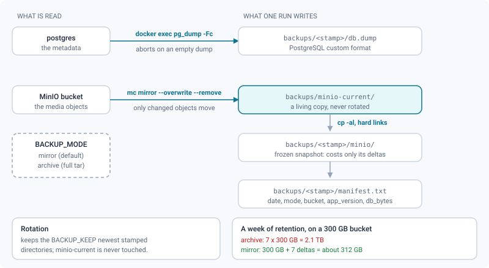
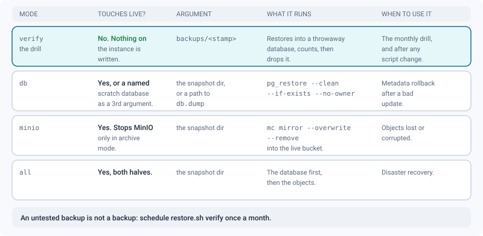

# Backups & restore

*Take, verify and restore an incremental backup of the only two things that hold state — PostgreSQL and MinIO.*

> Updated: 2026-08-23

Two services hold all persistent state: **PostgreSQL** (metadata) and **MinIO** (media objects).
They must be backed up **together** — the database stores MinIO object keys, and a restore that
mixes stamps produces versions pointing at objects that do not exist. One run of
`scripts/backup.sh` captures both into a single dated directory, which is the unit you restore.

| Volume | Backed up? | Why |
|--------|-----------|-----|
| `pgdata` | **yes**, as a `pg_dump -Fc` | Everything the application knows: projects, versions, comments, users, settings |
| `miniodata` | **yes**, as a mirror snapshot or a tar | The bytes themselves — masters, proxies, HLS renditions, thumbnails |
| `redisdata` | no | Rebuildable, but not free — see below |
| `prometheus_data`, `grafana_data` | no | Observability history, rebuildable |
| `clamav_db` | no | Re-downloaded on first start |

> [!NOTE]
> `redisdata` is more than queue state today. Losing it also loses **rate-limit counters**
> (windows restart from zero), **presence and live review rooms** (rebuilt as people reconnect),
> and the **repeatable maintenance schedule** — the digest, the weekly report and the purge stop
> until the API restarts and re-poses them. Media left in `PROCESSING` with no job behind them
> are moved to `FAILED` by the reconciliation pass 20 s after that restart, and relaunched from
> the media menu. Nothing is lost for good; a restart is required.

## Taking a backup

```bash
bash scripts/backup.sh [dir]        # default ./backups
```

One run writes **one directory**, named after the moment it started:

```
backups/
  minio-current/                  living mirror of the bucket (mirror mode)
  20260822-030000/
    db.dump                       pg_dump -Fc, taken inside the postgres container
    env.backup                    copy of .env, mode 600 — see below
    minio/                        hard-link snapshot of the mirror  (mirror mode)
    minio.tar.gz                  full archive of the volume        (archive mode)
    manifest.txt                  date, mode, bucket, app_version, db_bytes, env_included
```



### Why the snapshot carries your secrets

ShotGrid credentials, API tokens and 2FA secrets are stored encrypted, under a key derived
from `JWT_SECRET`. Restoring `db.dump` on a fresh machine with a new secret gives you rows
that are present but undecipherable — a silent failure, found on the day you need them most.

The run therefore copies `.env` next to the dump, as `env.backup`, mode 600, and
`manifest.txt` records `env_included=yes`. **Treat the backup directory as a secret store**:
restrict it as you would restrict `.env` itself, and encrypt it before moving it off the host.

The last line the script prints is machine-readable — `BACKUP_ID=20260822-030000` — which is how
`scripts/update.sh` picks up the id of the backup it just took.

### Three environment variables

| Variable | Default | Role |
|----------|---------|------|
| `BACKUP_MODE` | `mirror` | `mirror` keeps a living copy and freezes hard-link snapshots; `archive` writes a self-contained `tar.gz` per run |
| `BACKUP_KEEP` | `7` | Number of `<stamp>/` directories kept. `minio-current/` is never rotated — it *is* the mirror |
| `COMPOSE_PROJECT` | `review-app` | **Fallback only.** Containers are resolved with `docker compose ps -q <service>` first; the `${COMPOSE_PROJECT}-<service>-1` name is used only when the script runs outside the project directory |

```bash
# a project deployed under another name, kept for a fortnight
COMPOSE_PROJECT=review-prod BACKUP_KEEP=14 bash scripts/backup.sh /srv/backups/review
```

The script does not read your `.env` for storage credentials: it asks the containers
(`MINIO_ROOT_USER`, `MINIO_ROOT_PASSWORD` from `minio`, `S3_BUCKET` from `backend`). The host
file can drift from what compose actually injected; the running container cannot.

### Why a mirror rather than an archive

The archive mode tarred the whole MinIO volume on every run and kept seven of them. On a 300 GB
bucket that is 2.1 TB of backup for 300 GB of data, and a night stops being long enough to write
the tar.

`mirror` mode keeps one live copy of the bucket in `minio-current/` that `mc mirror` updates
incrementally — only new or changed objects cross the network — then freezes it with `cp -al`,
which creates **hard links, not copies**. A snapshot therefore costs only its own differences:
seven retentions of a 300 GB bucket where 2 GB change per day take about 312 GB, not 2.1 TB.
That model fits ReView particularly well because a media is never rewritten: a correction is a
new version, so yesterday's objects are still byte-identical today.

Keep `archive` when the bucket is small and you want a single file to copy off-site.

> [!WARNING]
> Because snapshots share their blocks, deleting one frees only what nothing else references —
> and `du` on a single snapshot directory reports the full apparent size. Measure the backup root
> as a whole (`du -sh backups/`), never one snapshot.

### The manifest, and why it matters

`manifest.txt` records the `APP_VERSION` the snapshot was taken under. It is the piece that tells
you whether a dump can be restored at all: a database migrated by version 2.4 does not boot under
version 2.3, because Prisma migrations do not undo. Read it before restoring anything older than
your last update.

```
date=2026-08-22T03:00:11+02:00
mode=mirror
bucket=review
app_version=v2.3.0
db_bytes=184320512
```

### Scheduling it, and getting it off the machine

```cron
# /etc/cron.d/review-backup — 03:15 every day
15 3 * * * root cd /srv/review && BACKUP_KEEP=14 bash scripts/backup.sh /srv/backups/review >> /var/log/review-backup.log 2>&1
```

On Windows, use Task Scheduler with
`"C:\Program Files\Git\bin\bash.exe" -c "cd /c/srv/review && bash scripts/backup.sh"`.

A backup that never leaves the machine does not survive the failure that destroys the machine.
Replicate the backup root to another host or another building — `rsync -aH` (the `-H` matters,
it is what preserves the hard links and keeps the copy incremental), a NAS replication task, or
an object-storage sync.

### Consistency

The dump and the objects are taken back to back, not atomically. Take them during a quiet period:
an upload that lands between the two produces an object with no row (harmless — an orphan) or a
row with no object (a broken media). The second is the one that hurts, so the database is dumped
**first**, which is the order the script uses.

For a stricter guarantee, stop the writers for the duration:

```bash
docker compose stop backend worker
bash scripts/backup.sh
docker compose start backend worker
```

## Restoring

```bash
bash scripts/restore.sh all    backups/20260822-030000      # database + objects
bash scripts/restore.sh db     backups/20260822-030000      # database only
bash scripts/restore.sh minio  backups/20260822-030000      # objects only
bash scripts/restore.sh verify backups/20260822-030000      # non-destructive drill
```

The normal argument is the **snapshot directory**, not a file. `db` also accepts a path straight
to a dump (`backups/20260822-030000/db.dump`), and takes an optional third argument: the name of
a scratch database to restore into, leaving the live one untouched.



| Mode | Touches the live instance | Stops MinIO | What it runs |
|------|---------------------------|-------------|--------------|
| `verify` | no | no | Restores into a throwaway database, counts, compares, drops it |
| `db` | yes (or a named scratch database) | no | `pg_restore --clean --if-exists --no-owner` |
| `minio` | yes | only in `archive` mode | `mc mirror --overwrite --remove` from the snapshot into the bucket |
| `all` | yes | only in `archive` mode | `db`, then `minio` |

Two details worth knowing before you run one of these:

- **The mirror restore does not stop MinIO.** It mirrors the snapshot back into the live bucket
  with `--remove`, so the bucket ends up *identical* to the snapshot: objects that appeared since
  are deleted. That is deliberate — leaving them would produce media rows the database no longer
  knows about. Only the `archive` branch is destructive at the volume level (`rm -rf /data/*`
  inside the volume, MinIO stopped and restarted around it).
- **Stop the writers before a `db` or an `all`.** `pg_restore --clean` drops and recreates every
  object in the schema while the API is holding connections to it.

```bash
docker compose stop backend worker
bash scripts/restore.sh all backups/20260822-030000
docker compose up -d backend worker
```

> [!IMPORTANT]
> `restore.sh` prints one restart line: `docker compose up -d backend worker`. That is safe **on
> an instance installed by `scripts/install.sh`**, because the installer writes `COMPOSE_FILE`
> (and `COMPOSE_PATH_SEPARATOR`) into `.env`, so a bare `docker compose` already selects this
> instance's stack. On a hand-built production host without those lines, a bare `docker compose
> up -d` auto-loads `docker-compose.override.yml`, drops the instance back to
> `NODE_ENV=development` and republishes PostgreSQL and Redis. Check first:
>
> ```bash
> grep -E '^COMPOSE_(FILE|PATH_SEPARATOR)=' .env \
>   || docker compose -f docker-compose.yml -f docker-compose.prod.yml up -d backend worker
> ```

## Verifying a backup without touching the instance

An untested backup is not a backup. `restore.sh verify` is the drill, and it is one command:

```bash
bash scripts/restore.sh verify backups/20260822-030000
```

```
▶ Restauration d'essai dans la base jetable review_restore_check_1756000000…
  base   : 68 tables, 41 comptes, 12904 médias
  objets : 38211 dans l'instantané, 38240 dans le bucket vivant
✅ Sauvegarde 20260822-030000 vérifiée (rien n'a été modifié sur l'instance).
```

What it actually does, in order: creates a throwaway database, restores the dump into it, counts
tables, `User` rows and `MediaObject` rows, drops the database, then counts the files in the
snapshot and the objects in the live bucket and prints both. It **fails** — non-zero exit, so a
cron job will tell you — if the snapshot holds no object at all, or if fewer than 11 tables came
out of the dump. Neither the live database nor the bucket is written to at any point.

The two object counts are not expected to be equal: the live bucket has kept growing since the
snapshot. A snapshot count that is *much* smaller, or that has stopped growing between two runs,
is the signal to investigate.

> [!TIP]
> Schedule the drill, not just the backup — a monthly `restore.sh verify` on the newest snapshot
> costs a few minutes and is the only thing that turns "we have backups" into a fact. Run it
> after any change to the scripts, to the compose volumes, or to the PostgreSQL major version.

A full drill goes one step further: restore both halves into a throwaway stack (a separate
`COMPOSE_PROJECT`), open the application, and play one video and one 3D media. That is the only
check that proves the object keys stored in the database still resolve to objects.

## Disaster recovery, in order

1. **Bring up storage only.**

   ```bash
   docker compose up -d postgres minio
   ```

   Nothing else. The backend crash-loops at boot while `ensureBucket()` cannot answer, so
   starting it earlier only fills the logs.

2. **Restore both halves from the same snapshot.**

   ```bash
   bash scripts/restore.sh all backups/20260822-030000
   ```

   `all` runs the database first, then the objects. Which half goes first does not matter — what
   matters is that both are finished, and come from the **same** stamp, before anything else
   starts.

3. **Start the rest**, with this instance's compose stack (see the callout above).

4. **Check readiness**, not liveness:

   ```bash
   docker compose exec -T backend node -e \
     "fetch('http://127.0.0.1:3000/health/ready').then(r=>r.json()).then(j=>console.log(j))"
   ```

   `database`, `redis` and `storage` must all report `ok: true`.

5. **Let the stragglers settle.** The queue was not restored, so media that were mid-transcode
   have no job left. Twenty seconds after the API boots, the reconciliation pass moves them to
   `FAILED` with an explicit reason; relaunch processing from the media menu. See
   [Monitoring & operations](monitoring.md#media-stuck-in-processing-heal-themselves).

> [!CAUTION]
> Never restore the database from one stamp and the objects from another. The database holds the
> object keys: a mismatched pair gives you versions whose media cannot be fetched, and there is
> no repair pass for that. If you only have one half, restore that half and accept the known
> damage rather than manufacturing an inconsistent state.

## Backups around an update

`scripts/update.sh` takes a backup **before** switching versions and refuses to continue if it
fails — that is the whole reason the backup script prints a machine-readable id. If readiness
does not come back after the switch, the script rolls the images and `APP_VERSION` back on its
own, then prints the exact command for the one thing it cannot undo:

```bash
docker compose stop backend worker
bash scripts/restore.sh db backups/20260822-030000/db.dump
docker compose up -d backend worker
```

Restoring the dump loses everything written since the update started, so it is the last resort,
used only when the previous version refuses to run on the migrated schema. `--no-backup` skips
the whole safety net and is exactly as dangerous as it sounds. See
[Updating](../getting-started/updating.md).

## Related pages

- [Monitoring & operations](monitoring.md)
- [MinIO storage](storage-minio.md)
- [Containers & configuration](containers-and-configuration.md)
- [Updating an instance](../getting-started/updating.md)
- [Docker stack](../getting-started/docker-stack.md)
- MinIO versioning: for object-level point-in-time recovery, enable bucket versioning with
  `mc version enable` on your MinIO deployment (optional, storage-hungry; the snapshot backup
  above is the supported baseline).
