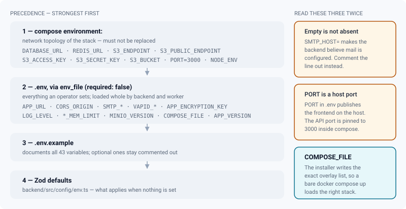
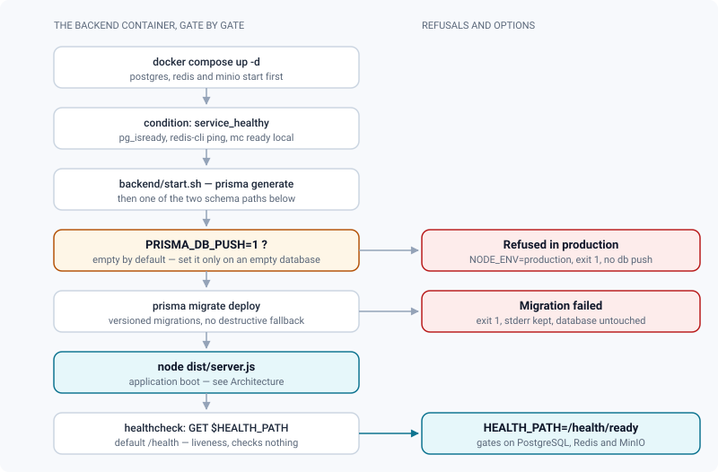

# Containers & configuration

*Where every setting comes from, what bounds each container, and how the stack is probed, pinned and upgraded.*

> Updated: 2026-08-23

This page is about the envelope, not the contents: which file wins when two of them set the
same variable, what stops a container before it can do damage, how much memory each service is
allowed, and what a `docker compose pull` is permitted to change. The companion pages describe
what runs inside: [Architecture](architecture.md), [Jobs & workers](jobs-and-workers.md),
[Monitoring](monitoring.md).

## Where configuration comes from

`.env` at the repository root is the single operator-facing file. Copy `.env.example`, which
documents **every** variable of `backend/src/config/env.ts` — 43 of them, grouped, commented,
and with the optional ones left commented out rather than emptied.

The `backend` and `worker` services load that file whole:

```yaml
env_file:
  - path: .env
    required: false
```

Before this, both services listed a closed `environment:` block carrying 17 of the 43
variables. `APP_URL`, `SMTP_*`, `VAPID_*`, `APP_ENCRYPTION_KEY`, `LOG_LEVEL` and the rest never
reached the container, so **inviting a collaborator failed on any Docker install**
(`APP_URL_MISSING`) and no email could carry a link.



### Precedence, and why some values are still hard-coded

`environment:` wins over `env_file:`. The values kept in `environment:` are the ones that
describe the **compose network topology**, and they must not be replaced:

| Variable | Value in compose | Why it stays |
|----------|------------------|--------------|
| `DATABASE_URL` | `…@postgres:5432/…` | A developer's `.env` usually points at `localhost` for the Prisma CLI |
| `REDIS_URL` | `redis://redis:6379` | Same reason |
| `S3_ENDPOINT` | `http://minio:9000` | Internal address; the browser uses `S3_PUBLIC_ENDPOINT` |
| `S3_ACCESS_KEY` / `S3_SECRET_KEY` | `MINIO_ROOT_*` | Derived from the MinIO credentials, one source of truth |
| `PORT` | `3000` | `PORT` in `.env` is the **host** port of the frontend, not the API port |
| `NODE_ENV` | `production` (`development` via the dev overlay) | Drives the production hardening in `config/env.ts` |
| `TZ` | `Europe/Paris` | Timestamps of digests, weekly reports and burn-ins; set it in `.env` |

> [!WARNING]
> An empty variable is not an absent one. `SMTP_HOST=` makes the backend believe a mail server
> is configured, and every invitation then fails at send time instead of being disabled
> cleanly. Comment the line out.

### What the installer writes, and why it matters

`scripts/install.sh` writes a `.env` with mode `600` and generates six secrets, so no default
password survives an install. Two of the lines it writes are operationally decisive:

| Line | Effect |
|------|--------|
| `COMPOSE_PATH_SEPARATOR=:` and `COMPOSE_FILE=…` | The exact overlay list of **this** instance. A bare `docker compose up -d` then loads the right stack — no forgotten `-f`, and no accidental fall-back to the development overlay, which would put the API back into `NODE_ENV=development` with the production guards off |
| `APP_VERSION=…` | The version this instance reports through `GET /api/version` and the *About* screen. `scripts/update.sh` rewrites it at every switch, and restores it on a rollback |

The installer touches **no tracked file**: it writes `.env` and the `deploy/` directory (the
rendered nginx configuration, the site compose overlay that bind-mounts the volumes under
`DATA_ROOT`). A later `git pull` or `git checkout vX.Y.Z` therefore still applies cleanly.

With `--tls none` the list it writes is the base stack plus the site overlay only — no
production overlay, so host ports stay published. That mode is for an instance already sitting
behind someone else's TLS front end. See
[Installation](../getting-started/installation.md#install-a-studio-instance).

## The schema gate at boot

`backend/start.sh` runs `prisma migrate deploy` and **stops the container if it fails** —
stderr intact, non-zero exit, database untouched.



The script used to end that line with `2>/dev/null || npx prisma db push --accept-data-loss`.
Any failure — a migration marked failed, schema drift, Postgres one second late — realigned the
database on the schema by dropping the columns and tables it no longer declared, without
leaving a trace of why, and `restart: always` replayed it.

Initialising an empty database without versioned migrations is now explicit:

```bash
PRISMA_DB_PUSH=1 docker compose up backend    # or PRISMA_DB_PUSH=1 in .env
```

The compose file passes that variable through explicitly — Docker Compose does not forward the
host shell environment into containers on its own. It is refused when `NODE_ENV=production`,
and `db push` runs **without** `--accept-data-loss`, so it declines by itself as soon as data
would be lost.

Recovering from a failed migration: read `npx prisma migrate status` inside the container, fix
or mark the migration resolved, restart. Never point `db push` at a database that holds work.

Everything after `node dist/server.js` — bucket creation, socket setup, scheduled jobs, the
listener — belongs to the application and is described in
[Architecture](architecture.md#boot).

## Upgrading an instance

`scripts/update.sh` is the supported path, and it does five things in order:

1. **Backs up first.** `scripts/backup.sh` runs and must produce a backup id; `--no-backup`
   skips it and says out loud that no database rollback will be possible.
2. **Switches version.** Two modes, chosen from `.env`: **registry** when
   `REVIEW_IMAGE_PREFIX` is set (`docker compose pull` of a mandatory `--version vX.Y.Z`, so
   nothing is compiled on the studio's server), **build** otherwise (`git checkout` of the tag,
   then `up -d --build`, refused if tracked files are modified locally).
3. **Rewrites `APP_VERSION`** — and `REVIEW_IMAGE_TAG` in registry mode.
4. **Waits on readiness**, from inside the container: `GET /health/ready` until it answers
   `ready` or the timeout expires (default 300 s, `--timeout`). No assumption about host ports,
   which production does not publish anyway.
5. **Rolls back on its own** if readiness never comes: previous tag or previous commit,
   previous `APP_VERSION`, containers recreated, and the last 50 lines of the backend log
   printed.

> [!CAUTION]
> The rollback restores the **code**, never the **schema**. Prisma migrations do not undo
> themselves: if the previous version cannot run on the migrated database, restore the dump
> taken at step 1 — and accept losing everything written since the update. The script prints
> the exact commands, including the backup id. See [Backups & restore](backups.md).

## Resource limits and log rotation

Every service carries the same rotation policy (a YAML anchor in `docker-compose.yml`, repeated
inline for the production `nginx` because anchors do not cross compose files):

```yaml
logging:
  driver: json-file
  options: { max-size: "10m", max-file: "5" }
```

The default `json-file` driver writes **without any bound**. On a NAS, an active instance's
pino logs fill the system pool and take the whole appliance down with them — not just ReView.
10 MB × 5 caps the stack at roughly 450 MB, and nginx's access log, the most talkative of the
lot, is the one that would have saturated it first.

Memory ceilings, all overridable in `.env`:

| Service | Default | Rationale |
|---------|---------|-----------|
| `backend` | `BACKEND_MEM_LIMIT=2g` | Node heap ≤ ~1.5 GB plus response buffers. The ceiling is not there for normal operation — it is there so a leak cannot take the host |
| `worker` | `WORKER_MEM_LIMIT=8g` | Two parallel HLS transcodes and, with `INSTALL_USD_TOOLS=1`, a headless Blender loading a whole USD stage. Below ~4 GB heavy conversions get OOM-killed instead of failing cleanly. **Per container**: `--scale worker=3` reserves 24 GB |
| `postgres` | `POSTGRES_MEM_LIMIT=2g`, `POSTGRES_SHM_SIZE=256mb` | `shared_buffers` stays at its default; `/dev/shm` at the container default of 64 MB makes parallel sorts fail with *could not resize shared memory segment* |
| `minio` | **none by default** | An OOM-killed storage service corrupts an upload in flight instead of protecting the host. Set `MINIO_MEM_LIMIT` only if the machine forces your hand |

## Pinned images

Nothing runs on `latest`. Two installations made on two dates must run the same software, and a
`docker compose pull` must not change MinIO's behaviour under a running studio.

| Image | Default | Override |
|-------|---------|----------|
| `minio/minio` | `RELEASE.2025-04-22T22-12-26Z` (last release shipping the full web console) | `MINIO_VERSION` |
| `prom/prometheus` | `v3.5.0` (3.5 LTS line) | `PROMETHEUS_VERSION` |
| `grafana/grafana-oss` | `11.6.1` (the provisioned dashboard is schemaVersion 39) | `GRAFANA_VERSION` |
| `nginx` | `1.27-alpine`, both in `frontend/Dockerfile` and in the production proxy | — |
| `postgres` / `redis` / `clamav` | `16-alpine` / `7-alpine` / `stable` | — |
| `review-backend`, `review-worker`, `review-frontend` | published by the release workflow, **no default** | `REVIEW_IMAGE_PREFIX` + `REVIEW_IMAGE_TAG`, both written `${VAR:?}` — compose refuses to start without them |

That last row is the production path and the strictest of the lot: `REVIEW_IMAGE_TAG` is
mandatory precisely so an instance can always say which version it runs, which is also what the
AGPL §13 offer of *corresponding* source presupposes. The worker image is published separately
from the backend because it alone carries Blender and `usd-core` (1.6 GB → 3.6 GB).

> [!IMPORTANT]
> Upgrading MinIO or PostgreSQL is a **data** operation, not an image bump. Read
> [MinIO storage](storage-minio.md) and [Backups & restore](backups.md) first, and read the
> upstream release notes between your version and the target.

## Health probes

| Service | Probe | Notes |
|---------|-------|-------|
| `backend` | `node -e "fetch('http://127.0.0.1:3000' + (HEALTH_PATH \|\| '/health'))"` | `127.0.0.1`, not `localhost`: Node's `fetch` resolves `localhost` to `::1` first while the server listens on IPv4. `interval 10s`, `start_period 40s`, 10 retries |
| `frontend` | busybox `wget` on `/index.html` | Without it an nginx that refused its configuration still counted as `running`, and the production proxy sent traffic to it |
| `postgres` | `pg_isready` | `backend` and `worker` gate on it (`condition: service_healthy`) |
| `redis` | `redis-cli ping` | Same |
| `minio` | `mc ready local` | Same |
| `clamav` | `clamdscan --ping 1` | `start_period 180s` — the signature database takes minutes to load |
| `worker` | none | It serves no HTTP; watch it through the queue metrics instead |

`/health` is a **liveness** probe: it answers without touching PostgreSQL, Redis or MinIO, so a
backend with a dead connection pool still reports healthy. That is deliberate — restarting a
container because Postgres fell over only adds an outage to an outage.

The **readiness** route exists and is usable today: `GET /health/ready` runs `SELECT 1`, a Redis
`PING` and a MinIO bucket probe, each bounded at 2 s, memoises the result for 5 s, and answers
`503 degraded` with a per-check reason as soon as one dependency is missing. Point the
container at it by setting one line in `.env`:

```dotenv
HEALTH_PATH=/health/ready
```

> [!NOTE]
> The comment block above the healthcheck in `docker-compose.yml` still says the readiness
> route does not exist yet. It is stale; the route shipped, and `scripts/install.sh` and
> `scripts/update.sh` both already wait on it. Trust this page and
> [Monitoring](monitoring.md), not the comment.

Gating the container on readiness has a consequence worth weighing before you set it: with
Redis or MinIO down, the backend becomes `unhealthy`, and anything with
`depends_on: service_healthy` — the `worker`, the `frontend`, the production `nginx` — stops
starting too. That is the right behaviour for an orchestrator that can reschedule, and a
harsher one for a single NAS.

## HTTP compression and caching

Neither nginx compressed anything, while `scripts/check-bundle-budget.mjs` measures and caps the
entry bundle **in gzip** (430 kB): browsers were downloading roughly three times the figure the
validation suite tracks. Both `frontend/nginx.conf` and `nginx/nginx.conf` now carry:

```nginx
gzip on;
gzip_vary on;
gzip_comp_level 5;
gzip_min_length 1024;
gzip_proxied any;
gzip_types text/plain text/css text/javascript text/markdown application/json
           application/javascript application/manifest+json application/wasm
           application/vnd.apple.mpegurl image/svg+xml font/ttf font/otf;
```

- `gzip_proxied any` is the decisive line. Its default, `off`, means **no proxied response is
  ever compressed** — and every response of the production proxy is proxied.
- `text/html` is always compressed by nginx and must not be listed. woff2 fonts, images and HLS
  segments are already compressed and are deliberately absent.
- `application/vnd.apple.mpegurl` **is** listed: HLS playlists are highly repetitive text and
  have grown a lot since every segment in them carries a presigned URL (~450 characters each,
  around 130 kB for ten minutes). They compress by an order of magnitude.
- A response already compressed upstream is passed through untouched; nginx never
  double-compresses.
- BREACH: compressing authenticated responses under TLS is exploitable only when
  attacker-controlled input is reflected into a response that carries a secret. ReView carries
  its JWT in the `Authorization` header, never in a response body, and CORS forbids
  cross-origin reads.

Caching follows Vite's content hashes:

| Path | Policy |
|------|--------|
| `/assets/…` | `expires 1y` + `Cache-Control: public, immutable` — the filename changes when the content does, so the browser never even revalidates |
| `/index.html` | `Cache-Control: no-cache` — always revalidated (a `304` when nothing moved), otherwise a deployment would keep serving the previous bundle |
| `/sw.js`, `/manifest.json` | No explicit policy: served with `ETag`/`Last-Modified`, which is what a service worker needs |
| `/review/derived/<id>/hls/*.ts` | Cached **by the production nginx itself** (2 GB on disk, 3 h inactive) and returned `public, max-age=31536000, immutable` — but only on `200`/`206`, so an expired presigned URL answering `403` is never frozen in a browser cache |

## The monitoring profile

`docker compose --profile monitoring up -d` adds `prometheus` and `grafana`. Grafana binds to
`127.0.0.1:3431` by default and provisions the *ReView* dashboard; its admin password comes from
`GRAFANA_ADMIN_PASSWORD`, which the installer generates. The variable is deliberately optional
rather than `${VAR:?}` — compose interpolates the whole file, inactive profiles included, so a
mandatory marker here would break `docker compose up` for everybody.

> [!TIP]
> `monitoring/prometheus.yml` declares `rule_files: /etc/prometheus/rules/*.yml`, and
> `monitoring/rules/alerts.yml` exists in the repository — but the `prometheus` service mounts
> only `prometheus.yml`. Until a `- ./monitoring/rules:/etc/prometheus/rules:ro` line is added,
> the bundled alert rules are simply not loaded. The glob is intentional so Prometheus still
> starts either way; the cost is that a missing mount is silent. See
> [Monitoring](monitoring.md).

## Related pages

- [Architecture](architecture.md) — processes, state, failure modes
- [Docker stack](../getting-started/docker-stack.md) — services, volumes, overlays, everyday commands
- [Installation](../getting-started/installation.md) — the installer, variables, host ports
- [Updating](../getting-started/updating.md) — versions, published images, rollback
- [Monitoring & operations](monitoring.md)
- [Backups & restore](backups.md)
