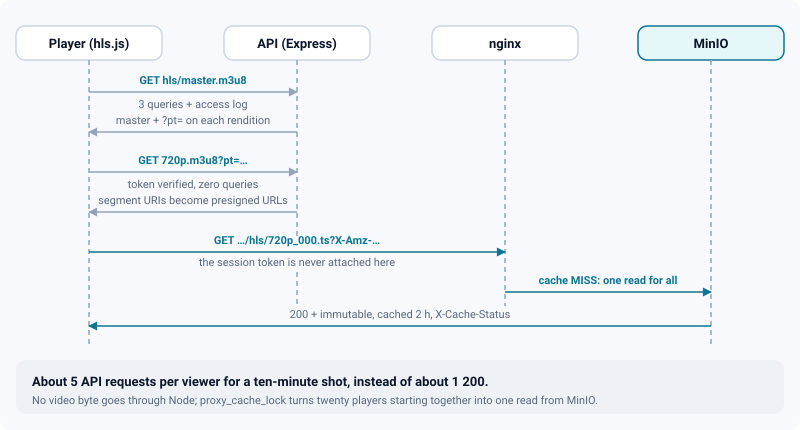
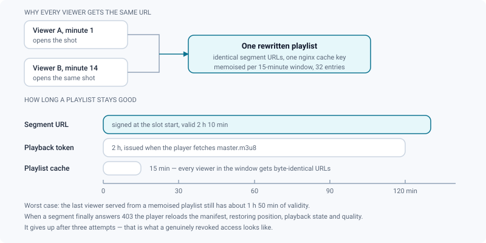
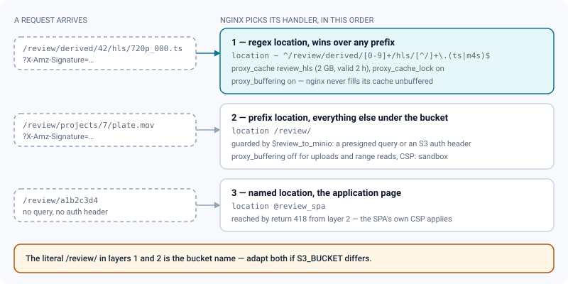

# HLS delivery

*How a segment reaches a player without ever touching Node, and why the URLs freeze in 15-minute windows.*

> Updated: 2026-08-23

Adaptive video is the heaviest thing ReView serves, and almost none of it goes through the API
process. Read this page before changing anything under `/api/media/:id/hls/`, the
`location ~ ^/review/derived/.../hls/` block in `nginx/nginx.conf`, or the presigning
lifetimes.

## What the worker writes

The FFmpeg worker builds a VOD ladder into MinIO under `derived/<mediaId>/hls/`:

```
derived/42/hls/master.m3u8      # one #EXT-X-STREAM-INF per rendition
derived/42/hls/720p.m3u8        # one #EXTINF per segment
derived/42/hls/720p_000.ts      # 2-second segments
```

Segments target **2 seconds**, and the GOP is pinned to one keyframe per segment (`fps × 2`).
Both matter: without a fixed GOP, libx264 places keyframes up to ten seconds apart, segments
become huge, and a quality switch freezes the picture — while the audio keeps decoding — for
as long as the download takes.

The ladder is written **incrementally**. Each rendition is encoded, uploaded, and the master
regenerated, so the master online never references a rendition that is not there yet;
`metadata.hls` carries `building: true` until the last one lands, and a `hls:changed` socket
event tells any open review to reload the master and pick up the new quality. Which heights are
produced is a studio setting — see [Transcoding](../admin-guide/transcoding.md).

A shot delivered as a **numbered image sequence** reaches exactly the same ladder: the frames
are one `VIDEO` media, the worker assembles a master from them first, and proxy, HLS, thumbnail
and sprite follow as they would for any video. See [Image sequences](../user-guide/image-sequences.md)
and [Jobs & workers](jobs-and-workers.md).

> [!NOTE]
> The player does **not** use adaptive bitrate selection. `useHlsPlayer` locks the highest
> rendition as soon as the manifest is parsed, and keeps a manually chosen quality across
> reloads. The ladder exists so a reviewer can choose, and so a switch is fast — not so the
> browser can decide for them mid-note.

## The problem this design solves

Until wave 2, every one of those files — segments included — was streamed through Express. Each
segment cost three indexed PostgreSQL reads (media row, project resolution, membership check)
plus a piped MinIO stream, and came back with `Cache-Control: private, max-age=60` on content
that never changes. A ten-minute shot is about 300 segments **per rendition, per viewer**; a
twenty-seat dailies room was enough to saturate the shared per-IP request budget and to make
video bandwidth compete with API latency inside a single Node event loop.

## The three tiers



| Request | Served by | Authorization | Cost |
|---------|-----------|---------------|------|
| `master.m3u8` | API | full check in the database + media access log | 3 queries, once per playback |
| `<rendition>.m3u8?pt=…` | API | playback token (HMAC) | no query at all |
| `<segment>.ts` | MinIO, through nginx | S3 presigned signature | never reaches Node |

1. **Master playlist.** `GET /api/media/:id/hls/master.m3u8` is the single control point. It
   runs the same access rules as before — published media, or a draft owned by the caller, plus
   project membership — writes `MediaAccessLog` (deduplicated over 30 minutes, as everywhere
   else), then returns the master with a **playback token** appended to each rendition URI:
   `720p.m3u8?pt=<jwt>`. The URIs stay relative, so the player resolves them back onto the API.

2. **Rendition playlist.** The token is verified in `backend/src/lib/mediaToken.ts` — a
   short-lived HS256 JWT scoped to one media *and* one user, carrying `kind: 'media-playback'`.
   Because `middleware/auth` only accepts access tokens with **no** `kind`, this token can never
   authenticate an API request; conversely an access token is never accepted as a playback
   token. A valid token skips the database entirely; an absent, expired, tampered or foreign
   token simply falls back to the full check, so nothing ever breaks — it only gets slower. The
   playlist returned has every segment URI replaced by an absolute presigned MinIO URL.

3. **Segments.** The player fetches them straight from storage. In production
   `S3_PUBLIC_ENDPOINT` is the application's own domain, so they travel through nginx
   (`https://<domain>/<bucket>/derived/42/hls/720p_000.ts?X-Amz-…`) and never touch the backend.
   In development they go directly to `http://localhost:9000`, cross-origin, which the bucket
   CORS policy already allows.

Per ten-minute video, per viewer: about **5 API requests instead of ~1 200**, and zero video
bytes through Node. Two of those five start the playback (the master, then one rendition
playlist); the rest are manifest reloads across a long session.

## Why the URLs are frozen in 15-minute windows

A presigned URL is unique to the instant it was signed. Signed on demand, twenty viewers of the
same daily would receive twenty different URLs for the same segment and no shared cache could
ever collapse them.



So rewritten rendition playlists are memoised per `signingWindowStart()` — 15 minutes, in
`backend/src/lib/hlsPlaylist.ts`. Within a window every viewer gets byte-identical playlists,
therefore identical segment URLs, therefore one cache key. The in-process map keeps only the
current window and at most 32 entries.

Consequence to know about: a ladder regenerated by a *reprocess* can be announced up to one
window late. Call `resetHlsPlaylistCache()` if you ever need that to be immediate.

The same idea is applied outside HLS. `StorageService.getPresignedGetUrl` pins its signing date
to the start of a **10-minute slot** and memoises the result, so a list of a hundred thumbnails
produces the same hundred URLs on every navigation — and the same ones from the API and from
the worker, which is what lets a browser reuse its cache instead of re-downloading every card.
The requested lifetime is extended by the slot width so memoisation never shortens a link.

## How long a playlist stays good

| Value | Duration | Where it lives |
|-------|----------|----------------|
| Segment target duration | **2 s** | `HLS_SEGMENT_SEC`, `backend/src/lib/hls.ts` |
| Playlist memoisation window | **15 min** | `HLS_URL_WINDOW_SEC`, `backend/src/lib/hlsPlaylist.ts` |
| Presigned segment URL | **2 h** + the 10-minute signing slot | `HLS_URL_TTL_SEC`, same file |
| Playback token | **2 h** from the master request | `HLS_PLAYBACK_TTL_SEC`, `backend/src/lib/mediaToken.ts` |
| nginx cache entry for a segment | **2 h**, zone capped at 2 GB | `nginx/nginx.conf` |

> [!IMPORTANT]
> **None of these is an environment variable.** They are exported TypeScript constants and do
> not appear in the Zod environment schema, so there is nothing to put in `.env` — changing one
> means editing the constant and rebuilding the backend image. The nginx cache lifetime is
> deliberately aligned with the presigned URL: an entry nobody can request again is dead weight.

Because the token is signed at the moment the master is fetched, it is always a full two hours
old at worst. The segment URLs are signed at the start of their 10-minute slot with two hours
ten minutes of validity, so the **last** viewer served from a memoised playlist still has about
1 h 50 min of it left. A session longer than that eventually gets a 403 on a segment;
`useHlsPlayer` recognises it (`isExpiredMediaUrlError` — `fragLoadError` with a 401 or 403),
reloads the manifest and restores position, playback state and the manually selected quality. It
gives up after **three** attempts rather than looping: that is what a genuinely revoked access
looks like.

## Caching rules

| Response | Cache-Control | Set by |
|----------|---------------|--------|
| Master and rendition playlists | `private, no-store` | `MediaService` — they carry a token and signed URLs |
| Segment served by MinIO | `public, max-age=31536000, immutable` | nginx, **only on 200/206** |
| Segment served by the legacy API proxy | `private, max-age=31536000, immutable` | `MediaService` |

The immutable header is bound to `$status` through a `map`: an expired signature answers 403,
and freezing *that* for a year would make the media unplayable until the browser cache is
cleared by hand.

nginx keeps a dedicated cache zone (`review_hls`, 10 MB of keys, 2 GB of bodies, entries valid
2 h, inactive 3 h) for segments only. `proxy_cache_lock on` with a 20 s timeout means twenty
players starting together produce **one** read from MinIO. The signature is part of the cache
key (`$scheme$request_method$host$request_uri`), so an entry is only reachable by a client the
API already handed a manifest to — guessing a path hits nothing.

Playlists are gzipped (`application/vnd.apple.mpegurl` is in `gzip_types` on both nginx
configurations): with one ~450-character presigned URL per segment, a ten-minute rendition
playlist is around 130 kB of highly repetitive text. Segments are not gzipped — they are
already compressed binary.

## Which nginx block wins for `/review/`

The bucket and the application collide on the path. Presigned URLs are path-style
(`/<bucket>/<key>`), the default bucket is called `review`, and the application has a
`/review/:slug` route. They cannot be separated on the path — an AWS v4 signature covers the
URI, so rewriting the prefix would invalidate every presigned URL — so they are separated on
the **signature** instead.



Three `map` blocks make the decision before any location runs:

| Variable | Set to 1 when |
|----------|---------------|
| `$review_presigned` | the query string contains `X-Amz-Signature=` |
| `$review_s3_auth` | an `Authorization` header is present (that is `mc` and other S3 tooling) |
| `$review_to_minio` | either of the two above — anything else is an application page |

A fourth, `$review_storage_auth`, **blanks** the `Authorization` header when the request is
already presigned: the session token has no business reaching the storage layer or its access
logs. Header-authenticated S3 tooling keeps its own, so administration is unaffected.

The `/review/` prefix location then uses a small trick: `if ($review_to_minio = 0) { return
418; }` with `error_page 418 = @review_spa`. Storage is the default branch because it carries
the requests with bodies (presigned `PUT` uploads, streamed unbuffered); deflecting a bodyless
`GET` navigation by internal redirect is safe, the reverse is not.

Two details about the segment block are easy to lose:

- it is a **regex location**, so it wins over the `/review/` prefix location whatever their
  order in the file;
- it sets `proxy_buffering on`, because nginx never fills its cache in unbuffered mode — while
  the `/review/` block deliberately disables buffering for uploads and MP4 range reads.

> [!CAUTION]
> **The bucket name is hard-coded in the proxy**, in both
> `location ~ ^/review/derived/[0-9]+/hls/…` and `location /review/`. An instance whose
> `S3_BUCKET` is not `review` loses the entire segment path — segments fall through to the SPA
> and playback fails with nothing obvious in the backend logs. Adapt both blocks, and the
> `map`s stay as they are.

## The session token never goes to storage

`hlsSource.applyHlsAuth` attaches `Authorization: Bearer …` **only** to URLs whose origin is the
application and whose path starts with `/api/`. Note that hls.js normalises the source URL
against `location.href` before any request, so `xhrSetup` sees absolute URLs — matching on
`startsWith('/api/')` alone would silently drop the header and return 401. In production storage
and application share an origin, so it is the *path* that tells them apart.

nginx blanks the header on presigned requests as the second barrier, as described above. Sending
the token to storage would authorize nothing and would deposit it in the storage access logs;
S3 also refuses two competing authentication mechanisms on the same request.

## Operational notes

- **`S3_PUBLIC_ENDPOINT` must be reachable from the browser.** It already had to be, for
  thumbnails and MP4 proxies; HLS depends on it too.
- **If storage lives on another domain**, add its origin to `connect-src` — not just
  `media-src` — in the application CSP: segments are fetched by XHR, not by the video element.
- **`X-Cache-Status`** is returned on segment responses (`HIT`/`MISS`/`EXPIRED`) — the quickest
  way to confirm the cache is doing its job during a dailies session:

  ```bash
  curl -sI "https://<domain>/review/derived/42/hls/720p_000.ts?X-Amz-…" | grep -i x-cache
  ```

- **The cache lives in the container's writable layer** (`/var/cache/nginx/hls`). It is
  disposable; mount a volume if you would rather it survive a redeploy.
- **The legacy proxy `/api/media/:id/hls/<segment>.ts` still works.** It is the fallback for a
  client without a rewritten manifest, and for any file name the rewriter did not recognise —
  an unknown URI is left relative on purpose rather than dropped. It is no longer the normal
  path, and traffic on it in production means the rewriting is not happening.

## Related pages

- [MinIO storage](storage-minio.md) — presigning, CORS, bucket layout
- [Containers & configuration](containers-and-configuration.md) — nginx and compose
- [Jobs & workers](jobs-and-workers.md) — how the ladder is produced
- [Transcoding](../admin-guide/transcoding.md) — which renditions are built
- [Video review](../user-guide/review-video.md) — what the viewer does with the ladder
