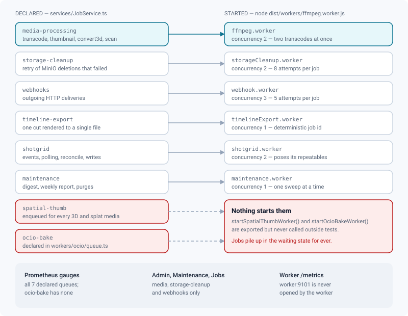
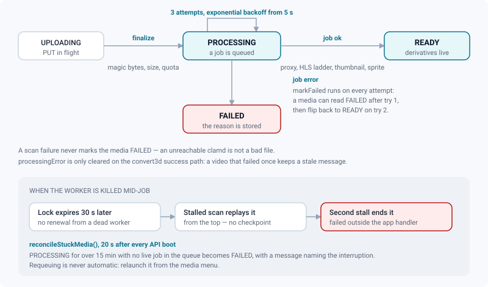

# Jobs & workers

*What the worker container actually runs, how a job fails, and what happens to a media left in PROCESSING.*

> Updated: 2026-08-23

Everything that takes longer than a request is queued in **BullMQ** (Redis) and executed by
the dedicated `worker` container. The API never blocks on media processing: it writes a row,
drops a job on a queue, and answers.

This page is the operator's view of that machinery — what runs where, what it costs, what
breaks, and how to tell the difference between "still working" and "lost".

## The two processes

The compose stack runs the same image twice, with two entry points.

| Process | Command | What it does |
|---------|---------|--------------|
| `backend` | `node dist/server.js` | Serves HTTP and Socket.io, **poses** jobs on the queues, refreshes the queue gauges, runs the boot reconciliation |
| `worker` | `node dist/workers/ffmpeg.worker.js` | **Consumes** the queues: FFmpeg, Blender, assimp, ClamAV, outgoing webhooks, ShotGrid, maintenance |

The split is deliberate: FFmpeg is CPU-bound and Blender is memory-hungry, and neither has any
business sharing an event loop with the API. It also means the two containers have different
resource profiles — the worker carries `mem_limit` (default `8g`) and, with
`INSTALL_USD_TOOLS=1`, a Blender and a `usd-core` Python environment that the API image does
not need.

Only the `worker` service may be scaled. See [Scaling](#scaling), and
[Architecture](architecture.md) for why the API is single-replica.

## Queues

Eight queues are declared. **Six of them have a consumer**, and the two that do not are the
first thing to check when a preview or a colour transform never appears.



| Queue | Consumer started | Concurrency | Attempts | Backoff | Kept on complete / fail |
|-------|------------------|-------------|----------|---------|--------------------------|
| `media-processing` | `ffmpeg.worker` | 2 | 3 | exponential, 5 s base | 100 / 500 |
| `storage-cleanup` | `storageCleanup.worker` | 2 | 8 | exponential, 15 s base | 100 / 1000 |
| `webhooks` | `webhook.worker` | 3 | 5 | exponential, 10 s base | 200 / 500 |
| `timeline-export` | `timelineExport.worker` | 1 | 2 | exponential, 10 s base | 50 / 100 |
| `shotgrid` | `shotgrid.worker` | 2 | 2 | exponential, 15 s base | 200 / 500 |
| `maintenance` | `maintenance.worker` | 1 | 2 | exponential, 60 s base | 50 / 100 |
| `spatial-thumb` | **none** | 1 (declared) | 8 | exponential, 30 s base | age 10 min or 100 / age 24 h or 200 |
| `ocio-bake` | **none** | 1 (declared) | 3 | exponential, 15 s base | 20 / 50 |

"Attempts" is the **total** number of tries, not the number of retries: a `media-processing`
job runs at most three times.

Two queues use a **deterministic job id**, which makes a duplicate request a no-op rather than
a second run: `timeline-export` (`timeline-<id>`) and `spatial-thumb`
(`spatial-thumb-<mediaId>`). Asking twice for the same export while one is pending costs
nothing.

> [!WARNING]
> **`spatial-thumb` and `ocio-bake` have no consumer.** `startSpatialThumbWorker()` and
> `startOcioBakeWorker()` exist and are tested, but nothing calls them: the worker entry point
> starts six consumers and neither of these is among them. Meanwhile the application keeps
> enqueuing — a spatial thumbnail for **every** 3D and splat media, a LUT bake on every OCIO
> config installed. Those jobs accumulate in `waiting` for ever, and once past twenty they
> keep the `ReviewQueueBacklog` alert firing. The consequence for users is a 3D or splat media
> with no preview image (see [Spatial thumbnails](../admin-guide/spatial-thumbnails.md)) and an
> OCIO config that falls back to the built-in transform (see
> [Colour management](../admin-guide/color-management.md)).

`ocio-bake` is also declared outside `QUEUE_NAMES` (in `backend/src/workers/ocio/queue.ts`), so
it is absent from `ALL_QUEUES` and therefore from the Prometheus gauges as well. Its enqueue
function deliberately never throws: installing a config must succeed even when Redis is
unreachable.

## What runs on `media-processing`

| `kind` | Trigger | Output |
|--------|---------|--------|
| `transcode` | Video upload finalized, or an image-sequence upload | Proxy MP4, multi-rendition HLS ladder, thumbnail, timeline sprite, audio waveform, scene markers, client burn-in derivative |
| `thumbnail` | Image upload finalized, or a manual request | Card and preview images, plus a full-resolution **web proxy** for formats a browser cannot decode |
| `convert3d` | Non-GLB 3D upload | `derived/{mediaId}/model.glb` via Blender (USD), `guc` or assimp |
| `trim` | Trim requested in review, before publication | Re-cut proxy |
| `scan` | Any upload finalized while `CLAMAV_HOST` is set and no other job applies | Antivirus verdict; a detection quarantines the object |

Splat media are served from their original file; their non-destructive edits are written by
the API, not by a job.

### Progress, step by step

Every media job publishes its current step onto the BullMQ job record with
`job.updateProgress`, so an encode that has been running for six hours can be told apart from
an FFmpeg that has been stuck for six hours. The percentage bands are fixed per job kind:

| `kind` | Steps, with their share of the total |
|--------|--------------------------------------|
| `transcode` | download 0–8, probe 8–10, proxy 10–32, thumbnail 32–36, renditions 36–84, client derivative 84–90, scene detection 90–93, sprite 93–98 |
| `thumbnail` | download 0–30, probe 30–40, thumbnail 40–95 |
| `convert3d` | download 0–20, convert 20–90 |
| `trim` | download 0–20, trim 20–90 |
| `scan` | download 0–50, scan 50–95 |

A write is only issued when the integer percentage moves, so a job produces at most about a
hundred of them.

> [!NOTE]
> This progress is **not surfaced anywhere yet**: `GET /api/admin/jobs` returns the job id,
> name, data, `failedReason` and `attemptsMade`, but not `progress`. Read it from Redis, or
> from any BullMQ dashboard pointed at the same instance.

### Image sequences are a step of `transcode`

A shot delivered as a numbered image sequence — `plan.1001.exr` to `plan.1200.exr`, or the same
pattern in DPX, TIFF or PNG — is **one** media of kind `VIDEO` whose source is a MinIO prefix
rather than an object. Before anything else, the worker:

1. lists the prefix, keeps the frames whose name it recognises, and sorts them by frame number;
2. downloads them four at a time, **renumbering them locally** as 0, 1, 2… — FFmpeg's `image2`
   demuxer stops at the first missing frame, so a delivery with holes would otherwise produce a
   silently truncated shot. The original numbering is kept in the manifest and in
   `metadata.startFrame`, which is what the player displays;
3. scans **every** frame if ClamAV is enabled — sampling would be theatre;
4. assembles `sequence-master.mp4` at CRF 12 in the temp directory, with a 60× realtime budget
   instead of the usual 20× because decoding EXR is nowhere near realtime.

Everything downstream — proxy, HLS ladder, thumbnail, sprite, frame-accurate annotations —
then works on an ordinary video without knowing where it came from. The master never leaves
the temp directory, and a `reprocess` always restarts from the frames, never from the proxy:
unlike a video, the original delivery is still there. See
[Image sequences](../user-guide/image-sequences.md).

### The web proxy for production stills

`thumbnail` produces a second derivative for any image a browser cannot decode — anything that
is not `.jpg`, `.jpeg`, `.png`, `.webp`, `.gif` or `.bmp`, so in practice EXR, DPX, TIFF and
TGA. It is a **full-resolution JPEG** at `derived/{mediaId}/proxy.jpg`, and it is what image
review, A/B, wipe and diff actually display; without it there would be nothing but a 640 px
thumbnail. EXR is decoded with `-apply_trc iec61966_2_1`, because FFmpeg's EXR decoder applies
no curve by default and a correct render would come out nearly black.

### Time limits

Every FFmpeg and ffprobe invocation is bounded. A command that loops — exotic container,
corrupt stream, a filter that stops advancing — would otherwise hold one of the two
`media-processing` slots for ever, and two such files would stop all transcoding in the studio
with nothing to show for it.

| Step | Limit |
|------|-------|
| `ffprobe` | **60 s** — it reads headers, never does long work |
| Any `ffmpeg` pass, duration known | **20× the probed duration**, clamped to 5 min minimum and 6 h maximum |
| Image-sequence master | Same, but **60×** — EXR decoding is far from realtime |
| Any `ffmpeg` pass, duration unknown | **1 h** flat |
| External 3D converter (Blender, `guc`, assimp) | `MODEL_CONVERT_TIMEOUT_MS`, default **900000** (15 min) |

On expiry the process is killed and the job fails with a message naming the step and the limit,
for example `ffmpeg step "hls 1080p" exceeded its 1200s time limit and was killed`. A timeout
is a distinct error class, so the NVENC → libx264 fallback deliberately does **not** replay a
command that expired: a missing encoder and a stuck one are different problems.

## A media through the pipeline



The status lives on `MediaObject.status` and is pushed live to the interface over Socket.io.
`finalize` writes `PROCESSING` **before** enqueuing, which is what makes a lost enqueue
visible as a stuck media rather than as nothing at all.

- A failure stores the message on `MediaObject.metadata.processingError`, truncated to 500
  characters, and sets `FAILED`.
- `trim` and `scan` failures deliberately **do not** mark the media `FAILED`: a failed trim
  still leaves a playable proxy, and an unreachable `clamd` must never condemn a file that was
  never found to be infected. Both are still retried by BullMQ.
- HLS renditions are recorded **incrementally**: each one is uploaded, the master is
  regenerated, and `metadata.hls` is updated with `building: true` until the last. A crash
  after the first rendition therefore leaves a playable but truncated ladder with `building`
  never clearing. A reprocess rebuilds the whole thing.

Two behaviours worth knowing when reading a status:

- `markFailed` runs on **every** attempt, not only the last. A media can read `FAILED` after
  attempt 1 and flip back to `READY` on attempt 2.
- `processingError` is only cleared on the `convert3d` success path. A video that failed once
  and then succeeded keeps a stale error string next to `status: READY`.

### Media stranded in PROCESSING

When the worker is killed mid-job, BullMQ's stalled-job machinery takes over — no stalled
settings are configured, so the defaults apply.

| Setting | Value |
|---------|-------|
| `lockDuration` | 30 s, renewed every 15 s |
| `stalledInterval` | 30 s |
| `maxStalledCount` | 1 |

The lock expires about 30 s after the last renewal, the next stalled scan moves the job back to
`wait`, and a worker **re-runs the handler from the top** — re-download, re-transcode, no
per-step checkpoint. If it stalls a second time BullMQ fails the job *outside* the
application's error handler, so nothing writes `processingError` and the media stays at
`PROCESSING`, indistinguishable from "still working".

That is what `reconcileStuckMedia()` exists for. It runs **20 s after every API boot** — long
enough for the worker to connect to the queue — and condemns a media only when both guards
hold: it has been in `PROCESSING` for more than **15 minutes**, and there is **no live job**
for it anywhere in the queue (waiting, active, delayed, paused, prioritized, waiting-children).
It then sets `FAILED` with an explicit message: *"Processing was interrupted (worker restarted
or job lost)… Relaunch processing from the media menu."* The write is conditional on the status
still being `PROCESSING`, so a job that finishes in the meantime is never downgraded.

> [!IMPORTANT]
> Requeuing is **never** automatic, and that is a decision rather than an omission. The original
> job kind cannot be reconstructed safely from the database, so a blind requeue could run the
> wrong work and overwrite valid derivatives; and a pathological file would requeue itself on
> every restart, for ever. `FAILED` plus a reason is a state a human can see and act on.

## Retrying

From the review page — right-click the media, `Reprocess` — or:

```bash
curl -s -X POST -H "Authorization: Bearer $JWT" \
  "$REVIEW/api/media/128/reprocess"
```

```json
{ "media": { "id": 128, "status": "PROCESSING", "…": "…" }, "requeued": true }
```

`requeued` is `false` when there is nothing to reconvert (a native GLB, for instance); the
media is simply set back to `READY`. The route refuses a media still in `UPLOADING`
(`400 NOT_FINALIZED`) and a published one (publish lock, `403 PUBLISHED_LOCKED`), sets the
media back to `PROCESSING`, re-requests the spatial thumbnail, and audits `MEDIA_REPROCESS`. It
does **not** clear the previous `processingError`, so the old message stays visible while the
retry runs.

At the job level, from *Admin → Maintenance → Jobs* or its API (admin only):

```bash
curl -s -X POST -H "Authorization: Bearer $ADMIN_JWT" \
  "$REVIEW/api/admin/jobs/media/4821/retry"

curl -s -X POST -H "Authorization: Bearer $ADMIN_JWT" \
  "$REVIEW/api/admin/jobs/webhooks/clean-failed"
```

`queue` is validated against a three-value enum: `media`, `storage-cleanup`, `webhooks`. Only a
failed job can be retried (`400` otherwise), and `clean-failed` removes up to 1000 failed jobs
at once. **`timeline-export`, `shotgrid`, `maintenance` and `spatial-thumb` are not exposed in
the dashboard** — their failures are visible only in the worker logs and in the queue gauges.

## Scheduled work

Nothing periodic runs from a plain timer any more, with one exception. The three maintenance
appointments are **BullMQ repeatable jobs**: the API poses them at boot, because it is the
process that carries `DIGEST_HOUR`; the worker executes them. They survive a restart, they
cannot double-fire on two replicas, and they appear in the queue gauges like any other work.

| Job | Schedule | What it does |
|-----|----------|--------------|
| `daily-digest` | cron `0 <DIGEST_HOUR> * * *`, local time, default 07:00 | Digest mail to users who opted in |
| `weekly-report` | cron `0 <DIGEST_HOUR> * * 1` — Monday | Production report to supervisors and admins |
| `purge` | every 24 h, plus a one-off run **60 s after boot** | Trash purge, obsolete-derived purge, idempotency-key purge, retention sweep |
| ShotGrid `poll` | every `pollingIntervalSec`, per connection in polling mode | Reads the remote event log |
| ShotGrid `reconcile` | cron `0 <hour> * * *`, per connection | Nightly reconciliation, plus a boot catch-up staggered from 10 s |
| Queue gauges | every 15 s, **in the API process** | Refreshes `review_queue_jobs` over all seven declared queues |
| `reconcileStuckMedia()` | once, 20 s after API boot | Condemns media stranded in `PROCESSING` |

Posing the schedule is idempotent: the previous repeatables with the same names are removed
first, so changing `DIGEST_HOUR` does not leave two schedules running. ShotGrid's schedule is
posed by the worker at boot **and** re-posed by the API whenever the connection settings change,
so switching a connection from webhook to polling takes effect without a restart.

The one-off boot purge exists so an instance switched back on after a long outage does not wait
until tomorrow to empty an expired trash. All purges are idempotent.

## Retention

Twelve kinds of record have a lifetime: two are pipeline data, nine are log families with a
configurable duration and their own admin screen, and one is an internal buffer.

| Data | Retention | Where it is set |
|------|-----------|-----------------|
| Trash (media, versions, shots, sequences, assets, projects) | `trash_retention_days`, default **30 days**, `0` disables | Studio setting |
| Obsolete derived files (HLS + sprite beyond the last N versions) | Off by default; `derived_purge` = `{ enabled, keepVersions }`, `keepVersions` default 3, clamped 1–100 | Studio setting |
| Audit log | **365 days** | *Admin → Maintenance → Retention* |
| Media access log | **365 days** | idem |
| Notifications | **90 days** | idem |
| User sessions | **30 days** after revocation or expiry | idem |
| Password resets | **7 days** | idem |
| Invitations | **90 days** | idem |
| Share links | **180 days** after revocation or expiry | idem |
| ShotGrid sync passes | **90 days** | idem |
| API v1 event journal | **30 days** | idem |
| Idempotency keys | **24 hours** | Hard-coded constant |

For every log family, `0` means keep for ever and the maximum is 3650 days. Deletion happens in
**batches** — 2000 rows by default, with a 25 ms pause between batches and a budget of 200
batches per family per automatic pass, so 400 000 rows a night. A studio that switches retention
on after a year catches up over several nights instead of locking a table. A manual run from
the admin screen is capped at 10 batches and reports `truncated` when it hit the ceiling.

> [!CAUTION]
> Three things are never deleted whatever the duration says: a session that is still valid, a
> share link that is still active, and a ShotGrid pass that still carries an unresolved
> conflict. Everything else in the table above is gone for good — take a
> [backup](backups.md) before lowering a duration. Policy and defaults:
> [Data retention](../admin-guide/data-retention.md).

## Failure modes

### Redis unreachable

The connection is built from `REDIS_URL` with `maxRetriesPerRequest: null`; BullMQ adds a retry
strategy that never gives up (1 s → 20 s, forever), and ioredis queues commands offline by
default. In practice:

- The **API still boots and serves static concerns** — nothing in the boot path awaits Redis.
- **Every `/api` route answers `429`.** The rate limiter is Redis-backed and **fails closed**:
  it can no longer count, and letting requests through would make a counter outage the way to
  bypass the limiter. `/health` is mounted outside `/api` and keeps answering, which is why the
  container healthcheck stays green while the application is unusable — check `/api/health`
  too when a stack looks healthy and behaves otherwise.
- Any request that enqueues a job (`POST /api/media/:id/finalize`, `/reprocess`, `/trim`, USD
  recompose, timeline export, webhook test) **hangs** rather than erroring, if it gets past the
  limiter at all. No route sets a request timeout, so the client sees a stalled connection.
- `finalize` writes `PROCESSING` before enqueuing, so a lost enqueue strands the media — until
  the next API boot, when the reconciliation marks it `FAILED` with a reason. Relaunch it with
  `POST /api/media/:id/reprocess` once Redis is back.
- **Presence and live review rooms are Redis-backed too**: the online list empties and dailies
  rooms stop synchronising. Only idempotency records are unaffected — they live in PostgreSQL.
- `GET /api/admin/system` pings Redis with no timeout of its own, so it can hang too.
- BullMQ connection errors are printed by the library on **stderr via `console.error`**, not
  through pino: no request id, no JSON. Look for raw `ECONNREFUSED` lines in
  `docker compose logs backend`.
- The `review_queue_jobs` gauges stop updating.

Two things deliberately survive the outage: the trash purge enqueues its storage cleanup with a
`.catch` that logs *"orphelins non retentés"*, and the ShotGrid webhook receiver — mounted
**before** the rate limiter — answers `202 { "accepted": true }` before enqueuing, so ShotGrid
never records a failed delivery.

### The worker is restarted

`docker compose stop`, `restart` and `up --build` all send `SIGTERM` and then `SIGKILL` ten
seconds later. Both processes install handlers, and shutdown runs in two ordered phases inside
an **8 second** grace budget (`SHUTDOWN_GRACE_MS`, deliberately under Docker's ten).

| Phase | Tasks |
|-------|-------|
| `STOP_INTAKE` (10) | Every BullMQ consumer's `close()` — which waits for its active job; on the API, `server.closeIdleConnections()` + `io.close()` and the queue handles |
| `DISCONNECT` (20) | The worker-events Redis channel, then Prisma |

A task that has not returned when the budget expires is **forced**: for a BullMQ consumer that
means `worker.close(true)`, and the active transcode loses its lock. That is the normal outcome
for a long encode — eight seconds will not finish a 4K ladder. The job then follows the stalled
path described above, and whatever stays frozen is caught by the boot reconciliation. A second
signal during shutdown exits immediately: an operator who insists wants it to stop.

One thing is not cleaned up on a forced kill: the temp directory (`review-*` in the container's
`tmpdir`, holding the source download, the proxy and the HLS ladder) is only removed by a
`finally` block, and nothing sweeps `tmpdir` at boot. Recreating the container is the simplest
cleanup.

### MinIO unreachable or full

- The worker's downloads and uploads are unprotected: any S3 error propagates, the media is
  marked `FAILED` with the raw SDK message in `processingError`, and BullMQ retries up to three
  times with 5 s exponential backoff.
- A **disk full** condition (`XMinioStorageFull`, HTTP 507) has no dedicated handling — it
  arrives as a generic SDK error and looks like any other processing failure. Run
  `docker compose exec minio mc admin info local` before assuming a codec problem.
- Some steps are best-effort and log-and-continue instead of failing the media: the burn-in
  logo download, the slate and client derivative, the timeline sprite, and the deletion of the
  original after transcode. The last one marks `metadata.sourceDeleted = true` before deleting,
  so a failed delete leaves an orphan original that nothing references any more.
- Finalize-time storage errors are **not** caught: `POST /api/media/:id/finalize` answers `500`
  and the media stays in `UPLOADING`.

See [MinIO storage](storage-minio.md) for the full picture.

## Observing the queues

```bash
docker compose logs -f worker
docker compose logs -f worker | grep '✗'          # failures only
curl -s http://localhost:3430/metrics | grep review_queue_jobs
```

```
review_queue_jobs{queue="media",state="waiting"} 0
review_queue_jobs{queue="media",state="active"} 1
review_queue_jobs{queue="media",state="failed"} 0
review_queue_jobs{queue="media",state="delayed"} 0
```

All seven declared queues are exported, in the four states above. The Prometheus label is not
the queue name: `media-processing` has always been exposed as `queue="media"`, and renaming it
would break the provisioned Grafana dashboard and every existing alert. `ocio-bake` is not
exported at all.

Log prefixes: `[ffmpeg.worker]`, `[storageCleanup.worker]`, `[webhook.worker]`,
`[timelineExport.worker]`, `[shotgrid.worker]`, `[maintenance.worker]`. A worker that logs
`[ffmpeg.worker] démarré.` has started its event loop — that line is printed before any Redis
round-trip, so it is **not** proof that Redis is reachable.

*Admin → Maintenance → Jobs* shows three of the queues (`media`, `storage-cleanup`,
`webhooks`) with counters, running and waiting jobs, failed jobs with their error, one-click
retry and purge-failed.

> [!NOTE]
> `backend/src/workers/metricsServer.ts` implements a `/metrics` endpoint for the worker
> process — job counters, encode durations, `review_worker_info` — on `worker:9101`, and
> `monitoring/prometheus.yml` scrapes it. Nothing calls `startWorkerMetricsServer()` or
> `attachWorkerMetrics()`, so that target never answers and the `ReviewWorkerDown` alert fires
> permanently on a stack started with the `monitoring` profile. Until it is wired, judge the
> worker by `review_queue_jobs{state="active"}` and by its logs.

## Scaling

The worker is stateless: run several replicas against the same Redis to increase throughput.
FFmpeg is CPU-bound at concurrency 2 per process — size the containers accordingly, or set
`VIDEO_ENCODER=h264_nvenc` to move encoding onto an NVIDIA GPU (see
[Monitoring & operations](monitoring.md)).

```bash
docker compose up -d --scale worker=3
```

Each replica is capped at `WORKER_MEM_LIMIT` (default `8g`) — **the limit is per container**,
so three replicas may claim 24 GB. Lower it before scaling on a small host, and remember that a
container killed by the OOM killer exits with code 137 and leaves its job to the stalled-job
mechanism above. Rationale for the default:
[Containers & configuration](containers-and-configuration.md).

Scaling also multiplies the schedulers: each worker replica re-poses the ShotGrid repeatables at
boot. That is harmless — the job ids are deterministic and the previous repeatables are removed
first — but it does mean the boot catch-up runs once per replica.

Do **not** scale the `backend` service — see [Architecture](architecture.md).

## Related pages

- [Media processing (user guide)](../user-guide/media-processing.md)
- [Image sequences](../user-guide/image-sequences.md)
- [Architecture](architecture.md)
- [MinIO storage](storage-minio.md)
- [HLS delivery](hls-delivery.md)
- [Monitoring & operations](monitoring.md)
- [Data retention](../admin-guide/data-retention.md)
