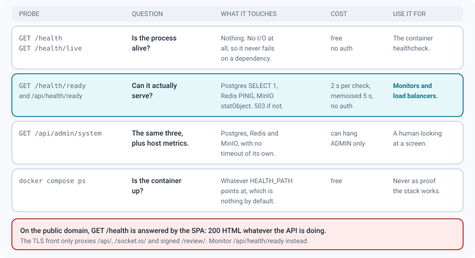
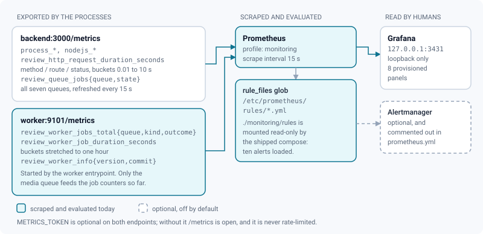

# Monitoring & operations

*Probes, metrics, alerts and logs — what to scrape, what to alert on, and what each signal actually means.*

> Updated: 2026-08-23

An instance of ReView is two Node processes (`backend` and `worker`) sitting on three stateful
services (PostgreSQL, MinIO, Redis). Everything below exists to answer three questions in that
order: **is it up**, **is it working**, and **when it stops, who finds out**.

## Four ways to ask "is it working?"

Asking the wrong one is how a backend with a dead connection pool keeps receiving traffic, and
how a container gets restarted for an outage that was not its own.



### Health probes

| Endpoint | Question | Touches | Fails when |
|----------|----------|---------|-----------|
| `GET /health`, `GET /health/live` | Is the process alive? | nothing | the process is gone |
| `GET /health/ready` | Can it actually serve? | Postgres, Redis, MinIO | any dependency is unreachable (**503**) |

Both are also mounted under `/api/` (`/api/health`, `/api/health/ready`). That matters in
production: the TLS front only proxies `/api/`, `/socket.io/`, `/assets/`, signed `/review/`
and the SPA, so `GET /health` on the public domain is answered by the SPA — 200 HTML, whatever
the API is doing. **External monitoring must use `https://<domain>/api/health/ready`.**

```bash
curl -s http://localhost:3430/health
```

```json
{ "status": "ok", "version": "2.3.0", "commit": "a1b2c3d4e5f6", "uptimeSec": 91422 }
```

```bash
curl -s -o /dev/null -w '%{http_code}\n' http://localhost:3430/health/ready   # 200 or 503
curl -s http://localhost:3430/health/ready | jq
```

```json
{
  "status": "ready",
  "version": "2.3.0",
  "cached": false,
  "checks": {
    "database": { "ok": true, "ms": 2 },
    "redis": { "ok": true, "ms": 1 },
    "storage": { "ok": true, "ms": 7 }
  }
}
```

Readiness is bounded on purpose, so that probing cannot become the load that finishes off a
struggling instance: **each check times out at 2 s**, the result is **memoised for 5 s**
(`"cached": true` says you got the memo), and concurrent calls share one execution. The failure
reason returned in `checks.*.error` is truncated to 120 characters, because a raw driver error
can carry a connection string.

Liveness stays trivial *by design*: restarting the API container because Postgres is down adds
an outage to an outage. That is why the compose healthcheck defaults to `/health`. An operator
who wants the container marked unhealthy when a dependency is missing sets
`HEALTH_PATH=/health/ready` in `.env` — the probe reads its path from that variable. The
`frontend` service has a probe of its own (`wget` on `/index.html`): an nginx that rejected its
configuration no longer counts as running. See
[Containers & configuration](containers-and-configuration.md#health-probes).

`GET /api/admin/system` still exists and reports the same three dependencies plus host metrics,
but it is admin-only and has no timeout of its own; use `/health/ready` for monitoring and
`/api/admin/system` for a human looking at a screen.

> [!TIP]
> `scripts/update.sh` probes readiness **from inside the container**
> (`docker compose exec -T backend node -e "fetch('http://127.0.0.1:3000/health/ready')…"`).
> Copy that pattern for any check run on the docker host: production publishes no host port for
> the backend, so `curl localhost:3430` only works on a development stack.

## Which version is running

```bash
curl -s http://localhost:3430/api/version
```

```json
{
  "version": "2.3.0",
  "commit": "a1b2c3d4e5f6",
  "builtAt": "2026-08-22T09:30:00.000Z",
  "node": "v22.14.0",
  "source": "https://github.com/YvigUnderscore/ReView"
}
```

Public and unauthenticated on purpose: support cannot diagnose an instance that cannot name
itself, and the AGPL §13 offer only means something if you can tell *which* sources correspond
to what is running. The same values appear in **Admin → System → About this instance** and in
the liveness payload.

The version comes from `APP_VERSION` in `.env` — written by `scripts/install.sh` and rewritten
by `scripts/update.sh` at every switch — and falls back to the `package.json` version baked into
the image. `GIT_SHA` and `BUILD_DATE` are optional and injected by the release workflow.

That endpoint is not decoration: it is the pivot of the update loop. `scripts/update.sh` takes a
backup and refuses to continue without one, switches the image tag or the git ref, waits up to
`--timeout` seconds (300 by default) for `/health/ready` to answer `ready`, prints
`/api/version` on success — and on failure dumps the last fifty backend log lines, puts back
both the previous tag and the previous `APP_VERSION`, and probes again. See
[Updating](../getting-started/updating.md).

> [!IMPORTANT]
> A rollback restores the **code**, never the **schema**: Prisma migrations do not undo. If the
> previous version refuses to run on the migrated database, restore the dump taken minutes
> earlier — `update.sh` prints the exact command, including the backup id. See
> [Backups & restore](backups.md#restoring).

## What Prometheus scrapes

The backend exposes **`GET /metrics`** in Prometheus text format:

- default Node.js process metrics (`process_*`, `nodejs_*`);
- `review_http_request_duration_seconds` — HTTP latency histogram labelled by `method` /
  normalised `route` / `status`, with buckets 0.01, 0.05, 0.1, 0.25, 0.5, 1, 2.5, 5, 10 s;
- `review_queue_jobs{queue,state}` — BullMQ depth (`waiting`, `active`, `failed`, `delayed`),
  refreshed every 15 s.

```bash
curl -s "http://localhost:3430/metrics?token=$METRICS_TOKEN" | grep review_
```

```
review_http_request_duration_seconds_count{method="GET",route="/api/media/:id",status="200"} 1284
review_queue_jobs{queue="media",state="waiting"} 0
review_queue_jobs{queue="media",state="active"} 1
review_queue_jobs{queue="storage-cleanup",state="failed"} 0
review_queue_jobs{queue="webhooks",state="delayed"} 2
```

**Seven queues are exported**, not five: `media`, `storage-cleanup`, `webhooks`,
`timeline-export`, `shotgrid`, `maintenance` and `spatial-thumb`. The list comes from a single
declaration (`QUEUE_LABELS` in `services/JobService`), so a queue added tomorrow appears in the
gauge, in the Grafana panel and in the backlog alert without anyone editing three files. Note
that the label is not always the queue name: `media-processing` has always been published as
`queue="media"`, and renaming it would break every existing query.

The `route` label is normalised (`/1234` → `/:id`, long hex tokens → `/:token`) and its
cardinality is bounded: a route enters the catalogue only on a response below `400`, at most
**300** distinct routes are tracked, and everything else is aggregated under `/other`. That is
deliberate — the middleware sits in front of the rate limiter and sees every URL, so an
unbounded label would let anyone grow the registry until the process runs out of memory.

Access: set `METRICS_TOKEN` in the backend environment and scrape with `?token=<value>` or
`Authorization: Bearer <value>`; a wrong value returns an empty `401`. Without a token the
endpoint is **open**. The frontend nginx does not proxy `/metrics`, and the endpoint is mounted
*before* the `/api` rate limiter, so it is never throttled — keep it on an internal network.



### The worker exporter, and why it is silent

`backend/src/workers/metricsServer.ts` defines a second collection point for the worker
process — **`worker:9101/metrics`**, no host port — with `review_worker_jobs_total`,
`review_worker_job_duration_seconds` (buckets stretched to one hour, because a multi-rendition
HLS encode is not an HTTP request) and `review_worker_info{version,commit}`.
`monitoring/prometheus.yml` already declares the `review-worker` scrape job for it.

**As shipped, nothing starts that server.** `startWorkerMetricsServer()` and
`attachWorkerMetrics()` have no caller outside their own test file; the worker entrypoint
(`dist/workers/ffmpeg.worker.js`) starts six queue consumers and no HTTP listener. Three
consequences an operator must know before trusting a dashboard:

- `up{job="review-worker"}` is permanently `0`, so `ReviewWorkerDown` fires for ever and drowns
  everything else in the alert list;
- `review_worker_jobs_total` and `review_worker_info` never exist, so `ReviewWorkerJobFailureRate`
  and `ReviewVersionMismatch` can never evaluate, and two Grafana panels stay empty;
- "the worker is alive" remains an *inference* from queue depth — a `waiting` count that climbs
  while `active` stays at 0.

Until the entrypoint calls `startWorkerMetricsServer()`, either comment out the `review-worker`
job in `monitoring/prometheus.yml` or silence `ReviewWorkerDown`, and watch the queues instead.

> [!WARNING]
> The same reading applies to the `spatial-thumb` queue. Media finalisation posts thumbnail jobs
> for 3D and splat media (`MediaService`), but `startSpatialThumbWorker()` is not called either:
> the jobs pile up in `waiting` and will trip `ReviewQueueBacklog` on a studio that uploads 3D.
> They are harmless — the worker never touches media status — but they are not being done.

### Useful queries

```promql
# request rate by status
sum by (status) (rate(review_http_request_duration_seconds_count[5m]))

# p95 latency
histogram_quantile(0.95, sum by (le) (rate(review_http_request_duration_seconds_bucket[5m])))

# error ratio
sum(rate(review_http_request_duration_seconds_count{status=~"5.."}[10m]))
  / sum(rate(review_http_request_duration_seconds_count[10m]))

# queue backing up — the first thing to alert on
review_queue_jobs{state="waiting"} > 20
review_queue_jobs{state="failed"} > 0
```

A `waiting` count that grows while `active` stays at 0 means the queue is not being consumed:
the container is down, Redis is unreachable from it, or — for `spatial-thumb` — no consumer
exists at all.

## The bundled Prometheus and Grafana

```bash
docker compose --profile monitoring up -d
```

| Piece | Where | Notes |
|-------|-------|-------|
| Prometheus | `monitoring/prometheus.yml`, no host port | Scrapes `backend:3000/metrics` (job `review-backend`) and `worker:9101/metrics` (job `review-worker`) every 15 s |
| Grafana | `GRAFANA_BIND:GRAFANA_PORT`, default `127.0.0.1:3431` | Loopback only — reach it over an SSH tunnel or a VPN |
| Datasource + dashboard | `monitoring/grafana/provisioning/` | Dashboard **ReView — API & jobs**, provisioned, not hand-made |
| Image pins | `PROMETHEUS_VERSION` (`v3.5.0`), `GRAFANA_VERSION` (`11.6.1`) | Override in `.env`, never by editing the compose file |

If you set `METRICS_TOKEN`, uncomment the `params: { token: ["<your token>"] }` line under
**both** scrape jobs.

The dashboard has eight panels, alerts first: firing alerts, running version, requests/s by
status, p95 latency, BullMQ depth, process RSS per job, worker jobs per minute by outcome,
worker job p95 duration per queue. The last two, and the version panel, depend on the worker
exporter described above.

> [!CAUTION]
> **Set `GRAFANA_ADMIN_PASSWORD` in `.env`.** It falls back to Grafana's historical `admin`,
> which is a real administrator account. The fallback exists only because compose interpolates
> the whole file even for inactive profiles, and a `:?` there would break `docker compose up`
> for everyone. The loopback binding is the protection that does not depend on the operator;
> set the password anyway. Sign-up and anonymous access are already disabled.

## Alert rules

`monitoring/rules/alerts.yml` holds ten rules, grouped by subject, meant to be evaluated every
15 s. They exist so that this page stops being a list of queries somebody is supposed to run by
hand. `severity: critical` means the studio cannot work; `warning` means look at it today.

| Alert | Fires when | Severity | Needs the worker exporter |
|-------|-----------|----------|---------------------------|
| `ReviewBackendDown` | the API answers no scrape for 2 min | critical | no |
| `ReviewWorkerDown` | the worker answers no scrape for 5 min | critical | yes |
| `ReviewHttpErrorRatio` | >5 % of responses are 5xx over 10 min | critical | no |
| `ReviewQueueBacklog` | >20 jobs waiting on a queue for 15 min | warning | no |
| `ReviewQueueFailures` | failed jobs left in a queue for 10 min | warning | no |
| `ReviewMediaJobStuck` | a media job active for a full hour | warning | no |
| `ReviewWorkerJobFailureRate` | >3 job failures in 30 min on one queue | warning | yes |
| `ReviewHttpLatencyHigh` | p95 above 2 s for 15 min | warning | no |
| `ReviewProcessRestarting` | more than three restarts in an hour | warning | no |
| `ReviewVersionMismatch` | two versions running at once for 15 min | warning | yes |

Each rule carries a `description` naming what to look at first — a full disk, a missing encoder,
an environment variable that fails validation at boot — so the alert text is usable at 3 a.m. by
somebody who did not write it.

> [!IMPORTANT]
> **The shipped compose does not mount the rules directory**, so out of the box Prometheus loads
> zero alerts. `rule_files` uses a glob (`/etc/prometheus/rules/*.yml`) precisely so that a
> missing mount degrades to "no alerts" instead of "Prometheus refuses to start" — which also
> means the failure is silent. Add the second line to the `prometheus` service:
>
> ```yaml
>     volumes:
>       - ./monitoring/prometheus.yml:/etc/prometheus/prometheus.yml:ro
>       - ./monitoring/rules:/etc/prometheus/rules:ro       # ← alert rules
> ```
>
> Then check `Status → Rules` in the Prometheus UI: an empty page means the mount is still
> missing.

Without an Alertmanager the rules are still evaluated and visible — in the Prometheus UI, through
the `ALERTS` series, and in the dashboard's first panel — they are simply routed nowhere. To
route them by email, copy `monitoring/alertmanager/alertmanager.yml`, fill in your SMTP details,
uncomment the `alerting:` block in `monitoring/prometheus.yml` and add the service to the
`monitoring` profile; the file's header contains the exact snippet.

The relay password is the one field that does **not** go in that file. Alertmanager reads it from
`smtp_auth_password_file`, so write it to `monitoring/alertmanager/smtp_password` — a single word,
no trailing newline — and it travels to the container through the directory already mounted at
`/etc/alertmanager`. The path is in `.gitignore`: a password written into the YAML instead would
be committed with it, and secret scanners flag that shape whatever the value.

## Reading the logs

Logs are pino JSON on stdout, with a request id correlated across the lines of one request.

```bash
docker compose logs -f backend
docker compose logs -f worker
docker compose logs --since 1h backend | grep '"level":50'      # errors
```

`LOG_LEVEL` accepts `fatal`, `error`, `warn`, `info`, `debug`, `trace`, `silent`; without it the
level is derived from `NODE_ENV`. Secrets are redacted from log objects (`password`, `secret`,
`apiKey`, `accessToken`, including one and two levels of nesting) and replaced with `[Redacted]`.

Two things escape pino and are worth knowing when reading logs:

- environment validation failures at boot are written straight to stderr, before the logger
  exists — as are the `[start]` lines of the container entrypoint, including the fatal message
  a failed `prisma migrate deploy` leaves behind;
- **BullMQ connection errors** are printed by the library through `console.error` — raw,
  unstructured, no request id. Redis trouble looks like bare `ECONNREFUSED` lines.

Worker log prefixes, one per consumer: `[ffmpeg.worker]`, `[storageCleanup.worker]`,
`[webhook.worker]`, `[timelineExport.worker]`, `[shotgrid.worker]`, `[maintenance.worker]`.
Successes are `✓`, failures `✗`. The API adds `[maintenance]` when it (re)poses the periodic
schedule and `[reconcile]` when it sweeps stuck media.

### Rotation

Every service is capped at **10 MB × 5 files** (`json-file` driver). Docker's default is
unbounded, and on a NAS an active instance fills the system pool until the appliance itself stops
working. Consequence to keep in mind: `docker compose logs --since 24h` may find nothing on a
busy day. Ship the logs elsewhere (`gelf`, `journald`, a sidecar) if you need real retention —
the driver is per service and easy to swap. Ceilings and rationale:
[Containers & configuration](containers-and-configuration.md#resource-limits-and-log-rotation).

## Queues, jobs and purges

*Admin → Maintenance → Jobs* shows the three queues an operator can act on — `media`,
`storage-cleanup` and `webhooks`: counters, running and waiting jobs, failed jobs with their
error text, one-click **retry** and **purge failed**. The other four queues are visible in
Prometheus but not in this screen.

```bash
curl -s -H "Authorization: Bearer $ADMIN_JWT" "$REVIEW/api/admin/jobs"
curl -s -X POST -H "Authorization: Bearer $ADMIN_JWT" "$REVIEW/api/admin/jobs/media/4821/retry"
curl -s -X POST -H "Authorization: Bearer $ADMIN_JWT" "$REVIEW/api/admin/jobs/media/clean-failed"
```

Retry refuses anything that is not a failed job (`400`), and both actions are audited
(`JOB_RETRY`, `JOBS_CLEAN_FAILED`).

### Media stuck in `PROCESSING` heal themselves

A worker killed mid-transcode loses its BullMQ lock. The first stall replays the job; the second
fails it *outside the application path*, leaving the media in `PROCESSING` with no
`processingError` — indistinguishable from work in progress. **Twenty seconds after every API
boot**, a reconciliation pass sweeps that state: any media in `PROCESSING`, older than 15 minutes,
with no live job left in the queue, is moved to `FAILED` with an explicit message
("Processing was interrupted…"). The policy is deliberately *fail, never requeue* — the original
job type cannot be reconstructed safely from the database, and a pathological file would
re-enqueue itself at every restart. Relaunch it from the media menu once you know why it died.

### Derived-files purge

*Admin → Maintenance → Jobs → obsolete derivatives*: when enabled, versions beyond the latest N
of each task or asset lose their HLS renditions and timeline sprite (proxy and thumbnail stay,
playback falls back to proxy quality). Off by default; `N` (`keepVersions`) defaults to 3 and is
clamped to 1–100. It runs with the daily maintenance pass, or on demand via the button
(`POST /api/admin/derived-purge/run`).

Caveat when reconciling storage: a media whose HLS delete failed is still recorded as purged, so
those objects are never retried.

## Scheduled maintenance

The three periodic chores used to be `setInterval` calls in the API process. They are now
**BullMQ repeatable jobs**, posed by the API at boot (it is the process that carries
`DIGEST_HOUR`) and executed by the worker at concurrency 1. That is what makes them survive a
restart, fire exactly once whatever the replica count, and show up in the job history like any
other work.

| Task | When | How it is posed |
|------|------|-----------------|
| Daily digest | every day at `DIGEST_HOUR` (default 07:00 local) | repeatable, cron `0 H * * *` |
| Weekly report | every Monday at `DIGEST_HOUR` | repeatable, cron `0 H * * 1` |
| Trash purge + derived purge + idempotency keys + retention sweep | every 24 h, plus one pass 60 s after each API boot | repeatable `every: 24 h`, plus a one-shot delayed job with a stable id that erases itself on completion |
| ShotGrid polling and nightly reconciliation | polling interval and hour from the project's settings | repeatables re-declared at every worker boot |

Container `TZ` is `Europe/Paris` in the compose file, so "07:00" means 07:00 there.

The purge pass is more than a trash sweep: it also runs the **retention** of nine log families
(audit, media access, notifications, sessions, password resets, invitations, share links,
ShotGrid sync runs, API events), in capped batches with a pause between them so a studio that
enables retention after a year of use catches up over several nights instead of locking the
database. Defaults, per-family periods and the admin screen:
[Data retention](../admin-guide/data-retention.md).

> [!NOTE]
> Re-posing the schedule is idempotent: the API removes the repeatables it owns before adding
> them again, so changing `DIGEST_HOUR` does not leave two schedules running. It does **not**
> touch repeatables owned by ShotGrid.

## Options that change what the worker does

### Antivirus (ClamAV)

```bash
docker compose --profile antivirus up -d            # clamd service (first start
                                                    # downloads the virus DB)
CLAMAV_HOST=clamav docker compose up -d backend worker
```

Every upload is scanned in the worker before processing (INSTREAM). Detections move the object to
`quarantine/{mediaId}/…`, mark the media `FAILED` and audit `MEDIA_QUARANTINED`. Media served
as-is (native GLB, splats) get a dedicated async `scan` job right after finalize. If clamd is
unreachable the job retries and the media is **not** failed — a file is never failed without an
actual detection. The clamd healthcheck has a 180 s `start_period` because the first database
download is slow.

### GPU transcoding (NVENC)

Set `VIDEO_ENCODER=h264_nvenc` on the worker (requires an NVIDIA GPU exposed to the container,
e.g. compose `deploy.resources.reservations.devices`). Presets are mapped from the x264 ladder
(`fast` → `p4`, `medium` → `p5`, `slow` → `p6`…); if NVENC fails at runtime the worker
automatically falls back to libx264 for that encode and logs
`[ffmpeg.worker] h264_nvenc indisponible — repli libx264`. Grep for that line to tell "the GPU is
being used" from "the GPU was requested". The variable is validated as an enum, so a typo stops
the worker at boot rather than silently disabling acceleration.

### Resumable uploads and integrity

Files ≥ 16 MiB upload as S3 multipart parts; an interrupted upload resumes where it left off (the
server lists the parts already received — no client state). Every upload carries a client-side
sha256: the worker re-hashes the downloaded file and fails the media on mismatch, and identical
content already in storage is **deduplicated** server-side (instant upload, `MEDIA_DEDUP` audit).

## What to watch

Most of this table is now an alert rule (see [Alert rules](#alert-rules)); it is kept because the
*meaning* column is what an operator actually needs, and because several rows have no metric
behind them.

| Signal | Where | Meaning |
|--------|-------|---------|
| `review_queue_jobs{state="waiting"}` climbing | Prometheus | The queue is not being consumed: worker down, Redis unreachable from it — or no consumer exists (`spatial-thumb`) |
| `review_queue_jobs{state="failed"} > 0` | Prometheus | Check the job dashboard for the error text |
| 5xx ratio | Prometheus | Often the database; check `docker compose logs backend` |
| **429 on every route at once** | Client side, backend logs | Redis is unreachable: the rate limiter fails closed and refuses everything. Look for `[rateLimit] compteur Redis indisponible` — one line per limiter every 30 s. The 5xx alert will **not** catch this |
| Backend restarting in a loop | `docker compose ps` | MinIO unreachable at boot, an invalid environment, or a failed `prisma migrate deploy` — the entrypoint now exits loudly instead of pushing the schema |
| Media stuck in `PROCESSING` | Admin content explorer | Handled automatically 20 s after the next API boot; before that, it is either genuinely running or waiting on a stall |
| Media in `FAILED` with "Processing was interrupted" | Admin content explorer | The reconciliation pass condemned it. Relaunch processing from the media menu once you know why the worker died |
| Requests hanging with no response | Client side | Redis unreachable: enqueue paths block instead of failing |
| Worker killed mid-transcode, exit code 137 | `docker compose ps -a` | The OOM killer hit `WORKER_MEM_LIMIT` — raise it in `.env` (Blender on a heavy USD stage is the usual suspect) |
| A data-retention question from a client or a DPO | *Admin → Maintenance → Retention* | The nine periods, and the audit trail of every sweep, live there |

## Related pages

- [Containers & configuration](containers-and-configuration.md) — env, limits, pins, probes
- [Jobs & workers](jobs-and-workers.md) — queue settings and failure modes in detail
- [Architecture](architecture.md)
- [Backups & restore](backups.md)
- [Security model](security.md)
- [Updating an instance](../getting-started/updating.md)
- [Data retention (admin)](../admin-guide/data-retention.md)
- [System & maintenance (admin)](../admin-guide/system-and-maintenance.md)
