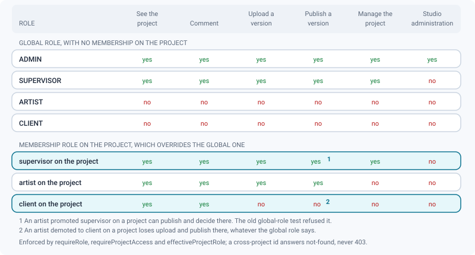
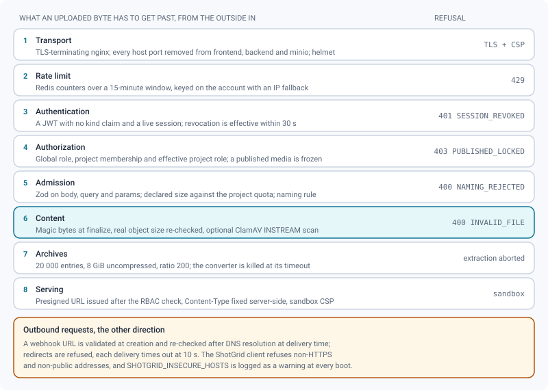

# Security model

*The controls behind every request — tokens, roles, presigned bytes, outbound guards, limits and retention.*

> Updated: 2026-08-23

ReView is a single-tenant application: one instance is one studio, and everything inside it is
somebody's unreleased work. The model below is built on that assumption. There is no
"public by default" surface, no anonymous read, and every byte that leaves the instance leaves
through a URL that was signed after an authorization check.

## Authentication & sessions

- JWT access tokens (`JWT_EXPIRES_IN`, default 7 d) and refresh tokens
  (`JWT_REFRESH_EXPIRES_IN`, default 30 d), signed with `JWT_SECRET`. Production boot **rejects
  weak or default secrets** (at least 32 characters, no `change_me`-style value).
- The signing algorithm is pinned to `HS256` **on verification as well as on signing**. Without
  that, `jwt.verify` would accept the algorithm announced in the header of the token presented —
  that is, chosen by whoever presents it.
- Every login creates a **revocable session** whose id (`sid`) is embedded in both tokens.
  Revocation takes effect within 30 s (the validity cache TTL). Admins can revoke a single
  session or every session of an account.
- The token is read **only from the `Authorization` header**. The historical `?token=` support was
  removed: a URL travels through application logs, the front proxy's logs, browser history and
  the `Referer` header, where a header does not go.
- Passwords are bcrypt-hashed with cost 12 and must be 8–128 characters with at least one letter
  and one digit. Auth events are audited.
- Optional TOTP 2FA with hashed one-time backup codes; the TOTP secret is stored encrypted
  (AES-GCM, `APP_ENCRYPTION_KEY` or a key derived from `JWT_SECRET`). The verification endpoint is
  limited to 15 attempts per 15 minutes.
- Optional OIDC SSO, with an SSO-only mode that makes password sign-in return
  `403 PASSWORD_LOGIN_DISABLED`.
- **Self-registration is closed by default** (`ALLOW_SELF_REGISTRATION=false`). Opening it on an
  internet-facing instance hands an authenticated account to anyone, and lets an attacker
  pre-book a colleague's email address before their first SSO login — which OIDC would then match
  to that account.

### Six token kinds, one allow-list

Every token the application issues is signed with the same `JWT_SECRET`, which is why the auth
middleware filters by **allow-list rather than blacklist**: only a payload with **no `kind` claim
and a numeric `id`** authenticates a request. A seventh kind added tomorrow is refused by
default, without anyone remembering to add it to a list.

| Token | `kind` | Lifetime | What it opens |
|-------|--------|----------|---------------|
| Access | *(none)* | `JWT_EXPIRES_IN`, 7 d | Every API route the bearer's role and memberships allow |
| Refresh | `refresh` | `JWT_REFRESH_EXPIRES_IN`, 30 d | A new access token, nothing else |
| 2FA exchange | `2fa` | 5 min | The second step of a login, after the password |
| Share session | `share` | 24 h | The sub-routes of **one** share link |
| OIDC state | `oidc` | 10 min | The SSO callback, in an HTTP-only cookie |
| Media playback | `media-playback` | 2 h | HLS sub-playlists for **one media and one user** |

The playback token has its own mirrored gate (`lib/mediaToken` accepts only
`kind === 'media-playback'`, and checks that the media id and the user id both match). Both
directions are closed: a playback token cannot call the API, and an access token cannot fetch a
rendition playlist. See [HLS delivery](hls-delivery.md).

### Public surfaces, on purpose

Everything else requires a JWT or an API token. These do not:

- `/health`, `/health/live`, `/health/ready` and their `/api/` twins — a probe that needs a
  credential is a probe nobody configures;
- `GET /api/version` — version and commit, published deliberately so that the AGPL §13 source
  offer can name the *corresponding* sources;
- `/api/setup`, and only while the database holds no studio;
- the login and SSO endpoints, and invitation activation;
- `/api/unsubscribe`, called by mail clients with no session;
- the ShotGrid webhook receiver, HMAC-verified on the **raw** body — which is why it is mounted
  before the JSON parser;
- `/api/openapi.json` and `/api/docs`;
- `/api/client/*`, gated by a share token and a share session.

## Authorization: the effective project role

Two levels decide every write. The **global role** (`ADMIN` / `SUPERVISOR` / `ARTIST` /
`CLIENT`) says what you are in the studio; the **membership role** on a project overrides it
there. The combination is computed once, by `effectiveProjectRole`, and that single function is
what ~35 call sites ask.

The rule in three lines:

- `ADMIN` is `ADMIN` everywhere, membership or not;
- `SUPERVISOR` keeps studio-wide management access, membership or not;
- anyone else gets access **only through a membership**, and their effective role is
  `membership.role ?? global role`.

That last line is the important one, and it replaced a duplicated global test that got two cases
backwards: an artist promoted supervisor on one project could not publish or decide there, and an
artist demoted to client on a project kept the right to contribute. Both are now decided by the
effective role.

- **RBAC middleware on every route**, plus **project-membership filtering on every read** —
  cross-project ids behave as not-found, never as `403` (no IDOR).
- **All inputs validated with Zod** (body, query and params) before any handler runs.
- The **publish lock** is enforced server-side (`403 PUBLISHED_LOCKED`), not merely hidden in the
  interface. A published media is frozen; corrections are new versions.
- Publishing a media is reserved to **its uploader** — a draft is strictly private until then,
  and anyone else asking for it gets `404`. `POST /api/versions/:id/publish` publishes the
  caller's own drafts on that version and additionally requires an effective role that can
  contribute, which is what excludes a client. Setting the version's status to published
  *directly*, and taking it back out of that state, are effective-supervisor acts: without the
  second half of that rule an author could unpublish their own version, edit it freely, and
  publish it again behind the lock.
- Deleting or restoring a version is *author or effective supervisor*; purging it permanently and
  recording a review decision are *effective supervisor* only.
- API tokens add a third dimension: fine-grained scopes checked route by route on `/api/v1`, a
  coarse write gate on `/api`, and an optional binding to a single project
  (`403 TOKEN_PROJECT_SCOPE`). A scope never grants more than its bearer's role and memberships
  already allow.
- Share links are revocable, with optional expiry and password, `VIEW`/`COMMENT` scoping, and
  only ever expose published, ready media.

> [!IMPORTANT]
> A router mounted on `/api` must **never** call `router.use(authenticate)`. Express runs it for
> every request crossing the mount point, public routes included — that is how client sharing
> once started answering `401`. Attach authentication route by route.

## Accounts a studio cannot lose

- `assertNotLastAdmin` guards the three write paths that could remove the last usable
  administrator: changing a role, disabling an account, and deleting one. Service accounts and
  already-disabled accounts do not count towards that quorum, so a studio cannot lock itself out
  by demoting the wrong person on a Friday evening.
- **Deactivation replaced deletion as the default.** `User.disabledAt` keeps the account, its
  history and its authorship while refusing every login, which is what offboarding actually
  needs; deletion stays available for an account created by mistake.
- Service accounts (`User.isService`) carry a random password that is never communicated and are
  explicitly refused at login; they can never be `ADMIN`.

See [Users & roles](../admin-guide/users-and-roles.md) and
[Per-project roles](../admin-guide/project-organization.md#per-project-roles).

## What an uploaded byte has to get past

Media bytes never transit through the API: uploads and reads use **presigned MinIO URLs**, issued
after the RBAC check. Everything else on this page exists so that a signature is only ever handed
to somebody entitled to it, and so that the object behind it cannot do harm.

| Layer | Control | Refusal |
|-------|---------|---------|
| Admission | Zod on body/query/params, declared size against the project quota, project naming convention | `400 NAMING_REJECTED` |
| Content | **Magic-bytes** check at finalize; a rejected file is deleted from storage immediately | `400 INVALID_FILE` |
| Content | Optional ClamAV `INSTREAM` scan; a detection quarantines the object under `quarantine/{mediaId}/`, fails the media and audits `MEDIA_QUARANTINED` | media `FAILED` |
| Archives | `ARCHIVE_MAX_ENTRIES` (20 000), `ARCHIVE_MAX_UNCOMPRESSED_BYTES` (8 GiB), `ARCHIVE_MAX_COMPRESSION_RATIO` (200), plus explicit path-traversal guards | extraction aborted |
| Archives | External converters killed after `MODEL_CONVERT_TIMEOUT_MS` (15 min) | job failed |
| Serving | Presigned GET, `Content-Type` fixed server-side, storage path served with `Content-Security-Policy: sandbox` | — |

Upload URLs are signed for **15 minutes**, read URLs for **an hour**. Signature times are
quantised into windows — 10 minutes for ordinary reads, 15 minutes for the segment URLs written
into an HLS sub-playlist, which live 2 hours — so that everybody who asks for the same object
inside one window receives the *same* URL. That is what lets the front proxy turn twenty viewers
of one daily into one fetch from storage; signed on demand, twenty viewers would produce twenty
different URLs and no shared cache could ever match them.

The client-supplied `Content-Type` is normalised before signing, and the definitive type is set
server-side at finalize. Because S3 only signs the `host` header, a browser could still send
another one — so the production nginx serves the storage path with
`Content-Security-Policy: sandbox; default-src 'none'; frame-ancestors 'none'`, which neutralises
any active content in an uploaded object whatever its declared type.

### Image sequences

A delivered shot is a thousand files, not one. `POST /api/media/sequence/init` accepts up to
**10 000 frames** per media and refuses anything above explicitly — never a silent truncation,
which would review an amputated shot. Each frame name is checked against a deliberately narrow
pattern (letters, digits, dot, dash, underscore, first character alphanumeric, no `..`) **before
any transfer**, because that name becomes the MinIO object key: the artist must get back the file
they delivered, under the name they delivered it with. Presigned URLs are handed out in batches.
See [Image sequences](../user-guide/image-sequences.md).

### Everything else about stored data

- Rich-text input is sanitized server-side (`lib/sanitize`).
- Soft-delete everywhere; permanent purge is an explicit admin action or the retention sweep.
- Every media consultation is journaled (deduplicated per 30 minutes) and browsable in
  *Admin → Maintenance → Media access*.

## Outbound requests (SSRF)

The worker sits inside the internal network, where MinIO, Redis and PostgreSQL are reachable
without network authentication. Anything that lets a user choose an outbound URL is therefore
guarded:

- Webhook targets are validated at creation (`400 BAD_WEBHOOK_URL` for private, loopback,
  link-local, short internal names or non-HTTP schemes) **and re-checked at delivery time, after
  DNS resolution**, because a public name can point at `127.0.0.1` or `169.254.169.254`.
  Redirects are refused rather than followed, and each delivery has a 10 s timeout.
- The ShotGrid client refuses non-HTTPS and non-public addresses. The single escape hatch,
  `SHOTGRID_INSECURE_HOSTS`, exists for the development simulator and is logged as a warning at
  **every** boot so it cannot be forgotten in production.

## Rate limiting

Counters live **in Redis**, one key space per limiter (`rl:<name>:`), with the expiry of the
window as the only reclamation — no key table, no cap. That replaced a per-process `Map`, which
had two failure modes worth remembering: two replicas doubled every quota, and a restart handed
an attacker ten fresh password attempts on a share link.

| Scope | Window | Ceiling | Counted per |
|-------|--------|---------|-------------|
| `/api` | 15 min | **6 000** signed in, **5 000** anonymous | The authenticated account, with the IP as fallback |
| `/api/v1` | 15 min | 10 000 | IP |
| `/api/setup` | 15 min | 10 | IP |
| `/api/share`, `/api/client` | 15 min | 300 | IP |
| `/api/client/:token/unlock` | 15 min | 10 | IP **and** the share token |
| `/api/auth` login, register, invitation | 15 min | 50 | IP |
| `/api/auth/2fa/verify` | 15 min | 15 | IP |
| `/api/unsubscribe` | 15 min | 60 | IP |
| `/api/search` | 1 min | 120 | The authenticated account |
| `/api/comments/export` | 1 min | 20 | The authenticated account |
| ShotGrid webhook receiver | 1 min | 600 | IP |

Keying the global limiter on the **account** matters behind NAT: fifty people sharing one studio
exit used to share one counter, and opening a single project costs a dozen calls. Only a valid
JWT signature counts as an identity — a random `Bearer` falls back to the IP, otherwise forging a
token per request would create a fresh counter every time, which is no limiter at all. Opaque API
tokens (`rvk_…`) are counted by IP and have their own `/api/v1` ceiling.

> [!WARNING]
> The limiter **fails closed**: if Redis does not answer, the request is refused with `429`. That
> is the right trade — a limiter that cannot count must not become the way around itself — but it
> means a Redis outage looks like *every route returning 429*, not like a 5xx spike. The log line
> to grep for is `[rateLimit] compteur Redis indisponible`, emitted at most once per limiter every
> 30 s.

## Secrets

- `JWT_SECRET`, MinIO, SMTP and Grafana credentials live in `.env` — never commit it.
- Stored secrets (SMTP password, webhook HMAC secrets, per-account TOTP secrets) are encrypted at
  rest with `APP_ENCRYPTION_KEY`, or a key derived from `JWT_SECRET` when it is unset. If you set
  it, production applies the same strength rule as to `JWT_SECRET`.
- Secrets shown once and never again: API tokens (`rvk_…`), service tokens, webhook HMAC secrets,
  2FA backup codes. Only hashes or ciphertext are stored.
- Log objects are redacted (`password`, `secret`, `apiKey`, `accessToken`, plus one and two levels
  of nesting) and replaced with `[Redacted]`.
- Production compose makes `POSTGRES_PASSWORD`, `MINIO_ROOT_USER`, `MINIO_ROOT_PASSWORD`,
  `JWT_SECRET`, `CORS_ORIGIN` and `S3_PUBLIC_ENDPOINT` mandatory, and `config/env.ts` re-checks
  them at boot. `scripts/install.sh` draws six random secrets, so no default password survives a
  real installation.

## Transport & headers

- In production, `docker-compose.prod.yml` puts a TLS-terminating nginx in front and removes
  every host port from `frontend`, `backend` and `minio`. MinIO is reachable only through
  `https://<domain>/<bucket>/`; its console requires an SSH tunnel or a VPN.
- `helmet` is applied on the API, with `crossOriginResourcePolicy: cross-origin` so the SPA can
  consume storage responses. `trust proxy` is set to 1 hop, which is what makes IP-based rate
  limiting meaningful behind nginx.
- Each nginx location sets its own CSP: a strict `default-src 'self'` policy for the SPA, a
  `sandbox` policy for the storage path. The application policy is deliberately declared per
  location and not at server level — two coexisting CSP headers are applied as an *intersection*
  by the browser, which would leave the API documentation page without its scripts.
  `Permissions-Policy` disables camera, microphone and geolocation; HSTS, `nosniff`,
  `X-Frame-Options` and `Referrer-Policy` are re-declared in every location, because a single
  `add_header` in a block cancels inheritance from the server block.
- The API documentation page (`/api/docs`) carries a scoped CSP allowing only its CDN assets.
- `CORS_ORIGIN=*` is rejected in production; the value is a comma-separated list of exact
  origins, and the same list drives the MinIO bucket CORS rules.
- Responses are gzipped (`gzip_proxied any`, without which nothing proxied is compressed).
  BREACH is a known and accepted trade here: no token is ever reflected in a response body — the
  JWT travels in a header — and CORS forbids cross-origin reads.

## Retention as a security control

Nine journals record activity and never give anything back. On a feature-film volume they end up
weighing more than the production data, and they hold personal data — IP addresses, identities,
timestamps — that no studio can keep indefinitely without justifying it. Each has a configurable
period in *Admin → Maintenance → Retention*, where `0` means "keep for ever":

| Journal | Default | What "expired" means |
|---------|---------|----------------------|
| Audit log | 365 d | Older than the period |
| Media access log | 365 d | Older than the period |
| Notifications | 90 d | Older than the period |
| User sessions | 30 d | **Revoked or expired** for longer than the period — a live session is never deleted |
| Password resets | 7 d | Used, or expired, for longer than the period |
| Invitations | 90 d | Accepted, or expired, for longer than the period |
| Share links | 180 d | **Revoked or expired** — an active link is never deleted |
| ShotGrid sync runs | 90 d | Finished, and carrying no unresolved conflict |
| API v1 events | 30 d | Older than the period |

The sweep runs with the daily maintenance job, deletes in capped batches with a pause between
them, and audits itself under `RETENTION_SWEEP` — a studio must be able to show *when* it purged.
Full policy: [Data retention](../admin-guide/data-retention.md).

## Dependency audit — baseline 2026-07-18

This is the last **recorded** audit, not a live figure, and the tree has moved since: it has
gained `@socket.io/redis-adapter`, `rate-limit-redis` and list-virtualisation packages. Re-run
`npm audit` in `backend/` and `frontend/` at every CP-SEC and update this section.

Toolchain: Node 22 images, Express 5, Prisma, Vite 7, React 19.

| Scope | State at the baseline |
|-------|-----------------------|
| Backend | **0 vulnerabilities** (fixed 2026-07-18: `adm-zip` ≥ 0.6.0, high — crafted-ZIP memory exhaustion; relevant because users upload 3D archives) |
| Frontend | **0 high/critical.** `lodash-es` forced to ≥ 4.18.1 via npm `overrides` (high, prototype pollution — transitive through Excalidraw's mermaid chain). Three **moderate** accepted: `nanoid` 4.x pinned inside `@excalidraw/mermaid-to-excalidraw` (predictable ids, only exercised by mermaid-to-diagram conversion; the fix would mean downgrading Excalidraw) |

Third-party licences are tracked in `THIRD-PARTY-NOTICES.md`, regenerated by
`node scripts/generate-notices.mjs`, which refuses any licence outside the allow-list. See
[Licensing](../development/licensing.md).

## Known watch-points

- **Seed accounts** (`admin@review.local` / `admin1234`, `artist@review.local` / `artist1234`)
  use published passwords: development only. A real installation never creates them.
- **`GET /metrics` is open when `METRICS_TOKEN` is unset**, and it is mounted before the `/api`
  rate limiter, so it is never throttled. It exposes route names, latencies and queue depth. Set
  the token, or keep the port off any routable network.
- **Grafana falls back to `admin`/`admin`** when `GRAFANA_ADMIN_PASSWORD` is unset. The loopback
  binding is the protection that does not depend on the operator; set the password anyway.
- **Audit entries are best-effort.** `logAudit` is fire-and-forget and swallows its errors, so a
  database blip loses audit lines for actions that otherwise succeeded.
- **A Redis outage is a full outage.** The limiter fails closed, presence and live rooms go, and
  enqueue paths block instead of failing. See [Rate limiting](#rate-limiting).
- Extend rate limiting as new public endpoints appear (client, share, webhook receivers).

Two items that used to live in this list are **fixed**, and are worth naming so that older
runbooks stop repeating them:

- The boot fallback `prisma db push --accept-data-loss` is gone. `backend/start.sh` runs
  `prisma migrate deploy` and nothing else; a failure exits non-zero with stderr intact and the
  database untouched. `db push` only runs behind an explicit `PRISMA_DB_PUSH=1`, without
  `--accept-data-loss`, and is refused outright when `NODE_ENV=production`.
- `SIGTERM` no longer kills in-flight work. Both processes handle `SIGTERM` and `SIGINT` and shut
  down in two phases — stop accepting (HTTP, sockets, queue consumers), then disconnect (Prisma,
  Redis) — under an 8 s grace period, after which what can be forced is forced. A second signal
  exits immediately.

## Related pages

- [API overview](../api/overview.md) — error codes and limits
- [Authentication & API access](../api/authentication.md)
- [Architecture](architecture.md) — failure modes and single-instance assumptions
- [Monitoring & operations](monitoring.md)
- [Backups & restore](backups.md)
- [HLS delivery](hls-delivery.md)
- [Users & roles (admin)](../admin-guide/users-and-roles.md)
- [Data retention (admin)](../admin-guide/data-retention.md)
- [Secure distribution (admin)](../admin-guide/secure-distribution.md)
- [Licensing](../development/licensing.md)
