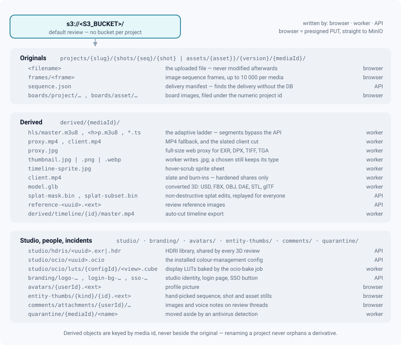

# MinIO storage

*One bucket, every binary: key layout, the three ways in, presigned lifetimes, quotas, and the ways storage fails.*

> Updated: 2026-08-23

Every binary an instance holds — originals, HLS segments, thumbnails, converted models, splat
masks, HDRIs, avatars, attachments — lives in **one** S3-compatible bucket, referenced from
PostgreSQL by object key (`MediaObject.storageKey` and friends). PostgreSQL knows *what* a file
is; MinIO knows *where the bytes are*; nothing else stores either.

The design rule behind the whole page: **the API does not move file bytes.** It signs URLs and
the browser talks to MinIO directly, in both directions. Two paths still stream through Node,
and they are named at the end of this page — but they are the exception, not the model.

## Configuration

| Variable | Default | Role |
|----------|---------|------|
| `S3_ENDPOINT` | *(required)* | Endpoint used by the backend and the worker (compose: `http://minio:9000`) |
| `S3_PUBLIC_ENDPOINT` | falls back to `S3_ENDPOINT` | Endpoint used to **sign browser-facing URLs** |
| `S3_ACCESS_KEY` / `S3_SECRET_KEY` | *(required)* | Credentials. `minioadmin` is rejected under `NODE_ENV=production` |
| `S3_BUCKET` | `review` | A single bucket holds everything |
| `S3_REGION` | `us-east-1` | Signing region; MinIO does not care, the signer does |
| `S3_FORCE_PATH_STYLE` | `true` | Path-style addressing, which is what MinIO speaks |
| `CORS_ORIGIN` | `*` | Drives the bucket CORS rule; `*` is refused in production |

Two S3 clients are built: one against `S3_ENDPOINT` for server-side operations, one against
`S3_PUBLIC_ENDPOINT` for signing. Getting `S3_PUBLIC_ENDPOINT` wrong is the single most common
deployment mistake: uploads and playback break in the browser while every server-side smoke test
passes. It must also match the scheme users reach the app with — an `http://` public endpoint
behind an HTTPS front end produces mixed-content failures, not a helpful error.

The image is **pinned** to `minio/minio:RELEASE.2025-04-22T22-12-26Z`, the last release that
ships the full web console the operations chapter below relies on. Override with
`MINIO_VERSION` in `.env`, and treat any upgrade as a data operation: back up first, and read
the release notes between your version and the target.

At boot the backend creates the bucket if missing and applies a CORS policy derived from
`CORS_ORIGIN`:

```json
{
  "AllowedHeaders": ["*"],
  "AllowedMethods": ["GET", "HEAD", "PUT"],
  "AllowedOrigins": ["https://review.mystudio.com"],
  "ExposeHeaders": ["ETag", "Content-Length", "Content-Type"],
  "MaxAgeSeconds": 3600
}
```

Bucket creation is fatal on failure — it runs before the HTTP listener, so the process exits 1
and crash-loops. The CORS step is **not** fatal: it logs a warning and carries on, which is
exactly why a browser upload that fails immediately with a CORS error is almost always
`CORS_ORIGIN` not matching the real front-end URL. The same rule is what lets the 3D viewer
fetch a GLB cross-origin.

> [!CAUTION]
> `S3_BUCKET` looks freely overridable, and behind the production proxy it is not. Two
> `location` blocks in `nginx/nginx.conf` hard-code the default bucket name in their path —
> `^/review/derived/[0-9]+/hls/…` for the cached segments, and `/review/` for everything else.
> Renaming the bucket without editing both makes every storage read behind TLS fall through to
> the SPA. The nginx file warns twice, in place; heed it before you change the variable.

## Key layout

Everything lives under one flat namespace, organised by prefix. `{mediaId}` is the numeric
`MediaObject` id shown in the version panel and in the admin.



Three conventions carry most of the consequences:

- **Originals are never modified.** `{parent}` is `shots/{sequence}/{shot}` for a shot version
  or `assets/{asset}` for an asset version. Every transformation the application offers —
  transcode, trim, splat edit, USD override, colour work — produces a derived object or
  non-destructive metadata, never a rewrite of the source.
- **Derived objects are keyed by media id**, not filed next to the original's project path.
  Renaming a project therefore never orphans a derivative, and deleting a media removes its
  original folder *and* its whole `derived/{mediaId}/` prefix in one sweep.
- **Image-sequence frames stay inside the media folder**, beside their manifest, so the project
  purge and the storage quotas — which already walk `projects/{slug}/` — carry them with no
  second code path to keep in step. For a sequence media, `sequence.json` **is** the stored
  original: it is what lets you reconstruct the delivery years later without the database.

Two keys are easy to miss when reconciling. `derived/{mediaId}/proxy.jpg` is the
full-resolution web proxy generated for formats a browser cannot display — EXR, DPX, TIFF, TGA;
without it those media show nothing but their thumbnail. And
`derived/timeline/{timelineId}/master.mp4` is the auto-cut export, which sits *inside* `derived/`
but is not keyed by a media id, so the admin storage report counts it under the `other` sub-type.

## The three ways in

Which path a file takes is decided by its size and its nature, and the client picks it — but all
three converge on the same finalisation.


### Under 16 MiB — one presigned PUT

```
POST /api/media/upload-url   → 201 { mediaObjectId, storageKey, uploadUrl, namingWarning }
PUT  <uploadUrl>             → the browser writes straight to MinIO
POST /api/media/:id/finalize → magic bytes, real size, quotas, enqueue
```

### 16 MiB and over — multipart, resumable, deduplicated

```
POST /api/media/multipart/init         → 201; resumes an interrupted upload if the hash matches
POST /api/media/multipart/:id/parts    → presigned URLs for up to 64 part numbers (1–10 000)
POST /api/media/multipart/:id/complete → MinIO assembles the parts
POST /api/media/:id/finalize
POST /api/media/multipart/:id/abort    → cancels and removes the media row
```

The part size is **16 MiB up to about 16 GiB**, and above that it grows to the next whole
megabyte so the object still fits under 1 000 parts — a 20 GB master cut into 16 MiB pieces
would be 1 250 parts, and the control traffic alone (signatures, `ListParts`, `Complete`) starts
to cost real time. The formula is a pure function of the declared size, which is what lets a
resume recompute exactly the same part boundaries **with no client-side state**: the server
lists the parts MinIO already holds and hands back the missing numbers.

Every upload carries a client-side sha256. If a `READY` media with the same hash and size
already exists and its source object is still present, the object is copied server-side —
an instant upload, audited as `MEDIA_DEDUP`. The worker re-hashes the downloaded file and fails
the media on mismatch.

### An image sequence — N frames, one media

The real VFX deliverable is a thousand files, not one. ReView treats a sequence as **one media**
of type `VIDEO` whose source is a MinIO prefix plus a manifest; the worker assembles a master
from it and everything downstream — proxy, HLS ladder, thumbnail, sprite, frame-accurate
annotations — works without knowing where the master came from.

```
POST /api/media/sequence/init         → validates every frame name BEFORE any transfer (≤ 10 000)
POST /api/media/sequence/:id/urls     → presigned PUT URLs, 64 frame names per call
POST /api/media/sequence/:id/complete → verifies what arrived, writes sequence.json, enqueues
GET  /api/media/sequence/:id/frames   → the original delivery again, frame by frame
```

Frame names are validated against a deliberately narrow pattern (letters, digits, dot, dash,
underscore; first character alphanumeric) **before** anything is transferred, and a rejected name
is reported with the name in the message rather than rewritten behind the artist's back — the key
has to stay the name that was delivered, because that is what will be downloaded back.

Completion trusts storage, not the client: it lists the prefix, keeps the frames that actually
arrived, re-reads a few headers to catch a mislabelled format, and writes the real frame count
and range. A partial delivery is a legitimate delivery — it is recorded as what it is, not
refused. That same listing is what resumes an interrupted frame upload: nothing is kept
client-side.

> [!TIP]
> `GET /api/media/sequence/:id/frames` hands back presigned URLs, one per frame, rather than
> building an archive. A hundred-gigabyte zip is not something a web process should be making.

### Finalisation, for all three

`POST /api/media/:id/finalize` is where the object stops being a blob and becomes a media. It
reads the magic bytes, compares the **real** object size against `max_file_size` and the project
quota, sets the definitive `Content-Type` server-side, and enqueues the processing job. A file
whose magic bytes do not match answers `400 INVALID_FILE` and the object is deleted on the spot;
a file that busts a quota sets the media `FAILED` and removes the object before answering.

### Presigned URL lifetimes

| Operation | TTL |
|-----------|-----|
| `PUT` upload (simple, and each sequence frame) | **15 minutes** |
| `PUT` upload (multipart part) | 1 hour |
| `GET` read | **1 hour to 1 h 10** — see below |
| `GET` HLS segment | 2 hours, signed at the start of a 15-minute window |

A read URL is not signed at the instant you ask for it. The signing date is pinned to the start
of a **10-minute window** and the requested lifetime is extended by the width of that window, so
two callers inside the same window — including the API and the worker, in different processes —
get a **byte-identical string**. That stability is the whole point: without it every response
carried a fresh signature, the browser saw a different URL and re-downloaded the thumbnail it
already had, and a page of a hundred shots re-fetched a hundred JPEGs on every navigation. The
result is memoised in process, up to 5 000 entries.

The corollary matters when you write code: rewriting an object **under the same key** from
outside the storage service — a browser depositing an avatar or an entity thumbnail over a
presigned `PUT` — must call `forgetPresignedUrl`, or the URL stays identical until the window
rolls and browsers keep showing the old image. Writes that go through the service
(`putObject`, `copyObject`, `setObjectContentType`, deletions) forget themselves.

Signing is **local**: it never contacts MinIO. A presign call therefore succeeds even when MinIO
is completely down; the failure surfaces later, in the browser.

The `Content-Type` sent by the client is normalised to a harmless value before signing, but S3
only signs the `host` header, so it is not binding. The definitive type is set server-side at
finalize, and active content is neutralised anyway by the `sandbox` CSP that the production
nginx puts on the storage path.

## Quotas and limits

| Limit | Setting key | Default | Exceeded → |
|-------|-------------|---------|------------|
| Maximum file size | `max_file_size` | 5 GiB | `400 FILE_TOO_LARGE` |
| Concurrent uploads per user | `max_concurrent_uploads` | 5 | `429 TOO_MANY_UPLOADS` |
| Storage per user | `user.storageLimit`, else `storage_limit_user` | 10 GiB | `403 STORAGE_LIMIT` |
| Storage per project | `Project.storageQuota` (bytes) | **unset = unlimited** | `403 PROJECT_QUOTA` |
| Frames per image sequence | — | 10 000 | `400`, refused before any transfer |
| Filename convention (`reject` mode) | per project | — | `400 NAMING_REJECTED` |

Size and project quota are checked **twice**: once against the *declared* size when the upload
URL is issued, once against the *real* object size at finalize. The per-user storage limit is
only checked against the declared size, and `ADMIN` accounts are exempt from it.

Project usage is the sum of the sizes of the project's non-deleted media, whatever the
attachment (shot task, asset task or asset):

```bash
curl -s -H "Authorization: Bearer $JWT" "$REVIEW/api/projects/3/usage"
```

## Deletion and the two known leaks

Deletion is soft in the application (`deletedAt`). Purging — from the admin trash, from the
daily maintenance pass after `trash_retention_days` (default 30, `0` disables), or with
`DELETE /api/media/:id/purge` — is what removes the storage objects.

A storage deletion that fails **after** the database commit is pushed onto the `storage-cleanup`
queue and retried 8 times with exponential backoff from 15 s, so a MinIO blip does not silently
leak objects. Two paths escape that safety net, and they are worth knowing when a bucket looks
bigger than the database says it should:

- the obsolete-derived purge marks `metadata.hlsPurged = true` **even when the storage delete
  failed**, so those objects are never retried;
- after a video transcode the original is deleted and `metadata.sourceDeleted` is set **before**
  the delete is confirmed; a failed delete leaves an unreferenced original behind.

> [!NOTE]
> Soft deletion is not the only thing that grows. Nine journal families — audit log, media
> access log, notifications, sessions, password resets, invitations, share links, ShotGrid sync
> passes, API events — now have their own configurable retention, swept in capped batches by the
> same daily pass. A studio that switches retention on after a year catches up over several
> nights instead of locking a table on a multi-million-row delete. See
> [Data retention](../admin-guide/data-retention.md).

Find orphans with the admin storage explorer (`GET /api/admin/storage`) or directly:

```bash
docker compose exec minio mc du local/review
docker compose exec minio mc ls --recursive local/review/derived | head
```

## Immutable originals: splats, USD, sequences

Three media types make the "never modify the original" rule visible:

- **Gaussian splats** — the uploaded PLY/SPZ/SOG is never touched. Edits are stored as compact
  binary artifacts in MinIO (a bitset mask, a subset-transform op list) plus metadata in
  PostgreSQL, and replayed by the viewer for every spectator.
- **USD** — the original stage stays as delivered; the viewer loads `derived/{mediaId}/model.glb`,
  produced by Blender + `usd-core`, and ReView's own overrides live in metadata.
- **Image sequences** — `sequence.json` plus the `frames/` prefix are the delivery; the assembled
  master is a derivative like any other.

Once a media is **published**, the lock is stronger still: splat edits, masks, trims, reprocess
and transforms all answer `403`. Correcting a published media means uploading a new version.

## Failure modes

| Situation | What happens |
|-----------|--------------|
| MinIO down at backend boot | `ensureBucket()` throws before the HTTP listener starts; the process exits 1 and crash-loops under `restart: always` |
| MinIO down while running | Presign still succeeds (local signing). `POST /api/media/:id/finalize` answers `500` and the media stays `UPLOADING`. Worker jobs fail the media with the raw SDK message in `processingError`, retried 3× |
| MinIO **disk full** (`XMinioStorageFull`, HTTP 507) | No dedicated handling — it arrives as a generic S3 error and takes the paths above. Uploads look like ordinary processing failures |
| Transient error during a multipart resume | `init` reads a failed part listing as an expired upload and **deletes the pending media row**; the client must restart the upload |
| Wrong `S3_PUBLIC_ENDPOINT` | Presigned URLs point at an unreachable or wrongly-signed host; the browser fails on `PUT`/`GET` while the server logs nothing |
| Bucket renamed without editing nginx | Every storage read behind the production proxy falls through to the SPA and returns HTML |

The AWS SDK's default retry policy (3 attempts, retryable errors only) is the only retry layer —
no application-level retry or circuit breaker exists in the storage service.

`GET /health/ready` includes a MinIO probe, bounded at 2 s, and answers `503` when it fails; it
is the cheapest way to turn "storage is down" into something a supervisor can alert on. See
[Architecture](architecture.md#health-and-what-healthy-actually-means).

## The two paths that still stream through Node

Worth stating plainly, because the rest of the page insists on the opposite:

- **HLS segments have a fallback.** The rendition playlist is rewritten so every segment URI is
  an absolute presigned MinIO URL, and that is the normal path. A segment name the playlist did
  not declare stays relative and is served by the API, which reads it from MinIO and pipes it
  through. It is a safety net for a client without a rewritten manifest, not a route to rely on.
  See [HLS delivery](hls-delivery.md).
- **Server-side reads.** Anything the backend needs to parse itself — an OCIO config, a manifest,
  a file being hashed — is fetched with `getObjectStream`. Those are small and infrequent.

## Backing the bucket up

`scripts/backup.sh` no longer tars the whole volume by default. In `mirror` mode (the default) it
keeps a **living copy** of the bucket in `backups/minio-current/`, updated incrementally by
`mc mirror` — only new or changed objects cross the network — and then freezes a snapshot of it
with hard links. A snapshot therefore costs its differences: seven retentions of a 300 GB bucket
where 2 GB changes a day occupy about 312 GB, not 2.1 TB. That model fits ReView particularly
well, because a media is never rewritten — a correction is a new version.

`BACKUP_MODE=archive` keeps the old behaviour, one self-contained `tar.gz` per run: simpler to
copy off-site, fine while the bucket is small.

Restoring follows the mode. A mirror restore is an `mc mirror --remove` back into the bucket and
**does not stop MinIO**; an archive restore stops the container, wipes `/data` and untars. The
`--remove` matters: the bucket must end up identical to the snapshot, including objects that
appeared since, or the database would be left pointing at ghosts.

> [!IMPORTANT]
> Always back the bucket up **together with** `pgdata`. The keys in the database must match the
> objects in the bucket; restoring one without the other produces a catalogue of files that do
> not exist, or files nothing references. See [Backups & restore](backups.md).

## Operations

```bash
# Health, capacity, and per-prefix usage
docker compose exec minio mc admin info local
docker compose exec minio mc du local/review

# What the backend thinks, right now
curl -s "$REVIEW/health/ready"
curl -s -H "Authorization: Bearer $ADMIN_JWT" "$REVIEW/api/admin/system"
```

`GET /api/admin/system` returns `services: { database, redis, minio }` — the MinIO probe is a
`HeadBucket` on the configured bucket.

- The console is on port `9001`, bound to `127.0.0.1` by default. In production
  `docker-compose.prod.yml` removes every host port from MinIO: reach the console over an SSH
  tunnel or a VPN, and the S3 API through nginx at `https://<domain>/<bucket>/`.
- `GET /api/admin/storage` walks the entire bucket and classifies every key. It is a page you
  open, not a metric you poll — see [Storage map](../admin-guide/storage.md#the-live-report).

## Related pages

- [Architecture](architecture.md) — where storage sits in the stack
- [Storage map (admin)](../admin-guide/storage.md) — the live report, and reclaiming space
- [HLS delivery](hls-delivery.md) — why segments bypass the API
- [Jobs & workers](jobs-and-workers.md) — what the worker does with a finalised media
- [Data retention](../admin-guide/data-retention.md)
- [Backups & restore](backups.md)
- [Docker stack](../getting-started/docker-stack.md)
