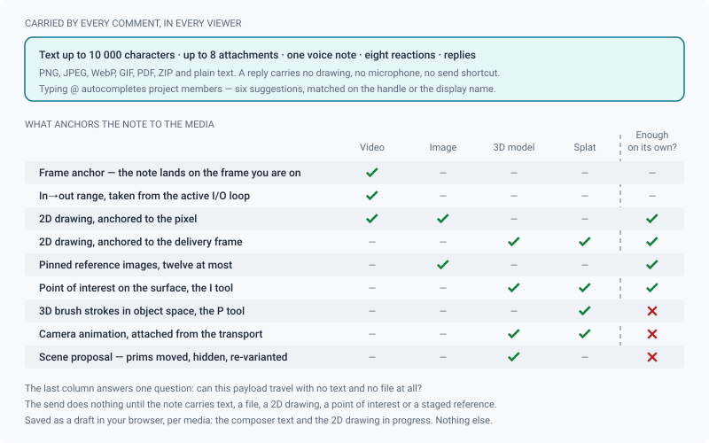

# Annotations & comments

*One commenting system for all four viewers: threads, states, payloads, mentions, deep links and hand-off.*

> Updated: 2026-08-23

Every review — video, image, 3D, splat — shares the same commenting system: threads, states,
mentions, reactions, attachments, voice notes, deep links and kanban hand-off. What changes
with the media type is what a comment can *carry*: a drawing on a frame, a point of interest
on a surface, a camera move, a proposal for the scene.

A note is never only text. It is text plus a position — and that position is what makes it
worth reading three weeks later, when nobody remembers which frame was being discussed.

## The comments panel

The panel sits to the right of the viewer and is toggled from the review header. It can be
dragged wider or narrower (from 300 to 680 pixels, 380 by default) and the width is
remembered. It stays visible in the unified fullscreen so you can keep annotating; theatre
mode hides it on purpose — theatre is for watching, not for writing.

| Element | What it does |
|---|---|
| Header count | `N open / total`, and the *All · Open · Resolved* filter |
| Thread | Root comments in timecode order, replies nested under them |
| Timeline markers | Clickable separators splitting the thread into sections (video) |
| Composer | Text, `Annotate`, paperclip, microphone, send |

On video, a comment is **anchored to the current frame**: its card carries an `F1043` badge,
clicking the card jumps the player back to that exact frame, and its author's avatar marks
the position on the timeline. A card also shows a camera icon when it restores a viewpoint
and a pen icon when it carries a drawing — clicking it restores all of them at once.

- `Ctrl+Enter` (or `⌘+Enter`) sends. `Enter` inserts a newline — a note about a shot is
  rarely one line.
- **Replies** nest under a root comment. A reply is plain: no send shortcut, no microphone,
  no drawing of its own, and no right-click menu.
- **Editing** is limited to the author, and an edited comment carries a small *modified*
  badge. Deleting is open to the author and to any `SUPERVISOR` or `ADMIN`.
- The thread updates live: a comment posted by someone else in the same review appears
  without a reload.

> [!IMPORTANT]
> The review asks for **one page of one hundred root comments** and offers no *load more*.
> Past that, the oldest hundred are shown and the rest are not — and the header's
> `N open / total` counts only what was loaded. A shot that has collected more than a
> hundred root notes is a shot whose thread should be exported (see
> [Getting the notes out](#what-you-can-do-with-a-note-afterwards)) rather than scrolled.

## Comment states, and the two counters

A comment carries one of five states, each with its own colour on the card:

| State | Meaning | How you set it |
|---|---|---|
| **Open** | nothing has been decided yet (the default) | the default, or the corner button on a resolved card |
| **Working on it** | someone has taken it | right-click the card |
| **Question** | the note is not understood, an answer is expected | right-click the card |
| **Won't fix** | knowingly left as is | right-click the card |
| **Resolved** | done | the button at the top right of the card |

The corner button toggles between **Resolved** and **Open** — that one gesture covers most of
the traffic. The three other states are a **right-click** away: five buttons per card would
not read. Changing any state is open to the comment's author and to `SUPERVISOR` / `ADMIN`,
and only on root comments.

Two counters exist, and they are not the same one:

- the **panel header** shows `N open / total` and filters *All / Open / Resolved*. It reads
  the resolved flag, so a *Won't fix* comment still counts as open there;
- the **thread** carries a row of state pills with their counts, shown as soon as there is
  more than one comment. Only states that actually have notes get a pill, and clicking one
  filters the thread down to it. That row is the one that separates *Question* from *Working
  on it*.

Cards in a closed state (*Resolved*, *Won't fix*) are dimmed, and the state badge's tooltip
says who closed it and when.

## What a comment can carry

Beyond the text — **10 000 characters** at most — a comment bundles whatever the viewer had
armed when you sent it. The composer shows a coloured line for each payload it recognises
(*annotation*, *hotspot attached*, *N references*, *I→O range attached*), so you can check
before sending.

> [!WARNING]
> A comment needs **text, a file, a 2D drawing, a point of interest or a staged reference**
> to be sent. A camera animation, a scene proposal or splat brush strokes alone do **not**
> satisfy the guard: the send button does nothing at all, silently. Type a word — even one —
> and everything you attached travels with it.

### Attachments & voice notes

- The paperclip accepts **images** (PNG, JPEG, WebP, GIF), **PDF**, **ZIP** and **plain
  text**. Anything outside that list is dropped when the comment is sent, so use the picker
  rather than a drag from an unusual application. **Eight attachments per comment** is the
  ceiling, enforced on both sides.
- Images are shown as thumbnails — two of them, then a `+N` tile opening a lightbox carousel.
  Everything else is a downloadable chip.
- The **microphone** in the main composer records a voice note: WebM/Opus where the browser
  supports it, the browser's own format otherwise, with the file extension following
  (`.webm`, `.ogg`, `.m4a`). It is attached like any other file and plays inline in the
  thread. Replies have no microphone.
- `Ctrl+V` in the composer attaches the clipboard image to the comment. The same paste with
  the focus in an **image viewer** pins it as a reference on the picture instead, re-encoding
  it to PNG if the clipboard offered an exotic format — see [Image review](review-image.md).
- There is no size limit on an attachment. A very large one is still a very large upload.

### Reactions

Eight emoji are offered on any comment (thumbs up, heart, laugh, party, eyes, fire, tick,
question mark), one per user and per emoji, toggled by clicking. They group into chips with a
count, and your own are outlined.

### Mentions

- Type `@` in the composer or in a reply to autocomplete **project members** — up to six
  suggestions, matched on the handle from its first letters or on the display name anywhere.
- Navigate with `↑` and `↓`, insert with `Enter` or `Tab`, dismiss with `Esc`.
- A handle is the member's username, or the local part of their email when no username is
  set.
- Mentioned members get a targeted notification that opens the review, and the mention is
  highlighted in the thread. You are never notified for mentioning yourself, and a mention of
  someone who is not a member of that project notifies nobody.

### Drafts

The composer text and any in-progress 2D drawing are saved in your browser, per media.
Leaving the review or reloading the page keeps them; they are cleared only when the comment
is **successfully sent**, so a failed send never loses your note. Attached files, points of
interest, camera animations and scene proposals are *not* part of the draft — re-attach them
if you reload.

## Drawing on the image

Enter the **Annotate** mode from the *Annotate* button of the composer, from the viewer's
right-click menu on video and image, or simply by pressing a drawing tool letter. The rail
then fills with the drawing tools and the options bar carries the ink, thickness and opacity
of the armed one.

| Tool | Key | Notes |
|---|---|---|
| Freehand | `D` | |
| Rectangle | `R` | |
| Ellipse | `E` | |
| Arrow | `A` | |
| Polygon | `G` | one click per vertex, **double-click to close**; fewer than three vertices is discarded |
| Text | `T` | click to place, type, then `Enter` or click away to commit — `Esc` cancels, empty text is dropped |
| Move a shape | `M` | pick up a shape already drawn |
| Eraser | `X` | click, or drag over several shapes |

- Five ink swatches are offered directly, plus a free colour picker that opens outside the
  page so it never covers the media. Your default ink is your own avatar colour, and a manual
  choice is remembered as a preference. Thickness runs from 1 to 24 px, opacity from 10 to
  100 % in steps of 5.
- Undo, redo and *clear all* sit at the right of the options bar, and the row tells you how
  many shapes are currently attached to the comment.
- Drawings are an overlay: they leave with the comment you send, and the composer is emptied.
- You can draw **half an image beyond each edge** — an arrow pointing in from outside the
  frame is a legitimate note. The first time a stroke goes past the delivery guide, a toast
  says so.
- **`Esc`**, or the pill at the top of the viewer, hides the annotation of the comment
  currently displayed.

**Where a drawing is anchored** depends on the media:

- **Video and image** — to the media itself. A stroke stays on its pixel through window
  resizes, fullscreen, and (on images) any amount of zoom and pan.
- **3D and splat** — to the **delivery frame**, the letterbox guide that materialises the
  shot's aspect ratio, so a drawing made on one screen lines up on every other.

On video, moving the playhead by hand hides the displayed annotation and deselects its
comment: the drawing is only aligned with its own frame. On 3D and splat, moving the camera
does the same — except that a comment's **scene proposal** stays applied so you can inspect
it from another angle.

> [!TIP]
> No tool letter fires while the caret is in the composer. Click into the viewer first, then
> press the key.

## Spatial notes on 3D and splat

A note on a spatial media can be a place or a move rather than a sentence. The viewpoint you
are looking from is recorded with every comment on a 3D or splat media, and restored when the
card is clicked. On top of that, the composer can bundle:

- a **point of interest** dropped on the surface (the `I` tool), which brings everyone back
  to the exact spot rather than to a general direction;
- **3D brush strokes** painted on the surface (splat, the `P` tool), stored in object space
  so they follow the object if it is transformed;
- the **camera animation** you built — press *Attach this animation to the next comment* in
  the transport, which only appears once an animation exists. A toast confirms the attachment
  on both 3D and splat; the composer's persistent *the current camera view will be saved*
  line is shown on 3D only, so on a splat trust the toast. See
  [Camera animation](camera-animation.md);
- a **scene proposal** (3D only) — the prims you moved, hid or re-varianted — replayed only
  while the comment is selected, which is how you suggest a change to a published asset
  without touching it.

> [!CAUTION]
> A camera animation, a scene proposal and splat brush strokes are not counted by the send
> guard. Sending them with an empty composer does nothing and loses nothing — but it also
> tells you nothing. Always write a line with them.

## What you can do with a note afterwards

### Deep links

- Viewer right-click on a video → **Copy the link to this frame** produces a URL carrying
  `?frame=N`; opening it seeks the review straight there, waiting for the player to be ready
  if needed.
- Comment card right-click → **Copy the link to the comment** produces `?comment=ID`;
  opening it selects the comment — seek, annotation and camera restored — and scrolls to its
  card. A link to a reply selects its root comment.
- A URL carrying both is resolved on the comment.

### Comment to kanban task

`SUPERVISOR` and `ADMIN` can right-click a comment card → **Create a kanban task**.

- The task is attached to the shot or the asset carrying the media's version. A media
  attached to neither cannot produce a task.
- Its name is taken from the comment text, stripped of formatting and truncated at eighty
  characters; its type is *Other*; it inherits the comment's assignee when one was set.
  That assignee field exists on the comment and is writable through
  `PATCH /api/comments/:id` by a supervisor, but no control sets it from the interface yet —
  in practice the task arrives unassigned.
- The task page shows an **original comment** chip linking back to the review at the exact
  frame and annotation, and a toast offers to open the new task straight away. See
  [Kanban & tasks](kanban-and-tasks.md).

### Watching (notification subscriptions)

- Right-click a **shot card**, an **asset card** or a **version card** → *Watch* / *Stop
  watching*.
- Watchers are notified of new **root** comments, media **publications** and **review
  decisions** on the watched item and on anything below it in the chain — watching a shot
  covers its versions and their media. Replies do not notify watchers.
- The person who acted is always excluded, and so is anyone already notified by an
  `@`-mention. On a review decision, the version author is excluded too — they get their own
  notification. See [Review decisions & approvals](review-approvals.md).

### Getting the notes out

A whole thread leaves the application as a file, from the right-click menu of the entity or
from the review dock:

| Scope | Formats offered |
|---|---|
| A media, a version, a shot | `CSV`, printable sheet |
| A playlist, an auto-cut timeline | `CSV`, printable sheet, `EDL` (CMX3600), `OpenTimelineIO` |

EDL and OTIO are refused outside a playlist or a cut, and for a good reason: they need a
continuous timecode, which only a sequence of clips has. A `CLIENT` account only ever exports
the notes it can already see. See [Exporting review notes](exporting-notes.md).

## Who sees what: clients, guests and share links

| Audience | Reads the thread | Writes | Draws, attaches | Changes a state | Marks *Show to the client* |
|---|---|---|---|---|---|
| `ARTIST`, `SUPERVISOR`, `ADMIN` on the project | the whole thread | root comments and replies | yes | own comments, or any as supervisor | `SUPERVISOR` / `ADMIN` |
| `CLIENT` **account**, member of the project | the whole thread | root comments and replies | no drawing — the viewer stays in Explore | own comments only | no |
| Share-link guest, `VIEW` permission | root comments marked visible | nothing | no | no | no |
| Share-link guest, `COMMENT` permission | root comments marked visible | one named root comment, optional timecode | no | no | no |

Three things follow from that table, and each one has bitten someone:

- **A comment is hidden from share links by default.** `SUPERVISOR` and `ADMIN` toggle *Show
  to the client* from the comment's right-click menu, one comment at a time. Nothing is ever
  revealed in bulk.
- **A guest's own comment is visible to the client automatically** — a client who writes a
  note must be able to re-read it. It also travels the usual chain: watchers are notified,
  the share's creator is notified, and the note is pushed to ShotGrid on a linked project.
- **A `CLIENT` account is not a guest.** Signed in as a member of the project, it reads the
  internal thread like anyone else; the *Show to the client* flag governs **share links**,
  the notes **export** and the **search**, not the in-app thread. Give an outside reviewer a
  share link, not an account, when the internal discussion must stay internal. See
  [Sharing](sharing.md).

People who wrote without an account here — share-link guests, and contributors imported from
ShotGrid — appear in the thread under their **declared name** rather than an avatar-backed
author, with initials derived from that name. A comment whose author's account was later
deleted keeps its text and reads as anonymous.

## Notes written on a cut

A note written while watching an auto-cut timeline belongs to the **cut**, not to the shot: a
screening produces editorial notes, and pouring them all into the artist's review would drown
the feedback actually meant for them. It carries two coordinates — its position in the film
and the frame inside the clip's own media — and reaches the shot's review only when someone
right-clicks it and chooses **Send to the shot review**. See
[Auto-updating cut timelines](auto-cut-timelines.md).

## Use cases

### Turning a dailies note into work

You circle the flicker, write "unstable roto on the left arm", and send. The next morning
the coordinator right-clicks that card and creates a kanban task: it lands on the shot,
named after the note, and the artist opens it from the board. The task keeps a chip back to
the review at that exact frame — nobody has to re-find the moment being discussed.

### A note that is a question, not a correction

Half the notes in a review are "is this intentional?". Set that comment to **Question** from
the right-click menu instead of leaving it Open: the thread's state pills then show at a
glance that three items are waiting on an answer and eleven on a fix, and clicking the
*Question* pill shows only those three. When the answer is "yes, keep it", switch it to
**Won't fix** rather than resolving it — the history says the decision was taken, not that
the work was done.

### Bringing the right person in

The comp note actually concerns lighting. Type `@` and the first letters of the lead's
username in a reply: they get a notification that opens the review straight on the thread.
No email, no copy-pasted link, and nobody else is disturbed.

### Talking through a note that takes a paragraph

Some notes are faster spoken. Hit the microphone in the composer, describe the fix while
scrubbing, stop. The voice note is attached at the current frame and plays inline in the
thread, next to the drawing that goes with it.

### Answering with a camera move instead of a sentence

"Frame it wider from here" takes a paragraph to write and ten seconds to show. Build the move
in the curve editor, press *Attach this animation to the next comment* in the transport, type
one line — "try this framing" — and send. Anyone who selects the card watches the move you
meant, from the exact camera you meant.

### Suggesting a change on a published asset

The asset is published, so its scene is frozen. Move the prim anyway, write a line, and send:
the delta rides along with your note and is replayed only when someone selects it. The
published scene is untouched, and the supervisor can see the proposal from any angle before
deciding to ask for a new version.

### Keeping the client out of the internal thread

Internal notes are hidden from share links by default, so a review can be brutal without
consequence. When one note *should* reach the client, a supervisor marks it *Show to the
client*; on a `COMMENT` link the client answers under it, with their name attached. Do not
hand out a `CLIENT` **account** for that: an account that is a member of the project reads
everything.

## Troubleshooting

**`Ctrl+Enter` does nothing in a reply.** Only the main composer has the send shortcut; use
the button.

**The send button does nothing at all.** The note carries none of the five things the guard
counts — text, a file, a 2D drawing, a point of interest, a staged reference. A camera
animation or a scene proposal on its own is not enough. Type a word.

**"8 attachments max per comment".** Split the note in two, or zip the files. There is no
size limit, but a very large attachment is still a very large upload.

**A file I attached never arrived.** Its type is outside the accepted list (PNG, JPEG, WebP,
GIF, PDF, ZIP, plain text, and the audio of a voice note): it is dropped when the comment is
sent. Convert it, or zip it.

**My draft came back but the attached files did not.** Only the text and the 2D drawing are
saved locally. Files, points of interest, camera animations and scene proposals are not.

**The `Open` counter says 4 but I only see 3 open notes.** The header counter and the header
filter read the resolved flag, so *Won't fix* comments count as open. The per-state pills in
the thread give the exact breakdown.

**Old comments are missing from a very long thread.** The review loads one page of one
hundred root comments and has no *load more*. Export the notes to read the whole thread.

**The client cannot see my comment.** Comments are hidden from share links by default. A
supervisor has to mark each one *Show to the client*.

**A guest says the link is read-only.** The share was created with `VIEW` permission. Issue a
`COMMENT` link — see [Sharing](sharing.md).

**"Create a kanban task" is missing, or fails.** It is limited to `SUPERVISOR` and `ADMIN`,
and the media's version must hang off a shot or an asset.

**The state I picked in the right-click menu came back with an error.** Changing a state is
reserved to the comment's author and to `SUPERVISOR` / `ADMIN`, and only on root comments.

**My drawing landed outside the frame.** On 3D and splat, strokes are anchored to the
delivery guide and you can draw beyond it deliberately; the toast that appears the first
time is a warning, not an error. If it was unintentional, undo in the options bar or the
eraser will do.

**Nothing happens when I press a tool letter.** The caret is probably still in the composer —
no shortcut fires while you are typing. Click into the viewer first.

## Related pages

- [The review workspace](review-workspace.md)
- [Video review](review-video.md) · [Image review](review-image.md) ·
  [3D review](review-3d.md) · [Splat review](review-splat.md)
- [Camera animation](camera-animation.md) — the move a comment can carry
- [Auto-updating cut timelines](auto-cut-timelines.md) — notes written on the film
- [Kanban & tasks](kanban-and-tasks.md) — tasks created from comments
- [Review decisions & approvals](review-approvals.md) — decisions notify watchers
- [Exporting review notes](exporting-notes.md) — CSV, EDL, OTIO, printable sheet
- [Sharing](sharing.md) — client access permissions
