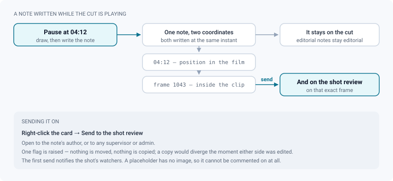

# Auto-updating cut timelines

*A cut that rebuilds itself at every publish: gaps shown, stages targeted, revisions frozen, notes routed.*

> Updated: 2026-08-23

Every sequence — and the project as a whole — carries a **cut** that keeps itself up to
date. Its content is never stored: it is recomputed from the current state of production
every time it is read, so publishing a new shot version is enough to update it. Nothing
to regenerate, no list to maintain by hand.

What *is* stored is only what a human decided: the cut's name, the stage it targets, and the
revisions someone chose to freeze.

## Where the cut lives

The whole-film cut sits at the top of the project's **Sequences** tab; a sequence's own cut
sits at the top of its page. Both are the same card, titled *Cut* until somebody renames it.

The card is a map of the film, not a player: it shows the shot count, the running time, a
*n gaps* badge, the number of the latest frozen revision, the stage selector, and the
**Freeze**, **Export** and **Play** buttons. Under them runs the whole film on one band —
clicking a clip opens the player *at that point*, not at the beginning.

Any project member can read and play a cut. Renaming it, targeting a stage, freezing a
revision and starting an export are reserved to supervisors and admins.

## How each shot picks the version it plays

One clip per shot, in production order: sequence order, then sequence code, then shot order,
then shot code (numerically aware, so `SH9` sorts before `SH10`). Shots that belong to no
sequence come last.

For each shot, the cut takes **the version of the furthest stage reached in the pipe** — not
simply the most recent one. An animation fix published after compositing does not send the
shot backwards in the edit. Among the versions at that stage, the most recent wins, and ties
are broken on the version id so the cut never reshuffles between two reads.

Only **published versions carrying at least one published, `READY` media** are candidates,
and a video media is preferred over anything else in the version.

The stage order is the **ordered department list** of the project (see
[Pipeline settings](../admin-guide/pipeline-settings.md)). Reordering that list changes what
"latest version" means everywhere: on assets, on shots, and in every cut.

> [!NOTE]
> A shot delivered as an **image sequence** (EXR or DPX frames) is a `VIDEO` media like any
> other by the time the cut reads it: the worker assembles a master from the frames, and
> everything downstream is unaware of the origin. See
> [Image sequences](image-sequences.md).

### Targeting a stage

The department selector — on the cut card, and in the player's *Playback* dock panel —
switches between:

- **Furthest stage** (the default): each shot shows how far it has got;
- **a specific department** (Layout, Animation, Lighting…): the chosen stage becomes a
  **ceiling**. Each shot shows that stage, falling back **upstream** when it has not reached
  it yet — asking for "Lighting" on a shot that has none shows its animation rather than a
  gap; asking for "Layout" on a shot already in compositing shows the layout, not the comp.

Two consequences worth knowing: the selector never shows work *later* than the target, and
versions whose task carries **no department** drop out of the cut entirely as soon as a
department is selected — they have no rank in the pipe, so no ceiling can hold them.

Only supervisors and admins can change the selector, and the choice is stored on the cut, so
everyone sees the same film.

## Gaps are shown, not hidden

A shot with no published media still takes its place, for its own duration, as a
**placeholder card** carrying its shot code and *No media*. A cut that skipped its gaps would
lie about its running time and hide exactly what a supervisor is looking for.

| Value | Where it comes from |
|---|---|
| Placeholder duration | The shot's declared frame range, `(end − start + 1) ÷ fps` |
| Placeholder fallback | **4 seconds**, when the range is missing or unusable |
| Clip duration | The media's real duration, always |
| Framerate | The sequence's override when it has one, otherwise the project's setting |

The card header counts them: *n gaps*, or *Complete*. When a clip's real duration differs
from the declared frame range by **more than half a second**, it is **flagged** with an amber
warning triangle rather than silently trimmed — recutting without saying so would turn a
visible problem into a surprise at the final conform.

> [!WARNING]
> A cut is capped at **5 000 shots**. Beyond that the list is truncated — the response says
> so — because loading a whole studio's shot table to sort it in memory takes the server down
> rather than showing anything useful. A film that size is an import anomaly, not an edit.

## Watching the cut

**Play** opens the cut on its own page (`/timelines/:id/play`). That page is the video review
page — same header, tool rail, options bar, inspector dock, transport and comments space —
with one difference: the timeline is the **whole film**, on a single scale from zero to the
end. Nothing else about the screen changes, so it reads without relearning.

Playback has **no cut in it**. Two video players take turns: while one plays, the next clip
is already loading in the other, and the changeover is a swap of visibility. Shot and
sequence changes are read on the timeline and in the label at the top
(`SQ020 · SH010 · v0002`), never as a black frame — nothing navigates, so nothing interrupts
the screening.

- Placeholders **hold their slot** for their own duration, timed on their own clock rather
  than on a video element: the cut runs for as long as the timeline says it does, gaps
  included. That clock is doubled by a timer, so a cut left in a background tab does not
  freeze on a gap.
- Playback is bounded by the **cut's** duration, not the file's: a media longer than the
  slot it was given is trimmed here rather than pushing the rest of the film out of sync.
- Frame stepping, timecode and frame number are those of the **film**, counted from frame 1
  at the cut's framerate. Stepping across a cut is a step like any other.
- Each shot is served exactly as the review serves it: **HLS** when renditions exist, the web
  MP4 otherwise. A shot that plays in its own review plays here too, and a fatal HLS error
  falls back to the MP4 rather than showing a black rectangle.
- Playback is locked to the **best rendition**, as in the review — a screening is not the
  place for quality to drift shot by shot.
- The timeline shows the sequences as a band above the clips, with a hard boundary between
  them, and pins each comment as a diamond carrying its author's avatar.
- The **Shots** drawer, under the transport, shows the clips as thumbnails; clicking one
  jumps there.
- The header carries an **Open in review** link on the clip currently playing — the way out
  when a note deserves the shot's own review rather than the cut's.
- The transport is **mouse-driven**: click the image to play or pause, use the buttons to
  step. Volume, mute, loop-all and both fullscreens (the page, or the image alone) are there;
  this page registers no playback keyboard shortcuts of its own — no spacebar play/pause, no
  next-shot key.
- The cut page has **one mode**, *Explore*: A/B comparison and trimming apply to a media, not
  to an assembled film, and the image zoom of the review is hidden here rather than offered
  as an inert button. The rail is the hand tool, plus the drawing tools once annotation is
  armed.

> [!NOTE]
> The bytes of a shot no longer travel through the application. The master playlist is
> rewritten by the API and carries your read token, but every segment URI inside a rendition
> playlist is replaced by an **absolute presigned storage URL**, frozen per fifteen-minute
> signing window so that twenty people watching the same dailies share one cache entry
> instead of pulling twenty different URLs.

## Reviewing the cut itself

Feedback written here belongs to the **cut**, at its position in the film: that is what you
were watching. Comments appear as diamonds on the same single timeline, ordered by their
position in the film, and drawing on the image works as in any review — the annotation is
attached to the comment and comes back when it is reopened. Selecting a comment pauses the
film, seeks to it and redisplays its drawing.

Each comment is stored with **two coordinates**: its position in the film, and the frame
**inside the clip's media**. That second one is what makes the next gesture possible.

**Right-click a comment → *Send to the shot review*** and it also appears in that shot's own
review, on that exact image. Nothing is moved and nothing is copied: a single flag is raised
on the comment, so the note stays on the cut and gains a second home. A copy would diverge
the moment either side was edited. The entry reads *sent to the review* and is greyed out
once it has been used.

Until it is shared, a cut comment stays with the cut. A screening produces many editing
notes, and pouring them all into the artist's review would drown the feedback actually
addressed to them. Sharing is open to **the comment's author or a supervisor/admin**, and the
first share notifies the shot's watchers.

A placeholder cannot be commented on — there is no image to attach the note to, and the page
says so. Everything else about the thread is the ordinary review thread: states, replies,
reactions, mentions, deep links. See [Annotations & comments](annotations-and-comments.md).

## Freezing a revision

**Freeze** stores a dated, numbered revision of what is on screen. Shot codes, sequence
codes, version names, departments and durations are **copied into** the revision, so it stays
readable even if a shot is later renamed, omitted or trashed. It is a record of what was
shown, not a view on the current state.

Reading a revision back gives what changed since the **immediately preceding** one: shots
added, shots removed, and shots whose version changed. The comparison is made on **shot
codes**, not database ids, because a shot can be deleted and recreated. Reordering and
duration changes are not reported.

> [!IMPORTANT]
> Freezing is a one-click gesture in the interface — the *Freeze* button on the card, and the
> same button in the player's *Info* dock panel. **Reading a past revision back is served by
> the API only** today: `GET /api/timelines/:id/snapshots` for the list (the two hundred most
> recent) and `GET /api/timelines/:id/snapshots/:revision` for one revision and its diff. The
> card and the dock show the latest revision number and nothing more.

## Exporting: the master, and the notes

The player's **Export** dock panel carries two groups, and they answer two different
questions.

### The cut master

**Export** encodes the whole cut into one MP4 — H.264 video at the project's resolution and
the cut's framerate, AAC stereo audio at 48 kHz — placeholders included, so the running time
matches the cut on screen. A placeholder becomes a black silent clip carrying the shot code,
so a gap is identifiable in the exported file too. On a machine whose fonts are missing, the
card is produced without its text rather than failing the whole export.

The job runs in the background, **one cut at a time** so it does not starve routine
transcodes; the button turns into a download link when the file is ready, and polls every few
seconds while it works. Each cut has a single master: **re-running the export replaces the
previous file**. Asking for an export while one is already running does nothing rather than
queuing a second.

Segments are encoded from the transcoded proxy when there is one, to avoid re-encoding EXR or
ProRes sources, then normalised to a common profile and concatenated without a second pass.

Playback inside ReView never needs this file — it exists to send the cut outside the
application. Starting an export is reserved to supervisors and admins; once a master exists,
anyone who can read the cut sees the download link.

### The notes

Next to the master sits a **Review notes** group: `CSV`, a printable sheet, an **EDL**
(CMX3600) and an **OpenTimelineIO** file. The cut is one of only two scopes with a continuous
timecode — the other is a playlist — which is precisely why EDL and OTIO mean something here
and are refused on a single media. This is how a screening's notes get back to the cutting
room, in a file Premiere, Resolve or Hiero opens. See
[Exporting review notes](exporting-notes.md).

The other dock tabs — image, guides, comparison — say *not applicable*: a cut has no image
settings of its own and no media B.

## Omitting a shot

A shot cut from the edit carries an **omitted** flag. Cuts skip it entirely, while its tasks,
versions, media and comments are preserved — deleting the shot would lose all of that, and it
is not a soft delete. The sequence's shot grid and the project's **Shots** tab mark it with an
eye-off badge, so it reads as a deliberate choice rather than an absence.

Right-click a shot — on its card in the **Shots** tab, or anywhere on the shot page — and
tick **Omitted from the cut**. The tick shows the current state, so the same entry puts the
shot back in the edit. Toggling it is reserved to supervisors and admins; everyone else sees
the badge without the entry.

Under the hood this is `PATCH /api/shots/:id` with `omitted` alone, so the rest of the shot is
left untouched — nothing else is republished to ShotGrid. Open cuts refresh on their own. The
flag affects the cuts only: the shot still counts in the Production tab's matrix, workload and
attention lists.

## Use cases

### Screening the film at the end of the week

1. Open the project → **Sequences** tab. The whole-film cut is the first card.
2. Read the badge: *4 gaps* tells you four shots have nothing published. That is the
   agenda before it is a screening.
3. **Play**. The film runs end to end, gaps included, at their real duration — so the
   running time you read is the running time you will deliver.
4. Take notes as you watch: they land on the cut, at the position in the film, with the
   drawing if you made one.
5. Afterwards, right-click the two or three notes that are genuinely for an artist →
   **Send to the shot review**. The rest stay editorial notes on the cut.

### Comparing two states of the edit

1. Before the screening, **Freeze** the cut. It becomes revision *n*.
2. A week later, freeze again, then read the new revision back through
   `GET /api/timelines/:id/snapshots/:revision`: it lists the shots added, the shots removed,
   and the shots whose version changed since revision *n*.
3. That list is your changelog for the production meeting — and it stays readable even if a
   shot was renamed in between, because the revision stored the codes rather than pointers.

### Watching the animation pass across a whole sequence

The lighting is halfway done and you want to check the animation, not the comp.

Set the cut's department selector to **Animation**. Shots already in comp fall back to their
animation version; shots that never had one fall back further upstream. What you watch is a
coherent animation pass, not a patchwork of stages.

Remember to set the selector back to **Furthest stage** afterwards — the choice is stored and
everyone sees it.

### Sending the cut to the editor

1. Set the stage selector to **Furthest stage**.
2. **Export**. The job encodes in the background; keep working.
3. When the button becomes a download link, the MP4 has the project's resolution, the cut's
   framerate, stereo audio, and the exact running time of the cut on screen — placeholders as
   black cards with their shot code, so the editor can see what is missing rather than
   guessing.
4. Export the notes as an **EDL** or an **OTIO** from the same panel, so the editor gets the
   comments on the same timecode as the picture.
5. Re-export after the next round of publishes: the master is replaced, the link stays the
   same.

### A shot that was dropped from the edit

Editorial cut SH120. Do **not** delete it: set its `omitted` flag. It disappears from every
cut and stops distorting the running time, but its versions, notes and history stay where
they are — and the sequence grid shows an eye-off badge so nobody re-creates it by mistake
next month.

## Troubleshooting

**A shot I just published is not in the cut.** The cut only takes versions that are
*published* and carry a media that is both *published* and `READY`. A media still
transcoding, or a version left as a draft, is not a candidate — and the shot shows a
placeholder in the meantime.

**A shot disappeared when I picked a department.** Its task carries no department, so it has
no rank in the pipe and no ceiling can hold it. Set the department on the task, or go back to
*Furthest stage*.

**The running time does not match the frame ranges.** Clip duration is always the media's
real duration; the frame range only decides a placeholder's length. Where the two disagree by
more than half a second, the clip carries an amber triangle — the cut is telling you the
delivery is not the length it was booked for.

**The stage selector and the Freeze button are greyed out.** They are reserved to supervisors
and admins. Everyone else reads and plays.

**Nothing happens when I press the spacebar.** The cut player registers no playback keyboard
shortcuts. Click the image to play or pause, and use the transport buttons to step.

**I cannot comment on this shot.** You are on a placeholder — there is no image to attach a
note to. Comment on the neighbouring clip, or publish something for that shot.

**A file I attached to a cut note never arrived.** The cut's composer sends the text, the
drawing and the two positions; attachments are not carried here. Attach the file to a note on
the shot's own review instead.

**Old notes are missing from a long screening thread.** Like the review, the cut loads one
page of one hundred root comments. Export the notes to read the whole thread.

**Export does nothing.** An export is already running for that cut — the button says so and
polls until the file lands. Only one runs at a time, and the previous master is replaced when
it finishes.

**A shot plays in its own review but is black in the cut.** The HLS stream failed and the
fallback to the MP4 could not resolve either; open the shot's review and check the media has
finished processing. See [Media processing](media-processing.md).

## Related pages

- [Projects & pipeline](projects-and-pipeline.md) — sequences, shots, publication
- [Video review](review-video.md) — the player the cut page reuses
- [Annotations & comments](annotations-and-comments.md) — the thread, its states and its rules
- [Exporting review notes](exporting-notes.md) — CSV, EDL, OTIO, printable sheet
- [Image sequences](image-sequences.md) — EXR and DPX deliveries, which enter the cut as video
- [Media processing](media-processing.md) — what has to finish before a shot is playable
- [Pipeline settings (admin)](../admin-guide/pipeline-settings.md) — the department order
  that decides "furthest stage"
