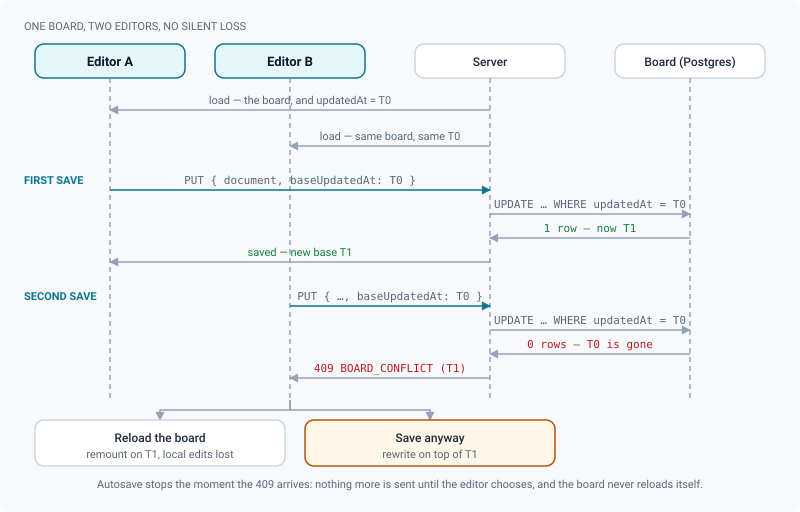
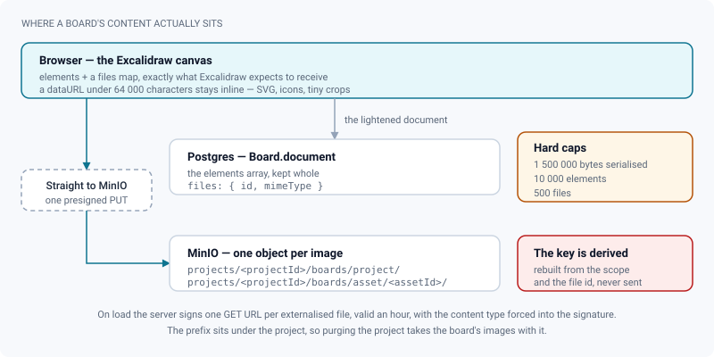

# Boards

*A free-form Excalidraw canvas per project and per asset, for the references a shot list cannot carry.*

> Updated: 2026-08-23

Some material has no natural place in a pipeline: a client's reference sheet, a silhouette
study, three arrows over a frame explaining what the note meant. A **board** is where that
material goes — a full-page **Excalidraw** canvas attached to an entity, so it stays reachable
from the entity itself rather than from a folder somebody has to remember.

There is exactly **one board per project and one per asset**. Sequences and shots do not have
one: a shot's material belongs on its versions, as media and annotations.

## Where a board lives, and how to get there

| Board | URL | Ways in |
|---|---|---|
| Project board | `/projects/:id/board` | Project header **Board** link, sidebar **Board** entry, command palette (*Board of the current project*), shortcut **`g` then `b`** |
| Asset board | `/assets/:id/board` | The **Board** button in the asset page header |

The board fills the page: a thin ReView strip on top — a **Media library** toggle, the save
indicator, a **Back** link — and the Excalidraw canvas below. The canvas follows the
application theme, so a board drawn in the dark theme stays legible in it.

> [!NOTE]
> The `g` then `b` shortcut needs a project in context and does nothing in a text field or
> while a dialog is open. It can be rebound like every other shortcut — see
> [Personalization](personalization.md#keyboard-shortcuts-configurable).

## Drawing and saving

Everything inside the canvas is stock Excalidraw: freehand drawing, shapes, arrows, text,
sticky-note layouts, its own toolbar, its own context menu, its own export options. ReView
adds two things around it — persistence, and a bridge to the project's published images.

**There is no save button.** The board saves itself **1.2 seconds after you stop changing
it**, and the strip says `… saving` then `✓ saved`. The scene lives on the server, so it
follows you between machines and is shared with the whole team.

**The board loads fresh every time**, deliberately: Excalidraw reads its content once, at
mount, so serving a cached board would silently show stale work. For the same reason the
editor never reloads itself in the background — coming back to the tab does not swap the
scene under your hands.

Every accepted save emits a `board:update` event on the project's socket room, carrying the
scope, the new timestamp and who saved. Nothing in the editor listens to it; it is there for
integrations that want to know a board moved.

## When two people save the same board

Boards are not a co-drawing surface: there are no live cursors, no merge, and a second viewer
only picks up your strokes on their next page load. What the server does guarantee is that
nobody's work disappears without being asked.

Every save carries `baseUpdatedAt`, the timestamp the editor loaded the board on, and the
write is conditional — Postgres updates the row **only if** it still carries that timestamp.
If somebody saved in between, the update touches zero rows and the server answers **409
`BOARD_CONFLICT`** with the timestamp that is actually stored.

The strip then shows *Someone else saved this board while you were editing it. Reloading drops
your unsaved changes.* and two buttons:

| Button | What it does |
|---|---|
| **Reload the board** | Remounts the editor on the server's version. Your unsaved changes are gone. |
| **Save anyway** | Rewrites your version on top of theirs, using the timestamp the 409 returned. Their work is replaced. |

> [!WARNING]
> **Autosave stops until you choose.** Everything you keep drawing is held locally and nothing
> more is sent, so the conflict cannot resolve itself by accident — but nothing is being saved
> either. Decide before you leave the page.

The honest way to work around all of this is still to agree who holds a board, or to split the
material between the project board and the asset boards. When you need to look at something
together, in real time, open a [live review session](playlists-and-live-review.md) on the media
instead.

## Putting images on a board

Two routes, and only two:

- **Drag and drop, or paste**, files straight onto the canvas — Excalidraw's own handling.
- **Media library** — the button on the left of the strip opens a side panel listing the
  project's **published images** — `IMAGE` media only, and only those the workers have finished
  processing. Click a thumbnail and it is inserted at a workable fixed size in the top-left of
  the canvas, ready to move and scale. On an asset board the project is resolved from the asset,
  so the panel shows the same library. If the project has nothing published yet, the panel says
  so and points you at drag and drop.

You cannot drag a ReView version, media card or shot onto a board: the media library panel is
the only bridge from the project's content into the canvas.

### Where those images actually go

Excalidraw keeps pasted images inside the scene, as base64 dataURLs. That used to be how ReView
stored them too, and two screenshots were enough to push the document past the server's body
limit — every autosave failed and the work was lost. Images are now **externalised**: anything
whose dataURL exceeds **64 000 characters** (roughly 46 kB) is uploaded to MinIO before the save,
and the document keeps only `{ id, mimeType }`.

| Cap | Value | What hits it |
|---|---|---|
| Serialised document | **1 500 000 bytes** | Thousands of strokes, or many small inline images |
| Elements | **10 000** | A moodboard that has become a whiteboard |
| Files | **500** | One board used as an image library |
| Inline dataURL | **64 000 characters** | Anything bigger is externalised instead of refused |

> [!IMPORTANT]
> The storage key is **rebuilt server-side** from the board's scope and the file id — it is
> never received from the client, so a board cannot be made to point at an arbitrary object in
> the bucket. The prefix sits under the project (`projects/<projectId>/boards/project/`, or
> `projects/<projectId>/boards/asset/<assetId>/`), which also means purging a project takes its
> boards' images with it, with nothing extra to maintain.

On load the server signs one GET URL per externalised file, valid an hour, with the content
type forced into the signature rather than trusted from what the browser uploaded. The editor
fetches them and rebuilds the dataURLs, so Excalidraw receives exactly what it always received —
only the transport changed. A file that cannot be fetched is dropped from the scene and
Excalidraw draws its own placeholder, rather than showing an entry with no image.

Boards saved before this change, with their images still base64 in the JSON, are read back as
they are and migrate to MinIO on the first save from the editor. Nothing to do.

> [!TIP]
> If an upload fails, the whole save is cancelled and the strip shows the error — nothing is
> lost locally, and the next change retries. Insert from the media library rather than dropping
> raw plates when you can: a published image already has a thumbnail and a sensible size.

## Who can open and who can save

Reading a board requires access to the project: admins and supervisors globally, everyone else
through project membership. Saving is narrower.

| Account | Open | Save on an active project | Save on an archived project |
|---|---|---|---|
| `ADMIN` | Yes | Yes | No — *Archived project — read only* |
| `SUPERVISOR` | Yes | Yes | No — *Archived project — read only* |
| `ARTIST`, member of the project | Yes | Yes | No — *Archived project — read only* |
| `ARTIST`, not a member | No | — | — |
| `CLIENT`, member of the project | Yes | No — *Read-only for clients* | No |

Two things follow. The archive lock is checked **before** the role check, so an
[archived project](../admin-guide/project-organization.md#archiving-read-only-restorable) is
read-only for everyone, admins included. And a `CLIENT` can open a board and move things around
on screen — it is the save the server refuses, and the strip reports it. Nothing is lost
silently, but nothing is kept either.

## Getting a board out of ReView

Use Excalidraw's own menu inside the canvas: it exports to PNG, SVG and `.excalidraw`. ReView
adds no export of its own, and no import — a `.excalidraw` file dropped on the canvas is handled
by Excalidraw directly.

One caveat worth knowing: that export only sees what the canvas has actually loaded. Images live
in MinIO and are fetched through their presigned URLs at mount, so export **after** the board has
finished appearing; anything whose file could not be fetched exports as its placeholder.

## Use cases

### Briefing a new asset

The modelling lead needs a reference sheet for a hero prop.

1. Open the asset → **Board**.
2. **Media library** → insert the published concept images that already live in the project.
   They come in as real images, at a workable size.
3. Drop the client's exports and photos alongside them, draw arrows and write the notes that
   matter — silhouette, scale, materials.
4. Nothing to save. Anyone opening the asset finds the same board.

The board is attached to the asset, so it travels with the entity and dies with it: purging the
project takes the board and its images along.

### Sketching a sequence layout before the shots exist

Use the **project** board: `g` then `b` from anywhere in the project. Block out the sequence as
boxes, name them with the shot codes you are about to generate, then create the shots for real
with the batch generator on the Shots tab (see
[Projects & pipeline](projects-and-pipeline.md#creating-sequences-and-shots-in-bulk)).

### Working on a board with someone else

Agree who holds it. If you both edit anyway, the second save is refused rather than silently
applied, and whoever loses the race gets to choose between *Reload the board* and *Save anyway* —
but that is a safety net, not a workflow.

If what you actually need is to look at something together, open a live review session on the
media instead: it has cursors, a pilot, and everybody's annotations.

### A board that has grown too heavy

A moodboard that has collected forty full-resolution plates will approach the document cap, and
the save will start refusing with a message naming the size it reached.

Split it: keep the project board for the show's overall direction and move per-asset material onto
the asset boards. Prefer the media library, whose images are already published and sized, over raw
plates dropped from the desktop.

## Troubleshooting

**The strip says `… saving` and never says `✓ saved`.** Either an image upload is failing — the
error appears in the strip — or the document exceeded a cap. Undo the last big paste and watch it
settle.

**A red banner says someone else saved the board.** That is the conflict guard. Pick *Reload the
board* to take their version, or *Save anyway* to keep yours. Autosave is stopped until you do.

**"Read-only for clients".** `CLIENT` accounts may open a board but not write to it. Ask for a
different role, or have someone else carry the change.

**"Archived project — read only".** The whole project is archived, boards included, whatever your
role. An admin restores it from the project settings.

**An image shows as a grey placeholder.** Its object could not be fetched when the board loaded, so
the entry was dropped and Excalidraw drew its own fallback. Reload the board — a transient storage
error fixes itself that way; if the placeholder stays, the object is gone from the bucket and the
element has to be replaced.

**My colleague does not see what I just drew.** Boards are not live. They will get it on their next
page load — the board is not refreshed in the background on purpose, because remounting the editor
under an editing user is exactly what would lose work.

## Related pages

- [Navigation & search](navigation-and-search.md) — shortcuts and the sidebar
- [Personalization](personalization.md) — rebinding `g` then `b`
- [Projects & pipeline](projects-and-pipeline.md)
- [Kanban & tasks](kanban-and-tasks.md)
- [Upload & publishing](upload-and-publishing.md) — what "published image" means for the media library
- [Playlists & live review](playlists-and-live-review.md) — for looking at something together, in real time
- [Project organization (admin)](../admin-guide/project-organization.md) — archiving and purging
