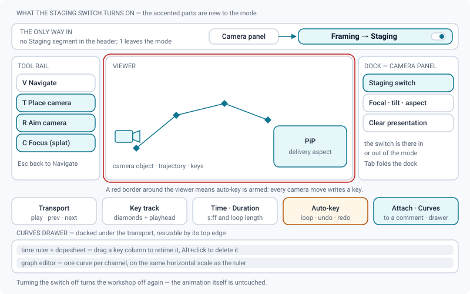
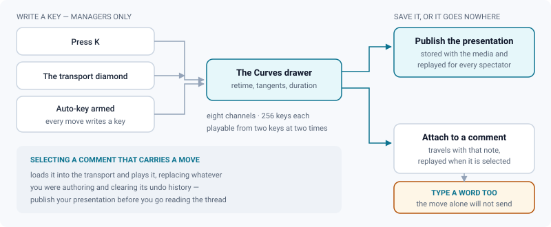

# Camera animation (Staging)

*Building a camera move in the Staging mode, and having it replay identically for every viewer.*

> Updated: 2026-08-23

A 3D or Gaussian splat media can carry an **animated camera**: a move authored once, stored
with the media, and replayed the same way for everyone who opens the review — including a
client on a share link, who never has to fly the scene themselves.

The camera workshop is the **Staging** mode of the review header: the second segment of the
mode switch, key `2`. Everything on this page happens there, except playback, which happens
everywhere.

## What Staging turns on

Entering the mode turns the whole workshop on at once, and leaving it turns it off again —
the animation itself is untouched either way.

- The **camera object** appears in the scene. It exists even before any key does: until you
  key it, it sits on the viewpoint you had when you entered the mode.
- The **picture-in-picture** window shows what that camera actually frames — focal length in
  millimetres on a fixed 36 mm sensor, at the delivery aspect ratio. **Drag** the frame to
  move it, use the **top-left handle** to resize it (the aspect stays locked to the camera
  frame, the bottom-right corner stays anchored), **double-click** to blow it up to three
  quarters of the viewer width and double-click again to restore it. Its position is
  remembered for the session, and it comes back where you left it.
- The **tool rail** swaps to the camera tools: `V` Navigate, `T` Place the camera, `R` Aim
  the camera, and on a splat `C` Focus. `T` and `R` attach a gizmo to the camera object;
  `Esc` returns to Navigate.
- The **transport** at the bottom gains the key controls, and the **Curves** button opens the
  sequencer under it.

The *PiP* switch in the *Camera* panel of the dock remains available as a manual override, in
or out of the mode.

> [!TIP]
> You never have to use the gizmos. Flying to a viewpoint and pressing `K` is the fastest way
> to build a move, and it is what most people end up doing.

## Setting keys

There are three ways to write a key, and they are not equivalent.

| Gesture | What it writes | Conditions |
|---|---|---|
| `K`, or the diamond in the transport | one key on **every** channel, from the current view | requires the right to manage the media; the time **snaps to the pipeline frame** |
| **Auto-key** armed, then move the camera | the same full key, at the exact playhead time (no frame snap) | a drag of more than three pixels, or a wheel zoom that has settled for a quarter of a second |
| The diamond of a channel row in the Curves drawer, or a double-click on a curve | **one** key, on that channel only | the value is taken from the view, or sampled from the curve when the view does not carry it |

Auto-key also picks up the *Focal* and *Tilt* fields of the *Camera* panel: changing either
one while it is armed writes an `fov` or a `roll` key at the playhead.

While auto-key is armed the transport button turns red and pulses, and the viewport gets a
**recording border**. It cannot be left on by accident, which is the point: everything you do
to the camera is being written down.

> [!IMPORTANT]
> `K` and the transport's key diamond are bound only for users who can manage the media —
> an `ADMIN`, a `SUPERVISOR`, or the person who uploaded it. Everyone else can play the move,
> scrub it, open the curves and attach it to a comment, but not author it.

## Transport and playback

The transport is the bottom row of the review. On a 3D media that also carries animation
clips, a track switch on its left chooses between the **camera** track described here and the
**clips** track of the file.

| Control | What it does | Shown to |
|---|---|---|
| Play / pause | plays the move; disabled while the animation has no key at all | everyone |
| Previous / next key | jumps to the neighbouring key time, all channels merged | everyone |
| Set a key | writes a full key from the current view | managers |
| Key track | drag anywhere to scrub — **snaps to the frame**, hold `Alt` for free positioning; clicking a diamond lands exactly on that key | everyone |
| Time field | seconds, stepping by one frame, next to the `s:ff` timecode; drag the label to scrub, `Shift` multiplies by ten | everyone |
| **Duration** | overrides "the last key" as the playback length, and therefore the loop length — up to 600 s | managers |
| Auto-key | arms recording | managers |
| Loop | repeats from zero to the playback length | everyone |
| Undo / redo | walks the animation history (100 steps) | managers |
| Attach to the next comment | hands the move to the comment composer | everyone, once the move is playable |
| Curves | opens and closes the sequencer drawer | everyone |

Without the **Duration** field, a move whose last key sits at 8 s cannot be made to hold to
12 s: playback would stop, or loop, on the last key. Set it, and the dashed guide in the
ruler and in the graph shows where playback now ends. Keys may still be edited beyond that
guide — they simply are not played.

| Key | Action |
|---|---|
| `Space` | play / pause — does nothing until the animation has at least one key |
| `K` | set a key from the current view |
| `←` / `→` | previous / next key |
| `Home` / `End` | start of playback / end of playback (the duration, or the last key if it is later) |
| `Ctrl/⌘+Z`, `Ctrl/⌘+Shift+Z`, `Ctrl/⌘+Y` | undo / redo **of the animation**, while you are in Staging |
| `Delete` / `Backspace` | remove the keys selected in the Curves drawer |
| `Ctrl/⌘+C`, `Ctrl/⌘+V` | copy and paste keys |

On a splat these shortcuts answer from any mode, not only from Staging — `K` writes a key
while you are in Clean up too. Only the undo and redo of the animation are mode-bound, so
that in Clean up the same keys keep driving the splat editor. On a 3D media they answer only
while the camera track is the one showing in the transport.

If playback stops on its own, you took the camera over: a click-drag, a wheel, or a flight
key during playback hands control back to you and pauses. A toast says so; press `Space` to
resume.

## The Curves drawer

The *Curves* button opens the sequencer, docked under the transport and resizable by its top
edge — the height is remembered per media type, with the rest of your chrome preferences.

- The **time ruler** carries the timecode at major ticks and frames at minor ones, and it
  shares the **exact same horizontal scale** as the graph below, so a key column stays
  vertically aligned with its keys. Drag the ruler to scrub, use the wheel to zoom, and the
  **Fit** button (top left of the drawer) to frame the whole animation again.
- The ruler doubles as a **dopesheet**: each diamond is a key column across all channels.
  **Drag** it to retime every channel at once, **`Alt`+click** it to delete the whole column.
- The **channel list** on the left lists the eight channels; a channel with no key is greyed
  out. Click a channel to hide or show its curve in the graph, and use the small diamond that
  appears on hover to key **that channel alone** at the playhead.
- The **graph** shows one curve per visible channel. The wheel zooms at the cursor and
  **`Shift`+wheel pans** horizontally. That combination belongs to the graph: on the ruler
  the wheel always zooms.
- **`Shift`+click** a key toggles it in and out of the selection; a marquee drag
  band-selects, and holding `Shift` adds to what is already selected.
- With keys selected, a floating bar offers the **tangent mode** — *Auto*, *Linear*,
  *Stepped* or *Free*. It applies to the whole selection, and free handles stay draggable on
  the last key you selected.
- **`Ctrl/⌘+C`** copies the selection with its modes and tangents, **`Ctrl/⌘+V`** pastes it
  at the playhead. The clipboard lives in your browser, so it crosses from one media to
  another.
- With no keys yet, the drawer explains how to start and offers the **Orbit preset**.

> [!NOTE]
> A drag of a key column, of a key, or of a tangent handle is a single undo step, however
> long the gesture lasts. `Ctrl+Z` walks back the whole move, not the last pixel of it.

## The eight channels

| Group | Channels | What it means |
|---|---|---|
| Position | `px` `py` `pz` | where the camera is |
| Target | `tx` `ty` `tz` | what it looks at |
| Camera | `fov` · `roll` | shown as focal length in millimetres, and as tilt in degrees |

The camera is described by where it is and what it looks at, rather than by a rotation. That
is what turns "hold on this point while pushing in" into a straight line on three curves
instead of a quaternion puzzle: key the position twice, leave the target alone, and the shot
holds by construction.

The focal channel is edited in millimetres on a fixed 36 mm sensor and clamped between 7 and
400 mm; tilt runs from -180° to +180°. A channel accepts up to **256 keys**, and a key time
may not exceed one hour. Channels are independent — nothing forces you to key all eight, and
a channel with no key simply keeps the value the camera had when the animation was loaded.

## Orbit preset

The preset writes a full turn around the current target: **eight poses plus a return** to the
start, **twelve seconds**, keeping the camera's height and focal length, in *Auto* tangents
and looping. It is offered in three places — the empty state of the Curves drawer, the
*Camera* panel of the dock, and the `Ctrl+K` palette. If an animation already exists, you are
asked to confirm before it is replaced.

## Import and export

The **Export** panel of the dock hosts both directions.

| Entry | What it does | Notes |
|---|---|---|
| **Import an animation** | reads a camera from **glTF/GLB** (the first animation of the file, from any 3D application) or from an **Alembic camera converted to JSON samples** | two samples minimum; the imported keys land on the channels in **linear** tangents and are fully editable — see [Alembic camera import](../admin-guide/3d-alembic.md) |
| **Camera animation (glTF)** | exports what you have built, so it can go back into the DCC | disabled until the animation is playable |

An import replaces the animation currently loaded, and resets its undo history.

## Saving: a presentation, or a comment

A move you have built is going nowhere until you do one of two things with it.

**Save it as the presentation.** In Staging, the commit group at the right of the options bar
carries a **Publish** button, shown to managers only. It writes the presentation: the camera
pose, the animation, and on a splat the depth of field, the reveal effect and the default
level of detail. It is stored with the media and
**replayed identically for every spectator** — the move starts playing on its own the next
time anyone opens the review. Because the presentation is the staging exception to the
publish lock, it stays editable after publication, unlike the content edits, which are
frozen.

**Attach it to a comment.** The *attach to the next comment* button of the transport hands
the animation to the comment composer; a toast confirms it. The button appears only once the
animation is playable — at least two keys at different times — and the move then travels with
that note, replayed only when someone selects it. This is how a note becomes a move rather
than a sentence.

> [!WARNING]
> An animation is not enough on its own to send a comment. The composer's send guard counts
> a drawing, a surface pin and staged reference images — not the camera animation. Attach the
> move, then type at least one word, or the send button does nothing at all. On a splat, the
> composer shows no confirmation line either: the toast fired by the attach button is the
> only feedback you get.

*Clear the presentation* (the bin button in the *Camera* panel, confirmed by a dialog, also
in `Ctrl+K`) removes the saved camera pose, the animation, the depth of field, the reveal
effect and the default level of detail in one go. The media file itself, its mask and its
edits are untouched.

> [!CAUTION]
> Selecting a comment that carries an animation **loads it into the transport and plays it**,
> replacing whatever you were authoring and clearing its undo history. Save your presentation
> before you go reading the thread.

## Use cases

### A turntable for a modelling review, in thirty seconds

Open the model, press `2` for Staging, frame the asset the way you want the turn to start,
then take the **Orbit preset** from the empty Curves drawer. You get a twelve-second loop
around the current target at your current height. Save the presentation, and every reviewer —
including the client on a share link — sees exactly that move, without touching a control.

### A camera move the client can watch, not fly

A splat scan is impressive and unreadable if everyone navigates it themselves. In Staging,
fly to the first viewpoint, press `K`, scrub forward two seconds, fly to the second, `K`
again. Four keys later you have a guided tour. Select the middle keys and set them to *Auto*
so the move eases instead of snapping. Save the presentation: it is replayed for everyone.

### Matching a move that already exists in the DCC

Layout has already made the move in Maya or Blender. Export the camera as glTF, drop it into
*Import an animation* in the Export panel, and the keys land on the eight channels in linear
tangents. From there you can retime the whole thing by dragging key columns on the ruler
rather than re-authoring anything.

### Fixing a move that drifts at the end

Play, and watch the last second overshoot. Open the Curves drawer, band-select the last two
columns, drag them earlier on the ruler to tighten the ending, then set the final key to
*Stepped* if you want the camera to hold dead still on the last frame. `Ctrl+Z` walks back
through every one of those edits while you are still in Staging.

### Holding on the last frame for four more seconds

The move ends at 8 s and the reviewer needs time to read the frame. Rather than duplicating
the last column further down the timeline, type `12` in the **Duration** field: playback —
and the loop — now runs to twelve seconds, the dashed guide moves, and the camera holds on
its last key for the extra four.

### Answering a note with a move

A supervisor asks where the silhouette breaks. Rather than describing it, fly the camera
through the two viewpoints that show it, key them, press *attach to the next comment*, write
"here, between these two angles", and send. Anyone selecting that comment gets the move
played for them, from their own screen.

## Troubleshooting

**`Space` does nothing.** The animation has no keys yet. Set one with `K`, or start from the
Orbit preset.

**`K` does nothing.** Setting keys requires the right to manage the media. Reviewers can
watch the presentation but not author it.

**Playback stopped on its own.** You moved the camera — a drag, a wheel or a flight key
during playback hands control back to you and pauses. A toast says so; press `Space` to
resume.

**Every move I make writes a key.** Auto-key is armed. The transport button is red and the
viewport has a red border while it is on; click the button to disarm it.

**The move plays past my last key, or stops before it.** The **Duration** field is set. Clear
it (or set it to zero) to go back to "the last key is the end".

**Undo undoes the wrong thing.** The animation's undo stack is only routed to `Ctrl+Z` while
you are in **Staging**. In Clean up, the same keys drive the splat or model editor instead.

**The `Shift`+wheel pan does not work on the ruler.** It is a graph gesture. On the ruler the
wheel always zooms; use the **Fit** button to come back to the whole animation.

**My animation disappeared.** Either an import, the Orbit preset or a comment selection
replaced it — all three call the same "load this animation" path, which also clears the undo
history. Only a saved presentation survives that.

**I attached the move and nothing was sent.** The composer needs text, a drawing, a pin or a
staged reference to accept a send. An animation alone is silently dropped; type a word.

**Nothing I do is saved after publication — except this.** That is the rule: content edits
are frozen at publication, staging is not. If the geometry itself is wrong, publish a new
version.

## Related pages

- [The review workspace](review-workspace.md)
- [3D review](review-3d.md)
- [Splat review](review-splat.md)
- [Annotations & comments](annotations-and-comments.md) — what else a comment can carry
- [Alembic camera import (admin)](../admin-guide/3d-alembic.md)
