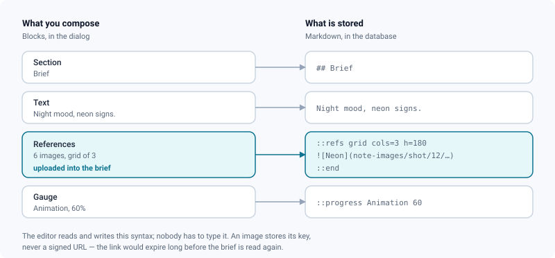

# Briefs

*The note that carries the instructions for a sequence, a shot or an asset — written in blocks, with images uploaded into it.*

> Updated: 2026-08-26

Every sequence, shot and asset carries a **brief**: the note that says what is expected, what
has been decided, and what the references look like. It belongs to ReView and to nothing else
— `description` comes from ShotGrid and goes back there, often read-only here, so a
synchronisation can overwrite it. A brief cannot be overwritten by anyone but the people who
write it.

The brief opens from the **Team and brief** line at the top of the page, next to the faces of
everyone working in the scope. One click opens the window: the team on the left, the brief on
the right, and **Edit** turns the same window into the editor.

## Writing a brief

The editor is a stack of blocks. You add one with the **+** that appears between blocks (or
the one at the end of the note), drag it by its handle to move it, and remove it with the bin.
There is no syntax to learn — each block shows what it will look like once read.

| Block | What it is for |
|-------|----------------|
| **Text** | A paragraph. Click it to edit, click away to see it rendered |
| **Heading** | A plain heading that cuts the reading up without folding it |
| **Foldable section** | A heading that folds. Mark it collapsed for the half of a brief nobody reads daily |
| **References** | Several images, as a grid you arrange or as a carousel to leaf through |
| **Image** | One image in the flow, full width, centred, or with the text alongside |
| **Gauge** | A progress bar — a percentage that is read without being read |
| **Sub-text** | A small line, for what accompanies without counting |
| **Divider** | A horizontal rule |

A **foldable section** holds what you put in it, and the editor draws those blocks attached to
their heading so you can see where they belong. Drag a block **sideways** to change that:
right to put it into the section above, left to take it out — the same handle you use to move
it up and down, or the `←` / `→` keys once the handle has focus. A section therefore stops
where you decide, not at the next heading. A plain **heading** holds nothing; it only marks a
break in the reading.

Inside a text block, the toolbar and the usual shortcuts apply to the selection: `Ctrl`/`Cmd`
+ `B` for bold, `+ I` for italic, `+ K` for a link, plus buttons for lists, quotes and inline
code. Pressing the same button again removes the mark.

> [!TIP]
> **Preview** switches the whole note to the reader's view without leaving the editor. Nothing
> is saved until you press **Save**, so it costs nothing to look.

Nothing is written until **Save**, and nothing is lost either: closing the window with unsaved
changes — the cross, `Esc`, or a click outside — asks first. The browser asks too if the page
itself is about to go, which is what happens when a file is dropped next to a drop zone rather
than on it.

## Images

Images live **in the brief**, not on some other server. Drop them on a References or Image
block, paste them from the clipboard — a screen grab goes straight in — or use *Choose
images*. They are uploaded directly to storage; the brief records the key, so the note keeps
working months later, when any signed link would have expired long ago.

A **References** block is arranged the way you want it read: grid or carousel, one to four
columns, and a thumbnail height. Drag the thumbnails to reorder them — the order of a board is
its argument, you put side by side what has to be compared. Clicking a thumbnail opens the
usual lightbox, with zoom and arrow keys.

A single **Image** block is placed rather than arranged: full width for a reference frame,
centred and reduced for a vignette, or left/right with the text flowing around it. Its width
is a percentage of the column, never a pixel count, so the brief survives a narrower screen.

> [!NOTE]
> Who can read an image is decided by the shot it belongs to: reading it is reading that shot,
> so it requires membership of its project. A brief written before this feature, pointing at
> an external URL, keeps working — nothing was migrated.

## Templates

A shot brief has the same shape from one shot to the next. **Templates** saves the current one
under a name — studio-wide or project-only — and applies it in two clicks on the next shot.

Applying a template *replaces* the brief: merging two structures would produce something
nobody wrote. Nothing is written until **Save**, so an unwanted template is one *Cancel* away.

## What is stored

The brief is stored as markdown, and that is deliberate: it stays readable in a text editor,
survives an export, and is what makes an old brief open unchanged in the new editor. The
syntax below is what the blocks write — you never have to type it, but you may meet it in an
export.

| Written | Read as |
|---------|---------|
| `## Title` | A foldable section, unfolded |
| `##- Title` | A foldable section, folded |
| `### Title` | A plain heading |
| `::endsection` | The end of a foldable section — what follows is back at the top level |
| `::progress Animation 60` | A gauge |
| `::small Delivered 12 March` | A sub-text |
| `::refs` … `::end` | A carousel of the images between them |
| `::refs grid cols=3 h=180` … `::end` | A grid of them, three columns, 180 px tall |
| `` | One image, floated left at 40 % of the column |
| `---` | A divider |

Everything else is ordinary markdown, rendered by the same engine as this documentation: raw
HTML is escaped and executable link protocols are stripped, so a paste from any website is
safe to read.

> [!IMPORTANT]
> Only project managers (`ADMIN`, `SUPERVISOR`, or a local elevation on the project) can write
> a brief or upload into it, and an archived project is read-only. Everyone with access to the
> project reads it.
