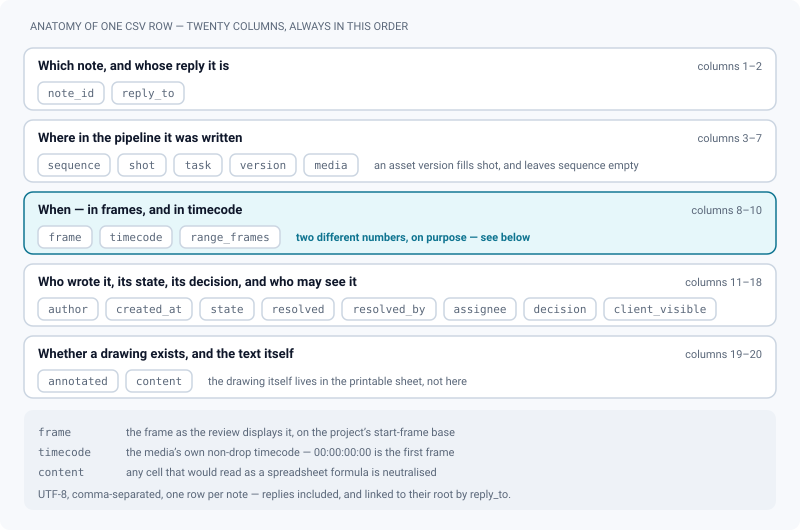

# Exporting review notes

*Get review notes out of ReView: a spreadsheet, an EDL or OTIO for the cutting room, a printable sheet.*

> Updated: 2026-08-23

A review thread already holds everything a production office or a cutting room asks for —
the frame a note sits on, its timecode, its author, its state, the decision on the version,
the drawing over the image. This page is about getting it **out**: as a spreadsheet, as an
editorial file an edit suite can read, or as a printable sheet where each note sits on the
frame it was written on.

Four formats, four readers:

| Format | File | Written for |
|--------|------|-------------|
| **Spreadsheet (CSV)** | `notes-<scope>-<id>.csv` | Production tracking, retake lists, pasting into a supervision sheet |
| **Printable sheet** | `notes-<scope>-<id>.html` | Paper read-through, a PDF for a client, an archive of one round of notes |
| **Edit list (EDL)** | `notes-<scope>-<id>.edl` | Premiere, Resolve, Avid, Hiero — notes as timeline markers |
| **OpenTimelineIO** | `notes-<scope>-<id>.otio` | Any OTIO-aware tool, and any script that would rather read JSON |

## Where each export lives

There is no single "Exports" screen. The action sits wherever the thing you want to export
already is, and the list of formats changes with it.

| Scope | Where the control is | Formats offered |
|-------|----------------------|-----------------|
| **Media** — the clip open in review | Review dock → **Export** panel → *Review notes*, **or** right-click the viewer → *Review notes* | CSV, printable sheet |
| **Playlist** | Right-click the playlist page → *Review notes* | CSV, sheet, EDL, OTIO |
| **Auto-cut timeline** | Montage dock → **Export** panel → *Review notes*, as a row of four buttons | CSV, sheet, EDL, OTIO |
| Version, shot | No control today — the REST route accepts them, no screen passes them | CSV, sheet |

> [!IMPORTANT]
> **EDL and OTIO describe a run of clips carrying continuous timecode.** A single media is not
> one, so the two editorial formats are simply not offered on a review, and asking the route
> for them anyway answers `400` — *EDL and OTIO are only available for a playlist or a
> montage*. Build a playlist, or open the sequence's cut, and export from there.

The interface reports on every export: a success toast naming the file that was downloaded,
and a separate warning toast when the note cap bit and the file is incomplete.

## The spreadsheet (CSV)

One row per note — **replies included**, linked to their parent by `reply_to`. Rows come out in
reading order: clip by clip, roots sorted by timecode, each reply immediately after its root. A
note with no timecode (an image, a 3D model, a splat) comes after the timed ones, in the order
it was written.

| Column | What it holds |
|--------|---------------|
| `note_id` | The note's identifier |
| `reply_to` | The identifier of the note it answers; empty for a root |
| `sequence`, `shot`, `task`, `version`, `media` | Where the note was written. For a version attached to an asset, the asset's name fills the `shot` column and `sequence` stays empty |
| `frame` | The frame **as the review displays it**, on the project's start-frame base (`1001` by default) |
| `timecode` | The media's own non-drop timecode — `00:00:00:00` is the first frame |
| `range_frames` | Length of the commented range, for a note written over an in→out span; empty for a point note |
| `author` | The display name, or the free-form name a client signed with |
| `created_at` | ISO 8601, UTC |
| `state` | `OPEN`, `WIP`, `QUESTION`, `WONT_FIX`, `RESOLVED` |
| `resolved`, `resolved_by` | `true`/`false`, and who marked it so |
| `assignee` | Who the note was handed to, if anyone |
| `decision` | The current review decision of the version carrying the note |
| `client_visible` | Whether the note is published to the client-facing share |
| `annotated` | `true` when a drawing exists on that note — the drawing itself is in the printable sheet, not here |
| `content` | The note's text, HTML flattened to plain text |

The file is UTF-8 without BOM, comma-separated, with `\n` line endings and a lowercase header —
the same conventions as the pipeline CSV (see
[Importing a project](importing-a-project.md)). Any cell that would read as a spreadsheet
formula (`=`, `+`, `-`, `@`, a tab or a carriage return in first position) is prefixed with an
apostrophe, so opening the file cannot execute anything.

> [!TIP]
> `frame` and `timecode` are deliberately two different numbers. `frame` is what the artist
> reads on screen and what a retake list should quote; `timecode` starts at zero and is what an
> edit suite expects. Sort on one, communicate with the other.

## Edit list (EDL, CMX3600)

One event per clip, laid end to end on the record timeline, with every note as a `* LOC:` marker
at the record timecode where it was written — the Resolve/Premiere convention. Marker colours
follow the note state:

| State | Colour |
|-------|--------|
| `OPEN` | red |
| `WIP` | yellow |
| `QUESTION` | cyan |
| `WONT_FIX` | blue |
| `RESOLVED` | green |

The reel column holds the auxiliary `AX` and the real media name is carried by
`* FROM CLIP NAME:`, because the CMX3600 reel field is eight characters wide and no studio file
name fits. Marker labels are `author: text`, cut at 180 characters.

Everything starts at `00:00:00:00`, non-drop: ReView does not store a source timecode, and an
EDL that invented one would be worse than an honest one.

## OpenTimelineIO

The same timeline as a `.otio` JSON document: one video track, one clip per media, notes as
`Marker.2` entries carrying the note id, its state and its author in their metadata. A note
written over an in→out range keeps its duration; a point note is a zero-length marker.

The schema versions used — `Timeline.1`, `Stack.1`, `Track.1`, `Clip.1`, `Marker.2`,
`ExternalReference.1`, `MissingReference.1`, `RationalTime.1`, `TimeRange.1` — are the ones
every OTIO release since 0.14 can read. `Clip.1` with a single `media_reference` is used rather
than `Clip.2`: a recent reader upgrades the schema on its own, the reverse is not true.

## The printable sheet

A self-contained HTML document: one block per note with the commented frame, the annotation
drawn over it, and the text with its author, frame, timecode, state and decision. Replies are
marked as such. Print it (`Ctrl+P` / `⌘+P`) and choose *Save as PDF* — the layout is already set
up for it, and a page break never splits a note in half.

The frame shown is the nearest tile of the **timeline sprite** the worker already computes for
the player's hover preview, so a whole sheet is produced in one request instead of one video
seek per note. For images, 3D models and splats the media thumbnail is used instead.

Images are embedded as data URIs rather than presigned links: a signed URL expires in an hour,
and a PDF printed six months later would be a page of empty frames. That has a cost, so the
sheet is bounded twice over — an image above **2 MB**, or one that would push the document past
a **24 MB** total, is skipped and that note prints without its frame.

> [!NOTE]
> The sheet is written in **your** interface language — headings, state labels, the print hint.
> The notes themselves are of course in whatever language they were written.

## What actually lands in the file

The scope decides which clips are collected, and in what order.

| Scope | Clips collected | Clip duration |
|-------|-----------------|---------------|
| Media | That one media | Its own duration; **5 seconds** for a still, a 3D model or a splat |
| Version | Every `READY` media of the version, oldest first | as above |
| Shot | Every version of every task of the shot, oldest first | as above |
| Playlist | **One media per item** — the first visible one, exactly as the dailies room plays it — in the playlist's order | as above |
| Auto-cut timeline | The cut's items, in cut order | **the montage's** duration, not the file's — that is what makes the editorial timecode right |

A few rules worth knowing before you trust a file:

- **You export what you can see.** The scope must belong to a project you are a member of
  (`ADMIN` and `SUPERVISOR` have global access). Media that are still drafts are included only
  when you are the person who uploaded them.
- **A `CLIENT` account only exports notes marked visible to clients.** An exported file travels,
  and internal review does not have to travel with it.
- **Notes written on a timeline stay on that timeline** until someone shares them back to the
  shot, exactly as in the review panel. Conversely, a timeline export carries only that
  timeline's notes.
- Frame rate comes from the media itself when the worker measured it, and from the project's
  pipeline setting otherwise. The EDL and the OTIO always use the project's rate, because a
  single timeline cannot have several.

## Limits

| Limit | Value | What happens at the edge |
|-------|-------|--------------------------|
| Notes per CSV, EDL or OTIO | 5000 | The file stops there; the response carries `X-Notes-Truncated: 1` and the interface raises a warning toast |
| Notes per printable sheet | 200 | Same, plus a banner at the top of the sheet saying only the first 200 are shown |
| Image size in a sheet | 2 MB each, 24 MB per document | That note prints without its frame |
| Exports per account | 20 per minute | Further calls are rate-limited |
| EDL marker label | 180 characters | Cut, because readers truncate them anyway |

## Use cases

### Sending a round of dailies notes to the cutting room

Right-click the playlist you screened → *Review notes* → **Edit list (EDL)**. Import it next to
the cut in Resolve or Premiere: every note lands as a coloured marker on the clip and at the
second it was written on. Take the **OpenTimelineIO** file instead if the pipeline downstream
speaks OTIO, or if a script is going to read it.

### Handing a supervisor a retake list

Open the shot's latest review → dock → **Export** → *Review notes* → **Spreadsheet (CSV)**.
Filter the sheet on `state = OPEN` and `assignee`, and you have the list. `decision` tells you
in one column which versions were already sent back.

### Archiving what was said about a version

**Printable sheet**, then *Save as PDF*. Every note carries its frame and its drawing, so the
document still means something in a year, when the media has been through four more versions.
Watch the 200-note cap: on a heavily discussed shot, export per media rather than per playlist.

## Related

- [Annotations & comments](annotations-and-comments.md) — what a note carries in the first place
- [Playlists & live review](playlists-and-live-review.md) — building the list an EDL exports
- [Auto-updating cut timelines](auto-cut-timelines.md) — the montage an OTIO export describes
- [Review decisions & approvals](review-approvals.md) — where the `decision` column comes from
- [Importing a project](importing-a-project.md) — the same CSV conventions, in the other
  direction
