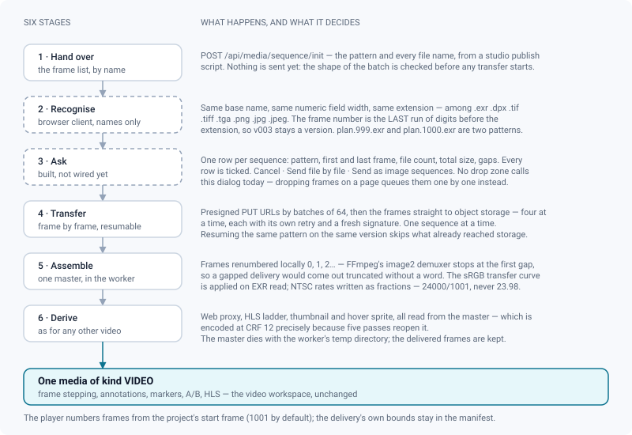
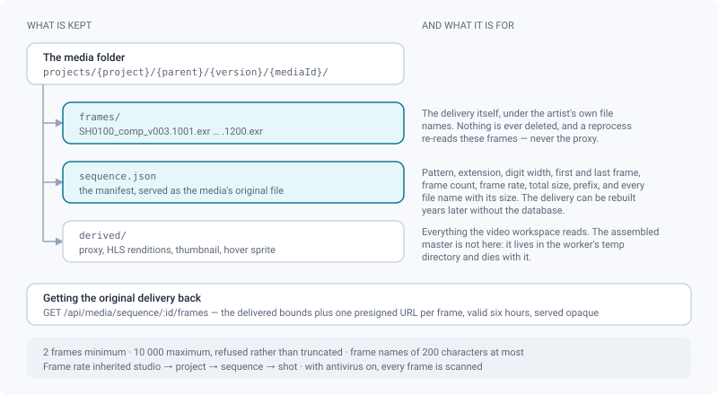

# Image sequences

*Turning a thousand EXR frames into one media you review exactly like a video.*

> Updated: 2026-08-23

A shot is not delivered as a file. It is delivered as a thousand: `SH0100_comp_v003.1001.exr`
through `SH0100_comp_v003.1200.exr`. ReView ingests such a delivery as **one media**, not a
thousand — a media of kind `VIDEO`, whose source is not an object but a storage prefix full
of frames plus a manifest describing them. The worker assembles a master from it, and
everything downstream — proxy, HLS ladder, thumbnail, hover sprite, frame-accurate
annotations — works without knowing where that master came from.

## What counts as a sequence

Two or more files sharing the same base name, the same **numeric field width** and the same
extension, among `.exr`, `.dpx`, `.tif`, `.tiff`, `.tga`, `.png`, `.jpg`, `.jpeg`. The
grouping is decided on names alone — no file is opened to find out.

- The frame number is the **last** run of digits before the extension. In
  `SH0100_comp_v003.1001.exr`, `v003` is a version and `1001` is the frame.
- A numeric field of **more than nine digits** is not a frame number but an identifier — a
  timestamp, a numeric uuid — and those files are never grouped.
- The field width is part of the key: `plan.999.exr` and `plan.1000.exr` are two different
  patterns (three digits and four), because they are two different FFmpeg patterns. Pad your
  numbering and the question does not arise.
- A **gapped** delivery is a fact of production, not a reading error: 1001, 1002, 1005 stays
  one sequence of three frames, and the gap is counted and reported rather than hidden.
- Frame names must match `[A-Za-z0-9][A-Za-z0-9._-]*`, be at most **200 characters** long and
  contain no `..`. A name outside that set is refused **before** the transfer, with the name
  in the message, rather than quietly rewritten — the storage key has to stay the name the
  artist delivered, because that is the name they will download again.

The pattern in FFmpeg notation (`SH0100_comp_v003.%04d.exr`) becomes the **name of the media**
and is what the review header and the technical sheet display.

> [!NOTE]
> A sequence holds between **2** and **10 000** frames. Past the ceiling the server refuses
> the batch — `SEQUENCE_TOO_LONG` — instead of truncating it, which would deliver an amputated
> shot without a word.

## Delivering a sequence

> [!IMPORTANT]
> **The grouping dialog is not reachable from the drop zones today.** The recognition, the
> confirmation dialog and the frame-by-frame transfer all exist in the browser client, but no
> drop zone calls them: dropping 1 200 EXR frames on a task, a shot, an asset or a version
> queues 1 200 ordinary uploads and creates 1 200 media. Until the drop zones are wired, a
> sequence is delivered through the API below — which is what a studio publish script does
> anyway.

The transport is the mirror image of a resumable upload: instead of cutting one file into
parts, it gathers many whole files into one media. Three calls, plus the frames themselves.

| Step | Call | What it does |
|---|---|---|
| 1 | `POST /api/media/sequence/init` | `{ versionId, pattern, frames: [{ name, size }], framerate? }` — checks the shape of the batch, creates the carrying media (`VIDEO`, `UPLOADING`) or **finds the one left by an interrupted delivery**, and returns `mediaObjectId`, `framerate` and `uploadedFrames` |
| 2 | `POST /api/media/sequence/:id/urls` | `{ names }`, **64 at most** per call — one presigned `PUT` URL per frame |
| 3 | — | `PUT` each frame to its URL. The reference client sends **four at a time**, each with its own retry on a freshly signed URL |
| 4 | `POST /api/media/sequence/:id/complete` | Lists what actually reached storage, re-reads three frame headers, writes the manifest, and queues the assembly |
| — | `POST /api/media/multipart/:id/abort` | Cancelling: empties the prefix and removes the media left in `UPLOADING`, so abandoned frames are not left billed and invisible |

**Resumption costs the client nothing.** `init` matches on the same uploader, the same
version, the same pattern and a media still in `UPLOADING`, then lists the frames already
present in object storage: the storage is the authority, the client keeps no state. Closing
the laptop in the middle of an 80 GB delivery costs only the frames in flight.

The reference client shows the progress two ways on purpose — bytes for the bar, files for the
text (`342 / 1200 frames`) — because frames do not all weigh the same, and it runs **one
sequence at a time**: each already saturates the link with its four parallel frames. Once the
transfer is done it polls the media until it is `READY` or `FAILED`, and gives up after **one
hour** with a processing-timeout message. A delivery that arrived with gaps raises a warning
toast at that point too, not only in the dialog.

## What ReView builds

Once every frame has arrived, the worker downloads them, renumbers them locally `0, 1, 2…`,
and assembles a **master**:

1. **Local renumbering is not cosmetic.** FFmpeg's `image2` demuxer stops at the first missing
   frame, so a gapped delivery — a render relaunched on a few frames, a daily occurrence —
   would come out truncated in silence. The delivered numbering is kept in the manifest and in
   the media's metadata.
2. **EXR frames are linear**: the sRGB transfer curve is applied on read, otherwise a correct
   render comes out nearly black. It is the same decision as the still-image proxy, reused
   rather than rewritten.
3. **The frame rate is inherited** studio → project → sequence → shot, exactly as the
   administration shows it (see [Projects & pipeline](projects-and-pipeline.md)), and frozen
   on the media so the master can be rebuilt identically years later. NTSC rates are written
   as exact fractions — `24000/1001`, never `23.98`. The API accepts a `framerate` override at
   `init`; there is no override in the interface.
4. **The master is encoded at CRF 12**, far above the proxy's 23, and is scaled to even
   dimensions (4:2:0 refuses a 1997×1080 render). It is not a deliverable: it is the input of
   five passes — proxy, each HLS rendition, hover sprite, thumbnail, and scene detection when
   an administrator has enabled it. Decoding two thousand 4K EXR frames five times would cost
   hours of CPU per shot.

From there the media is an ordinary video: web proxy, HLS ladder, thumbnail and hover sprite,
built exactly as for a delivered QuickTime. See [Media processing](media-processing.md).

> [!WARNING]
> **Gaps are collapsed at assembly.** A delivery of 1001, 1002, 1005 plays as three
> consecutive frames — the hole is not held open. Check the missing-frame count before
> annotating a shot you believe complete.

## Frame numbering in the player

The transport line numbers frames from the **project's start frame** (`1001` by default,
`Admin → Settings` for the studio default, then per project), not from the delivery's own
first frame. When the two agree — the usual case for a shot delivered from 1001 — the counter
reads the delivered numbers, and a note that says "fix the halo at 1042" points at the frame
the artist rendered.

When they differ, the delivery's own bounds are not lost: they are written in the manifest and
returned by `GET /api/media/sequence/:id/frames`. The review's technical sheet shows the
project numbering under *First frame*, not the delivery's.

## The original delivery is kept

Nothing is deleted. The frames stay in object storage under their own names, next to the
manifest that describes the delivery.

- `frames/` holds the delivery under the artist's own file names. A **reprocess re-reads these
  frames**, never the proxy: unlike a video, whose source is dropped after transcoding, the
  original delivery of a sequence is always still there.
- `sequence.json` is the manifest — pattern, extension, digit width, first and last frame,
  frame count, frame rate, total size, prefix, and every file name with its size. It is served
  as the media's **original file**, which is what makes the delivery reconstructible years
  later without the database.
- `GET /api/media/sequence/:id/frames` returns those bounds plus **one presigned URL per
  frame**, valid **six hours**. A hundred-gigabyte archive is not something a web process
  should build on the fly; any client — a browser, `curl`, a studio tool — downloads them in
  parallel, under their delivered names. Frames are served with an opaque content type: they
  download, they never render.
- The assembled master is **not** stored. It lives in the worker's temporary directory and
  dies with it.

## Reviewing the result

The media that comes out is a `VIDEO`, and it is reviewed like one: transport and frame
stepping, timestamped annotations, timeline markers, A/B comparison with wipe and difference,
adaptive HLS, live sessions, review decisions. Nothing on the review side knows the pixels
came from a folder of EXR files.

- [Video review](review-video.md) — the transport, the comparison modes, the markers
- [Annotations & comments](annotations-and-comments.md) — notes anchored to a frame
- [Upload & publishing](upload-and-publishing.md) — the draft/published rule the media follows
- The technical sheet (dock, *Info*) shows the **pattern** as the file name, the frame rate,
  the first frame and the delivery mode

## Limits, refusals and quotas

Everything an ordinary upload checks is checked here too, because the sequence transport calls
the same guard: project access, contribution rights, archived projects, storage quotas, naming
convention, and inheritance of the version's published state — a sequence added to a published
version is born published.

| Refusal | When |
|---|---|
| `BAD_PATTERN` | The pattern is not `name.%0Nd.ext` |
| `SEQUENCE_TOO_SHORT` / `SEQUENCE_TOO_LONG` | Fewer than 2 frames, or more than 10 000 |
| `BAD_FRAME_NAME` | A frame name outside the allowed character set, or longer than 200 characters |
| `DUPLICATE_FRAME` | The same name sent twice in one batch |
| `FRAME_OUTSIDE_PATTERN` | A frame whose extension or digit width does not match the pattern |
| `FILE_TOO_LARGE` | The **whole batch** exceeds the studio's maximum file size (5 GB by default) — the cap is not per frame, otherwise it would be dodged by splitting |
| `PROJECT_QUOTA` / `STORAGE_LIMIT` | The project's or the uploader's storage quota, measured on what actually arrived |
| `TOO_MANY_UPLOADS` | The uploader already has the maximum number of media in `UPLOADING` (5 by default) |
| `NAMING_REJECTED` | The project's naming convention, in blocking mode, applied to the **pattern** — not to each frame name |
| `SEQUENCE_EMPTY` | Fewer than two frames actually reached storage when `complete` was called |
| `INVALID_FILE` | The first, middle or last frame is not a readable image of the announced format — the cheap way to catch a folder of PNG delivered under an `.exr` extension |
| `SEQUENCE_NOT_SUPPORTED_HERE` | `POST /api/v1/publish` was handed `plan.%04d.exr` or `plan.####.dpx`. The two-step publish flow opens a media for a single file; it names the sequence endpoints instead of opening a media that could never be filled |

Two more things worth planning for:

- **Antivirus** (opt-in, `CLAMAV_HOST`): every frame is scanned before assembly, which is slow
  on a long shot. One infected frame fails the whole media, with the threat named.
- The naming-convention **warning** (non-blocking mode) is returned by `init` but not surfaced
  by the client, where an ordinary upload would raise a toast.

## Troubleshooting

**My 1 200 frames became 1 200 media.** They were dropped on a page rather than delivered
through the sequence endpoints — see the callout in
[Delivering a sequence](#delivering-a-sequence). Delete the batch and deliver it again with
the API.

**Two patterns are proposed for one shot.** The numeric field changes width somewhere in the
delivery (`plan.999.exr` next to `plan.1000.exr`). Pad the numbering at render time; ReView
will not merge them, because the merged pattern is one FFmpeg could not read back.

**A frame name was refused.** Spaces, accents, `#`, `:` or a leading dot are not accepted in a
storage key. The message names the offending file. Rename at render time — ReView will not
rename it for you, because that name is what you will download later.

**The transfer stopped and I do not want to start over.** Send the same pattern to the same
version, from the same account, while the media is still in `UPLOADING`: `init` returns
`resumed: true` and the list of frames already in storage, and you only send what is missing.

**The upload widget gave up.** It stops following a media after one hour of `PROCESSING`. The
assembly itself keeps running in the worker: reopen the version to see whether the media
reached `READY`, and look at [Media processing](media-processing.md) if it is `FAILED`.

**The shot is shorter than the delivery.** Count the missing frames: gaps are collapsed at
assembly, so a delivery with fifty holes plays fifty frames short. The manifest still lists
exactly what was delivered.

**The frame counter does not start where my render does.** The player numbers from the
project's start frame, not from the delivery's. Align the project setting with the shot's
numbering, or read the delivered bounds from `GET /api/media/sequence/:id/frames`.

**My publish script gets `SEQUENCE_NOT_SUPPORTED_HERE`.** `POST /api/v1/publish` takes a real
file name. Both `%04d` and `####` notations are recognised as patterns and refused there on
purpose; use `POST /api/media/sequence/init`.

## Related pages

- [Video review](review-video.md) — how the resulting media is reviewed
- [Image review](review-image.md) — a single still, and the JPEG proxy of production formats
- [Media processing](media-processing.md) — proxy, HLS ladder, thumbnail, sprite
- [Upload & publishing](upload-and-publishing.md)
- [Projects & pipeline](projects-and-pipeline.md) — where the frame rate is inherited from
- [Storage (admin)](../admin-guide/storage.md) — quotas and object storage
