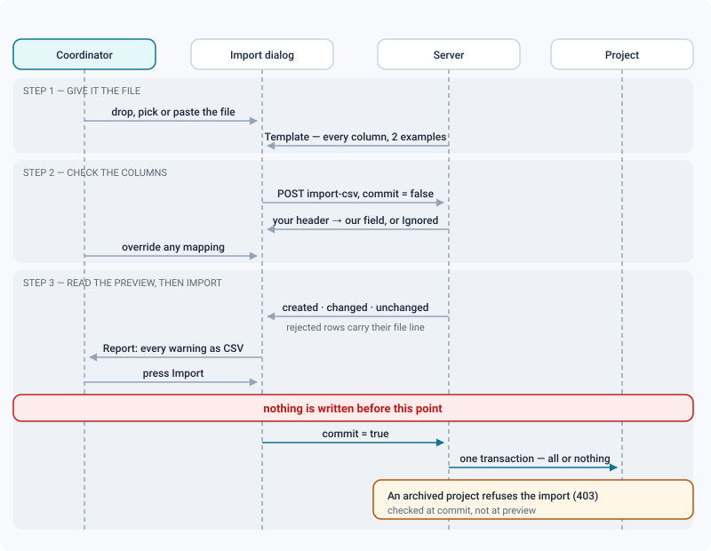
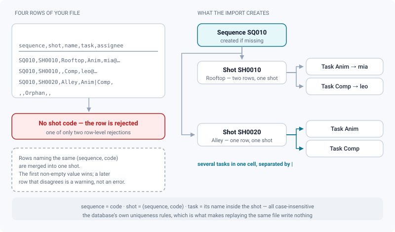

# Importing a project from a CSV file

*Turn the coordinator's spreadsheet into sequences, shots and tasks — previewed first, replayable forever.*

> Updated: 2026-08-23

Between `docker compose up` and the first dailies there is one step: getting your shot list
in. The CSV import is that step. It reads the spreadsheet a production coordinator already
keeps — or the export of ShotGrid, ftrack or Kitsu — creates the episodes, sequences, shots
and tasks it describes, and can be replayed as many times as you like without ever
duplicating anything.

Open it from the project header: **Import CSV**. The action is reserved to project managers
(effective project `SUPERVISOR`).

## The three steps



1. **Give it the file.** Drop a `.csv` onto the dialog, pick one with the file field, or paste
   the content into the text area. **Template** downloads a valid file with every supported
   column, filled with two example rows — generated by the server, so it can never drift from
   what the parser accepts.
2. **Check the columns.** Press **Preview**. The dialog then shows which column of *your* file
   feeds which field of ReView, and lets you change any of them — including setting one to
   *Ignored*. You never have to rewrite a header. Changing a mapping clears the preview; press
   **Refresh preview** to see the consequences.
3. **Read the preview, then import.** The dialog says exactly what will be created, updated and
   left alone, lists the rejected rows with their reason, and only then enables the **Import**
   button. When the project already matches the file it stays disabled, under a plain *Nothing
   to write: the project already matches this file.*

> [!IMPORTANT]
> **Nothing is written before you press Import.** The preview is a `commit=false` call, and the
> corrections you made in step 2 travel back with the commit — up to 200 columns — so the
> preview you validated and the import that follows always read the file the same way.

The plan is recomputed from the project's current state at the moment you commit, not replayed
from what was on screen. If someone created `SH0010` while you were reading the preview, the
import updates it instead of colliding with it.

## Columns the parser knows

The header row is required; column order is free. Header matching ignores case, accents, spaces
and underscores, so `Cut In`, `cut_in` and `CUTIN` are the same column. Only **shot** is
mandatory.

| Field | Recognised headers | Applies to |
|-------|--------------------|------------|
| Episode | `episode`, `ep`, `episode_code`, `ep_code`, `episode_name`, `sg_episode` | sequence |
| Sequence | `sequence`, `seq`, `sq`, `sequence_code`, `seq_code`, `scene`, `scene_code`, `sg_sequence` | shot |
| **Shot** (required) | `shot`, `shot_code`, `shot_number`, `plan`, `plan_code`, `code`, `sg_shot` | — |
| Name | `name`, `nom`, `title`, `titre`, `label`, `shot_name`, `long_name`, `display_name` | shot |
| Description | `description`, `desc`, `notes`, `note`, `comment`, `brief`, `synopsis`, `sg_description` | shot |
| Tags | `tags`, `tag`, `keywords`, `labels`, `mots_cles` | *recognised, not stored* |
| Shot status | `shot_status`, `status_shot`, `statut_plan`, `sg_shot_status` (or a bare `status`, see below) | shot |
| Start frame | `start_frame`, `frame_in`, `frame_start`, `cut_in`, `head_in`, `first_frame`, `in`, `sg_cut_in` | shot |
| End frame | `end_frame`, `frame_out`, `frame_end`, `cut_out`, `tail_out`, `last_frame`, `out`, `sg_cut_out` | shot |
| Duration | `frames`, `frame_count`, `duration`, `duration_frames`, `length`, `nb_frames`, `cut_duration` | shot |
| Tasks | `task`, `tasks`, `task_name`, `task_names`, `tache`, `taches`, `activity`, `sg_task` | task |
| Department | `department`, `departement`, `dept`, `discipline`, `step`, `pipeline_step`, `task_department`, **`task_type`**, `sg_step` | task |
| Task status | `task_status`, `status_task`, `statut_tache`, `sg_task_status` (or a bare `status`, see below) | task |
| Assignee | `assignee`, `assigned`, `assigned_to`, `task_assignee`, `artist`, `owner`, `user`, `responsable`, `sg_assigned_to` | task |
| Start date | `start_date`, `begin`, `begin_date`, `date_debut`, `debut`, `task_start`, `starts_on` | task |
| Due date | `due_date`, `due`, `deadline`, `echeance`, `end_date`, `date_fin`, `delivery`, `delivery_date` | task |

> [!WARNING]
> **`task_type` is an alias of Department, not of Tasks.** A Kitsu export names its
> *Task type* column exactly that, and it lands on the department field — which is usually
> right, since Kitsu's task type *is* the pipeline step. If your file uses it as the task name,
> remap it by hand in step 2; that is what the mapping is for.

Two more rules the preview will show you but that are easier to read here:

- **A column that matches nothing is reported as a warning and ignored.** The file is never
  refused because it carries extra columns.
- **A field can only be claimed once.** If two columns both map to Name, the second is dropped
  rather than silently overwriting the first. Use the mapping to choose which one wins.
- **A bare `status` column** (also `state`, `statut`, `etat`, `sg_status_list`, `status_list`)
  does not say what it is the status *of*. It is read as the **task** status when the file has a
  task column, and as the **shot** status otherwise. Use `shot_status` / `task_status` when a
  file carries both.

## One row per task is normal

Trackers export a shot once per task. Rows that name the same shot — same sequence, same code —
are therefore **merged into one shot**, and their tasks are collected.



```csv
sequence,shot,name,task,assignee
SQ010,SH0010,Rooftop,Anim,mia@studio.tld
SQ010,SH0010,,Comp,leo@studio.tld
```

That file creates **one** shot with **two** tasks. The first non-empty value wins for
shot-level fields; a later row that says something different is reported as a warning, never as
an error.

Alternatively, several tasks fit in one cell, separated by `|` — and the task columns of that
row (department, status, assignee, dates) apply to all of them:

```csv
sequence,shot,name,tasks
SQ010,SH0010,Rooftop,Anim|Comp
```

Identity is the same as the database's own uniqueness rules: a sequence is its code, a shot is
`(sequence, code)`, a task is its name inside its shot — all case-insensitive. When the file
declares a department, a task of the same name in *that* department is matched first, so `Anim`
in animation and `Anim` in compositing stay two separate jobs.

A task created without a department column gets one guessed from its own name (`Anim…` →
animation, `Comp…` → compositing, `lgt…` → lighting, and so on), but **only if the project
already declares that department** — a guess does not enrich the pipeline. The same guess also
sets the task's type.

## Value formats

- **Delimiter**: comma, semicolon or tab, whichever dominates the header. Quoted fields and
  doubled quotes are handled, so `"Rooftop, wide"` stays one value.
- **Numbers**: whole numbers. Spaces and thousands separators produced by spreadsheets
  (`1 001`, `1,001`) are accepted; anything else is a warning and the field is skipped.
- **Dates**: `YYYY-MM-DD`, `YYYY/MM/DD`, `DD/MM/YYYY`, `DD-MM-YYYY`, `DD.MM.YYYY`. The day comes
  first, never the month — convert US-style dates before importing, otherwise deadlines would
  move silently.
- **Frame range**: give two of the three among start, end and duration. The duration completes
  what is missing rather than contradicting it — with a start it gives the end, with an end it
  gives the start, with neither it counts from the project's first frame. If all three are
  present and disagree, the explicit range wins and the mismatch is reported.
- **Text length**: a name over 200 characters and a description over 4000 are cut to fit, with a
  warning naming the column.
- **Status and department** are resolved against what the project already knows — a status by
  code or name, a department by key or name, both ignoring case, accents and separators. An
  unknown value is a warning: the row is still imported, that one field left empty.
- **Assignee** is resolved by e-mail, username, full name, or `firstName lastName`, among the
  project's members plus the studio's global `ADMIN` and `SUPERVISOR` accounts. Service
  identities and disabled accounts are excluded — assigning work to them means nothing.
- **Episodes** are only read when the project has the
  [Episode level](projects-and-pipeline.md#episodes-series) switched on. Otherwise the column is
  ignored with a warning; the import is not refused. A sequence that changes episode from one
  file to the next is re-attached, but an absent episode never detaches it.
- **Tags** are recognised so they are not mistaken for a typo, but ReView does not store tags on
  a shot yet, so the column is dropped.

## Replaying a file

Import is **idempotent**: running the same file twice reports every line as *Unchanged* and
writes nothing. What the preview says, and what the import then writes:

| Situation | Preview | What gets written |
|-----------|---------|-------------------|
| Every value identical to the project | Unchanged | nothing |
| One value differs | Changed | that field alone |
| The shot does not exist yet | New | the shot, and the tasks the row names |
| A column is absent from the file | Unchanged | nothing — an absent column never erases a value |
| A shot present last time is missing from the file | not listed | nothing — an import never deletes |
| Status, department or person the project does not know | Warning | the row, with that one field left empty |
| Duration contradicts start and end | Warning | the explicit range; the duration is discarded |
| Two rows of the same shot disagree | Warning | the first value; the later one is dropped |
| The same task name twice on one shot | Warning | the task once |
| A name or description over the length limit | Warning | the value, shortened |
| Episode column, episode level switched off | Warning | everything except the episode |
| Tags column with values in it | Warning | everything except the tags |
| The row names no shot | **Rejected** | nothing for that row |
| The shot, its sequence or its episode is in the trash | **Rejected** (*In the trash*) | nothing for that row |

> [!CAUTION]
> **The trash still holds the code.** Deleting a shot in ReView is a soft delete, and the
> `(project, code)` uniqueness rule covers deleted rows too. A file that names a shot sitting in
> the trash is refused at preview rather than crashing the whole write on a database
> constraint — restore it or purge it, then replay. This is the second of the two row-level
> rejections, alongside a row with no shot code.

Nothing is ever deleted by an import, and no media, version or annotation is touched: the
importer writes structure only.

## The report

Every warning and every rejected row carries the file line number, the column and the offending
value. **Report** downloads the whole list as a CSV — line, shot, severity, reason — so the file
can be fixed in a spreadsheet and replayed.

| Reason | Meaning |
|--------|---------|
| No shot code | The row names no shot; it is skipped |
| In the trash | The shot, sequence or episode still holds its code from the trash; restore or purge it |
| No shot column found | Nothing in the header maps to Shot — map one by hand |
| Column not recognised | The header matched no field. Map it, or leave it ignored |
| Not a whole number / not a date | The cell could not be read; that field alone is skipped |
| Value too long | A name or description was shortened to fit |
| Duration contradicts the range | Start, end and duration disagree; the range wins |
| Contradicts an earlier row | Two rows of the same shot disagree; the first value is kept |
| Task appears twice | The same task name is listed twice for one shot |
| Unknown status / department / person | The value is not in this project's vocabulary or team |
| Episode column ignored | The project has no episode level |
| Tags column ignored | Tags are not stored yet |
| File longer than the limit | The rest of the file was not read |

The severity column has two values only: *Rejected* for the four reasons that stop a row or a
file (empty file, no shot column, no shot code, in the trash), *Warning* for everything else.

## What the importer does not cover

- **Assets.** There is no asset column: an asset-based show still has to be built by hand on the
  project page, or brought in through the
  [ShotGrid integration](../admin-guide/shotgrid-integration.md). The importer speaks episodes,
  sequences, shots and tasks.
- **Media.** A CSV creates the places work will land in, never the work itself. Versions and
  media arrive by [upload](upload-and-publishing.md).
- **Deletion.** Removing a line from the file does not remove anything from the project.

## Limits

- 1 000 000 characters per request, 20 000 data rows per file. A longer file is read up to the
  limit and the cut is reported.
- The preview details the first **1000** shots and carries at most **2000** warnings; the counts
  always cover the whole file, and the downloadable report carries what the screen shows.
- Writing is done in bulk inside a single transaction with a two-minute budget, in batches of
  500 rows: a feature film's two thousand shots and ten thousand tasks go in as one
  all-or-nothing operation.
- An archived project refuses the import (`403 PROJECT_ARCHIVED`) — the check happens at commit,
  not at preview.
- Every commit is recorded in the audit log as `PROJECT_IMPORT_CSV`, with the counts of what it
  created and changed.

## Getting a file back out

**Export CSV**, next to the import button, writes the project's shot list as
`project-<id>-shots.csv` and re-imports as-is.

> [!NOTE]
> The export is a **skeleton, not a backup**. It carries four columns — `sequence`, `shot`,
> `name`, `tasks` (task names joined by `|`) — and nothing else: no frame range, no status, no
> department, no assignee, no date, no description. Use it to seed a second project or to send
> someone the shot list, not to snapshot a production.

Fields starting with `=`, `+`, `-` or `@` are prefixed with an apostrophe so a shot named
`=cmd()` cannot execute as a formula in Excel or Sheets — the downloadable import report applies
the same guard.

Note that the export is readable by **every** project member, clients included.

## Example file

[`examples/pipeline-import.csv`](examples/pipeline-import.csv) — a two-episode series excerpt
using every column. The same file is available from the dialog itself (**Template**).

## Related

- [Projects & pipeline](projects-and-pipeline.md) — the hierarchy, bulk generators, the Episode
  level
- [Project organization](../admin-guide/project-organization.md) — roles, templates, archiving,
  quotas
- [Kanban & tasks](kanban-and-tasks.md) — where the imported tasks show up
- [ShotGrid integration](../admin-guide/shotgrid-integration.md) — for a studio that keeps its
  tracker rather than migrating off it
